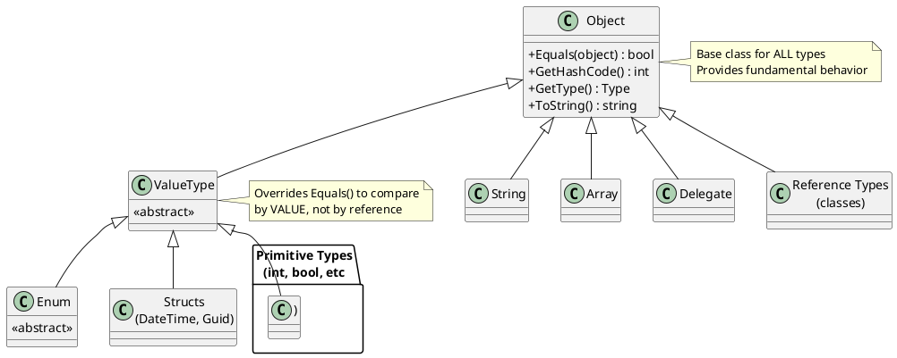
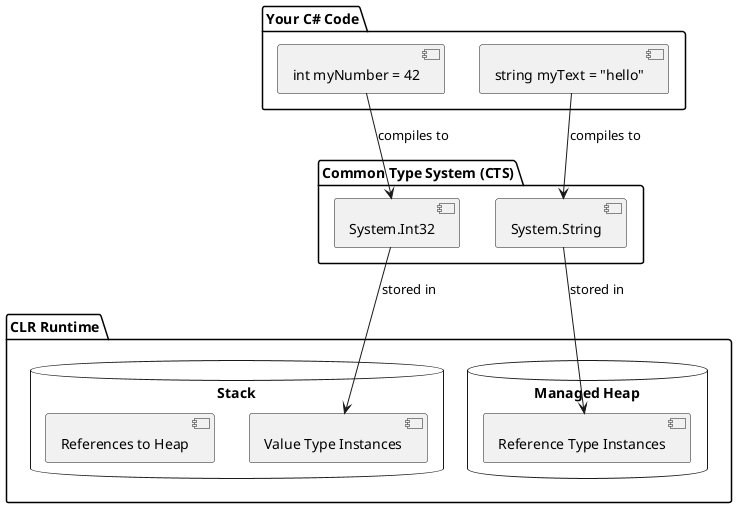
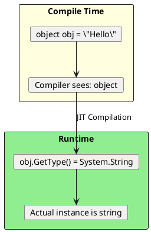

# C# Type System - Deep Dive

## The Foundation: Everything is an Object (Almost)

In C#, all types ultimately derive from `System.Object`. This is the **Unified Type System** - one of C#'s most powerful features.



## Type Categories

```plantuml
@startuml
skinparam monochrome false
skinparam shadowing false
skinparam rectangle {
  RoundCorner 10
}

rectangle "C# Types" as root {
  rectangle "Value Types" as vt #LightBlue {
    rectangle "Simple Types" as simple {
      card "int, long, short, byte"
      card "float, double, decimal"
      card "bool, char"
    }
    rectangle "Enum Types" as enum {
      card "enum Color { Red, Green }"
    }
    rectangle "Struct Types" as struct {
      card "DateTime, Guid, TimeSpan"
      card "Custom structs"
      card "Nullable<T>"
    }
    rectangle "Tuple Types" as tuple {
      card "(int, string)"
      card "ValueTuple<T1, T2>"
    }
  }

  rectangle "Reference Types" as rt #LightGreen {
    rectangle "Class Types" as class {
      card "object, string"
      card "Custom classes"
      card "Anonymous types"
    }
    rectangle "Interface Types" as interface {
      card "IEnumerable<T>"
      card "IDisposable"
    }
    rectangle "Array Types" as array {
      card "int[], string[]"
      card "multidimensional"
    }
    rectangle "Delegate Types" as delegate {
      card "Action, Func"
      card "EventHandler"
    }
  }
}
@enduml
```



## Why Does This Matter for Senior Developers?

Understanding the type system is crucial because:

1. **Performance Decisions**: Choosing struct vs class impacts memory allocation
2. **API Design**: Generic constraints depend on type hierarchy
3. **Debugging**: Understanding boxing helps identify performance issues
4. **Interviews**: This is fundamental knowledge expected at senior level

## CTS (Common Type System)

The Common Type System defines how types are declared, used, and managed in the CLR.



## C# Aliases vs .NET Types

| C# Alias | .NET Type | Size | Range |
|----------|-----------|------|-------|
| `bool` | `System.Boolean` | 1 byte | true/false |
| `byte` | `System.Byte` | 1 byte | 0 to 255 |
| `sbyte` | `System.SByte` | 1 byte | -128 to 127 |
| `char` | `System.Char` | 2 bytes | Unicode character |
| `short` | `System.Int16` | 2 bytes | -32,768 to 32,767 |
| `ushort` | `System.UInt16` | 2 bytes | 0 to 65,535 |
| `int` | `System.Int32` | 4 bytes | -2.1B to 2.1B |
| `uint` | `System.UInt32` | 4 bytes | 0 to 4.2B |
| `long` | `System.Int64` | 8 bytes | Very large range |
| `ulong` | `System.UInt64` | 8 bytes | 0 to very large |
| `float` | `System.Single` | 4 bytes | ±1.5e-45 to ±3.4e38 |
| `double` | `System.Double` | 8 bytes | ±5.0e-324 to ±1.7e308 |
| `decimal` | `System.Decimal` | 16 bytes | Financial precision |
| `string` | `System.String` | Variable | Reference type! |
| `object` | `System.Object` | Variable | Base of all |

### Key Insight: `string` is a Reference Type!

```csharp
// string is a REFERENCE TYPE but behaves like value type due to:
// 1. Immutability
// 2. Operator overloading (== compares content, not reference)

string a = "hello";
string b = "hello";

Console.WriteLine(a == b);                    // True - content comparison
Console.WriteLine(ReferenceEquals(a, b));     // True - string interning!
Console.WriteLine(object.ReferenceEquals(a, b)); // True

string c = new string("hello".ToCharArray());
Console.WriteLine(a == c);                    // True - content
Console.WriteLine(ReferenceEquals(a, c));     // False - different objects!
```

## The `default` Keyword

Understanding defaults shows you understand type initialization:

```csharp
// Value types - default to "zero" equivalent
int i = default;           // 0
bool b = default;          // false
DateTime dt = default;     // DateTime.MinValue (0001-01-01)
Guid g = default;          // Guid.Empty (all zeros)

// Reference types - default to null
string s = default;        // null
object o = default;        // null
int[] arr = default;       // null

// Nullable value types - default to null
int? ni = default;         // null (HasValue = false)

// Structs - all fields set to their defaults
MyStruct ms = default;     // All fields zeroed
```

## Compile-Time vs Runtime Types

```csharp
object obj = "Hello";  // Compile-time: object, Runtime: string

// GetType() returns RUNTIME type
Console.WriteLine(obj.GetType());  // System.String

// typeof() returns COMPILE-TIME type info
Console.WriteLine(typeof(object)); // System.Object

// is operator checks runtime type
if (obj is string str)
{
    Console.WriteLine(str.Length);  // Pattern matching
}
```



## Practical Application: Generic Constraints

Understanding the type system lets you write powerful generic code:

```csharp
// where T : struct - Value types only (no null)
public T? TryParse<T>(string input) where T : struct
{
    // T cannot be null, but T? (Nullable<T>) can
    return default; // Returns null for Nullable<T>
}

// where T : class - Reference types only
public T CreateOrDefault<T>() where T : class, new()
{
    return new T(); // Can use new() because of constraint
}

// where T : notnull - Non-nullable types (C# 8+)
public void Process<T>(T item) where T : notnull
{
    // Compiler guarantees item is never null
    Console.WriteLine(item.ToString());
}

// where T : unmanaged - Blittable types (for interop)
public unsafe void WriteToMemory<T>(T* pointer, T value) where T : unmanaged
{
    *pointer = value;
}
```

## Senior Interview Questions

**Q: What's the difference between `typeof()`, `GetType()`, and `is`?**

```csharp
// typeof - compile-time, works on type names
Type t1 = typeof(string);  // No instance needed

// GetType - runtime, works on instances
string s = "hello";
Type t2 = s.GetType();     // Requires instance

// is - runtime type check with optional pattern matching
object obj = "hello";
bool isString = obj is string;
if (obj is string str) { /* str is now available */ }
```

**Q: Can you have a struct inherit from another struct?**

No! Structs are implicitly sealed and cannot be inherited from. They can only implement interfaces:

```csharp
public struct Point : IEquatable<Point>  // Interface OK
{
    public int X, Y;
    public bool Equals(Point other) => X == other.X && Y == other.Y;
}

// This is ILLEGAL:
// public struct Point3D : Point { }  // Cannot inherit from struct
```

**Q: Why can't structs have a parameterless constructor (before C# 10)?**

Before C# 10, the CLR required being able to zero-initialize structs. A custom parameterless constructor could leave the struct in an invalid state. C# 10 relaxed this, but you should still initialize all fields.
