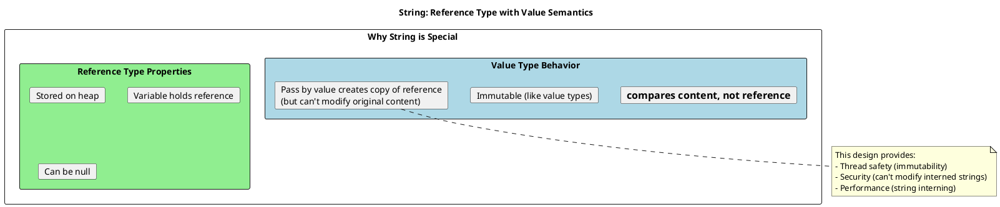
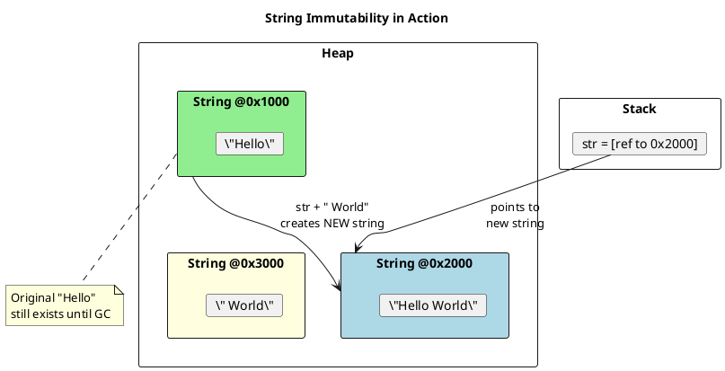
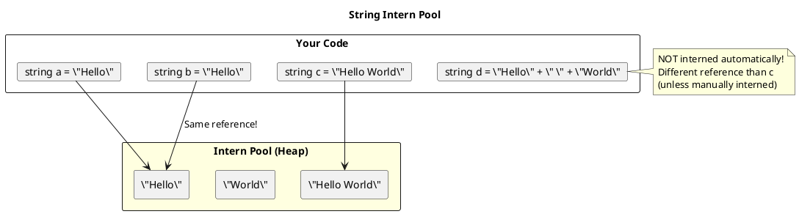
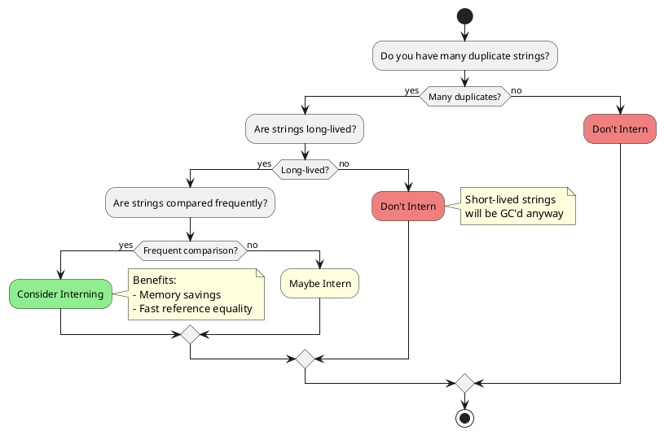
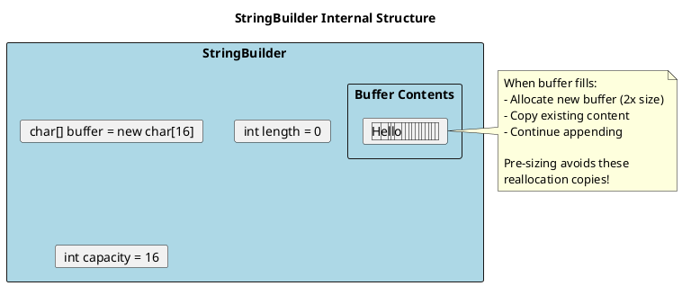
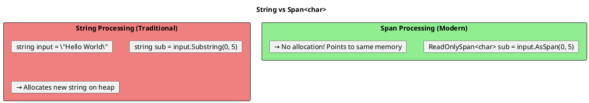

# Strings in C# - Deep Dive

## The Unique Nature of Strings

Strings in C# are **reference types** that **behave like value types**. This is crucial to understand.



## String Immutability

Every operation that "modifies" a string actually creates a **new string**.



```csharp
string original = "Hello";
string modified = original + " World";

// original is STILL "Hello"
// modified is a NEW string "Hello World"
// Two separate string objects on the heap

Console.WriteLine(ReferenceEquals(original, modified));  // False

// This is why string concatenation in loops is expensive:
string result = "";
for (int i = 0; i < 1000; i++)
{
    result += i.ToString();  // Creates 1000 new string objects!
}
// Each += creates a new string, copies old content, appends new
// O(n²) complexity!
```

## String Interning

The CLR maintains a pool of unique strings to save memory.



```csharp
// ═══════════════════════════════════════════════════════
// COMPILE-TIME LITERALS ARE INTERNED
// ═══════════════════════════════════════════════════════
string a = "Hello";
string b = "Hello";

Console.WriteLine(a == b);                 // True (content)
Console.WriteLine(ReferenceEquals(a, b));  // True (same object!)

// ═══════════════════════════════════════════════════════
// RUNTIME-CREATED STRINGS ARE NOT INTERNED
// ═══════════════════════════════════════════════════════
string c = "Hel" + "lo";  // Compiler optimizes to "Hello" - INTERNED
string d = "Hel";
d += "lo";                // Runtime concatenation - NOT INTERNED

Console.WriteLine(a == d);                 // True (content same)
Console.WriteLine(ReferenceEquals(a, d));  // False (different objects!)

// ═══════════════════════════════════════════════════════
// MANUAL INTERNING
// ═══════════════════════════════════════════════════════
string e = string.Intern(d);  // Add to intern pool or get existing
Console.WriteLine(ReferenceEquals(a, e));  // True now!

// Check if interned
string interned = string.IsInterned(d);  // Returns interned string or null
```

### When to Use String Interning



## StringBuilder - The Performance Solution

```csharp
// BAD: O(n²) - creates n string objects
public string BuildBad(string[] parts)
{
    string result = "";
    foreach (var part in parts)
        result += part;  // New allocation each time!
    return result;
}

// GOOD: O(n) - single buffer, grows as needed
public string BuildGood(string[] parts)
{
    var sb = new StringBuilder();
    foreach (var part in parts)
        sb.Append(part);  // Appends to internal buffer
    return sb.ToString();  // Single allocation for final string
}

// BETTER: Pre-size if you know approximate length
public string BuildBetter(string[] parts)
{
    int totalLength = parts.Sum(p => p.Length);
    var sb = new StringBuilder(totalLength);  // Avoid resizing
    foreach (var part in parts)
        sb.Append(part);
    return sb.ToString();
}
```



## String Methods Performance

```csharp
// ═══════════════════════════════════════════════════════
// SUBSTRING - Creates new string (allocation!)
// ═══════════════════════════════════════════════════════
string full = "Hello World";
string sub = full.Substring(0, 5);  // New "Hello" string allocated

// BETTER: Use Span for temporary processing (no allocation)
ReadOnlySpan<char> subSpan = full.AsSpan(0, 5);

// ═══════════════════════════════════════════════════════
// SPLIT - Creates array of new strings
// ═══════════════════════════════════════════════════════
string csv = "a,b,c,d,e";
string[] parts = csv.Split(',');  // Allocates array + 5 strings

// For high-performance parsing, use Span-based approaches
// or StringTokenizer from community libraries

// ═══════════════════════════════════════════════════════
// STRING COMPARISON
// ═══════════════════════════════════════════════════════
string a = "hello";
string b = "HELLO";

// Ordinal (fastest) - byte-by-byte comparison
bool ordinal = string.Equals(a, b, StringComparison.Ordinal);  // False

// OrdinalIgnoreCase - fast case-insensitive
bool ignoreCase = string.Equals(a, b, StringComparison.OrdinalIgnoreCase);  // True

// CurrentCulture - culture-aware, SLOW
bool culture = string.Equals(a, b, StringComparison.CurrentCulture);

// ALWAYS specify comparison type explicitly!
```

## Span<char> and Memory<char>

Modern C# provides zero-allocation string processing:



```csharp
// TRADITIONAL: Allocations on every operation
public static (string firstName, string lastName) ParseNameOld(string fullName)
{
    int space = fullName.IndexOf(' ');
    string first = fullName.Substring(0, space);      // Allocation!
    string last = fullName.Substring(space + 1);      // Allocation!
    return (first, last);
}

// MODERN: Zero allocations until you need strings
public static (string firstName, string lastName) ParseNameNew(string fullName)
{
    ReadOnlySpan<char> span = fullName.AsSpan();
    int space = span.IndexOf(' ');

    // These are just views, no allocation
    ReadOnlySpan<char> first = span[..space];
    ReadOnlySpan<char> last = span[(space + 1)..];

    // Only allocate when returning
    return (first.ToString(), last.ToString());
}

// BEST: When you don't need strings at all
public static bool StartsWithName(ReadOnlySpan<char> fullName, ReadOnlySpan<char> expectedFirst)
{
    int space = fullName.IndexOf(' ');
    if (space < 0) return false;

    ReadOnlySpan<char> first = fullName[..space];
    return first.SequenceEqual(expectedFirst);  // No allocations!
}
```

## String Formatting Options

```csharp
// ═══════════════════════════════════════════════════════
// STRING.FORMAT (Legacy)
// ═══════════════════════════════════════════════════════
string formatted = string.Format("Name: {0}, Age: {1}", name, age);
// Boxing occurs for value types!

// ═══════════════════════════════════════════════════════
// STRING INTERPOLATION ($"") - Preferred
// ═══════════════════════════════════════════════════════
string interpolated = $"Name: {name}, Age: {age}";
// C# 10+: Can avoid boxing with interpolated string handlers

// ═══════════════════════════════════════════════════════
// STRING.CONCAT - Fast for known parts
// ═══════════════════════════════════════════════════════
string concat = string.Concat("Name: ", name, ", Age: ", age.ToString());
// No boxing, optimized overloads

// ═══════════════════════════════════════════════════════
// STRING.JOIN - Best for collections
// ═══════════════════════════════════════════════════════
string[] items = { "a", "b", "c" };
string joined = string.Join(", ", items);  // "a, b, c"

// ═══════════════════════════════════════════════════════
// STRING.CREATE (C# 7.2+) - High performance
// ═══════════════════════════════════════════════════════
string efficient = string.Create(10, 42, (span, value) =>
{
    // Write directly to the string's buffer
    value.TryFormat(span, out _);
});
```

## Common String Pitfalls

```csharp
// ═══════════════════════════════════════════════════════
// PITFALL 1: String comparison without specifying type
// ═══════════════════════════════════════════════════════
// BAD: Uses current culture, slow and inconsistent
if (str1 == str2) { }

// GOOD: Explicit comparison
if (string.Equals(str1, str2, StringComparison.Ordinal)) { }

// ═══════════════════════════════════════════════════════
// PITFALL 2: ToLower/ToUpper for comparison
// ═══════════════════════════════════════════════════════
// BAD: Allocates new strings
if (str1.ToLower() == str2.ToLower()) { }

// GOOD: No allocation
if (string.Equals(str1, str2, StringComparison.OrdinalIgnoreCase)) { }

// ═══════════════════════════════════════════════════════
// PITFALL 3: Checking for null or empty separately
// ═══════════════════════════════════════════════════════
// VERBOSE:
if (str != null && str.Length > 0) { }

// BETTER:
if (!string.IsNullOrEmpty(str)) { }

// BEST (includes whitespace check):
if (!string.IsNullOrWhiteSpace(str)) { }

// ═══════════════════════════════════════════════════════
// PITFALL 4: Contains/StartsWith without comparison
// ═══════════════════════════════════════════════════════
// BAD: Culture-dependent
bool contains = str.Contains("test");

// GOOD: Explicit comparison
bool contains = str.Contains("test", StringComparison.OrdinalIgnoreCase);
```

## Senior Interview Questions

**Q: Why are strings immutable?**

1. **Thread Safety**: Multiple threads can share strings without locks
2. **Security**: Can't modify interned strings (security-sensitive data)
3. **Hashing**: Hash code can be cached (Dictionary key safety)
4. **String Interning**: Only works if strings can't be modified

**Q: What's the difference between `String.Empty` and `""`?**

```csharp
string empty1 = string.Empty;
string empty2 = "";

// They're the same interned string!
Console.WriteLine(ReferenceEquals(empty1, empty2));  // True

// Use string.Empty for clarity and to avoid "magic strings"
```

**Q: How would you efficiently search for a substring in a large text?**

```csharp
// For simple cases: IndexOf with StringComparison
int index = largeText.IndexOf("needle", StringComparison.Ordinal);

// For repeated searches: use compiled Regex or string search algorithms
var regex = new Regex("pattern", RegexOptions.Compiled);

// For very large texts: Consider Span-based or specialized libraries
```

**Q: When would you NOT use StringBuilder?**

- Concatenating 2-3 strings (direct concat is faster)
- When you know exact final length and can use `string.Create`
- When working with Span<char> for zero-allocation scenarios
- In interpolated strings (compiler optimizes small cases)

```csharp
// Direct concat is faster for small operations
string fast = a + " " + b;  // More efficient than StringBuilder for 2-3 strings

// Because StringBuilder has initialization overhead
var sb = new StringBuilder();  // Object creation
sb.Append(a);                  // Method call
sb.Append(" ");                // Method call
sb.Append(b);                  // Method call
return sb.ToString();          // Another allocation
```
