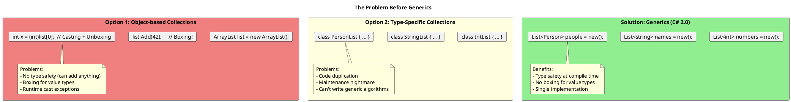
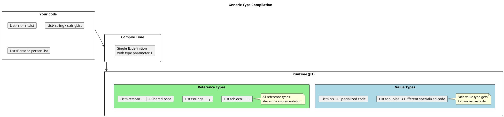
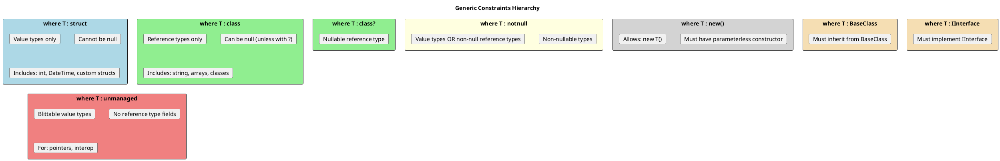
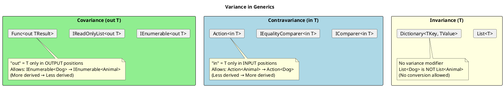
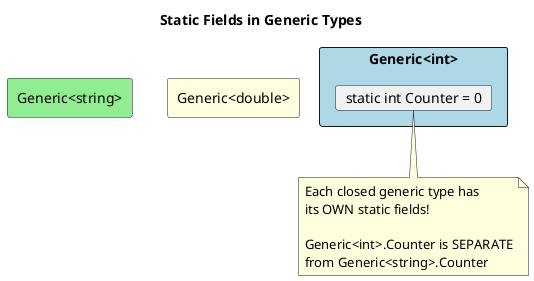

# Generics - Deep Dive

## Why Generics Exist

Before generics (C# 1.0), we had two bad options:



## How Generics Work Internally



This is called **Type Specialization** and it's why generics with value types have zero boxing overhead.

## Generic Constraints

Constraints tell the compiler what capabilities `T` must have:



### Constraint Examples

```csharp
// ═══════════════════════════════════════════════════════
// BASIC CONSTRAINTS
// ═══════════════════════════════════════════════════════

// Value type only - allows Nullable<T> usage
public T? GetOrNull<T>(Dictionary<string, T> dict, string key) where T : struct
{
    return dict.TryGetValue(key, out var value) ? value : null;
}

// Reference type only
public T CreateOrDefault<T>() where T : class, new()
{
    return new T();  // Can use new() because of constraint
}

// Multiple constraints
public void Process<T>(T item) where T : class, IDisposable, new()
{
    using var instance = new T();
    // T is: reference type, disposable, has parameterless ctor
}

// ═══════════════════════════════════════════════════════
// INTERFACE CONSTRAINTS - Avoiding Boxing!
// ═══════════════════════════════════════════════════════

// WITHOUT constraint - causes boxing for structs
public int CompareBoxing(IComparable a, IComparable b)
{
    return a.CompareTo(b);  // Boxing if a and b are value types!
}

// WITH constraint - no boxing
public int CompareNoBoxing<T>(T a, T b) where T : IComparable<T>
{
    return a.CompareTo(b);  // No boxing! Constrained call
}

// ═══════════════════════════════════════════════════════
// UNMANAGED CONSTRAINT - For unsafe/interop code
// ═══════════════════════════════════════════════════════

public unsafe void WriteToMemory<T>(T* destination, T value) where T : unmanaged
{
    *destination = value;  // Direct memory write
}

// Valid: int, double, Point (struct with only value types)
// Invalid: string, object, any struct with reference fields

// ═══════════════════════════════════════════════════════
// MULTIPLE TYPE PARAMETERS
// ═══════════════════════════════════════════════════════

public TOutput Convert<TInput, TOutput>(TInput input)
    where TInput : class
    where TOutput : class, new()
{
    // Different constraints for each type parameter
    return new TOutput();
}
```

## Covariance and Contravariance

This is one of the most confusing advanced topics. Let's break it down:



### The Intuition

```plantuml
@startuml
skinparam monochrome false

title Why Variance Rules Exist

rectangle "Covariance: Safe for OUTPUT" #LightGreen {
  card "IEnumerable<Dog> dogs = GetDogs();"
  card "IEnumerable<Animal> animals = dogs;"
  card "Animal a = animals.First();"

  note right
    Reading a Dog as Animal? ✓
    Every Dog IS an Animal
  end note
}

rectangle "Why List<T> can't be Covariant" #LightCoral {
  card "List<Dog> dogs = new() { new Dog() };"
  card "List<Animal> animals = dogs;  // If this were allowed..."
  card "animals.Add(new Cat());  // Adding Cat to Dog list! 💥"

  note right
    List has Add() method
    Can't allow writing Cat
    where Dog is expected
  end note
}

rectangle "Contravariance: Safe for INPUT" #LightBlue {
  card "Action<Animal> feedAnimal = a => a.Eat();"
  card "Action<Dog> feedDog = feedAnimal;"
  card "feedDog(myDog);  // Calls feedAnimal with Dog"

  note right
    Method expects Animal
    Passing Dog? ✓
    Dog IS an Animal
  end note
}
@enduml
```



### Code Examples

```csharp
// ═══════════════════════════════════════════════════════
// COVARIANCE (out) - Output positions
// ═══════════════════════════════════════════════════════

public interface IProducer<out T>  // T only in return types
{
    T Produce();
    // void Consume(T item);  // ERROR! Can't use T as parameter
}

class AnimalShelter : IProducer<Dog>
{
    public Dog Produce() => new Dog();
}

// Usage: More derived → Less derived
IProducer<Dog> dogProducer = new AnimalShelter();
IProducer<Animal> animalProducer = dogProducer;  // ✓ Covariant!
Animal animal = animalProducer.Produce();  // Gets a Dog

// Real-world: IEnumerable<T> is covariant
IEnumerable<string> strings = new List<string> { "a", "b" };
IEnumerable<object> objects = strings;  // ✓ Works!

// ═══════════════════════════════════════════════════════
// CONTRAVARIANCE (in) - Input positions
// ═══════════════════════════════════════════════════════

public interface IConsumer<in T>  // T only in parameter types
{
    void Consume(T item);
    // T Produce();  // ERROR! Can't use T as return type
}

class AnimalFeeder : IConsumer<Animal>
{
    public void Consume(Animal animal) => animal.Eat();
}

// Usage: Less derived → More derived
IConsumer<Animal> animalConsumer = new AnimalFeeder();
IConsumer<Dog> dogConsumer = animalConsumer;  // ✓ Contravariant!
dogConsumer.Consume(new Dog());  // Passes Dog to Animal consumer

// Real-world: Action<T> is contravariant
Action<object> printObject = o => Console.WriteLine(o);
Action<string> printString = printObject;  // ✓ Works!
printString("Hello");

// ═══════════════════════════════════════════════════════
// COMBINING BOTH (Func<in TInput, out TResult>)
// ═══════════════════════════════════════════════════════

Func<Animal, string> describeAnimal = a => a.GetType().Name;
Func<Dog, object> describeAsObject = describeAnimal;  // ✓ Both!
// Contravariant in input (Animal → Dog)
// Covariant in output (string → object)
```

## Generic Methods vs Generic Classes

```csharp
// ═══════════════════════════════════════════════════════
// GENERIC CLASS - Type parameter for entire class
// ═══════════════════════════════════════════════════════

public class Repository<T> where T : IEntity
{
    private readonly List<T> _items = new();

    public void Add(T item) => _items.Add(item);
    public T? GetById(int id) => _items.FirstOrDefault(x => x.Id == id);

    // Non-generic method in generic class
    public int Count() => _items.Count;

    // Generic method in generic class (different type param)
    public TResult Transform<TResult>(Func<T, TResult> selector)
    {
        return selector(_items.First());
    }
}

// ═══════════════════════════════════════════════════════
// GENERIC METHOD - Type parameter for single method
// ═══════════════════════════════════════════════════════

public class Utilities  // Non-generic class
{
    // Generic method with type inference
    public static T Max<T>(T a, T b) where T : IComparable<T>
    {
        return a.CompareTo(b) > 0 ? a : b;
    }

    // Generic method with multiple type params
    public static TOutput Convert<TInput, TOutput>(
        TInput input,
        Func<TInput, TOutput> converter)
    {
        return converter(input);
    }
}

// Type inference at call site
int maxInt = Utilities.Max(5, 10);  // T inferred as int
string maxStr = Utilities.Max("apple", "banana");  // T inferred as string
```

## Static Members in Generic Types



```csharp
public class Counter<T>
{
    public static int Count { get; private set; }

    public Counter()
    {
        Count++;
    }
}

// Each closed type has its own static field!
new Counter<int>();
new Counter<int>();
new Counter<string>();

Console.WriteLine(Counter<int>.Count);     // 2
Console.WriteLine(Counter<string>.Count);  // 1
Console.WriteLine(Counter<double>.Count);  // 0 (never instantiated)
```

## Generic Type Inference

```csharp
// ═══════════════════════════════════════════════════════
// WHEN INFERENCE WORKS
// ═══════════════════════════════════════════════════════

// From arguments
List<int> numbers = new() { 1, 2, 3 };
var first = numbers.First();  // T inferred as int

// From lambda return type
var mapped = numbers.Select(x => x.ToString());  // TResult = string

// ═══════════════════════════════════════════════════════
// WHEN INFERENCE FAILS
// ═══════════════════════════════════════════════════════

// Return type only - can't infer
public static T CreateDefault<T>() => default!;
// var x = CreateDefault();  // ERROR! Must specify: CreateDefault<int>()

// Ambiguous inference
public static void Process<T>(T item, Func<T, string> formatter) { }
// Process(42, x => x.ToString());  // OK
// Process(42, null);  // ERROR! Can't infer Func<T, string> from null

// ═══════════════════════════════════════════════════════
// EXPLICIT TYPE ARGUMENTS
// ═══════════════════════════════════════════════════════

// Sometimes needed to resolve ambiguity
var result = Enumerable.Empty<string>();  // Must specify
var cast = numbers.Cast<object>();  // Must specify target type
```

## Pattern: Generic Factory

```csharp
public interface IFactory<out T>
{
    T Create();
}

public class GenericFactory<T> : IFactory<T> where T : new()
{
    public T Create() => new T();
}

// With dependency injection
public class ServiceFactory<T> : IFactory<T> where T : class
{
    private readonly IServiceProvider _provider;

    public ServiceFactory(IServiceProvider provider)
    {
        _provider = provider;
    }

    public T Create() => _provider.GetRequiredService<T>();
}

// Covariant usage
IFactory<Dog> dogFactory = new GenericFactory<Dog>();
IFactory<Animal> animalFactory = dogFactory;  // ✓ Covariant
Animal animal = animalFactory.Create();
```

## Pattern: Generic Repository

```csharp
public interface IRepository<T> where T : class, IEntity
{
    Task<T?> GetByIdAsync(int id);
    Task<IReadOnlyList<T>> GetAllAsync();
    Task<T> AddAsync(T entity);
    Task UpdateAsync(T entity);
    Task DeleteAsync(T entity);
}

public class Repository<T> : IRepository<T> where T : class, IEntity
{
    private readonly DbContext _context;
    private readonly DbSet<T> _dbSet;

    public Repository(DbContext context)
    {
        _context = context;
        _dbSet = context.Set<T>();
    }

    public async Task<T?> GetByIdAsync(int id)
        => await _dbSet.FindAsync(id);

    public async Task<IReadOnlyList<T>> GetAllAsync()
        => await _dbSet.ToListAsync();

    public async Task<T> AddAsync(T entity)
    {
        await _dbSet.AddAsync(entity);
        await _context.SaveChangesAsync();
        return entity;
    }

    public async Task UpdateAsync(T entity)
    {
        _dbSet.Update(entity);
        await _context.SaveChangesAsync();
    }

    public async Task DeleteAsync(T entity)
    {
        _dbSet.Remove(entity);
        await _context.SaveChangesAsync();
    }
}
```

## C# 11: Generic Math

```csharp
// New in C# 11 - Generic math with static abstract interface members
public T Sum<T>(T[] values) where T : INumber<T>
{
    T result = T.Zero;  // Static abstract property
    foreach (var value in values)
    {
        result += value;  // Operator defined in interface
    }
    return result;
}

// Works with any numeric type!
int intSum = Sum(new[] { 1, 2, 3, 4, 5 });
double doubleSum = Sum(new[] { 1.5, 2.5, 3.5 });
decimal decimalSum = Sum(new[] { 1.0m, 2.0m, 3.0m });

// Generic parsing
public T Parse<T>(string input) where T : IParsable<T>
{
    return T.Parse(input, null);  // Static abstract method
}

int number = Parse<int>("42");
DateTime date = Parse<DateTime>("2024-01-15");
```

## Senior Interview Questions

**Q: Why can't you do `new T()` without the `new()` constraint?**

Because the compiler doesn't know if `T` has a parameterless constructor. The constraint guarantees it exists.

```csharp
// Without constraint:
public T Create<T>()
{
    // return new T();  // ERROR! T might not have parameterless ctor
    return Activator.CreateInstance<T>();  // Works but slower
}

// With constraint:
public T Create<T>() where T : new()
{
    return new T();  // ✓ Guaranteed to work
}
```

**Q: Why can't you use `==` with generic types?**

```csharp
public bool AreEqual<T>(T a, T b)
{
    // return a == b;  // ERROR! Operator == not defined for T
    return EqualityComparer<T>.Default.Equals(a, b);  // ✓ Works
}

// Or with constraint:
public bool AreEqual<T>(T a, T b) where T : IEquatable<T>
{
    return a.Equals(b);  // ✓ Works
}
```

**Q: What's the difference between `List<object>` and `List<T>`?**

`List<object>` causes boxing for value types and loses type information.
`List<T>` preserves the actual type, no boxing, compile-time safety.

**Q: Can you have a generic attribute? (C# 11+)**

Yes! C# 11 finally allows generic attributes:

```csharp
public class ValidateAttribute<T> : ValidationAttribute where T : IValidator
{
    public override bool IsValid(object? value)
    {
        var validator = Activator.CreateInstance<T>();
        return validator.Validate(value);
    }
}

[Validate<EmailValidator>]
public string Email { get; set; }
```
