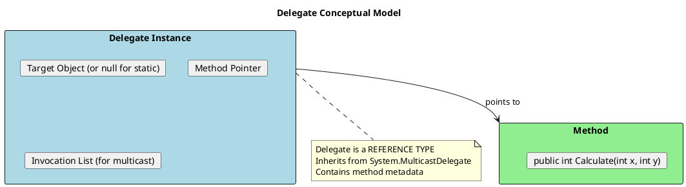
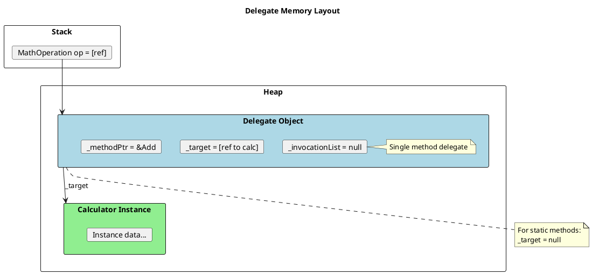
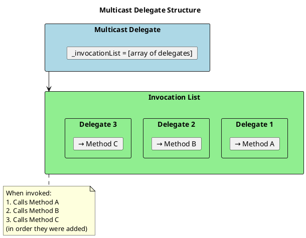
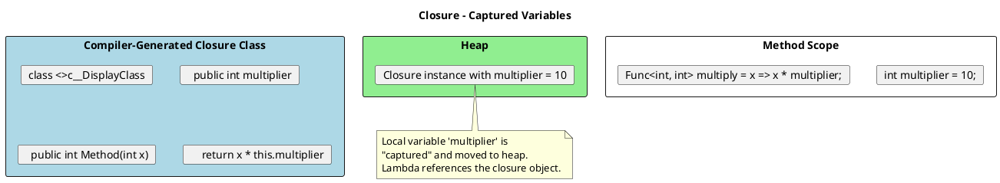

# Delegates - Deep Dive

## What Is a Delegate?

A delegate is a **type-safe function pointer**. It holds a reference to a method and can invoke it.



## Delegate Declaration and Usage

```csharp
// ═══════════════════════════════════════════════════════
// DECLARING A DELEGATE TYPE
// ═══════════════════════════════════════════════════════

// Custom delegate type
public delegate int MathOperation(int x, int y);
public delegate void Logger(string message);
public delegate T Factory<T>();

// ═══════════════════════════════════════════════════════
// CREATING DELEGATE INSTANCES
// ═══════════════════════════════════════════════════════

public class Calculator
{
    // Instance method
    public int Add(int x, int y) => x + y;

    // Static method
    public static int Multiply(int x, int y) => x * y;
}

// From instance method
var calc = new Calculator();
MathOperation addDelegate = calc.Add;
MathOperation addDelegate2 = new MathOperation(calc.Add);  // Explicit

// From static method
MathOperation multiplyDelegate = Calculator.Multiply;

// From lambda expression
MathOperation subtractDelegate = (x, y) => x - y;

// From anonymous method (old syntax)
MathOperation divideDelegate = delegate(int x, int y) { return x / y; };

// ═══════════════════════════════════════════════════════
// INVOKING DELEGATES
// ═══════════════════════════════════════════════════════

int result1 = addDelegate(5, 3);        // Direct invocation
int result2 = addDelegate.Invoke(5, 3); // Explicit Invoke

// Null-safe invocation
MathOperation? nullableDelegate = null;
int? result3 = nullableDelegate?.Invoke(5, 3);  // null if delegate is null
```

## Delegate Internal Structure



## Built-in Delegate Types

```plantuml
@startuml
skinparam monochrome false

title Built-in Delegate Types

rectangle "Action<T...> (void return)" #LightBlue {
  card "Action                    // () → void"
  card "Action<T>                 // (T) → void"
  card "Action<T1, T2>            // (T1, T2) → void"
  card "Action<T1, T2, T3, ...>   // up to 16 params"
}

rectangle "Func<T..., TResult> (returns value)" #LightGreen {
  card "Func<TResult>             // () → TResult"
  card "Func<T, TResult>          // (T) → TResult"
  card "Func<T1, T2, TResult>     // (T1, T2) → TResult"
  card "Func<T1, ..., T16, TResult>"
}

rectangle "Predicate<T> (returns bool)" #LightYellow {
  card "Predicate<T>              // (T) → bool"
  card "Equivalent to: Func<T, bool>"
}

rectangle "Comparison<T> (for sorting)" #LightCoral {
  card "Comparison<T>             // (T, T) → int"
  card "Returns: negative, zero, or positive"
}
@enduml
```



```csharp
// ═══════════════════════════════════════════════════════
// ACTION - No return value
// ═══════════════════════════════════════════════════════

Action sayHello = () => Console.WriteLine("Hello!");
Action<string> greet = name => Console.WriteLine($"Hello, {name}!");
Action<string, int> greetTimes = (name, times) =>
{
    for (int i = 0; i < times; i++)
        Console.WriteLine($"Hello, {name}!");
};

sayHello();
greet("World");
greetTimes("Developer", 3);

// ═══════════════════════════════════════════════════════
// FUNC - Returns a value
// ═══════════════════════════════════════════════════════

Func<int> getRandomNumber = () => new Random().Next();
Func<int, int> square = x => x * x;
Func<int, int, int> add = (x, y) => x + y;
Func<string, int, string> repeat = (s, n) => string.Concat(Enumerable.Repeat(s, n));

int random = getRandomNumber();
int squared = square(5);  // 25
string repeated = repeat("ab", 3);  // "ababab"

// ═══════════════════════════════════════════════════════
// PREDICATE - Returns bool
// ═══════════════════════════════════════════════════════

Predicate<int> isEven = n => n % 2 == 0;
Predicate<string> isLongString = s => s.Length > 10;

bool even = isEven(4);  // true
List<int> numbers = new() { 1, 2, 3, 4, 5, 6 };
List<int> evenNumbers = numbers.FindAll(isEven);  // [2, 4, 6]

// ═══════════════════════════════════════════════════════
// COMPARISON - For sorting
// ═══════════════════════════════════════════════════════

Comparison<Person> byAge = (p1, p2) => p1.Age.CompareTo(p2.Age);
Comparison<Person> byNameDesc = (p1, p2) => -p1.Name.CompareTo(p2.Name);

List<Person> people = GetPeople();
people.Sort(byAge);  // Sorts by age ascending
```

## Multicast Delegates

Delegates can hold references to multiple methods:



```csharp
// ═══════════════════════════════════════════════════════
// COMBINING DELEGATES
// ═══════════════════════════════════════════════════════

Action<string> log1 = msg => Console.WriteLine($"[LOG1] {msg}");
Action<string> log2 = msg => Console.WriteLine($"[LOG2] {msg}");
Action<string> log3 = msg => Console.WriteLine($"[LOG3] {msg}");

// Combine using + or +=
Action<string> allLoggers = log1 + log2;
allLoggers += log3;

// Invoke all three
allLoggers("Hello!");
// Output:
// [LOG1] Hello!
// [LOG2] Hello!
// [LOG3] Hello!

// ═══════════════════════════════════════════════════════
// REMOVING DELEGATES
// ═══════════════════════════════════════════════════════

allLoggers -= log2;
allLoggers("After removal");
// Output:
// [LOG1] After removal
// [LOG3] After removal

// ═══════════════════════════════════════════════════════
// RETURN VALUES IN MULTICAST
// ═══════════════════════════════════════════════════════

Func<int> getNumber1 = () => 1;
Func<int> getNumber2 = () => 2;
Func<int> getNumber3 = () => 3;

Func<int> combined = getNumber1 + getNumber2 + getNumber3;
int result = combined();  // Returns 3 (only LAST return value!)

// To get all return values:
var results = combined.GetInvocationList()
    .Cast<Func<int>>()
    .Select(d => d())
    .ToList();  // [1, 2, 3]

// ═══════════════════════════════════════════════════════
// EXCEPTION HANDLING IN MULTICAST
// ═══════════════════════════════════════════════════════

Action<string> safe1 = msg => Console.WriteLine($"Safe1: {msg}");
Action<string> throws = msg => throw new Exception("Oops!");
Action<string> safe2 = msg => Console.WriteLine($"Safe2: {msg}");

Action<string> all = safe1 + throws + safe2;

// If one delegate throws, remaining delegates don't execute!
// all("test");  // Safe1 runs, throws, Safe2 never runs

// Safe execution of all delegates:
void SafeInvoke<T>(Action<T> multicast, T arg)
{
    foreach (var d in multicast.GetInvocationList().Cast<Action<T>>())
    {
        try
        {
            d(arg);
        }
        catch (Exception ex)
        {
            Console.WriteLine($"Delegate failed: {ex.Message}");
        }
    }
}

SafeInvoke(all, "test");
// Safe1: test
// Delegate failed: Oops!
// Safe2: test
```

## Delegate Variance

```csharp
// Delegates support variance (covariance and contravariance)

// ═══════════════════════════════════════════════════════
// COVARIANCE IN RETURN TYPE
// ═══════════════════════════════════════════════════════

Func<Dog> getDog = () => new Dog();
Func<Animal> getAnimal = getDog;  // ✓ Covariant!
Animal animal = getAnimal();  // Actually returns Dog

// ═══════════════════════════════════════════════════════
// CONTRAVARIANCE IN PARAMETERS
// ═══════════════════════════════════════════════════════

Action<Animal> feedAnimal = a => a.Eat();
Action<Dog> feedDog = feedAnimal;  // ✓ Contravariant!
feedDog(new Dog());  // Calls feedAnimal with Dog

// ═══════════════════════════════════════════════════════
// COMBINED VARIANCE
// ═══════════════════════════════════════════════════════

Func<Animal, string> describeAnimal = a => a.GetType().Name;
Func<Dog, object> describeAsObject = describeAnimal;  // ✓ Both!
```

## Delegates as Method Parameters

```csharp
// ═══════════════════════════════════════════════════════
// STRATEGY PATTERN WITH DELEGATES
// ═══════════════════════════════════════════════════════

public class DataProcessor
{
    public List<T> Process<T>(
        IEnumerable<T> items,
        Func<T, bool> filter,
        Func<T, T> transform,
        Comparison<T>? sort = null)
    {
        var result = items.Where(filter).Select(transform).ToList();
        if (sort != null)
            result.Sort(sort);
        return result;
    }
}

var processor = new DataProcessor();
var numbers = new[] { 1, 2, 3, 4, 5, 6, 7, 8, 9, 10 };

var result = processor.Process(
    numbers,
    filter: n => n % 2 == 0,           // Even numbers
    transform: n => n * n,              // Square them
    sort: (a, b) => b.CompareTo(a)     // Descending
);
// result: [100, 64, 36, 16, 4]

// ═══════════════════════════════════════════════════════
// CALLBACK PATTERN
// ═══════════════════════════════════════════════════════

public void ProcessAsync(
    string input,
    Action<string> onSuccess,
    Action<Exception> onError)
{
    try
    {
        var result = DoWork(input);
        onSuccess(result);
    }
    catch (Exception ex)
    {
        onError(ex);
    }
}

ProcessAsync(
    "data",
    result => Console.WriteLine($"Success: {result}"),
    error => Console.WriteLine($"Error: {error.Message}")
);
```

## Closure and Captured Variables



```csharp
// ═══════════════════════════════════════════════════════
// CLOSURE EXAMPLE
// ═══════════════════════════════════════════════════════

public Func<int, int> CreateMultiplier(int factor)
{
    // 'factor' is captured in a closure
    return x => x * factor;
}

var times2 = CreateMultiplier(2);
var times10 = CreateMultiplier(10);

Console.WriteLine(times2(5));   // 10
Console.WriteLine(times10(5));  // 50

// ═══════════════════════════════════════════════════════
// CLOSURE PITFALL - Loop Variable Capture
// ═══════════════════════════════════════════════════════

// BUG: All delegates capture same variable!
var actions = new List<Action>();
for (int i = 0; i < 5; i++)
{
    actions.Add(() => Console.WriteLine(i));
}

foreach (var action in actions)
    action();  // Prints: 5, 5, 5, 5, 5 (all same!)

// FIX: Copy to local variable
actions.Clear();
for (int i = 0; i < 5; i++)
{
    int captured = i;  // Each iteration captures different variable
    actions.Add(() => Console.WriteLine(captured));
}

foreach (var action in actions)
    action();  // Prints: 0, 1, 2, 3, 4

// NOTE: foreach loop variable is safe in C# 5+
foreach (var item in items)
{
    actions.Add(() => Console.WriteLine(item));  // Safe!
}
```

## Performance Considerations

```csharp
// ═══════════════════════════════════════════════════════
// ALLOCATION AWARENESS
// ═══════════════════════════════════════════════════════

// Each lambda creates a delegate instance (allocation)
void ProcessItems(List<int> items)
{
    // BAD: Creates new delegate on every call
    items.Where(x => x > 0);  // Allocates delegate

    // BETTER: Cache the delegate if called frequently
    private static readonly Func<int, bool> _isPositive = x => x > 0;
    items.Where(_isPositive);  // Reuses cached delegate
}

// ═══════════════════════════════════════════════════════
// CLOSURE ALLOCATION
// ═══════════════════════════════════════════════════════

void ProcessWithThreshold(List<int> items, int threshold)
{
    // BAD: Captures 'threshold' - allocates closure
    var filtered = items.Where(x => x > threshold);

    // If performance critical, consider passing state differently
}

// ═══════════════════════════════════════════════════════
// DELEGATE CACHING
// ═══════════════════════════════════════════════════════

public class ProcessorOptimized
{
    // Static lambda (no capture) - cached automatically by compiler
    private static readonly Func<int, bool> _isEven = x => x % 2 == 0;

    // Instance method as delegate
    private readonly Action<string> _logDelegate;

    public ProcessorOptimized()
    {
        _logDelegate = Log;  // Cache once
    }

    private void Log(string message) => Console.WriteLine(message);
}
```

## Senior Interview Questions

**Q: What's the difference between a delegate and an interface with a single method?**

| Aspect | Delegate | Interface |
|--------|----------|-----------|
| Multicast | Yes (+=) | No |
| Anonymous impl | Lambda | Anonymous class |
| Performance | Slight overhead | Virtual dispatch |
| Variance | Built-in | Must declare |

```csharp
// Delegate approach
Func<int, int> square = x => x * x;

// Interface approach
public interface ITransform
{
    int Transform(int x);
}
class Squarer : ITransform
{
    public int Transform(int x) => x * x;
}
```

**Q: What happens when you call `+=` on a delegate?**

It creates a **new** delegate instance containing both invocation lists. Delegates are immutable.

```csharp
Action a = () => Console.WriteLine("A");
Action b = () => Console.WriteLine("B");
Action combined = a;
combined += b;  // Creates NEW delegate, 'combined' now points to it

// 'a' is unchanged - still only calls "A"
```

**Q: How do you safely invoke a nullable delegate?**

```csharp
Action<string>? handler = null;

// Option 1: Null conditional
handler?.Invoke("message");

// Option 2: Local copy (for thread safety)
var localHandler = handler;
if (localHandler != null)
    localHandler("message");

// Option 3: Interlocked for thread-safe read
var safeHandler = Interlocked.CompareExchange(ref handler, null, null);
safeHandler?.Invoke("message");
```

**Q: Why might a delegate cause a memory leak?**

If an instance method delegate is stored long-term, it keeps the target object alive:

```csharp
public class Subscriber
{
    public void Subscribe(Publisher pub)
    {
        pub.OnEvent += HandleEvent;  // 'this' is captured!
    }

    private void HandleEvent(string msg) { }

    // If Subscriber should be GC'd but Publisher lives on,
    // Subscriber won't be collected (delegate holds reference)
}
```
