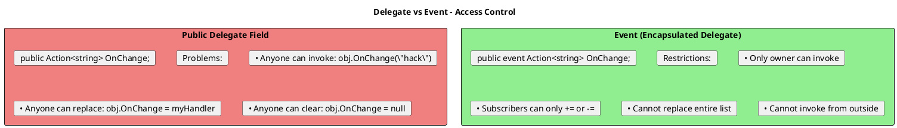
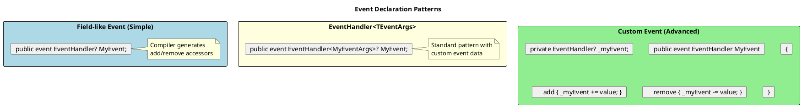
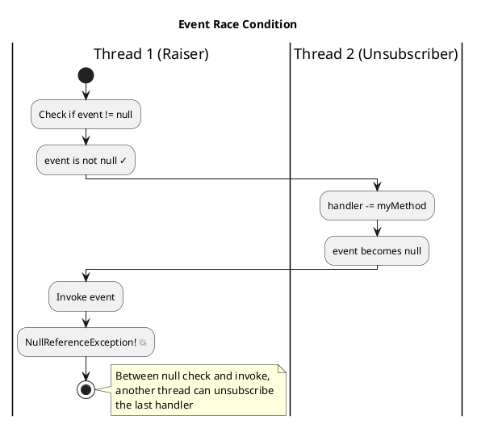
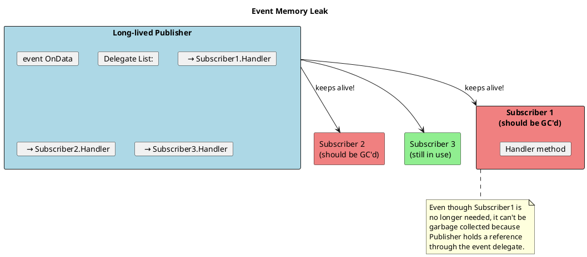
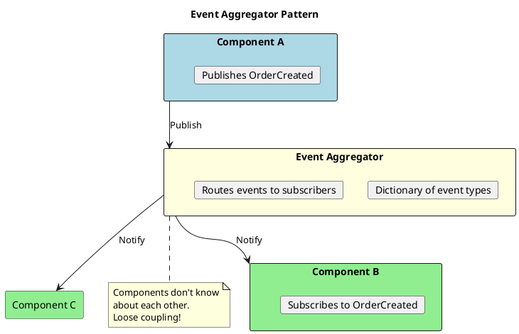

# Events - Deep Dive

## Events vs Delegates

Events are a **restricted wrapper** around delegates that enforce the publisher-subscriber pattern.



```csharp
public class Publisher
{
    // DELEGATE FIELD - Dangerous!
    public Action<string>? OnChangeDelegate;

    // EVENT - Safe!
    public event Action<string>? OnChangeEvent;

    public void RaiseEvent(string message)
    {
        OnChangeEvent?.Invoke(message);  // Only publisher can invoke
    }
}

var pub = new Publisher();

// With delegate - too much access
pub.OnChangeDelegate?.Invoke("Hacked!");  // ✓ Anyone can invoke!
pub.OnChangeDelegate = null;               // ✓ Anyone can clear!
pub.OnChangeDelegate = s => { };           // ✓ Anyone can replace!

// With event - properly restricted
// pub.OnChangeEvent?.Invoke("Hacked!");  // ✗ ERROR: Can't invoke
// pub.OnChangeEvent = null;               // ✗ ERROR: Can't assign
// pub.OnChangeEvent = s => { };           // ✗ ERROR: Can't replace
pub.OnChangeEvent += s => Console.WriteLine(s);  // ✓ Only += or -= allowed
```

## Event Declaration Patterns



### Basic Event Pattern

```csharp
// ═══════════════════════════════════════════════════════
// STANDARD EVENT PATTERN
// ═══════════════════════════════════════════════════════

public class OrderEventArgs : EventArgs
{
    public int OrderId { get; }
    public decimal Amount { get; }

    public OrderEventArgs(int orderId, decimal amount)
    {
        OrderId = orderId;
        Amount = amount;
    }
}

public class OrderService
{
    // Standard event declaration
    public event EventHandler<OrderEventArgs>? OrderCreated;

    // Protected virtual method for raising event (allows override)
    protected virtual void OnOrderCreated(OrderEventArgs e)
    {
        OrderCreated?.Invoke(this, e);
    }

    public void CreateOrder(int id, decimal amount)
    {
        // Business logic...

        // Raise event
        OnOrderCreated(new OrderEventArgs(id, amount));
    }
}

// Subscriber
var orderService = new OrderService();
orderService.OrderCreated += (sender, e) =>
{
    Console.WriteLine($"Order {e.OrderId} created: ${e.Amount}");
};

orderService.OrderCreated += OrderService_OrderCreated;  // Method group

static void OrderService_OrderCreated(object? sender, OrderEventArgs e)
{
    // Handle event
}
```

### Custom Event Accessors

```csharp
public class ThreadSafePublisher
{
    private readonly object _lock = new();
    private EventHandler<EventArgs>? _myEvent;

    public event EventHandler<EventArgs> MyEvent
    {
        add
        {
            lock (_lock)
            {
                _myEvent += value;
                Console.WriteLine("Subscriber added");
            }
        }
        remove
        {
            lock (_lock)
            {
                _myEvent -= value;
                Console.WriteLine("Subscriber removed");
            }
        }
    }

    protected virtual void OnMyEvent()
    {
        EventHandler<EventArgs>? handler;
        lock (_lock)
        {
            handler = _myEvent;
        }
        handler?.Invoke(this, EventArgs.Empty);
    }
}
```

## Thread Safety with Events



### Thread-Safe Event Invocation

```csharp
public class SafePublisher
{
    public event EventHandler<EventArgs>? DataReceived;

    // ═══════════════════════════════════════════════════════
    // PATTERN 1: Local copy (Simple)
    // ═══════════════════════════════════════════════════════
    protected virtual void OnDataReceived()
    {
        // Copy to local variable - atomic read
        var handler = DataReceived;
        handler?.Invoke(this, EventArgs.Empty);
    }

    // ═══════════════════════════════════════════════════════
    // PATTERN 2: Interlocked read (Most correct)
    // ═══════════════════════════════════════════════════════
    protected virtual void OnDataReceivedSafe()
    {
        var handler = Volatile.Read(ref DataReceived);
        handler?.Invoke(this, EventArgs.Empty);
    }

    // ═══════════════════════════════════════════════════════
    // PATTERN 3: C# 6+ null conditional (Recommended)
    // ═══════════════════════════════════════════════════════
    protected virtual void OnDataReceivedModern()
    {
        // ?. is thread-safe! Reads delegate once
        DataReceived?.Invoke(this, EventArgs.Empty);
    }
}
```

## Memory Leaks with Events

This is a **critical** topic for senior developers:



### The Problem

```csharp
public class LongLivedService  // Lives entire app lifetime
{
    public event EventHandler? DataUpdated;
}

public class ShortLivedWindow  // Should be GC'd when closed
{
    private readonly LongLivedService _service;

    public ShortLivedWindow(LongLivedService service)
    {
        _service = service;
        _service.DataUpdated += OnDataUpdated;  // Subscribes
    }

    private void OnDataUpdated(object? sender, EventArgs e)
    {
        // Handle update
    }

    // Window closes but forgets to unsubscribe!
    // This instance can NEVER be garbage collected
    // because _service.DataUpdated holds a reference to it
}
```

### Solutions

```csharp
// ═══════════════════════════════════════════════════════
// SOLUTION 1: IDisposable pattern
// ═══════════════════════════════════════════════════════

public class ProperWindow : IDisposable
{
    private readonly LongLivedService _service;
    private bool _disposed;

    public ProperWindow(LongLivedService service)
    {
        _service = service;
        _service.DataUpdated += OnDataUpdated;
    }

    private void OnDataUpdated(object? sender, EventArgs e)
    {
        if (_disposed) return;
        // Handle update
    }

    public void Dispose()
    {
        if (_disposed) return;
        _disposed = true;
        _service.DataUpdated -= OnDataUpdated;  // Unsubscribe!
    }
}

// ═══════════════════════════════════════════════════════
// SOLUTION 2: Weak Event Pattern
// ═══════════════════════════════════════════════════════

public class WeakEventPublisher
{
    private readonly List<WeakReference<EventHandler>> _handlers = new();

    public void Subscribe(EventHandler handler)
    {
        _handlers.Add(new WeakReference<EventHandler>(handler));
    }

    public void Unsubscribe(EventHandler handler)
    {
        _handlers.RemoveAll(wr =>
            !wr.TryGetTarget(out var target) || target == handler);
    }

    public void Raise()
    {
        var deadRefs = new List<WeakReference<EventHandler>>();

        foreach (var weakRef in _handlers)
        {
            if (weakRef.TryGetTarget(out var handler))
            {
                handler(this, EventArgs.Empty);
            }
            else
            {
                deadRefs.Add(weakRef);  // Target was GC'd
            }
        }

        // Clean up dead references
        foreach (var dead in deadRefs)
            _handlers.Remove(dead);
    }
}

// ═══════════════════════════════════════════════════════
// SOLUTION 3: WeakEventManager (WPF)
// ═══════════════════════════════════════════════════════

// WPF provides built-in weak event support
public class MyEventManager : WeakEventManager
{
    public static void AddHandler(object source, EventHandler handler)
    {
        CurrentManager.ProtectedAddHandler(source, handler);
    }

    public static void RemoveHandler(object source, EventHandler handler)
    {
        CurrentManager.ProtectedRemoveHandler(source, handler);
    }

    // ... implementation
}
```

## Event Patterns for Modern C#

```csharp
// ═══════════════════════════════════════════════════════
// PATTERN: Events with IObservable<T>
// ═══════════════════════════════════════════════════════

public class ObservablePublisher
{
    private readonly Subject<OrderEventArgs> _orderSubject = new();

    public IObservable<OrderEventArgs> OrderStream => _orderSubject.AsObservable();

    public void CreateOrder(int id, decimal amount)
    {
        // Business logic...
        _orderSubject.OnNext(new OrderEventArgs(id, amount));
    }
}

// Subscriber with automatic cleanup
var subscription = publisher.OrderStream
    .Where(e => e.Amount > 100)
    .Subscribe(e => Console.WriteLine($"Large order: {e.OrderId}"));

// Later: automatic cleanup
subscription.Dispose();

// ═══════════════════════════════════════════════════════
// PATTERN: Events with Channels (High performance)
// ═══════════════════════════════════════════════════════

public class ChannelPublisher
{
    private readonly Channel<OrderEventArgs> _channel =
        Channel.CreateUnbounded<OrderEventArgs>();

    public ChannelReader<OrderEventArgs> Reader => _channel.Reader;

    public async Task CreateOrderAsync(int id, decimal amount)
    {
        await _channel.Writer.WriteAsync(new OrderEventArgs(id, amount));
    }
}

// Consumer
await foreach (var order in publisher.Reader.ReadAllAsync())
{
    Console.WriteLine($"Processing order: {order.OrderId}");
}

// ═══════════════════════════════════════════════════════
// PATTERN: Async event handlers
// ═══════════════════════════════════════════════════════

// Using Func<Task> instead of Action
public class AsyncPublisher
{
    private readonly List<Func<OrderEventArgs, Task>> _handlers = new();

    public void Subscribe(Func<OrderEventArgs, Task> handler)
        => _handlers.Add(handler);

    public async Task RaiseAsync(OrderEventArgs e)
    {
        foreach (var handler in _handlers)
        {
            await handler(e);  // Sequential
        }

        // Or parallel:
        // await Task.WhenAll(_handlers.Select(h => h(e)));
    }
}
```

## Event Aggregator Pattern

For decoupled event communication:



```csharp
public interface IEventAggregator
{
    void Publish<TEvent>(TEvent eventData);
    IDisposable Subscribe<TEvent>(Action<TEvent> handler);
}

public class EventAggregator : IEventAggregator
{
    private readonly Dictionary<Type, List<object>> _handlers = new();
    private readonly object _lock = new();

    public void Publish<TEvent>(TEvent eventData)
    {
        List<object>? handlers;
        lock (_lock)
        {
            if (!_handlers.TryGetValue(typeof(TEvent), out handlers))
                return;
            handlers = handlers.ToList();  // Copy for thread safety
        }

        foreach (var handler in handlers.Cast<Action<TEvent>>())
        {
            handler(eventData);
        }
    }

    public IDisposable Subscribe<TEvent>(Action<TEvent> handler)
    {
        lock (_lock)
        {
            if (!_handlers.ContainsKey(typeof(TEvent)))
                _handlers[typeof(TEvent)] = new List<object>();

            _handlers[typeof(TEvent)].Add(handler);
        }

        return new Subscription(() =>
        {
            lock (_lock)
            {
                _handlers[typeof(TEvent)].Remove(handler);
            }
        });
    }

    private class Subscription : IDisposable
    {
        private readonly Action _unsubscribe;
        public Subscription(Action unsubscribe) => _unsubscribe = unsubscribe;
        public void Dispose() => _unsubscribe();
    }
}

// Usage
var aggregator = new EventAggregator();

// Component B subscribes
var subscription = aggregator.Subscribe<OrderCreatedEvent>(e =>
{
    Console.WriteLine($"Order created: {e.OrderId}");
});

// Component A publishes (doesn't know about B)
aggregator.Publish(new OrderCreatedEvent(123));

// Cleanup
subscription.Dispose();
```

## Senior Interview Questions

**Q: Why use `event` keyword instead of a public delegate field?**

The `event` keyword provides encapsulation:
1. Only the declaring class can invoke the event
2. Subscribers can only use `+=` and `-=`
3. Prevents replacing the entire invocation list
4. Prevents invoking from outside the class

**Q: How do you handle async event handlers?**

```csharp
// Problem: async void is dangerous
button.Click += async (s, e) =>  // async void!
{
    await DoSomethingAsync();  // Exception here crashes app
};

// Better: Use Task-based pattern
public event Func<EventArgs, Task>? AsyncEvent;

protected virtual async Task OnAsyncEvent()
{
    if (AsyncEvent != null)
    {
        foreach (var handler in AsyncEvent.GetInvocationList()
            .Cast<Func<EventArgs, Task>>())
        {
            await handler(EventArgs.Empty);
        }
    }
}
```

**Q: What's the difference between `EventHandler` and `EventHandler<T>`?**

```csharp
// EventHandler - uses EventArgs (no data)
public event EventHandler? SimpleEvent;

// EventHandler<T> - uses custom EventArgs with data
public event EventHandler<MyEventArgs>? DataEvent;

// Modern pattern - can skip EventArgs entirely
public event Action<Order>? OrderCreated;  // Simple, no sender
```

**Q: How would you implement a "once" subscription?**

```csharp
public static class EventExtensions
{
    public static void SubscribeOnce<T>(
        this object source,
        string eventName,
        Action<T> handler)
    {
        var eventInfo = source.GetType().GetEvent(eventName);
        EventHandler<T>? wrapper = null;

        wrapper = (sender, e) =>
        {
            handler(e);
            eventInfo?.RemoveEventHandler(source, wrapper);
        };

        eventInfo?.AddEventHandler(source, wrapper);
    }
}

// Or simpler with custom event
public void SubscribeOnce(Action<OrderEventArgs> handler)
{
    EventHandler<OrderEventArgs>? wrapper = null;
    wrapper = (s, e) =>
    {
        OrderCreated -= wrapper;
        handler(e);
    };
    OrderCreated += wrapper;
}
```
