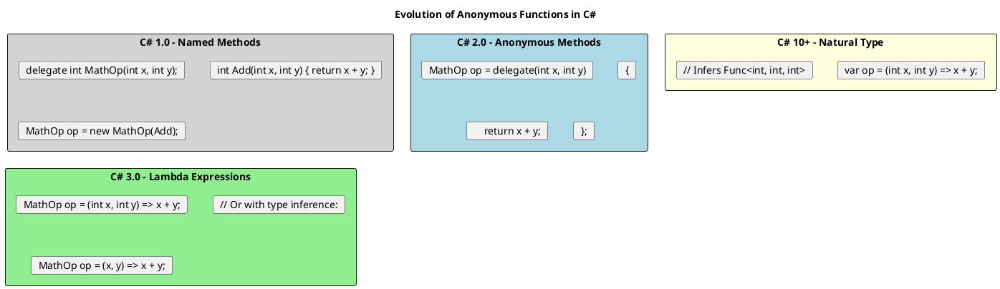
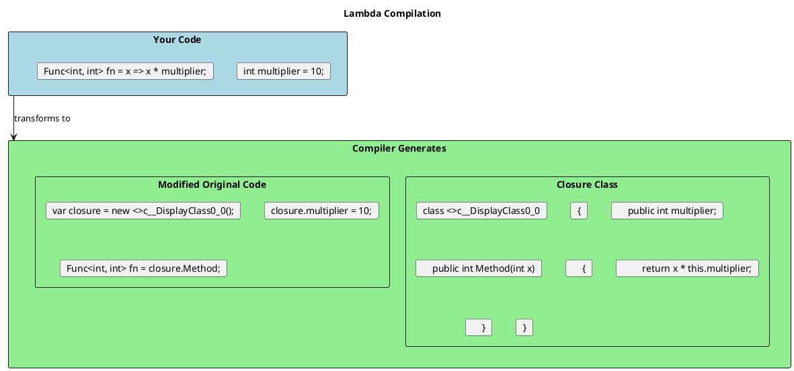
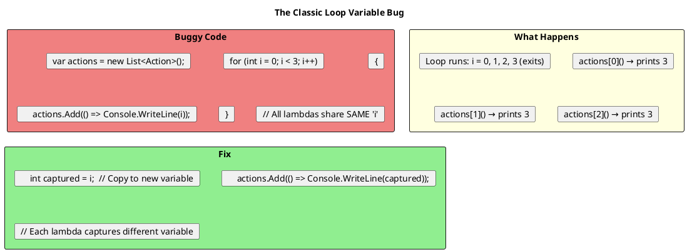
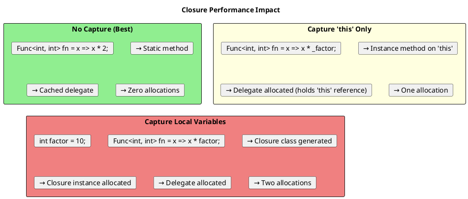
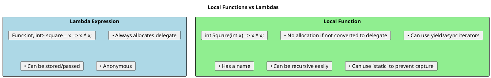

# Lambda Expressions & Closures - Deep Dive

## Lambda Evolution



## Lambda Syntax Forms

```csharp
// ═══════════════════════════════════════════════════════
// EXPRESSION LAMBDAS (single expression, implicit return)
// ═══════════════════════════════════════════════════════

// Full syntax
Func<int, int, int> add = (int x, int y) => x + y;

// Type inference
Func<int, int, int> add2 = (x, y) => x + y;

// Single parameter - parentheses optional
Func<int, int> square = x => x * x;

// No parameters
Func<int> getOne = () => 1;
Action sayHello = () => Console.WriteLine("Hello");

// ═══════════════════════════════════════════════════════
// STATEMENT LAMBDAS (multiple statements, explicit return)
// ═══════════════════════════════════════════════════════

Func<int, int, int> addWithLog = (x, y) =>
{
    Console.WriteLine($"Adding {x} and {y}");
    return x + y;
};

Action<string> processName = name =>
{
    var trimmed = name.Trim();
    var upper = trimmed.ToUpper();
    Console.WriteLine(upper);
};

// ═══════════════════════════════════════════════════════
// C# 10+ NATURAL TYPE INFERENCE
// ═══════════════════════════════════════════════════════

// Compiler infers Func<int, int, int>
var add3 = (int x, int y) => x + y;

// Must specify parameter types for inference
// var add4 = (x, y) => x + y;  // ERROR: Can't infer types

// Return type can be explicit
var parse = (string s) => int.Parse(s);  // Func<string, int>
var parseExplicit = int (string s) => int.Parse(s);  // Explicit return type

// ═══════════════════════════════════════════════════════
// C# 12 - DEFAULT PARAMETERS IN LAMBDAS
// ═══════════════════════════════════════════════════════

var greet = (string name = "World") => $"Hello, {name}!";
Console.WriteLine(greet());        // "Hello, World!"
Console.WriteLine(greet("John"));  // "Hello, John!"
```

## How Lambdas Are Compiled



### No Capture = Static Method

```csharp
// Lambda with NO captured variables
Func<int, int> square = x => x * x;

// Compiler generates static method and caches delegate:
// static int <>m__0(int x) => x * x;
// static Func<int, int> <>f__0 = new Func<int, int>(<>m__0);
// Func<int, int> square = <>f__0;  // Reuses cached instance

// Benefits: No allocation, maximum performance
```

### Capture = Closure Class

```csharp
int multiplier = 10;
Func<int, int> multiply = x => x * multiplier;  // Captures 'multiplier'

// Compiler generates closure class (heap allocation!)
// Plus: 'multiplier' now lives on heap, not stack
```

## Closures - The Captured Variables

```plantuml
@startuml
skinparam monochrome false

title Closure Variable Lifetime

rectangle "Without Closure" #LightBlue {
  card "void Method()"
  card "{"
  card "    int x = 10;"
  card "    // x dies when method returns"
  card "}"
}

rectangle "With Closure" #LightGreen {
  card "Func<int> Method()"
  card "{"
  card "    int x = 10;"
  card "    return () => x;  // x is captured"
  card "}"
  card ""
  card "// x now lives on heap"
  card "// Lifetime extended to delegate lifetime"
}

note bottom of "With Closure"
  The variable 'x' is "closed over"
  It's moved from stack to heap
  Lives as long as the delegate lives
end note
@enduml
```

### Closure Examples

```csharp
// ═══════════════════════════════════════════════════════
// BASIC CLOSURE
// ═══════════════════════════════════════════════════════

public Func<int, int> CreateMultiplier(int factor)
{
    // 'factor' is captured
    return x => x * factor;
}

var times2 = CreateMultiplier(2);
var times10 = CreateMultiplier(10);

// Each lambda has its own captured 'factor'
Console.WriteLine(times2(5));   // 10
Console.WriteLine(times10(5));  // 50

// ═══════════════════════════════════════════════════════
// MUTABLE CLOSURE - Changes are visible!
// ═══════════════════════════════════════════════════════

int counter = 0;
Action increment = () => counter++;
Action print = () => Console.WriteLine(counter);

increment();  // counter = 1
increment();  // counter = 2
print();      // Prints: 2

// Both lambdas share the SAME captured variable!

// ═══════════════════════════════════════════════════════
// CLOSURE SHARES VARIABLE, NOT VALUE
// ═══════════════════════════════════════════════════════

int value = 1;
Func<int> getValue = () => value;

Console.WriteLine(getValue());  // 1

value = 100;
Console.WriteLine(getValue());  // 100 - sees the change!
```

## The Loop Variable Trap

This is the **most common closure bug**:



```csharp
// ═══════════════════════════════════════════════════════
// THE BUG
// ═══════════════════════════════════════════════════════

var actions = new List<Action>();

for (int i = 0; i < 5; i++)
{
    actions.Add(() => Console.WriteLine(i));  // Captures 'i'
}

foreach (var action in actions)
    action();  // Prints: 5, 5, 5, 5, 5 (all same!)

// Why? There's only ONE 'i' variable, and all lambdas share it
// By the time they execute, i = 5

// ═══════════════════════════════════════════════════════
// THE FIX - Copy to Local
// ═══════════════════════════════════════════════════════

actions.Clear();

for (int i = 0; i < 5; i++)
{
    int captured = i;  // New variable each iteration
    actions.Add(() => Console.WriteLine(captured));
}

foreach (var action in actions)
    action();  // Prints: 0, 1, 2, 3, 4 (correct!)

// ═══════════════════════════════════════════════════════
// FOREACH IS SAFE (C# 5+)
// ═══════════════════════════════════════════════════════

var names = new[] { "Alice", "Bob", "Charlie" };
var greeters = new List<Action>();

foreach (var name in names)
{
    // In C# 5+, 'name' is logically a new variable each iteration
    greeters.Add(() => Console.WriteLine($"Hello, {name}!"));
}

foreach (var greet in greeters)
    greet();  // Correctly prints: Hello, Alice! Hello, Bob! Hello, Charlie!
```

## Closure Performance Implications



### Avoiding Closure Allocations

```csharp
public class Processor
{
    private readonly int _multiplier = 10;

    // BAD: Closure allocation every call
    public int ProcessBad(List<int> items)
    {
        int threshold = 5;  // Captured!
        return items.Where(x => x > threshold && x < _multiplier).Sum();
        // Allocates: closure class + delegate
    }

    // BETTER: Use method instead of lambda when capturing 'this'
    public int ProcessBetter(List<int> items)
    {
        return items.Where(IsInRange).Sum();
    }

    private bool IsInRange(int x) => x > 5 && x < _multiplier;

    // BEST: Static lambda (C# 9+) - compile error if captures anything
    public int ProcessBest(List<int> items, int threshold, int limit)
    {
        // Static lambda prevents accidental capture
        return items.Where(static x => x > 0).Sum();

        // This would be a compile error:
        // items.Where(static x => x > threshold);  // ERROR: Can't capture
    }
}
```

## Expression vs Statement Lambdas

```csharp
// ═══════════════════════════════════════════════════════
// EXPRESSION LAMBDA - Can be converted to Expression Tree
// ═══════════════════════════════════════════════════════

Expression<Func<int, bool>> expr = x => x > 5;
// This is metadata - can be analyzed, translated to SQL, etc.

// ═══════════════════════════════════════════════════════
// STATEMENT LAMBDA - Cannot be converted to Expression Tree
// ═══════════════════════════════════════════════════════

// This will NOT compile:
// Expression<Func<int, bool>> expr = x => { return x > 5; };

// Statement lambdas can only be delegates
Func<int, bool> func = x => { return x > 5; };  // OK

// ═══════════════════════════════════════════════════════
// WHY IT MATTERS - Entity Framework
// ═══════════════════════════════════════════════════════

// EF translates expressions to SQL
var users = dbContext.Users
    .Where(u => u.Age > 18)     // Expression - translates to SQL WHERE
    .ToList();

// If you use statement lambda, it can't translate:
// .Where(u => { return u.Age > 18; })  // ERROR
```

## Lambda Attributes (C# 10+)

```csharp
// ═══════════════════════════════════════════════════════
// ATTRIBUTES ON LAMBDAS
// ═══════════════════════════════════════════════════════

// Return type attribute
var parse = [return: NotNullIfNotNull(nameof(s))]
    (string? s) => s?.ToUpper();

// Parameter attribute
var validate = ([Required] string name) => name.Length > 0;

// Method attribute
var handler = [Obsolete("Use NewHandler instead")]
    (int x) => x * 2;

// ═══════════════════════════════════════════════════════
// USEFUL FOR ASP.NET MINIMAL APIS
// ═══════════════════════════════════════════════════════

app.MapGet("/users/{id}",
    [Authorize(Roles = "Admin")]
    async ([FromRoute] int id, IUserService service) =>
    {
        return await service.GetByIdAsync(id);
    });

app.MapPost("/users",
    [ProducesResponseType(201)]
    [ProducesResponseType(400)]
    async ([FromBody] CreateUserDto dto, IUserService service) =>
    {
        var user = await service.CreateAsync(dto);
        return Results.Created($"/users/{user.Id}", user);
    });
```

## Local Functions vs Lambdas



```csharp
public int ProcessItems(List<int> items)
{
    // Local function - no allocation unless converted to delegate
    int Transform(int x) => x * 2;

    // Static local function - compile error if it captures
    static int SafeTransform(int x) => x * 2;

    // Can use recursion naturally
    int Factorial(int n) => n <= 1 ? 1 : n * Factorial(n - 1);

    // Can be async iterator
    async IAsyncEnumerable<int> GetItemsAsync()
    {
        foreach (var item in items)  // Can capture!
        {
            await Task.Delay(10);
            yield return item;
        }
    }

    return items.Select(Transform).Sum();
}
```

## Senior Interview Questions

**Q: What's the difference between a lambda and an anonymous method?**

Anonymous methods (C# 2.0) use `delegate` keyword, lambdas use `=>`:
```csharp
// Anonymous method
Func<int, int> anon = delegate(int x) { return x * 2; };

// Lambda
Func<int, int> lambda = x => x * 2;
```
Lambdas are preferred. Anonymous methods can omit parameter list when not needed.

**Q: Can you explain what a closure "closes over"?**

A closure closes over (captures) variables from its enclosing scope. The variable itself (not its value) is captured and lives as long as the closure:

```csharp
int x = 10;
Func<int> getClosure = () => x;  // Closes over 'x'
x = 20;
Console.WriteLine(getClosure());  // 20, not 10!
```

**Q: Why might a lambda cause a memory leak?**

If a lambda captures `this` and is stored in a long-lived collection:

```csharp
public class Subscriber
{
    private int _value = 10;

    public void Subscribe(EventManager manager)
    {
        // Captures 'this' implicitly through _value
        manager.OnEvent += () => Console.WriteLine(_value);
        // 'this' is now held by manager's event
        // Subscriber can't be GC'd while manager lives
    }
}
```

**Q: What does `static` on a lambda do?**

It prevents capturing any variables, making accidental closures a compile error:

```csharp
int x = 10;
Func<int, int> fn = static y => y * 2;      // OK
Func<int, int> fn2 = static y => y * x;     // ERROR: Can't capture x
Func<int, int> fn3 = static y => y * this._value;  // ERROR: Can't capture this
```
