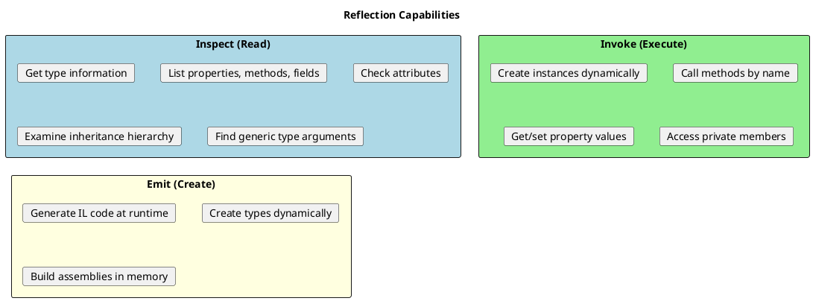
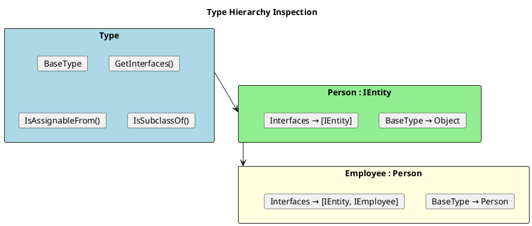
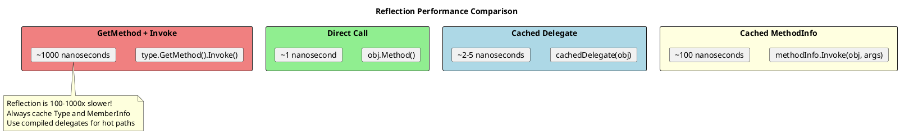

# Reflection - Deep Dive

## What Is Reflection?

Reflection allows you to inspect and manipulate type metadata at runtime. It's the foundation for many frameworks (DI containers, ORMs, serializers).



## Getting Type Information

```csharp
// ═══════════════════════════════════════════════════════
// THREE WAYS TO GET TYPE
// ═══════════════════════════════════════════════════════

// 1. typeof() - compile-time, from type name
Type type1 = typeof(string);

// 2. GetType() - runtime, from instance
string s = "hello";
Type type2 = s.GetType();

// 3. Type.GetType() - runtime, from string name
Type? type3 = Type.GetType("System.String");
Type? type4 = Type.GetType("MyNamespace.MyClass, MyAssembly");

// ═══════════════════════════════════════════════════════
// BASIC TYPE INFORMATION
// ═══════════════════════════════════════════════════════

Type type = typeof(Dictionary<string, int>);

Console.WriteLine($"Name: {type.Name}");                    // Dictionary`2
Console.WriteLine($"FullName: {type.FullName}");            // System.Collections.Generic.Dictionary`2[...]
Console.WriteLine($"Namespace: {type.Namespace}");          // System.Collections.Generic
Console.WriteLine($"Assembly: {type.Assembly.GetName().Name}"); // System.Collections

Console.WriteLine($"IsClass: {type.IsClass}");              // True
Console.WriteLine($"IsGenericType: {type.IsGenericType}");  // True
Console.WriteLine($"IsValueType: {type.IsValueType}");      // False
Console.WriteLine($"IsInterface: {type.IsInterface}");      // False
Console.WriteLine($"IsAbstract: {type.IsAbstract}");        // False
Console.WriteLine($"IsSealed: {type.IsSealed}");            // False
```

## Type Hierarchy



```csharp
public interface IEntity { int Id { get; } }
public class Person : IEntity { public int Id { get; set; } }
public class Employee : Person { public string Department { get; set; } }

Type employeeType = typeof(Employee);

// Base type
Type? baseType = employeeType.BaseType;  // Person
Type? grandBase = baseType?.BaseType;    // Object

// Interfaces
Type[] interfaces = employeeType.GetInterfaces();  // [IEntity]

// Hierarchy checks
bool isAssignable = typeof(IEntity).IsAssignableFrom(employeeType);  // True
bool isSubclass = employeeType.IsSubclassOf(typeof(Person));         // True
bool implements = typeof(IEntity).IsAssignableFrom(employeeType);    // True

// Walk up inheritance chain
Type? current = employeeType;
while (current != null)
{
    Console.WriteLine(current.Name);
    current = current.BaseType;
}
// Output: Employee, Person, Object
```

## Members: Properties, Methods, Fields

```csharp
public class Product
{
    private int _id;
    public string Name { get; set; }
    public decimal Price { get; private set; }

    public Product() { }
    public Product(string name, decimal price) { Name = name; Price = price; }

    public void Display() => Console.WriteLine($"{Name}: ${Price}");
    private void InternalProcess() { }
}

Type type = typeof(Product);

// ═══════════════════════════════════════════════════════
// PROPERTIES
// ═══════════════════════════════════════════════════════

PropertyInfo[] props = type.GetProperties();
foreach (var prop in props)
{
    Console.WriteLine($"{prop.Name}: {prop.PropertyType.Name}");
    Console.WriteLine($"  CanRead: {prop.CanRead}, CanWrite: {prop.CanWrite}");
}
// Name: String, CanRead: True, CanWrite: True
// Price: Decimal, CanRead: True, CanWrite: False

// Get specific property
PropertyInfo? nameProp = type.GetProperty("Name");

// ═══════════════════════════════════════════════════════
// METHODS
// ═══════════════════════════════════════════════════════

// Public methods only (default)
MethodInfo[] publicMethods = type.GetMethods();

// Including private methods
MethodInfo[] allMethods = type.GetMethods(
    BindingFlags.Public |
    BindingFlags.NonPublic |
    BindingFlags.Instance);

// Get specific method
MethodInfo? displayMethod = type.GetMethod("Display");
MethodInfo? privateMethod = type.GetMethod("InternalProcess",
    BindingFlags.NonPublic | BindingFlags.Instance);

// ═══════════════════════════════════════════════════════
// FIELDS (including private)
// ═══════════════════════════════════════════════════════

FieldInfo[] fields = type.GetFields(
    BindingFlags.Public |
    BindingFlags.NonPublic |
    BindingFlags.Instance);

foreach (var field in fields)
{
    Console.WriteLine($"Field: {field.Name}, Type: {field.FieldType.Name}");
}
// Field: _id, Type: Int32
// Field: <Name>k__BackingField, Type: String (auto-property backing field)
// Field: <Price>k__BackingField, Type: Decimal

// ═══════════════════════════════════════════════════════
// CONSTRUCTORS
// ═══════════════════════════════════════════════════════

ConstructorInfo[] ctors = type.GetConstructors();
foreach (var ctor in ctors)
{
    var parameters = ctor.GetParameters();
    Console.WriteLine($"Ctor: ({string.Join(", ", parameters.Select(p => p.ParameterType.Name))})");
}
// Ctor: ()
// Ctor: (String, Decimal)
```

## Dynamic Invocation

```plantuml
@startuml
skinparam monochrome false

title Reflection Invocation Flow

rectangle "1. Get Type" as t #LightBlue {
  card "typeof(MyClass)"
  card "obj.GetType()"
}

rectangle "2. Get Member" as m #LightGreen {
  card "GetMethod(\"DoWork\")"
  card "GetProperty(\"Name\")"
}

rectangle "3. Invoke" as i #LightYellow {
  card "method.Invoke(instance, args)"
  card "property.SetValue(instance, value)"
}

t --> m --> i
@enduml
```

```csharp
// ═══════════════════════════════════════════════════════
// CREATING INSTANCES
// ═══════════════════════════════════════════════════════

// Parameterless constructor
Type type = typeof(Product);
object? instance1 = Activator.CreateInstance(type);

// With constructor parameters
object? instance2 = Activator.CreateInstance(type, "Widget", 19.99m);

// Generic version (better performance)
Product product = Activator.CreateInstance<Product>();

// Using ConstructorInfo
ConstructorInfo? ctor = type.GetConstructor(new[] { typeof(string), typeof(decimal) });
object? instance3 = ctor?.Invoke(new object[] { "Gadget", 29.99m });

// ═══════════════════════════════════════════════════════
// INVOKING METHODS
// ═══════════════════════════════════════════════════════

MethodInfo? method = type.GetMethod("Display");
method?.Invoke(instance1, null);  // Calls Display() on instance1

// Method with parameters
MethodInfo? addMethod = typeof(Calculator).GetMethod("Add");
object? result = addMethod?.Invoke(calculator, new object[] { 5, 3 });

// Static method
MethodInfo? parseMethod = typeof(int).GetMethod("Parse", new[] { typeof(string) });
object? parsed = parseMethod?.Invoke(null, new object[] { "42" });

// ═══════════════════════════════════════════════════════
// GETTING/SETTING PROPERTIES
// ═══════════════════════════════════════════════════════

PropertyInfo? nameProp = type.GetProperty("Name");

// Get value
object? name = nameProp?.GetValue(instance1);

// Set value
nameProp?.SetValue(instance1, "New Name");

// ═══════════════════════════════════════════════════════
// ACCESSING PRIVATE MEMBERS
// ═══════════════════════════════════════════════════════

FieldInfo? privateField = type.GetField("_id",
    BindingFlags.NonPublic | BindingFlags.Instance);

privateField?.SetValue(instance1, 42);  // Set private field!
int? id = (int?)privateField?.GetValue(instance1);  // Get private field
```

## Generic Types with Reflection

```csharp
// ═══════════════════════════════════════════════════════
// INSPECTING GENERIC TYPES
// ═══════════════════════════════════════════════════════

Type listType = typeof(List<string>);

Console.WriteLine(listType.IsGenericType);      // True
Console.WriteLine(listType.IsConstructedGenericType);  // True (has type arguments)

// Get generic type definition
Type genericDef = listType.GetGenericTypeDefinition();  // List<>
Console.WriteLine(genericDef.Name);  // List`1

// Get type arguments
Type[] typeArgs = listType.GetGenericArguments();  // [String]

// ═══════════════════════════════════════════════════════
// CREATING GENERIC TYPES DYNAMICALLY
// ═══════════════════════════════════════════════════════

// Start with open generic type
Type openType = typeof(Dictionary<,>);

// Make closed generic type
Type closedType = openType.MakeGenericType(typeof(string), typeof(int));

// Create instance
object? dict = Activator.CreateInstance(closedType);

// ═══════════════════════════════════════════════════════
// INVOKING GENERIC METHODS
// ═══════════════════════════════════════════════════════

public class Serializer
{
    public T Deserialize<T>(string json) => default!;
}

Type serializerType = typeof(Serializer);
MethodInfo? method = serializerType.GetMethod("Deserialize");

// Make generic method with specific type
MethodInfo? genericMethod = method?.MakeGenericMethod(typeof(Person));

// Invoke
var serializer = new Serializer();
object? result = genericMethod?.Invoke(serializer, new object[] { "{}" });
```

## Performance Considerations



### Optimization Strategies

```csharp
public class ReflectionOptimizer
{
    // ═══════════════════════════════════════════════════════
    // BAD: Reflection on every call
    // ═══════════════════════════════════════════════════════
    public object? GetValueSlow(object obj, string propertyName)
    {
        return obj.GetType()
            .GetProperty(propertyName)?
            .GetValue(obj);  // Slow every time!
    }

    // ═══════════════════════════════════════════════════════
    // BETTER: Cache PropertyInfo
    // ═══════════════════════════════════════════════════════
    private static readonly ConcurrentDictionary<(Type, string), PropertyInfo?> _propertyCache = new();

    public object? GetValueCached(object obj, string propertyName)
    {
        var key = (obj.GetType(), propertyName);
        var prop = _propertyCache.GetOrAdd(key, k =>
            k.Item1.GetProperty(k.Item2));
        return prop?.GetValue(obj);
    }

    // ═══════════════════════════════════════════════════════
    // BEST: Compiled delegates
    // ═══════════════════════════════════════════════════════
    private static readonly ConcurrentDictionary<(Type, string), Func<object, object?>> _getterCache = new();

    public object? GetValueFast(object obj, string propertyName)
    {
        var key = (obj.GetType(), propertyName);
        var getter = _getterCache.GetOrAdd(key, k =>
        {
            var prop = k.Item1.GetProperty(k.Item2);
            if (prop == null) return _ => null;

            var param = Expression.Parameter(typeof(object));
            var cast = Expression.Convert(param, k.Item1);
            var access = Expression.Property(cast, prop);
            var convert = Expression.Convert(access, typeof(object));

            return Expression.Lambda<Func<object, object?>>(convert, param).Compile();
        });

        return getter(obj);
    }
}

// Performance comparison:
// GetValueSlow:   ~500ns per call
// GetValueCached: ~100ns per call (5x faster)
// GetValueFast:   ~5ns per call   (100x faster!)
```

## Source Generators (Modern Alternative)

```csharp
// C# 9+ Source Generators replace many reflection use cases
// with compile-time code generation

// Instead of:
// var json = JsonSerializer.Serialize(obj);  // Uses reflection

// Use source-generated:
[JsonSerializable(typeof(Person))]
public partial class MyJsonContext : JsonSerializerContext { }

var json = JsonSerializer.Serialize(person, MyJsonContext.Default.Person);
// No reflection! Generated at compile time
```

## Common Reflection Patterns

### Pattern 1: Plugin System

```csharp
public interface IPlugin
{
    string Name { get; }
    void Execute();
}

public class PluginLoader
{
    public List<IPlugin> LoadPlugins(string directory)
    {
        var plugins = new List<IPlugin>();

        foreach (var file in Directory.GetFiles(directory, "*.dll"))
        {
            var assembly = Assembly.LoadFrom(file);

            var pluginTypes = assembly.GetTypes()
                .Where(t => typeof(IPlugin).IsAssignableFrom(t))
                .Where(t => !t.IsInterface && !t.IsAbstract);

            foreach (var type in pluginTypes)
            {
                if (Activator.CreateInstance(type) is IPlugin plugin)
                {
                    plugins.Add(plugin);
                }
            }
        }

        return plugins;
    }
}
```

### Pattern 2: Dependency Injection Container

```csharp
public class SimpleContainer
{
    private readonly Dictionary<Type, Type> _registrations = new();

    public void Register<TInterface, TImplementation>()
        where TImplementation : TInterface
    {
        _registrations[typeof(TInterface)] = typeof(TImplementation);
    }

    public T Resolve<T>()
    {
        return (T)Resolve(typeof(T));
    }

    private object Resolve(Type type)
    {
        if (_registrations.TryGetValue(type, out var implementation))
            type = implementation;

        var constructor = type.GetConstructors().First();
        var parameters = constructor.GetParameters()
            .Select(p => Resolve(p.ParameterType))
            .ToArray();

        return constructor.Invoke(parameters);
    }
}
```

## Senior Interview Questions

**Q: When should you avoid reflection?**

- Hot paths (called frequently) - use compiled delegates or source generators
- When type is known at compile time - use direct calls or generics
- Security-sensitive code - reflection can access private members

**Q: What's the difference between `typeof()` and `GetType()`?**

```csharp
Animal animal = new Dog();

typeof(Animal)     // Always Animal (compile-time)
animal.GetType()   // Dog (runtime actual type)
```

**Q: How do you invoke a private method?**

```csharp
var method = type.GetMethod("PrivateMethod",
    BindingFlags.NonPublic | BindingFlags.Instance);
method.Invoke(instance, parameters);
```

**Q: What are `BindingFlags` and when are they needed?**

`BindingFlags` control which members are returned:
- `Public` / `NonPublic` - visibility
- `Instance` / `Static` - member type
- `DeclaredOnly` - exclude inherited members
- `FlattenHierarchy` - include static members from base classes

Default is `Public | Instance`, so you must specify flags for private or static members.
