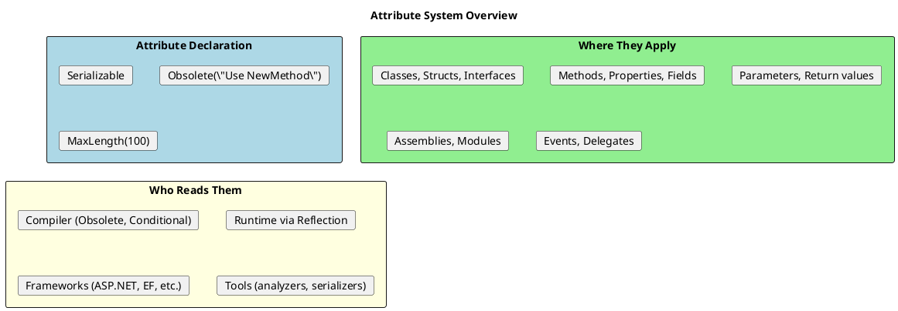
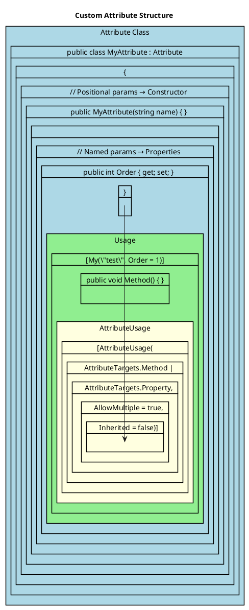

# Attributes - Deep Dive

## What Are Attributes?

Attributes are metadata attached to code elements. They don't change code behavior directly but provide information that can be read at compile time or runtime.



## Built-in Attributes

```csharp
// ═══════════════════════════════════════════════════════
// COMPILER ATTRIBUTES
// ═══════════════════════════════════════════════════════

[Obsolete("Use NewMethod instead", error: false)]
public void OldMethod() { }

[Obsolete("This will cause compile error", error: true)]
public void VeryOldMethod() { }

[Conditional("DEBUG")]  // Method only called in DEBUG builds
public void DebugLog(string message) => Console.WriteLine(message);

// ═══════════════════════════════════════════════════════
// SERIALIZATION ATTRIBUTES
// ═══════════════════════════════════════════════════════

[Serializable]
public class Person
{
    [NonSerialized]
    private int _cachedValue;  // Won't be serialized

    public string Name { get; set; }
}

// JSON Serialization (System.Text.Json)
public class Product
{
    [JsonPropertyName("product_name")]
    public string Name { get; set; }

    [JsonIgnore]
    public string InternalCode { get; set; }

    [JsonInclude]
    private int _secretId;
}

// ═══════════════════════════════════════════════════════
// VALIDATION ATTRIBUTES
// ═══════════════════════════════════════════════════════

public class CreateUserDto
{
    [Required(ErrorMessage = "Name is required")]
    [StringLength(100, MinimumLength = 2)]
    public string Name { get; set; }

    [Required]
    [EmailAddress]
    public string Email { get; set; }

    [Range(18, 120)]
    public int Age { get; set; }

    [RegularExpression(@"^\d{5}$", ErrorMessage = "Invalid ZIP")]
    public string ZipCode { get; set; }

    [Compare(nameof(Password))]
    public string ConfirmPassword { get; set; }
}

// ═══════════════════════════════════════════════════════
// CALLER INFO ATTRIBUTES
// ═══════════════════════════════════════════════════════

public static class Logger
{
    public static void Log(
        string message,
        [CallerMemberName] string memberName = "",
        [CallerFilePath] string filePath = "",
        [CallerLineNumber] int lineNumber = 0,
        [CallerArgumentExpression(nameof(message))] string expr = "")
    {
        Console.WriteLine($"[{memberName}:{lineNumber}] {message}");
        Console.WriteLine($"  File: {filePath}");
        Console.WriteLine($"  Expression: {expr}");
    }
}

// Usage:
Logger.Log(user.Name);
// Output:
// [Main:25] John
// File: C:\...\Program.cs
// Expression: user.Name
```

## Creating Custom Attributes



```csharp
// ═══════════════════════════════════════════════════════
// SIMPLE CUSTOM ATTRIBUTE
// ═══════════════════════════════════════════════════════

[AttributeUsage(AttributeTargets.Method)]
public class AuditAttribute : Attribute
{
    public string Action { get; }
    public string? Description { get; set; }

    public AuditAttribute(string action)
    {
        Action = action;
    }
}

// Usage
public class OrderService
{
    [Audit("Create", Description = "Creates a new order")]
    public Order CreateOrder(OrderDto dto) { ... }

    [Audit("Delete")]
    public void DeleteOrder(int id) { ... }
}

// ═══════════════════════════════════════════════════════
// VALIDATION ATTRIBUTE
// ═══════════════════════════════════════════════════════

public class FutureDateAttribute : ValidationAttribute
{
    protected override ValidationResult? IsValid(
        object? value,
        ValidationContext validationContext)
    {
        if (value is DateTime date)
        {
            if (date > DateTime.Now)
                return ValidationResult.Success;

            return new ValidationResult(
                ErrorMessage ?? "Date must be in the future");
        }

        return new ValidationResult("Invalid date");
    }
}

// Usage
public class Event
{
    [Required]
    public string Name { get; set; }

    [FutureDate(ErrorMessage = "Event must be scheduled for the future")]
    public DateTime StartDate { get; set; }
}

// ═══════════════════════════════════════════════════════
// ATTRIBUTE WITH MULTIPLE TARGETS
// ═══════════════════════════════════════════════════════

[AttributeUsage(
    AttributeTargets.Class |
    AttributeTargets.Method |
    AttributeTargets.Property,
    AllowMultiple = true,
    Inherited = true)]
public class PermissionAttribute : Attribute
{
    public string[] Roles { get; }

    public PermissionAttribute(params string[] roles)
    {
        Roles = roles;
    }
}

// Usage
[Permission("Admin")]
public class AdminController
{
    [Permission("Admin", "Manager")]  // Multiple allowed
    public void ManageUsers() { }
}
```

## Reading Attributes via Reflection

```csharp
// ═══════════════════════════════════════════════════════
// CHECKING IF ATTRIBUTE EXISTS
// ═══════════════════════════════════════════════════════

Type type = typeof(OrderService);
MethodInfo? method = type.GetMethod("CreateOrder");

// Simple check
bool hasAudit = method?.IsDefined(typeof(AuditAttribute)) ?? false;

// Using Attribute class
bool hasAudit2 = Attribute.IsDefined(method!, typeof(AuditAttribute));

// ═══════════════════════════════════════════════════════
// GETTING ATTRIBUTE INSTANCE
// ═══════════════════════════════════════════════════════

// Single attribute
AuditAttribute? audit = method?.GetCustomAttribute<AuditAttribute>();
if (audit != null)
{
    Console.WriteLine($"Action: {audit.Action}");
    Console.WriteLine($"Description: {audit.Description}");
}

// Multiple attributes (when AllowMultiple = true)
IEnumerable<PermissionAttribute> permissions =
    method?.GetCustomAttributes<PermissionAttribute>() ?? [];

foreach (var perm in permissions)
{
    Console.WriteLine($"Roles: {string.Join(", ", perm.Roles)}");
}

// ═══════════════════════════════════════════════════════
// SCANNING FOR ATTRIBUTES
// ═══════════════════════════════════════════════════════

public static IEnumerable<(MethodInfo Method, AuditAttribute Attr)>
    FindAuditedMethods(Assembly assembly)
{
    return assembly.GetTypes()
        .SelectMany(t => t.GetMethods())
        .Select(m => (Method: m, Attr: m.GetCustomAttribute<AuditAttribute>()))
        .Where(x => x.Attr != null)!;
}

// Usage
foreach (var (method, attr) in FindAuditedMethods(Assembly.GetExecutingAssembly()))
{
    Console.WriteLine($"{method.DeclaringType?.Name}.{method.Name}: {attr.Action}");
}
```

## Practical Patterns

### Pattern 1: Authorization Framework

```csharp
[AttributeUsage(AttributeTargets.Method | AttributeTargets.Class)]
public class AuthorizeAttribute : Attribute
{
    public string[] Roles { get; }
    public string? Policy { get; set; }

    public AuthorizeAttribute(params string[] roles)
    {
        Roles = roles;
    }
}

public class AuthorizationFilter
{
    public bool IsAuthorized(MethodInfo method, ClaimsPrincipal user)
    {
        // Check class-level attribute
        var classAttr = method.DeclaringType?.GetCustomAttribute<AuthorizeAttribute>();

        // Check method-level attribute
        var methodAttr = method.GetCustomAttribute<AuthorizeAttribute>();

        // Method attribute overrides class attribute
        var attr = methodAttr ?? classAttr;

        if (attr == null)
            return true;  // No authorization required

        // Check if user has any required role
        return attr.Roles.Length == 0 ||
               attr.Roles.Any(role => user.IsInRole(role));
    }
}
```

### Pattern 2: API Documentation

```csharp
[AttributeUsage(AttributeTargets.Method)]
public class ApiEndpointAttribute : Attribute
{
    public string Route { get; }
    public string Method { get; }
    public string Summary { get; set; } = "";
    public Type? RequestType { get; set; }
    public Type? ResponseType { get; set; }

    public ApiEndpointAttribute(string method, string route)
    {
        Method = method;
        Route = route;
    }
}

public class UserController
{
    [ApiEndpoint("GET", "/users/{id}",
        Summary = "Get user by ID",
        ResponseType = typeof(User))]
    public User GetUser(int id) => ...;

    [ApiEndpoint("POST", "/users",
        Summary = "Create new user",
        RequestType = typeof(CreateUserDto),
        ResponseType = typeof(User))]
    public User CreateUser(CreateUserDto dto) => ...;
}

// Generate documentation
public static string GenerateApiDocs(Type controllerType)
{
    var sb = new StringBuilder();

    foreach (var method in controllerType.GetMethods())
    {
        var attr = method.GetCustomAttribute<ApiEndpointAttribute>();
        if (attr == null) continue;

        sb.AppendLine($"## {attr.Method} {attr.Route}");
        sb.AppendLine(attr.Summary);
        if (attr.RequestType != null)
            sb.AppendLine($"Request: {attr.RequestType.Name}");
        if (attr.ResponseType != null)
            sb.AppendLine($"Response: {attr.ResponseType.Name}");
        sb.AppendLine();
    }

    return sb.ToString();
}
```

### Pattern 3: Command Handler Discovery

```csharp
[AttributeUsage(AttributeTargets.Class)]
public class CommandHandlerAttribute : Attribute
{
    public Type CommandType { get; }

    public CommandHandlerAttribute(Type commandType)
    {
        CommandType = commandType;
    }
}

public interface ICommand { }
public interface ICommandHandler<T> where T : ICommand
{
    Task HandleAsync(T command);
}

[CommandHandler(typeof(CreateOrderCommand))]
public class CreateOrderHandler : ICommandHandler<CreateOrderCommand>
{
    public Task HandleAsync(CreateOrderCommand command) => ...;
}

// Auto-register handlers
public static class ServiceCollectionExtensions
{
    public static IServiceCollection AddCommandHandlers(
        this IServiceCollection services,
        Assembly assembly)
    {
        var handlerTypes = assembly.GetTypes()
            .Where(t => t.GetCustomAttribute<CommandHandlerAttribute>() != null)
            .Where(t => !t.IsAbstract);

        foreach (var handlerType in handlerTypes)
        {
            var attr = handlerType.GetCustomAttribute<CommandHandlerAttribute>()!;
            var interfaceType = typeof(ICommandHandler<>).MakeGenericType(attr.CommandType);
            services.AddTransient(interfaceType, handlerType);
        }

        return services;
    }
}

// Usage in Startup
services.AddCommandHandlers(typeof(Program).Assembly);
```

## C# 11: Generic Attributes

```csharp
// Before C# 11: Type as parameter
[TypeConverter(typeof(MyConverter))]
public class MyClass { }

// C# 11: Generic attribute
public class ValidatorAttribute<T> : Attribute where T : IValidator, new()
{
    public bool Validate(object value)
    {
        var validator = new T();
        return validator.IsValid(value);
    }
}

// Usage
[Validator<EmailValidator>]
public string Email { get; set; }

[Validator<PhoneValidator>]
public string Phone { get; set; }
```

## Senior Interview Questions

**Q: What's the difference between `Attribute.GetCustomAttribute` and `MemberInfo.GetCustomAttribute`?**

They're similar, but:
- `MemberInfo.GetCustomAttribute<T>()` is an extension method (more concise)
- `Attribute.GetCustomAttribute()` is static and works with any `MemberInfo`
- Both read from metadata; no functional difference

**Q: When are attributes instantiated?**

Attributes are instantiated lazily when first accessed via reflection. Each call to `GetCustomAttribute` creates a new instance (unless cached):

```csharp
var attr1 = method.GetCustomAttribute<MyAttribute>();
var attr2 = method.GetCustomAttribute<MyAttribute>();
ReferenceEquals(attr1, attr2);  // False! Different instances
```

**Q: Can you have logic in an attribute constructor?**

Yes, but keep it simple. Attributes should be declarative. Complex logic belongs in the code that reads the attribute:

```csharp
// BAD - Complex logic in attribute
public class ComplexAttribute : Attribute
{
    public ComplexAttribute()
    {
        // Don't: connect to database
        // Don't: read files
        // Don't: complex calculations
    }
}

// GOOD - Attribute is data, processing is separate
public class SimpleAttribute : Attribute
{
    public string Value { get; }
    public SimpleAttribute(string value) => Value = value;
}

public class AttributeProcessor
{
    public void Process(SimpleAttribute attr)
    {
        // Complex logic here
    }
}
```

**Q: How do `AttributeTargets` work?**

They restrict where an attribute can be applied:

```csharp
[AttributeUsage(AttributeTargets.Property)]
public class PropertyOnlyAttribute : Attribute { }

// [PropertyOnly]  // ERROR: Can't apply to class
public class MyClass
{
    [PropertyOnly]  // OK: Property
    public int Value { get; set; }
}
```
