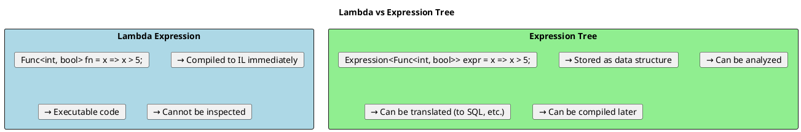
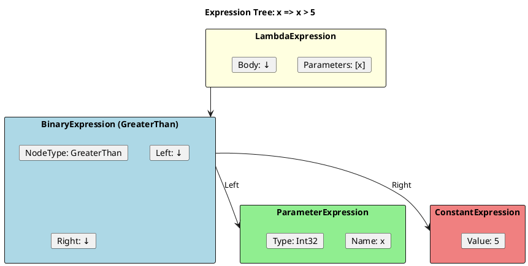
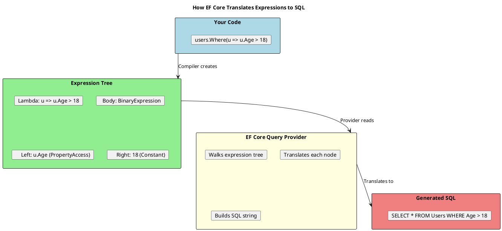

# Expression Trees - Deep Dive

## What Are Expression Trees?

Expression trees represent code as data - a tree structure that can be analyzed, modified, and compiled. They're the foundation of LINQ providers like Entity Framework.



## Expression Tree Structure



```csharp
Expression<Func<int, bool>> expr = x => x > 5;

// Inspect the structure
Console.WriteLine($"Type: {expr.GetType().Name}");  // Expression`1
Console.WriteLine($"Body: {expr.Body}");            // (x > 5)
Console.WriteLine($"Body Type: {expr.Body.GetType().Name}");  // BinaryExpression

var binary = (BinaryExpression)expr.Body;
Console.WriteLine($"NodeType: {binary.NodeType}");  // GreaterThan
Console.WriteLine($"Left: {binary.Left}");          // x
Console.WriteLine($"Right: {binary.Right}");        // 5

var left = (ParameterExpression)binary.Left;
var right = (ConstantExpression)binary.Right;
Console.WriteLine($"Parameter: {left.Name}, Type: {left.Type}");  // x, Int32
Console.WriteLine($"Constant: {right.Value}");  // 5
```

## Building Expression Trees

```csharp
// ═══════════════════════════════════════════════════════
// METHOD 1: From Lambda (Compiler builds it)
// ═══════════════════════════════════════════════════════

Expression<Func<int, bool>> fromLambda = x => x > 5;

// ═══════════════════════════════════════════════════════
// METHOD 2: Using Expression Factory Methods
// ═══════════════════════════════════════════════════════

// Build: x => x > 5

// 1. Create parameter
ParameterExpression param = Expression.Parameter(typeof(int), "x");

// 2. Create constant
ConstantExpression constant = Expression.Constant(5, typeof(int));

// 3. Create comparison
BinaryExpression comparison = Expression.GreaterThan(param, constant);

// 4. Create lambda
Expression<Func<int, bool>> manual = Expression.Lambda<Func<int, bool>>(
    comparison,
    param);

// 5. Compile and use
Func<int, bool> compiled = manual.Compile();
Console.WriteLine(compiled(10));  // True
Console.WriteLine(compiled(3));   // False
```

### Building Complex Expressions

```csharp
// Build: person => person.Age >= 18 && person.Name.StartsWith("J")

ParameterExpression personParam = Expression.Parameter(typeof(Person), "person");

// person.Age
MemberExpression ageProperty = Expression.Property(personParam, "Age");

// person.Age >= 18
BinaryExpression ageCheck = Expression.GreaterThanOrEqual(
    ageProperty,
    Expression.Constant(18));

// person.Name
MemberExpression nameProperty = Expression.Property(personParam, "Name");

// person.Name.StartsWith("J")
MethodInfo startsWithMethod = typeof(string).GetMethod("StartsWith", new[] { typeof(string) })!;
MethodCallExpression nameCheck = Expression.Call(
    nameProperty,
    startsWithMethod,
    Expression.Constant("J"));

// person.Age >= 18 && person.Name.StartsWith("J")
BinaryExpression combined = Expression.AndAlso(ageCheck, nameCheck);

// Create final lambda
Expression<Func<Person, bool>> finalExpr = Expression.Lambda<Func<Person, bool>>(
    combined,
    personParam);

// Use with LINQ
var adults = people.AsQueryable().Where(finalExpr);
```

## Why Expression Trees Matter: LINQ Providers



```csharp
// IQueryable uses Expression Trees
IQueryable<User> query = dbContext.Users
    .Where(u => u.Age > 18)           // Expression, not executed yet
    .Where(u => u.IsActive)           // Adds to expression tree
    .OrderBy(u => u.Name);            // Adds to expression tree

// Expression is translated to SQL when materialized
List<User> results = query.ToList(); // NOW SQL is generated and executed

// IEnumerable uses delegates - in-memory filtering
IEnumerable<User> inMemory = users
    .Where(u => u.Age > 18);          // Delegate, filters in C#
```

## ExpressionVisitor - Analyzing and Transforming

```csharp
// ═══════════════════════════════════════════════════════
// VISITOR TO FIND ALL PROPERTY ACCESSES
// ═══════════════════════════════════════════════════════

public class PropertyFinder : ExpressionVisitor
{
    public List<string> Properties { get; } = new();

    protected override Expression VisitMember(MemberExpression node)
    {
        if (node.Member is PropertyInfo prop)
        {
            Properties.Add($"{node.Expression?.Type.Name}.{prop.Name}");
        }
        return base.VisitMember(node);
    }
}

// Usage
Expression<Func<Person, bool>> expr = p => p.Age > 18 && p.Name.Length > 0;

var finder = new PropertyFinder();
finder.Visit(expr);

foreach (var prop in finder.Properties)
    Console.WriteLine(prop);
// Output:
// Person.Age
// Person.Name
// String.Length

// ═══════════════════════════════════════════════════════
// VISITOR TO REPLACE PARAMETER
// ═══════════════════════════════════════════════════════

public class ParameterReplacer : ExpressionVisitor
{
    private readonly ParameterExpression _oldParam;
    private readonly ParameterExpression _newParam;

    public ParameterReplacer(ParameterExpression oldParam, ParameterExpression newParam)
    {
        _oldParam = oldParam;
        _newParam = newParam;
    }

    protected override Expression VisitParameter(ParameterExpression node)
    {
        return node == _oldParam ? _newParam : node;
    }
}

// Combine two expressions with different parameters
public static Expression<Func<T, bool>> And<T>(
    Expression<Func<T, bool>> left,
    Expression<Func<T, bool>> right)
{
    var param = Expression.Parameter(typeof(T), "x");

    var leftBody = new ParameterReplacer(left.Parameters[0], param).Visit(left.Body);
    var rightBody = new ParameterReplacer(right.Parameters[0], param).Visit(right.Body);

    var combined = Expression.AndAlso(leftBody, rightBody);

    return Expression.Lambda<Func<T, bool>>(combined, param);
}

// Usage
Expression<Func<Person, bool>> isAdult = p => p.Age >= 18;
Expression<Func<Person, bool>> isActive = p => p.IsActive;

var combined = And(isAdult, isActive);
// Result: x => x.Age >= 18 && x.IsActive
```

## Dynamic Query Building

```csharp
public class QueryBuilder<T>
{
    private readonly ParameterExpression _param;
    private Expression? _body;

    public QueryBuilder()
    {
        _param = Expression.Parameter(typeof(T), "x");
    }

    public QueryBuilder<T> Where(string propertyName, object value)
    {
        var property = Expression.Property(_param, propertyName);
        var constant = Expression.Constant(value);
        var equals = Expression.Equal(property, constant);

        _body = _body == null ? equals : Expression.AndAlso(_body, equals);
        return this;
    }

    public QueryBuilder<T> WhereLike(string propertyName, string pattern)
    {
        var property = Expression.Property(_param, propertyName);
        var method = typeof(string).GetMethod("Contains", new[] { typeof(string) })!;
        var call = Expression.Call(property, method, Expression.Constant(pattern));

        _body = _body == null ? call : Expression.AndAlso(_body, call);
        return this;
    }

    public QueryBuilder<T> WhereGreaterThan(string propertyName, object value)
    {
        var property = Expression.Property(_param, propertyName);
        var constant = Expression.Constant(value);
        var greater = Expression.GreaterThan(property, constant);

        _body = _body == null ? greater : Expression.AndAlso(_body, greater);
        return this;
    }

    public Expression<Func<T, bool>> Build()
    {
        if (_body == null)
            return x => true;

        return Expression.Lambda<Func<T, bool>>(_body, _param);
    }
}

// Usage
var query = new QueryBuilder<Person>()
    .Where("IsActive", true)
    .WhereGreaterThan("Age", 18)
    .WhereLike("Name", "John")
    .Build();

var results = dbContext.People.Where(query).ToList();
// SQL: WHERE IsActive = 1 AND Age > 18 AND Name LIKE '%John%'
```

## Specification Pattern with Expressions

```csharp
public abstract class Specification<T>
{
    public abstract Expression<Func<T, bool>> ToExpression();

    public bool IsSatisfiedBy(T entity)
    {
        return ToExpression().Compile()(entity);
    }

    public Specification<T> And(Specification<T> other)
    {
        return new AndSpecification<T>(this, other);
    }

    public Specification<T> Or(Specification<T> other)
    {
        return new OrSpecification<T>(this, other);
    }

    public Specification<T> Not()
    {
        return new NotSpecification<T>(this);
    }
}

public class AndSpecification<T> : Specification<T>
{
    private readonly Specification<T> _left;
    private readonly Specification<T> _right;

    public AndSpecification(Specification<T> left, Specification<T> right)
    {
        _left = left;
        _right = right;
    }

    public override Expression<Func<T, bool>> ToExpression()
    {
        var leftExpr = _left.ToExpression();
        var rightExpr = _right.ToExpression();

        var param = Expression.Parameter(typeof(T));
        var body = Expression.AndAlso(
            Expression.Invoke(leftExpr, param),
            Expression.Invoke(rightExpr, param));

        return Expression.Lambda<Func<T, bool>>(body, param);
    }
}

// Concrete specifications
public class AdultSpecification : Specification<Person>
{
    public override Expression<Func<Person, bool>> ToExpression()
        => p => p.Age >= 18;
}

public class ActiveSpecification : Specification<Person>
{
    public override Expression<Func<Person, bool>> ToExpression()
        => p => p.IsActive;
}

// Usage
var spec = new AdultSpecification().And(new ActiveSpecification());
var results = dbContext.People.Where(spec.ToExpression()).ToList();
```

## Performance: Compiled Expressions

```csharp
public class FastPropertyAccessor<T, TValue>
{
    private readonly Func<T, TValue> _getter;
    private readonly Action<T, TValue>? _setter;

    public FastPropertyAccessor(string propertyName)
    {
        var param = Expression.Parameter(typeof(T), "x");
        var property = Expression.Property(param, propertyName);

        // Compile getter
        _getter = Expression.Lambda<Func<T, TValue>>(property, param).Compile();

        // Compile setter if property is writable
        var propInfo = typeof(T).GetProperty(propertyName);
        if (propInfo?.CanWrite == true)
        {
            var valueParam = Expression.Parameter(typeof(TValue), "value");
            var assign = Expression.Assign(property, valueParam);
            _setter = Expression.Lambda<Action<T, TValue>>(assign, param, valueParam).Compile();
        }
    }

    public TValue GetValue(T obj) => _getter(obj);
    public void SetValue(T obj, TValue value) => _setter?.Invoke(obj, value);
}

// Usage - much faster than reflection!
var accessor = new FastPropertyAccessor<Person, string>("Name");
string name = accessor.GetValue(person);
accessor.SetValue(person, "New Name");

// Performance comparison (per call):
// Direct property access: ~1ns
// Compiled expression:    ~5ns
// Reflection:             ~100ns
```

## Senior Interview Questions

**Q: Why can't statement lambdas be converted to expression trees?**

Expression trees can only represent single expressions, not statements. The compiler can't represent control flow (if, while, etc.) in the expression tree structure:

```csharp
// OK - single expression
Expression<Func<int, bool>> ok = x => x > 5;

// ERROR - statement body
Expression<Func<int, bool>> error = x =>
{
    Console.WriteLine(x);  // Statement
    return x > 5;          // Statement
};
```

**Q: What's the difference between `Expression.Invoke` and calling a compiled delegate?**

`Expression.Invoke` creates a node that calls an expression within another expression tree. The entire tree can still be translated (e.g., to SQL). Compiling first would lose the ability to translate.

**Q: How does Entity Framework use expression trees?**

EF's `IQueryable` provider receives expression trees, walks them with an `ExpressionVisitor`, and translates each node to SQL. Property accesses become column names, method calls become SQL functions, etc.

**Q: When would you build expression trees manually vs using lambdas?**

Manual building when:
- Query criteria are dynamic (from user input)
- Combining multiple expressions at runtime
- Building generic frameworks (automapper, validation)

Lambda syntax when:
- Expression is known at compile time
- Simpler, more readable code
