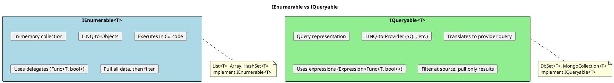
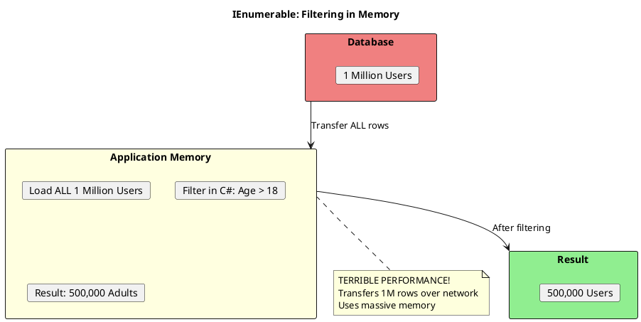
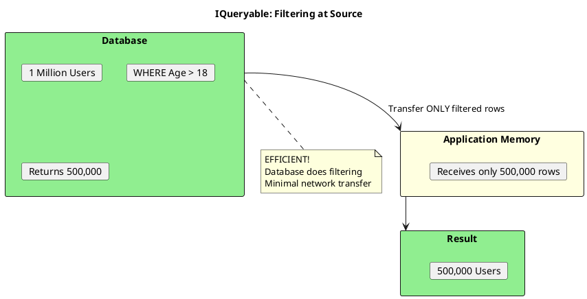
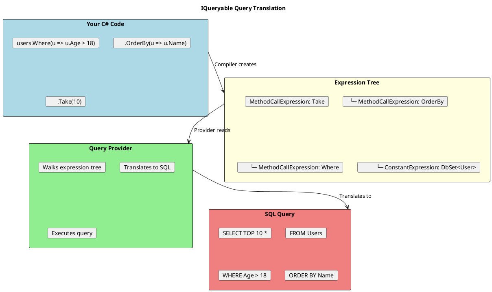

# IEnumerable<T> vs IQueryable<T> - The Critical Difference

## Overview

This is one of the **most important** distinctions for a senior .NET developer. Getting this wrong causes massive performance problems.



## The Interface Definitions

```csharp
// IEnumerable<T> - Simple iteration
public interface IEnumerable<T> : IEnumerable
{
    IEnumerator<T> GetEnumerator();
}

// IQueryable<T> - Extends IEnumerable, adds query capability
public interface IQueryable<T> : IEnumerable<T>, IQueryable
{
    Type ElementType { get; }
    Expression Expression { get; }      // The query as expression tree
    IQueryProvider Provider { get; }     // Translates and executes
}
```

## The Critical Difference: Where Filtering Happens





## Code Example: The Problem

```csharp
public class UserRepository
{
    private readonly AppDbContext _context;

    // ═══════════════════════════════════════════════════════
    // BAD: Returns IEnumerable - forces in-memory filtering
    // ═══════════════════════════════════════════════════════
    public IEnumerable<User> GetAllUsersBad()
    {
        return _context.Users;  // Returns as IEnumerable
    }

    // Caller usage:
    var adults = repo.GetAllUsersBad()
        .Where(u => u.Age > 18)   // This is Enumerable.Where!
        .ToList();                 // Loads ALL users, then filters

    // SQL Generated: SELECT * FROM Users  (no WHERE clause!)


    // ═══════════════════════════════════════════════════════
    // GOOD: Returns IQueryable - filtering pushed to database
    // ═══════════════════════════════════════════════════════
    public IQueryable<User> GetAllUsersGood()
    {
        return _context.Users;  // Returns as IQueryable
    }

    // Caller usage:
    var adults = repo.GetAllUsersGood()
        .Where(u => u.Age > 18)   // This is Queryable.Where!
        .ToList();                 // Only filtered users loaded

    // SQL Generated: SELECT * FROM Users WHERE Age > 18
}
```

## How The Translation Works



```csharp
// The two different Where methods:

// IEnumerable - uses delegate (compiled code)
public static IEnumerable<T> Where<T>(
    this IEnumerable<T> source,
    Func<T, bool> predicate);  // Delegate - just runs the code

// IQueryable - uses expression (data structure)
public static IQueryable<T> Where<T>(
    this IQueryable<T> source,
    Expression<Func<T, bool>> predicate);  // Expression tree - can be translated
```

## Common Mistakes

### Mistake 1: Casting to IEnumerable

```csharp
// BAD: Explicitly casting loses IQueryable benefits
IEnumerable<User> users = _context.Users;  // Implicit cast
var filtered = users.Where(u => u.Age > 18);  // In-memory!

// Also BAD: AsEnumerable() forces in-memory
var filtered = _context.Users
    .AsEnumerable()  // After this, everything is in-memory
    .Where(u => u.Age > 18);
```

### Mistake 2: Method Return Type

```csharp
// BAD: Repository returns IEnumerable
public interface IUserRepository
{
    IEnumerable<User> GetUsers();  // Can't compose efficiently
}

// GOOD: Repository returns IQueryable
public interface IUserRepository
{
    IQueryable<User> GetUsers();  // Callers can add filters
}
```

### Mistake 3: ToList() Too Early

```csharp
// BAD: ToList() before filtering
var users = _context.Users.ToList();  // Loads ALL users
var adults = users.Where(u => u.Age > 18);  // Filters in memory

// GOOD: ToList() after all filters
var adults = _context.Users
    .Where(u => u.Age > 18)      // Added to expression tree
    .OrderBy(u => u.Name)        // Added to expression tree
    .Take(10)                    // Added to expression tree
    .ToList();                   // NOW execute and materialize
```

## When to Use AsEnumerable()

Sometimes you NEED in-memory processing:

```csharp
// When using methods that can't be translated to SQL
var users = _context.Users
    .Where(u => u.IsActive)           // Can translate
    .AsEnumerable()                    // Switch to LINQ-to-Objects
    .Where(u => MyCustomLogic(u))     // Can't translate, runs in memory
    .ToList();

// When using client-side functions
var users = _context.Users
    .Where(u => u.IsActive)
    .AsEnumerable()
    .Select(u => new UserDto
    {
        Name = u.Name,
        FormattedDate = u.CreatedAt.ToString("MMMM dd, yyyy")  // C# formatting
    })
    .ToList();

// EF Core alternative: Use EF.Functions for some operations
var users = _context.Users
    .Where(u => EF.Functions.Like(u.Name, "%john%"))  // Translates to SQL LIKE
    .ToList();
```

## IQueryable Composition

```csharp
public class UserQueryBuilder
{
    private IQueryable<User> _query;

    public UserQueryBuilder(AppDbContext context)
    {
        _query = context.Users;
    }

    public UserQueryBuilder Active()
    {
        _query = _query.Where(u => u.IsActive);
        return this;
    }

    public UserQueryBuilder MinAge(int age)
    {
        _query = _query.Where(u => u.Age >= age);
        return this;
    }

    public UserQueryBuilder InDepartment(string dept)
    {
        _query = _query.Where(u => u.Department == dept);
        return this;
    }

    public UserQueryBuilder OrderByName()
    {
        _query = _query.OrderBy(u => u.Name);
        return this;
    }

    public async Task<List<User>> ExecuteAsync()
    {
        return await _query.ToListAsync();
    }

    // Get the query for further composition
    public IQueryable<User> AsQueryable() => _query;
}

// Usage - all filters combined into single SQL query
var users = await new UserQueryBuilder(context)
    .Active()
    .MinAge(18)
    .InDepartment("Engineering")
    .OrderByName()
    .ExecuteAsync();

// SQL: SELECT * FROM Users
//      WHERE IsActive = 1 AND Age >= 18 AND Department = 'Engineering'
//      ORDER BY Name
```

## AsNoTracking() - Performance Optimization

```csharp
// Default: EF tracks entities for change detection
var users = await _context.Users
    .Where(u => u.IsActive)
    .ToListAsync();
// Users are tracked - good for updates

// Read-only scenario: Skip tracking for performance
var users = await _context.Users
    .AsNoTracking()  // No change tracking
    .Where(u => u.IsActive)
    .ToListAsync();
// 30-50% faster for read-only queries
// Uses less memory

// Global configuration for read-heavy apps
services.AddDbContext<AppDbContext>(options =>
    options.UseSqlServer(connectionString)
           .UseQueryTrackingBehavior(QueryTrackingBehavior.NoTracking));
```

## Expression Tree Inspection

```csharp
// You can see what IQueryable will translate to
IQueryable<User> query = _context.Users
    .Where(u => u.Age > 18)
    .OrderBy(u => u.Name);

// See the expression tree
Console.WriteLine(query.Expression);

// See the generated SQL (EF Core)
Console.WriteLine(query.ToQueryString());
// Output: SELECT [u].[Id], [u].[Name], [u].[Age]
//         FROM [Users] AS [u]
//         WHERE [u].[Age] > 18
//         ORDER BY [u].[Name]
```

## Senior Interview Questions

**Q: What happens if you call `.ToList()` on an IQueryable and then apply `.Where()`?**

The `.Where()` becomes LINQ-to-Objects (in-memory filtering):
```csharp
var all = _context.Users.ToList();  // SQL: SELECT * FROM Users
var filtered = all.Where(u => u.Age > 18);  // No SQL, filters in memory
```

**Q: Can every LINQ method be translated to SQL?**

No. Methods like `ToString()`, custom functions, or complex logic can't be translated:
```csharp
// This FAILS at runtime
var users = _context.Users
    .Where(u => MyCustomMethod(u.Name))  // Can't translate
    .ToList();

// Fix: Use AsEnumerable() to switch to client-side
var users = _context.Users
    .Where(u => u.IsActive)  // Server-side
    .AsEnumerable()
    .Where(u => MyCustomMethod(u.Name))  // Client-side
    .ToList();
```

**Q: Why does IQueryable extend IEnumerable?**

So that IQueryable results can be used anywhere IEnumerable is expected. Once you enumerate an IQueryable, it executes and returns an in-memory sequence.

**Q: How would you implement pagination efficiently?**

```csharp
public async Task<PagedResult<User>> GetPagedAsync(int page, int pageSize)
{
    var query = _context.Users.Where(u => u.IsActive);

    var total = await query.CountAsync();  // SQL: SELECT COUNT(*)

    var items = await query
        .OrderBy(u => u.Id)  // Required for consistent paging
        .Skip((page - 1) * pageSize)
        .Take(pageSize)
        .ToListAsync();

    // SQL: SELECT ... OFFSET x ROWS FETCH NEXT y ROWS ONLY

    return new PagedResult<User>(items, total, page, pageSize);
}
```
