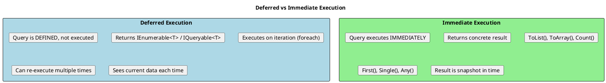
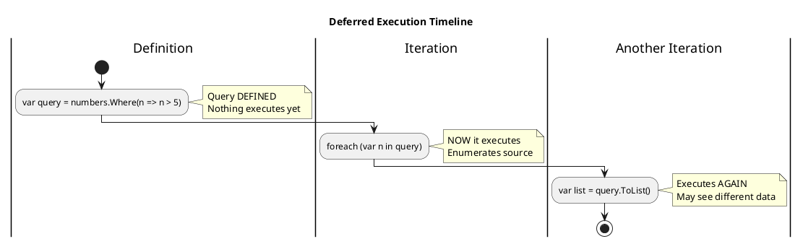
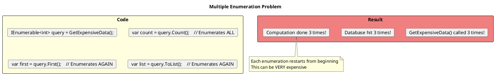

# Deferred vs Immediate Execution

## The Core Concept

LINQ queries are **not executed when defined**. They execute when you **iterate** or **materialize** them.



## Visualizing Deferred Execution



```csharp
var numbers = new List<int> { 1, 2, 3, 4, 5 };

// Query is DEFINED here (no execution)
var query = numbers.Where(n => n > 2);

Console.WriteLine("Query defined");

// Modify source BEFORE execution
numbers.Add(6);
numbers.Add(7);

Console.WriteLine("Source modified");

// Query EXECUTES here (during iteration)
foreach (var n in query)
{
    Console.WriteLine(n);  // 3, 4, 5, 6, 7
}

// Output:
// Query defined
// Source modified
// 3
// 4
// 5
// 6
// 7

// Notice: 6 and 7 are included even though they were added AFTER query definition!
```

## Deferred Operators vs Immediate Operators

```plantuml
@startuml
skinparam monochrome false

title LINQ Operator Categories

rectangle "Deferred (Lazy)" #LightBlue {
  rectangle "Streaming" #LightCyan {
    card "Where, Select, SelectMany"
    card "Take, Skip, TakeWhile, SkipWhile"
    card "Distinct, Cast, OfType"
    card "Concat, Zip, Append, Prepend"
    note right: Process one\nelement at a time
  }

  rectangle "Non-Streaming" #LightYellow {
    card "OrderBy, OrderByDescending"
    card "ThenBy, ThenByDescending"
    card "Reverse, GroupBy"
    card "Join, GroupJoin"
    note right: Must read ALL elements\nbefore producing any
  }
}

rectangle "Immediate (Eager)" #LightGreen {
  rectangle "Aggregation" {
    card "Count, Sum, Average"
    card "Min, Max, Aggregate"
  }

  rectangle "Element" {
    card "First, FirstOrDefault"
    card "Single, SingleOrDefault"
    card "Last, LastOrDefault"
    card "ElementAt"
  }

  rectangle "Conversion" {
    card "ToList, ToArray"
    card "ToDictionary, ToLookup"
    card "ToHashSet"
  }

  rectangle "Quantifiers" {
    card "Any, All, Contains"
  }
}
@enduml
```



### Reference Table

| Operator | Execution | Notes |
|----------|-----------|-------|
| `Where` | Deferred | Streaming |
| `Select` | Deferred | Streaming |
| `SelectMany` | Deferred | Streaming |
| `Take` | Deferred | Streaming |
| `Skip` | Deferred | Streaming |
| `OrderBy` | Deferred | Non-streaming (buffers all) |
| `GroupBy` | Deferred | Non-streaming (buffers all) |
| `Join` | Deferred | Non-streaming |
| `ToList` | **Immediate** | Returns List<T> |
| `ToArray` | **Immediate** | Returns T[] |
| `Count` | **Immediate** | Returns int |
| `First` | **Immediate** | Returns T |
| `Any` | **Immediate** | Returns bool |

## The Multiple Enumeration Problem



```csharp
// ═══════════════════════════════════════════════════════
// THE PROBLEM
// ═══════════════════════════════════════════════════════

IEnumerable<User> GetUsers()
{
    Console.WriteLine("Getting users from database...");
    return _context.Users.ToList();
}

var users = GetUsers();  // Returns IEnumerable

// Each of these enumerates the sequence!
var count = users.Count();      // Enumeration #1
var first = users.First();      // Enumeration #2
var list = users.ToList();      // Enumeration #3

// For lazy sequences (like database queries), this means 3 DB calls!

// ═══════════════════════════════════════════════════════
// THE FIX: Materialize once
// ═══════════════════════════════════════════════════════

var users = GetUsers().ToList();  // Materialize ONCE

// Now these just iterate the in-memory list (fast)
var count = users.Count;          // Property access, O(1)
var first = users[0];             // Index access, O(1)

// ═══════════════════════════════════════════════════════
// DETECTING THE ISSUE
// ═══════════════════════════════════════════════════════

// ReSharper/Rider will warn: "Possible multiple enumeration of IEnumerable"
// The fix is to call .ToList() or .ToArray() once
```

## Streaming vs Non-Streaming Deferred

```csharp
// ═══════════════════════════════════════════════════════
// STREAMING: Can produce output before reading all input
// ═══════════════════════════════════════════════════════

var numbers = Enumerable.Range(1, 1_000_000);

// Where is streaming - can start returning immediately
var filtered = numbers.Where(n => n % 2 == 0);

// Take is streaming - stops after getting enough
var firstTen = filtered.Take(10).ToList();
// Only reads until it finds 10 even numbers (reads ~20 elements)

// ═══════════════════════════════════════════════════════
// NON-STREAMING: Must read all input before any output
// ═══════════════════════════════════════════════════════

var numbers = Enumerable.Range(1, 1_000_000);

// OrderBy must read ALL elements to sort them
var sorted = numbers.OrderBy(n => n);

// Even Take(1) still forces reading all million elements first!
var first = sorted.Take(1).ToList();
// Had to sort all 1,000,000 elements just to get the smallest

// ═══════════════════════════════════════════════════════
// COMBINING THEM EFFICIENTLY
// ═══════════════════════════════════════════════════════

// BAD: OrderBy then Take - sorts entire collection
var badQuery = items
    .OrderBy(i => i.Date)     // Sorts ALL items
    .Take(10);

// GOOD: Filter first, then sort smaller set
var goodQuery = items
    .Where(i => i.IsActive)    // Reduces set first
    .OrderBy(i => i.Date)      // Sorts smaller set
    .Take(10);

// For IQueryable (database): Let DB do the work
var dbQuery = _context.Items
    .OrderBy(i => i.Date)
    .Take(10);  // SQL: SELECT TOP 10 ... ORDER BY Date
// Database optimizes this with index!
```

## Closures and Captured Variables in Deferred Queries

```csharp
// ═══════════════════════════════════════════════════════
// GOTCHA: Variable capture with deferred execution
// ═══════════════════════════════════════════════════════

int threshold = 5;
var query = numbers.Where(n => n > threshold);  // Captures 'threshold'

threshold = 10;  // Changed BEFORE execution!

var result = query.ToList();  // Uses threshold = 10, not 5!

// ═══════════════════════════════════════════════════════
// EXAMPLE: Loop variable capture
// ═══════════════════════════════════════════════════════

var queries = new List<IEnumerable<int>>();

for (int i = 0; i < 5; i++)
{
    queries.Add(numbers.Where(n => n == i));  // Captures 'i'
}

// When executed, ALL queries use i = 5!
foreach (var q in queries)
{
    var results = q.ToList();  // All search for 5
}

// Fix: Copy to local variable
for (int i = 0; i < 5; i++)
{
    int captured = i;  // Local copy
    queries.Add(numbers.Where(n => n == captured));
}
```

## Side Effects in Deferred Queries

```csharp
// ═══════════════════════════════════════════════════════
// DANGER: Side effects execute multiple times
// ═══════════════════════════════════════════════════════

int counter = 0;

var query = numbers.Select(n =>
{
    counter++;  // Side effect!
    return n * 2;
});

// First enumeration
var list1 = query.ToList();  // counter = 10

// Second enumeration
var list2 = query.ToList();  // counter = 20 (not reset!)

// Third enumeration
foreach (var n in query)  // counter = 30
{
    Console.WriteLine(n);
}

// ═══════════════════════════════════════════════════════
// RULE: Avoid side effects in LINQ queries
// ═══════════════════════════════════════════════════════

// BAD: Side effect in Select
var items = orders.Select(o =>
{
    _logger.Log($"Processing {o.Id}");  // Side effect
    return o.ToDto();
});

// GOOD: Separate concerns
var items = orders.Select(o => o.ToDto()).ToList();
foreach (var item in items)
{
    _logger.Log($"Processing {item.Id}");
}
```

## Forcing Immediate Execution

```csharp
// ═══════════════════════════════════════════════════════
// MATERIALIZING COLLECTIONS
// ═══════════════════════════════════════════════════════

// ToList - Most common
List<User> list = query.ToList();

// ToArray - When you need array
User[] array = query.ToArray();

// ToDictionary - Key-value lookup
Dictionary<int, User> dict = query.ToDictionary(u => u.Id);

// ToLookup - Key to multiple values
ILookup<string, User> lookup = query.ToLookup(u => u.Department);

// ToHashSet - Unique values, fast contains
HashSet<string> set = query.Select(u => u.Email).ToHashSet();

// ═══════════════════════════════════════════════════════
// SCALAR RESULTS (always immediate)
// ═══════════════════════════════════════════════════════

int count = query.Count();
bool any = query.Any();
bool all = query.All(u => u.IsActive);
User first = query.First();
User? firstOrNull = query.FirstOrDefault();
int sum = numbers.Sum();
double avg = numbers.Average();
```

## Async Enumeration (IAsyncEnumerable<T>)

```csharp
// ═══════════════════════════════════════════════════════
// ASYNC STREAMING - Deferred execution with async
// ═══════════════════════════════════════════════════════

public async IAsyncEnumerable<User> GetUsersStreamingAsync()
{
    await foreach (var user in _context.Users.AsAsyncEnumerable())
    {
        yield return user;
    }
}

// Consume asynchronously
await foreach (var user in GetUsersStreamingAsync())
{
    Console.WriteLine(user.Name);
}

// Materialize asynchronously
var users = await _context.Users.ToListAsync();  // Immediate async

// ═══════════════════════════════════════════════════════
// EF CORE ASYNC METHODS
// ═══════════════════════════════════════════════════════

// Deferred query, immediate async execution
var count = await query.CountAsync();
var first = await query.FirstAsync();
var list = await query.ToListAsync();
var any = await query.AnyAsync();
```

## Senior Interview Questions

**Q: If `Select` is deferred, when does the lambda inside it run?**

The lambda runs during enumeration, once per element:
```csharp
var query = items.Select(x =>
{
    Console.WriteLine($"Processing {x}");
    return x * 2;
});

// Nothing printed yet

foreach (var n in query)  // Lambda runs here
{
    // "Processing..." printed for each item
}
```

**Q: What happens if the source collection changes between creating and executing a query?**

The query sees the current state at execution time:
```csharp
var list = new List<int> { 1, 2, 3 };
var query = list.Where(n => n > 1);

list.Add(4);
list.Remove(1);

var result = query.ToList();  // [2, 3, 4]
```

**Q: How do you prevent multiple enumeration in a method that accepts `IEnumerable<T>`?**

```csharp
public void ProcessItems(IEnumerable<int> items)
{
    // Option 1: Materialize immediately
    var list = items as IList<int> ?? items.ToList();

    // Option 2: Check if already materialized
    var materialized = items as ICollection<int> ?? items.ToList();

    // Now safe to enumerate multiple times
    var count = materialized.Count;
    var sum = materialized.Sum();
}
```

**Q: What's the difference between `First()` and `FirstOrDefault()`?**

- `First()`: Throws if empty - use when empty is a bug
- `FirstOrDefault()`: Returns default if empty - use when empty is valid

```csharp
var user = users.First(u => u.Id == id);  // Throws if not found
var user = users.FirstOrDefault(u => u.Id == id);  // null if not found
```
