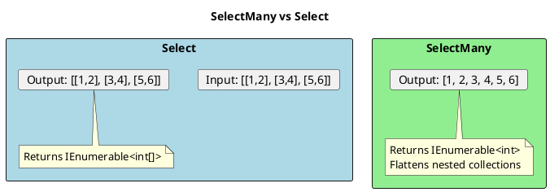
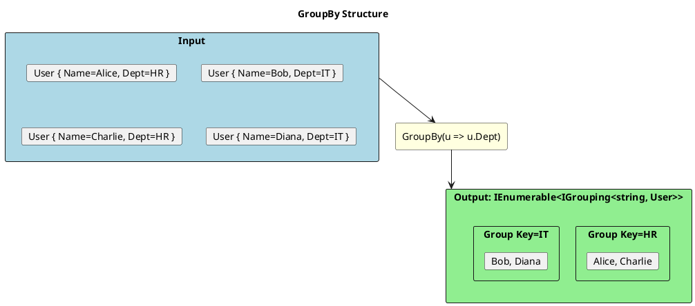
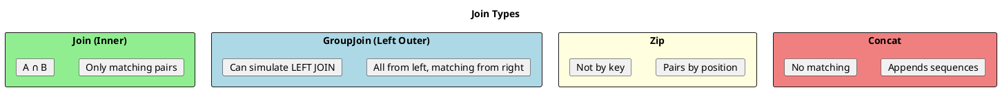

# LINQ Operators - Comprehensive Guide

## Operator Categories

```plantuml
@startuml
skinparam monochrome false

title LINQ Operators by Category

rectangle "Filtering" #LightBlue {
  card "Where, OfType"
}

rectangle "Projection" #LightGreen {
  card "Select, SelectMany"
}

rectangle "Ordering" #LightYellow {
  card "OrderBy, ThenBy"
  card "OrderByDescending"
  card "ThenByDescending, Reverse"
}

rectangle "Grouping" #LightCoral {
  card "GroupBy, ToLookup"
}

rectangle "Joining" #Wheat {
  card "Join, GroupJoin"
  card "Zip, Concat"
}

rectangle "Set Operations" #LightPink {
  card "Distinct, Union"
  card "Intersect, Except"
}

rectangle "Aggregation" #LightCyan {
  card "Count, Sum, Average"
  card "Min, Max, Aggregate"
}

rectangle "Element" #Lavender {
  card "First, Last, Single"
  card "ElementAt, DefaultIfEmpty"
}

rectangle "Quantifiers" #PaleGreen {
  card "Any, All, Contains"
}

rectangle "Partitioning" #MistyRose {
  card "Take, Skip"
  card "TakeWhile, SkipWhile"
  card "Chunk (C# 10)"
}
@enduml
```



## Filtering Operators

### Where

```csharp
// Basic filtering
var adults = users.Where(u => u.Age >= 18);

// Multiple conditions
var qualified = users.Where(u => u.Age >= 18 && u.IsActive && u.Score > 80);

// With index
var everyOther = items.Where((item, index) => index % 2 == 0);

// Chained Where (equivalent to AND)
var result = users
    .Where(u => u.IsActive)
    .Where(u => u.Age >= 18);  // Same as combining with &&
```

### OfType

```csharp
// Filter by type and cast
object[] mixed = { 1, "hello", 2, "world", 3.14, 4 };

IEnumerable<int> integers = mixed.OfType<int>();      // [1, 2, 4]
IEnumerable<string> strings = mixed.OfType<string>(); // ["hello", "world"]

// Common use: filtering derived types
IEnumerable<Shape> shapes = GetShapes();
var circles = shapes.OfType<Circle>();  // Only circles
```

## Projection Operators

### Select

```csharp
// Transform each element
var names = users.Select(u => u.Name);

// Anonymous type
var projected = users.Select(u => new { u.Name, u.Email });

// Named record/class
var dtos = users.Select(u => new UserDto(u.Name, u.Email));

// With index
var indexed = items.Select((item, i) => $"{i}: {item}");

// Computed properties
var computed = products.Select(p => new
{
    p.Name,
    TotalValue = p.Price * p.Quantity,
    Category = p.Price > 100 ? "Premium" : "Standard"
});
```

### SelectMany - Flattening



```csharp
// Flatten nested collections
var departments = new[]
{
    new { Name = "HR", Employees = new[] { "Alice", "Bob" } },
    new { Name = "IT", Employees = new[] { "Charlie", "Diana", "Eve" } }
};

// Select: IEnumerable<string[]>
var nested = departments.Select(d => d.Employees);

// SelectMany: IEnumerable<string>
var flat = departments.SelectMany(d => d.Employees);
// ["Alice", "Bob", "Charlie", "Diana", "Eve"]

// With result selector (like CROSS JOIN)
var pairs = departments.SelectMany(
    d => d.Employees,
    (dept, emp) => new { Department = dept.Name, Employee = emp }
);
// [{ HR, Alice }, { HR, Bob }, { IT, Charlie }, ...]

// Common use: Flattening orders to order items
var allItems = orders.SelectMany(o => o.Items);
```

## Ordering Operators

```csharp
// ═══════════════════════════════════════════════════════
// SINGLE KEY ORDERING
// ═══════════════════════════════════════════════════════

var byName = users.OrderBy(u => u.Name);
var byNameDesc = users.OrderByDescending(u => u.Name);

// ═══════════════════════════════════════════════════════
// MULTI-KEY ORDERING
// ═══════════════════════════════════════════════════════

var sorted = users
    .OrderBy(u => u.Department)           // Primary: A-Z
    .ThenByDescending(u => u.Salary)      // Secondary: High to Low
    .ThenBy(u => u.Name);                 // Tertiary: A-Z

// Equivalent SQL: ORDER BY Department, Salary DESC, Name

// ═══════════════════════════════════════════════════════
// CUSTOM COMPARER
// ═══════════════════════════════════════════════════════

// Case-insensitive ordering
var caseInsensitive = names.OrderBy(n => n, StringComparer.OrdinalIgnoreCase);

// Custom comparer
public class NaturalStringComparer : IComparer<string>
{
    public int Compare(string? x, string? y)
    {
        // Implement natural sorting: "item2" < "item10"
    }
}

var natural = files.OrderBy(f => f.Name, new NaturalStringComparer());

// ═══════════════════════════════════════════════════════
// REVERSE
// ═══════════════════════════════════════════════════════

var reversed = items.Reverse();  // Reverses entire sequence
```

## Grouping Operators



```csharp
// ═══════════════════════════════════════════════════════
// BASIC GROUPING
// ═══════════════════════════════════════════════════════

var byDepartment = users.GroupBy(u => u.Department);

foreach (var group in byDepartment)
{
    Console.WriteLine($"Department: {group.Key}");
    foreach (var user in group)
    {
        Console.WriteLine($"  - {user.Name}");
    }
}

// ═══════════════════════════════════════════════════════
// GROUP WITH ELEMENT SELECTOR
// ═══════════════════════════════════════════════════════

// Only keep names in each group
var namesByDept = users.GroupBy(
    u => u.Department,
    u => u.Name  // Element selector
);

foreach (var group in namesByDept)
{
    Console.WriteLine($"{group.Key}: {string.Join(", ", group)}");
}

// ═══════════════════════════════════════════════════════
// GROUP WITH RESULT SELECTOR
// ═══════════════════════════════════════════════════════

var summary = users.GroupBy(
    u => u.Department,
    (key, group) => new
    {
        Department = key,
        Count = group.Count(),
        AverageAge = group.Average(u => u.Age),
        Names = group.Select(u => u.Name).ToList()
    }
);

// ═══════════════════════════════════════════════════════
// GROUP BY MULTIPLE KEYS
// ═══════════════════════════════════════════════════════

var byDeptAndRole = users.GroupBy(u => new { u.Department, u.Role });

foreach (var group in byDeptAndRole)
{
    Console.WriteLine($"{group.Key.Department} - {group.Key.Role}: {group.Count()}");
}
```

## Joining Operators



```csharp
var orders = new[]
{
    new { Id = 1, CustomerId = 1, Total = 100 },
    new { Id = 2, CustomerId = 2, Total = 200 },
    new { Id = 3, CustomerId = 1, Total = 150 }
};

var customers = new[]
{
    new { Id = 1, Name = "Alice" },
    new { Id = 2, Name = "Bob" },
    new { Id = 3, Name = "Charlie" }  // No orders
};

// ═══════════════════════════════════════════════════════
// JOIN (INNER JOIN)
// ═══════════════════════════════════════════════════════

var innerJoin = orders.Join(
    customers,
    order => order.CustomerId,    // Outer key
    customer => customer.Id,       // Inner key
    (order, customer) => new       // Result selector
    {
        customer.Name,
        order.Total
    }
);
// Alice-100, Bob-200, Alice-150 (Charlie excluded - no orders)

// ═══════════════════════════════════════════════════════
// GROUP JOIN (for LEFT OUTER JOIN)
// ═══════════════════════════════════════════════════════

var leftJoin = customers.GroupJoin(
    orders,
    customer => customer.Id,
    order => order.CustomerId,
    (customer, customerOrders) => new
    {
        customer.Name,
        Orders = customerOrders.ToList(),
        OrderCount = customerOrders.Count()
    }
);
// Alice: [100, 150], Bob: [200], Charlie: [] (included with empty orders)

// Flatten for traditional LEFT JOIN
var flatLeftJoin = customers
    .GroupJoin(orders, c => c.Id, o => o.CustomerId, (c, os) => new { c, os })
    .SelectMany(
        x => x.os.DefaultIfEmpty(),
        (x, order) => new { x.c.Name, Total = order?.Total ?? 0 }
    );

// ═══════════════════════════════════════════════════════
// ZIP
// ═══════════════════════════════════════════════════════

var names = new[] { "Alice", "Bob", "Charlie" };
var scores = new[] { 90, 85, 95 };

var zipped = names.Zip(scores, (name, score) => $"{name}: {score}");
// ["Alice: 90", "Bob: 85", "Charlie: 95"]

// C# 10: Third sequence
var ids = new[] { 1, 2, 3 };
var triple = names.Zip(scores, ids);  // Returns (string, int, int) tuples

// ═══════════════════════════════════════════════════════
// CONCAT
// ═══════════════════════════════════════════════════════

var all = activeUsers.Concat(inactiveUsers);
```

## Set Operations

```csharp
var set1 = new[] { 1, 2, 3, 4, 5 };
var set2 = new[] { 4, 5, 6, 7, 8 };

// ═══════════════════════════════════════════════════════
// DISTINCT
// ═══════════════════════════════════════════════════════

var duplicates = new[] { 1, 2, 2, 3, 3, 3 };
var unique = duplicates.Distinct();  // [1, 2, 3]

// With custom equality
var distinctUsers = users.DistinctBy(u => u.Email);  // C# 10

// ═══════════════════════════════════════════════════════
// UNION
// ═══════════════════════════════════════════════════════

var union = set1.Union(set2);  // [1, 2, 3, 4, 5, 6, 7, 8]

// ═══════════════════════════════════════════════════════
// INTERSECT
// ═══════════════════════════════════════════════════════

var common = set1.Intersect(set2);  // [4, 5]

// ═══════════════════════════════════════════════════════
// EXCEPT
// ═══════════════════════════════════════════════════════

var onlyInFirst = set1.Except(set2);   // [1, 2, 3]
var onlyInSecond = set2.Except(set1);  // [6, 7, 8]

// ═══════════════════════════════════════════════════════
// CUSTOM COMPARER
// ═══════════════════════════════════════════════════════

var distinct = strings.Distinct(StringComparer.OrdinalIgnoreCase);
var union = set1.Union(set2, new MyComparer());
```

## Aggregation Operators

```csharp
var numbers = new[] { 5, 10, 15, 20, 25 };

// ═══════════════════════════════════════════════════════
// SIMPLE AGGREGATES
// ═══════════════════════════════════════════════════════

int count = numbers.Count();           // 5
int countEven = numbers.Count(n => n % 2 == 0);  // 2
long longCount = numbers.LongCount();  // For large collections

int sum = numbers.Sum();               // 75
double avg = numbers.Average();        // 15.0
int min = numbers.Min();               // 5
int max = numbers.Max();               // 25

// With selector
var totalSalary = employees.Sum(e => e.Salary);
var maxAge = users.Max(u => u.Age);
var youngestName = users.MinBy(u => u.Age)?.Name;  // C# 10

// ═══════════════════════════════════════════════════════
// AGGREGATE (Custom Accumulator)
// ═══════════════════════════════════════════════════════

// Simple: Sum reimplemented
int sum = numbers.Aggregate((acc, n) => acc + n);

// With seed value
int sumPlusTen = numbers.Aggregate(10, (acc, n) => acc + n);  // 85

// With result selector
string csv = numbers.Aggregate(
    new StringBuilder(),
    (sb, n) => sb.Append(n).Append(","),
    sb => sb.ToString().TrimEnd(',')
);
// "5,10,15,20,25"

// Complex aggregation
var stats = numbers.Aggregate(
    new { Sum = 0, Count = 0, Min = int.MaxValue, Max = int.MinValue },
    (acc, n) => new
    {
        Sum = acc.Sum + n,
        Count = acc.Count + 1,
        Min = Math.Min(acc.Min, n),
        Max = Math.Max(acc.Max, n)
    }
);
```

## Partitioning Operators

```csharp
var items = new[] { 1, 2, 3, 4, 5, 6, 7, 8, 9, 10 };

// ═══════════════════════════════════════════════════════
// TAKE / SKIP
// ═══════════════════════════════════════════════════════

var firstThree = items.Take(3);      // [1, 2, 3]
var skipThree = items.Skip(3);       // [4, 5, 6, 7, 8, 9, 10]
var middle = items.Skip(3).Take(4);  // [4, 5, 6, 7]

// Pagination
int page = 2, pageSize = 3;
var pageItems = items.Skip((page - 1) * pageSize).Take(pageSize);

// ═══════════════════════════════════════════════════════
// TAKE WHILE / SKIP WHILE
// ═══════════════════════════════════════════════════════

var ascending = new[] { 1, 2, 3, 5, 4, 3, 2 };
var whileIncreasing = ascending.TakeWhile(n => n < 5);  // [1, 2, 3]
var afterFive = ascending.SkipWhile(n => n < 5);        // [5, 4, 3, 2]

// ═══════════════════════════════════════════════════════
// TAKE LAST / SKIP LAST (C# 8+)
// ═══════════════════════════════════════════════════════

var lastThree = items.TakeLast(3);   // [8, 9, 10]
var skipLast = items.SkipLast(3);    // [1, 2, 3, 4, 5, 6, 7]

// ═══════════════════════════════════════════════════════
// CHUNK (C# 10)
// ═══════════════════════════════════════════════════════

var batches = items.Chunk(3);
// [[1,2,3], [4,5,6], [7,8,9], [10]]

foreach (var batch in items.Chunk(100))
{
    await ProcessBatchAsync(batch);
}

// ═══════════════════════════════════════════════════════
// RANGE SYNTAX (C# 8+)
// ═══════════════════════════════════════════════════════

var array = items.ToArray();
var slice = array[2..5];    // [3, 4, 5]
var last3 = array[^3..];    // [8, 9, 10]
var first3 = array[..3];    // [1, 2, 3]
```

## Query Syntax vs Method Syntax

```csharp
// ═══════════════════════════════════════════════════════
// QUERY SYNTAX (SQL-like)
// ═══════════════════════════════════════════════════════

var queryResult =
    from u in users
    where u.Age >= 18
    orderby u.Name
    select new { u.Name, u.Email };

// ═══════════════════════════════════════════════════════
// METHOD SYNTAX (Fluent)
// ═══════════════════════════════════════════════════════

var methodResult = users
    .Where(u => u.Age >= 18)
    .OrderBy(u => u.Name)
    .Select(u => new { u.Name, u.Email });

// ═══════════════════════════════════════════════════════
// COMPLEX QUERY SYNTAX
// ═══════════════════════════════════════════════════════

var complexQuery =
    from o in orders
    join c in customers on o.CustomerId equals c.Id
    where o.Total > 100
    orderby o.Date descending
    group o by c.Name into g
    select new
    {
        Customer = g.Key,
        TotalOrders = g.Count(),
        TotalAmount = g.Sum(x => x.Total)
    };

// Equivalent method syntax
var methodComplex = orders
    .Join(customers, o => o.CustomerId, c => c.Id, (o, c) => new { o, c })
    .Where(x => x.o.Total > 100)
    .OrderByDescending(x => x.o.Date)
    .GroupBy(x => x.c.Name)
    .Select(g => new
    {
        Customer = g.Key,
        TotalOrders = g.Count(),
        TotalAmount = g.Sum(x => x.o.Total)
    });

// ═══════════════════════════════════════════════════════
// LET KEYWORD (Query Syntax Only)
// ═══════════════════════════════════════════════════════

var withLet =
    from u in users
    let fullName = u.FirstName + " " + u.LastName  // Computed value
    where fullName.Length > 10
    orderby fullName
    select fullName;
```

## Senior Interview Questions

**Q: What's the difference between `First()` and `Single()`?**

- `First()`: Returns first element; throws if empty
- `Single()`: Returns only element; throws if empty OR more than one

```csharp
var one = new[] { 1 };
var many = new[] { 1, 2, 3 };

one.First();   // 1
one.Single();  // 1

many.First();  // 1
many.Single(); // InvalidOperationException!
```

**Q: How do you implement `SelectMany` using `Select`?**

```csharp
// SelectMany flattens nested collections
var flat = outer.SelectMany(o => o.Inner);

// Equivalent with Select + Aggregate
var flat = outer.Select(o => o.Inner).Aggregate((a, b) => a.Concat(b));
```

**Q: What's the time complexity of `Contains` on `List<T>` vs `HashSet<T>`?**

- `List<T>.Contains`: O(n) - linear search
- `HashSet<T>.Contains`: O(1) - hash lookup

Always use `HashSet` when you need frequent `Contains` checks.
