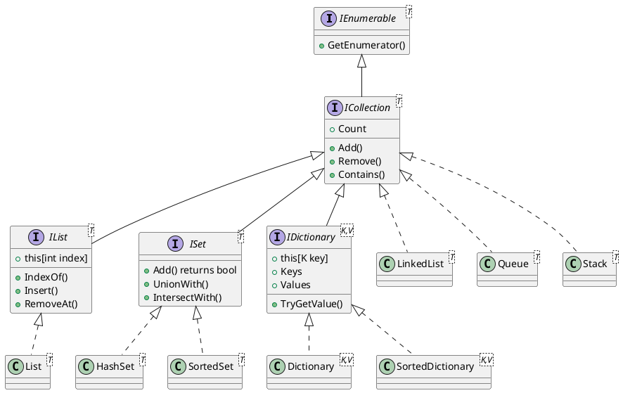
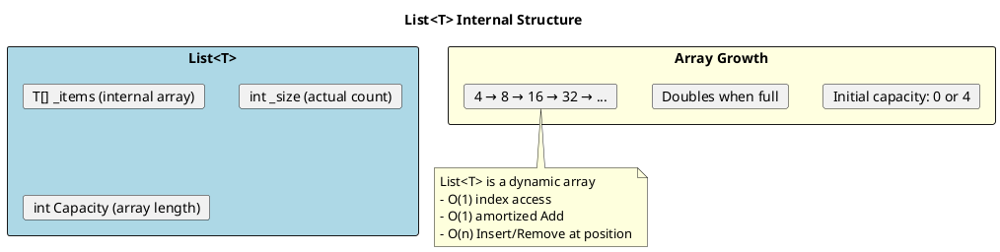
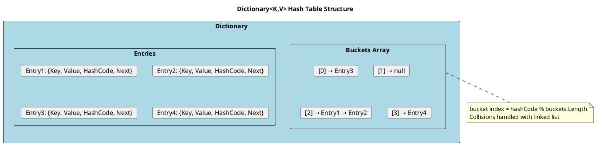
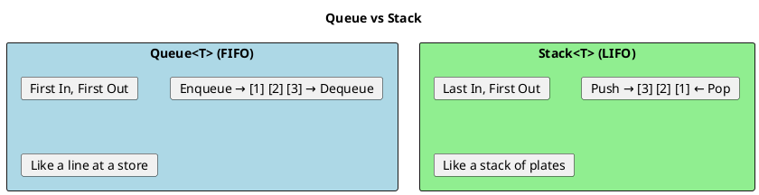

# .NET Collections - Deep Dive

## Collection Hierarchy



## Choosing the Right Collection

```plantuml
@startuml
skinparam monochrome false

title Collection Selection Decision Tree

start

:What's your primary operation?;

if (Need key-value lookup?) then (yes)
  if (Need sorted keys?) then (yes)
    #LightGreen:SortedDictionary<K,V>
    note right: O(log n) operations\nKeys in sorted order
  else (no)
    #LightGreen:Dictionary<K,V>
    note right: O(1) average lookup\nMost common choice
  endif
elseif (Need unique values?) then (yes)
  if (Need sorted?) then (yes)
    #LightBlue:SortedSet<T>
    note right: O(log n) operations\nSorted iteration
  else (no)
    #LightBlue:HashSet<T>
    note right: O(1) Contains\nFast set operations
  endif
elseif (Need index access?) then (yes)
  #LightYellow:List<T>
  note right: Most versatile\nO(1) index access
elseif (FIFO needed?) then (yes)
  #LightCoral:Queue<T>
elseif (LIFO needed?) then (yes)
  #LightCoral:Stack<T>
elseif (Frequent insert/remove?) then (yes)
  #Wheat:LinkedList<T>
  note right: O(1) insert/remove\nat known position
else
  #LightYellow:List<T>
  note right: Default choice
endif

stop
@enduml
```

## List<T>

The most commonly used collection.



```csharp
// ═══════════════════════════════════════════════════════
// CREATION
// ═══════════════════════════════════════════════════════

// Empty
var list = new List<int>();

// With initial capacity (avoids resizing)
var list = new List<int>(100);  // Pre-allocate for 100 items

// Collection initializer
var list = new List<int> { 1, 2, 3, 4, 5 };

// From existing collection
var list = new List<int>(existingEnumerable);
var list = existingArray.ToList();

// ═══════════════════════════════════════════════════════
// COMMON OPERATIONS
// ═══════════════════════════════════════════════════════

list.Add(item);           // O(1) amortized
list.AddRange(items);     // O(n)
list.Insert(index, item); // O(n) - shifts elements
list.Remove(item);        // O(n) - searches then shifts
list.RemoveAt(index);     // O(n) - shifts elements
list.RemoveAll(predicate);// O(n)
list.Contains(item);      // O(n) - linear search
list.IndexOf(item);       // O(n)
list.BinarySearch(item);  // O(log n) - MUST BE SORTED!
list.Sort();              // O(n log n)
list.Reverse();           // O(n)
list.Clear();             // O(n)

// ═══════════════════════════════════════════════════════
// PERFORMANCE TIP: Pre-size when possible
// ═══════════════════════════════════════════════════════

// BAD: Many reallocations
var list = new List<int>();
for (int i = 0; i < 10000; i++)
    list.Add(i);  // Resizes multiple times

// GOOD: Single allocation
var list = new List<int>(10000);
for (int i = 0; i < 10000; i++)
    list.Add(i);  // No resizing

// ═══════════════════════════════════════════════════════
// CAPACITY MANAGEMENT
// ═══════════════════════════════════════════════════════

var list = new List<int> { 1, 2, 3 };
Console.WriteLine(list.Count);    // 3
Console.WriteLine(list.Capacity); // 4 (or more)

list.TrimExcess();  // Reduce capacity to match count
```

## Dictionary<TKey, TValue>

The most efficient key-value store.



```csharp
// ═══════════════════════════════════════════════════════
// CREATION
// ═══════════════════════════════════════════════════════

var dict = new Dictionary<string, int>();
var dict = new Dictionary<string, int>(100);  // With capacity
var dict = new Dictionary<string, int>(StringComparer.OrdinalIgnoreCase);

// Collection initializer
var dict = new Dictionary<string, int>
{
    ["one"] = 1,
    ["two"] = 2,
    ["three"] = 3
};

// ═══════════════════════════════════════════════════════
// COMMON OPERATIONS
// ═══════════════════════════════════════════════════════

dict[key] = value;              // Add or update, O(1)
dict.Add(key, value);           // Add only, throws if exists
dict.TryAdd(key, value);        // Add only, returns bool

var value = dict[key];          // Get, throws if not found
dict.TryGetValue(key, out var value);  // Safe get

dict.ContainsKey(key);          // O(1)
dict.ContainsValue(value);      // O(n)!

dict.Remove(key);               // O(1)
dict.Remove(key, out var value);// Get value while removing

// ═══════════════════════════════════════════════════════
// SAFE ACCESS PATTERNS
// ═══════════════════════════════════════════════════════

// BAD: Two lookups
if (dict.ContainsKey(key))
{
    var value = dict[key];  // Second lookup!
}

// GOOD: Single lookup
if (dict.TryGetValue(key, out var value))
{
    // Use value
}

// Get or add pattern
if (!dict.TryGetValue(key, out var value))
{
    value = ComputeValue();
    dict[key] = value;
}

// C# 8+: Using GetValueOrDefault
var value = dict.GetValueOrDefault(key);           // Default if not found
var value = dict.GetValueOrDefault(key, fallback); // Custom default

// ═══════════════════════════════════════════════════════
// ITERATION
// ═══════════════════════════════════════════════════════

foreach (var kvp in dict)
{
    Console.WriteLine($"{kvp.Key}: {kvp.Value}");
}

foreach (var (key, value) in dict)  // Deconstruction
{
    Console.WriteLine($"{key}: {value}");
}

foreach (var key in dict.Keys) { }
foreach (var value in dict.Values) { }
```

## HashSet<T>

Unordered collection of unique values.

```csharp
// ═══════════════════════════════════════════════════════
// CREATION
// ═══════════════════════════════════════════════════════

var set = new HashSet<int>();
var set = new HashSet<string>(StringComparer.OrdinalIgnoreCase);
var set = new HashSet<int>(existingCollection);

// ═══════════════════════════════════════════════════════
// COMMON OPERATIONS
// ═══════════════════════════════════════════════════════

set.Add(item);       // O(1), returns bool (false if existed)
set.Remove(item);    // O(1)
set.Contains(item);  // O(1) - FAST!
set.Clear();

// ═══════════════════════════════════════════════════════
// SET OPERATIONS
// ═══════════════════════════════════════════════════════

var setA = new HashSet<int> { 1, 2, 3, 4, 5 };
var setB = new HashSet<int> { 4, 5, 6, 7, 8 };

// Modifying operations (change setA)
setA.UnionWith(setB);        // setA = {1,2,3,4,5,6,7,8}
setA.IntersectWith(setB);    // setA = {4,5}
setA.ExceptWith(setB);       // setA = {1,2,3}
setA.SymmetricExceptWith(setB); // setA = {1,2,3,6,7,8}

// Non-modifying checks
bool overlaps = setA.Overlaps(setB);       // Any common elements?
bool subset = setA.IsSubsetOf(setB);
bool superset = setA.IsSupersetOf(setB);
bool proper = setA.IsProperSubsetOf(setB);
bool equals = setA.SetEquals(setB);

// ═══════════════════════════════════════════════════════
// USE CASE: Fast Contains Check
// ═══════════════════════════════════════════════════════

// BAD: O(n) per check
var list = validIds.ToList();
foreach (var item in items)
{
    if (list.Contains(item.Id)) { }  // O(n) each time!
}

// GOOD: O(1) per check
var set = validIds.ToHashSet();
foreach (var item in items)
{
    if (set.Contains(item.Id)) { }   // O(1) each time!
}
```

## Queue<T> and Stack<T>



```csharp
// ═══════════════════════════════════════════════════════
// QUEUE<T> - FIFO
// ═══════════════════════════════════════════════════════

var queue = new Queue<string>();

queue.Enqueue("first");
queue.Enqueue("second");
queue.Enqueue("third");

var item = queue.Dequeue();  // "first"
var peek = queue.Peek();     // "second" (doesn't remove)
bool tryResult = queue.TryDequeue(out var value);  // Safe dequeue

// Use case: Task processing, BFS
var taskQueue = new Queue<WorkItem>();
while (taskQueue.Count > 0)
{
    var task = taskQueue.Dequeue();
    Process(task);
}

// ═══════════════════════════════════════════════════════
// STACK<T> - LIFO
// ═══════════════════════════════════════════════════════

var stack = new Stack<int>();

stack.Push(1);
stack.Push(2);
stack.Push(3);

var item = stack.Pop();   // 3
var peek = stack.Peek();  // 2 (doesn't remove)
bool tryResult = stack.TryPop(out var value);

// Use case: Undo operations, DFS, expression parsing
var history = new Stack<EditorState>();
history.Push(currentState);
// On undo:
if (history.Count > 0)
{
    RestoreState(history.Pop());
}

// ═══════════════════════════════════════════════════════
// PRIORITY QUEUE (C# 10)
// ═══════════════════════════════════════════════════════

var pq = new PriorityQueue<string, int>();

pq.Enqueue("low priority task", 3);
pq.Enqueue("high priority task", 1);
pq.Enqueue("medium priority task", 2);

var task = pq.Dequeue();  // "high priority task"
```

## LinkedList<T>

Doubly-linked list for efficient insert/remove.

```csharp
var list = new LinkedList<int>();

// Operations return LinkedListNode<T>
var node1 = list.AddFirst(1);
var node3 = list.AddLast(3);
var node2 = list.AddAfter(node1, 2);  // O(1)!

// O(1) insert/remove at known position
list.Remove(node2);
list.AddBefore(node3, 2);

// O(n) search
var found = list.Find(2);  // Returns node

// When to use:
// - Frequent insertions/removals in middle
// - Need to maintain insertion order
// - Don't need index access

// When NOT to use:
// - Need random access by index
// - Memory is constrained (node overhead)
```

## Concurrent Collections

```csharp
using System.Collections.Concurrent;

// ═══════════════════════════════════════════════════════
// CONCURRENT DICTIONARY
// ═══════════════════════════════════════════════════════

var dict = new ConcurrentDictionary<string, int>();

dict.TryAdd(key, value);
dict.TryUpdate(key, newValue, expectedOldValue);
dict.TryRemove(key, out var removed);

// Atomic get-or-add
var value = dict.GetOrAdd(key, k => ComputeValue(k));

// Atomic update
dict.AddOrUpdate(
    key,
    addValue: 1,
    updateValueFactory: (k, old) => old + 1
);

// ═══════════════════════════════════════════════════════
// CONCURRENT QUEUE / STACK
// ═══════════════════════════════════════════════════════

var queue = new ConcurrentQueue<WorkItem>();
queue.Enqueue(item);
if (queue.TryDequeue(out var work)) { }

var stack = new ConcurrentStack<int>();
stack.Push(item);
if (stack.TryPop(out var value)) { }

// ═══════════════════════════════════════════════════════
// CONCURRENT BAG (Unordered)
// ═══════════════════════════════════════════════════════

var bag = new ConcurrentBag<int>();
bag.Add(item);
if (bag.TryTake(out var value)) { }

// ═══════════════════════════════════════════════════════
// BLOCKING COLLECTION (Producer-Consumer)
// ═══════════════════════════════════════════════════════

var collection = new BlockingCollection<int>(boundedCapacity: 100);

// Producer
collection.Add(item);  // Blocks if full

// Consumer
var item = collection.Take();  // Blocks if empty

// Better pattern
foreach (var item in collection.GetConsumingEnumerable())
{
    Process(item);  // Exits when CompleteAdding() called
}

// Signal no more items
collection.CompleteAdding();
```

## Collection Performance Comparison

| Operation | List<T> | Dictionary<K,V> | HashSet<T> | SortedSet<T> | LinkedList<T> |
|-----------|---------|-----------------|------------|--------------|---------------|
| Add | O(1)* | O(1)* | O(1)* | O(log n) | O(1) |
| Remove | O(n) | O(1) | O(1) | O(log n) | O(1)† |
| Contains | O(n) | O(1) | O(1) | O(log n) | O(n) |
| Index | O(1) | N/A | N/A | N/A | O(n) |
| Min/Max | O(n) | O(n) | O(n) | O(log n)‡ | O(n) |

*Amortized. †At known position. ‡O(1) for Min/Max property.

## Senior Interview Questions

**Q: When would you use `SortedDictionary` over `Dictionary`?**

When you need keys in sorted order during iteration or need Min/Max key access. `SortedDictionary` is O(log n) for operations vs O(1) for `Dictionary`, but maintains order.

**Q: What happens when Dictionary has hash collisions?**

Entries with same bucket index are stored in a linked list (chaining). Performance degrades to O(n) in worst case. Good GetHashCode() distribution minimizes collisions.

**Q: How do you implement a custom equality comparer?**

```csharp
public class PersonComparer : IEqualityComparer<Person>
{
    public bool Equals(Person? x, Person? y)
    {
        if (ReferenceEquals(x, y)) return true;
        if (x is null || y is null) return false;
        return x.Id == y.Id;
    }

    public int GetHashCode(Person obj) => obj.Id.GetHashCode();
}

var dict = new Dictionary<Person, string>(new PersonComparer());
```

**Q: Why is `List<T>.Contains` O(n) but `HashSet<T>.Contains` O(1)?**

List does linear search through elements. HashSet computes hash of the item, goes directly to the bucket, and checks (usually) one entry.
