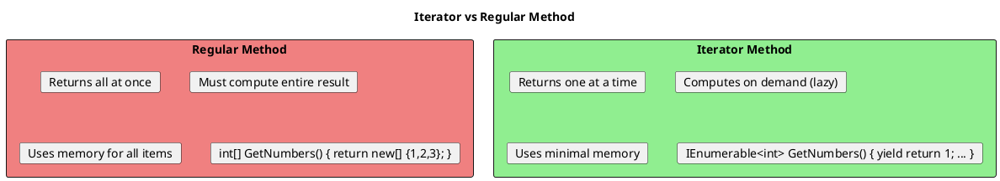

# Iterators and yield - Deep Dive

## What Is an Iterator?

An iterator is a method that returns a sequence of values one at a time using `yield return`. The compiler transforms it into a state machine.



## Basic Iterator Syntax

```csharp
// ═══════════════════════════════════════════════════════
// SIMPLE ITERATOR
// ═══════════════════════════════════════════════════════

public IEnumerable<int> GetNumbers()
{
    yield return 1;
    yield return 2;
    yield return 3;
}

// Usage
foreach (var n in GetNumbers())
{
    Console.WriteLine(n);  // 1, 2, 3
}

// ═══════════════════════════════════════════════════════
// ITERATOR WITH LOOP
// ═══════════════════════════════════════════════════════

public IEnumerable<int> GetRange(int start, int count)
{
    for (int i = 0; i < count; i++)
    {
        yield return start + i;
    }
}

// ═══════════════════════════════════════════════════════
// ITERATOR WITH CONDITION
// ═══════════════════════════════════════════════════════

public IEnumerable<int> GetEvenNumbers(IEnumerable<int> source)
{
    foreach (var n in source)
    {
        if (n % 2 == 0)
        {
            yield return n;
        }
    }
}

// ═══════════════════════════════════════════════════════
// YIELD BREAK - Stop iteration
// ═══════════════════════════════════════════════════════

public IEnumerable<int> TakeWhilePositive(IEnumerable<int> source)
{
    foreach (var n in source)
    {
        if (n < 0)
        {
            yield break;  // Stop iteration completely
        }
        yield return n;
    }
}
```

## How Iterators Work Internally

```plantuml
@startuml
skinparam monochrome false

title Iterator State Machine

rectangle "Your Code" #LightBlue {
  card "IEnumerable<int> GetNumbers()"
  card "{"
  card "    yield return 1;"
  card "    yield return 2;"
  card "    yield return 3;"
  card "}"
}

rectangle "Compiler Generates" #LightGreen {
  rectangle "State Machine Class" {
    card "int state = 0;"
    card "int current;"
    card ""
    card "bool MoveNext()"
    card "{"
    card "    switch(state)"
    card "    {"
    card "        case 0: current=1; state=1; return true;"
    card "        case 1: current=2; state=2; return true;"
    card "        case 2: current=3; state=3; return true;"
    card "        case 3: return false;"
    card "    }"
    card "}"
  }
}

"Your Code" --> "Compiler Generates" : transforms to
@enduml
```

```csharp
// What you write:
public IEnumerable<int> SimpleIterator()
{
    Console.WriteLine("Before 1");
    yield return 1;
    Console.WriteLine("Before 2");
    yield return 2;
    Console.WriteLine("After 2");
}

// Equivalent generated code (simplified):
public class SimpleIterator_StateMachine : IEnumerable<int>, IEnumerator<int>
{
    private int _state = 0;
    private int _current;

    public int Current => _current;

    public bool MoveNext()
    {
        switch (_state)
        {
            case 0:
                Console.WriteLine("Before 1");
                _current = 1;
                _state = 1;
                return true;

            case 1:
                Console.WriteLine("Before 2");
                _current = 2;
                _state = 2;
                return true;

            case 2:
                Console.WriteLine("After 2");
                _state = -1;  // Finished
                return false;

            default:
                return false;
        }
    }

    public void Reset() => throw new NotSupportedException();
    public void Dispose() { }
}
```

## Lazy Evaluation Demonstration

```csharp
public IEnumerable<int> LazySequence()
{
    Console.WriteLine("Starting iteration");

    Console.WriteLine("Yielding 1");
    yield return 1;

    Console.WriteLine("Yielding 2");
    yield return 2;

    Console.WriteLine("Yielding 3");
    yield return 3;

    Console.WriteLine("Iteration complete");
}

// Usage
var sequence = LazySequence();  // Nothing printed!
Console.WriteLine("Sequence created");

foreach (var n in sequence)
{
    Console.WriteLine($"Received: {n}");
    if (n == 2) break;  // Stop early
}

// Output:
// Sequence created
// Starting iteration
// Yielding 1
// Received: 1
// Yielding 2
// Received: 2
// (Note: "Yielding 3" never printed - we stopped early!)
```

## IEnumerator<T> Interface

```csharp
// The interface that iterators implement
public interface IEnumerator<T> : IDisposable
{
    T Current { get; }           // Current element
    bool MoveNext();             // Move to next, return false if done
    void Reset();                // Reset to beginning (rarely used)
}

// Manual iteration
using var enumerator = collection.GetEnumerator();
while (enumerator.MoveNext())
{
    var current = enumerator.Current;
    Console.WriteLine(current);
}

// foreach is syntactic sugar for the above
foreach (var item in collection)
{
    Console.WriteLine(item);
}
```

## Custom Iterator Implementation

```csharp
// ═══════════════════════════════════════════════════════
// IMPLEMENTING IENUMERABLE<T> MANUALLY
// ═══════════════════════════════════════════════════════

public class CountdownEnumerable : IEnumerable<int>
{
    private readonly int _start;

    public CountdownEnumerable(int start) => _start = start;

    public IEnumerator<int> GetEnumerator() => new CountdownEnumerator(_start);

    IEnumerator IEnumerable.GetEnumerator() => GetEnumerator();

    private class CountdownEnumerator : IEnumerator<int>
    {
        private readonly int _start;
        private int _current;
        private bool _started;

        public CountdownEnumerator(int start)
        {
            _start = start;
            _current = start + 1;
        }

        public int Current => _current;
        object IEnumerator.Current => Current;

        public bool MoveNext()
        {
            if (_current > 0)
            {
                _current--;
                return true;
            }
            return false;
        }

        public void Reset()
        {
            _current = _start + 1;
        }

        public void Dispose() { }
    }
}

// ═══════════════════════════════════════════════════════
// SAME THING WITH YIELD (Much simpler!)
// ═══════════════════════════════════════════════════════

public class CountdownSimple : IEnumerable<int>
{
    private readonly int _start;

    public CountdownSimple(int start) => _start = start;

    public IEnumerator<int> GetEnumerator()
    {
        for (int i = _start; i >= 0; i--)
        {
            yield return i;
        }
    }

    IEnumerator IEnumerable.GetEnumerator() => GetEnumerator();
}
```

## Infinite Sequences

```csharp
// ═══════════════════════════════════════════════════════
// INFINITE SEQUENCES (Only possible with yield!)
// ═══════════════════════════════════════════════════════

public IEnumerable<int> InfiniteNumbers()
{
    int n = 0;
    while (true)  // Infinite loop!
    {
        yield return n++;
    }
}

// Safe usage - take only what you need
var firstTen = InfiniteNumbers().Take(10).ToList();

// Fibonacci sequence
public IEnumerable<long> Fibonacci()
{
    long prev = 0, current = 1;

    yield return prev;
    yield return current;

    while (true)
    {
        var next = prev + current;
        yield return next;
        prev = current;
        current = next;
    }
}

var first20Fib = Fibonacci().Take(20).ToList();

// Prime numbers (infinite)
public IEnumerable<int> Primes()
{
    yield return 2;

    for (int n = 3; ; n += 2)  // Odd numbers only
    {
        if (IsPrime(n))
            yield return n;
    }
}
```

## Async Iterators (IAsyncEnumerable<T>)

```csharp
// ═══════════════════════════════════════════════════════
// ASYNC ITERATOR
// ═══════════════════════════════════════════════════════

public async IAsyncEnumerable<int> GetNumbersAsync()
{
    for (int i = 0; i < 10; i++)
    {
        await Task.Delay(100);  // Simulate async work
        yield return i;
    }
}

// Consuming async iterator
await foreach (var n in GetNumbersAsync())
{
    Console.WriteLine(n);
}

// ═══════════════════════════════════════════════════════
// WITH CANCELLATION
// ═══════════════════════════════════════════════════════

public async IAsyncEnumerable<int> GetNumbersAsync(
    [EnumeratorCancellation] CancellationToken ct = default)
{
    for (int i = 0; ; i++)
    {
        ct.ThrowIfCancellationRequested();
        await Task.Delay(100, ct);
        yield return i;
    }
}

// Usage with cancellation
var cts = new CancellationTokenSource(TimeSpan.FromSeconds(5));
try
{
    await foreach (var n in GetNumbersAsync(cts.Token))
    {
        Console.WriteLine(n);
    }
}
catch (OperationCanceledException)
{
    Console.WriteLine("Cancelled!");
}

// ═══════════════════════════════════════════════════════
// CONVERTING DATABASE STREAM
// ═══════════════════════════════════════════════════════

public async IAsyncEnumerable<User> StreamUsersAsync(
    [EnumeratorCancellation] CancellationToken ct = default)
{
    await foreach (var user in _context.Users.AsAsyncEnumerable().WithCancellation(ct))
    {
        yield return user;
    }
}
```

## Common Iterator Patterns

```csharp
// ═══════════════════════════════════════════════════════
// FILTERING PATTERN
// ═══════════════════════════════════════════════════════

public IEnumerable<T> Filter<T>(IEnumerable<T> source, Func<T, bool> predicate)
{
    foreach (var item in source)
    {
        if (predicate(item))
            yield return item;
    }
}

// ═══════════════════════════════════════════════════════
// TRANSFORMATION PATTERN
// ═══════════════════════════════════════════════════════

public IEnumerable<TResult> Transform<T, TResult>(
    IEnumerable<T> source,
    Func<T, TResult> selector)
{
    foreach (var item in source)
    {
        yield return selector(item);
    }
}

// ═══════════════════════════════════════════════════════
// FLATTENING PATTERN
// ═══════════════════════════════════════════════════════

public IEnumerable<T> Flatten<T>(IEnumerable<IEnumerable<T>> source)
{
    foreach (var inner in source)
    {
        foreach (var item in inner)
        {
            yield return item;
        }
    }
}

// ═══════════════════════════════════════════════════════
// TREE TRAVERSAL (with yield)
// ═══════════════════════════════════════════════════════

public class TreeNode<T>
{
    public T Value { get; set; }
    public List<TreeNode<T>> Children { get; } = new();

    public IEnumerable<T> PreOrderTraversal()
    {
        yield return Value;  // Visit this node

        foreach (var child in Children)
        {
            foreach (var value in child.PreOrderTraversal())
            {
                yield return value;  // Visit descendants
            }
        }
    }

    // Alternative using SelectMany
    public IEnumerable<T> PreOrderTraversalLinq() =>
        new[] { Value }.Concat(Children.SelectMany(c => c.PreOrderTraversalLinq()));
}

// ═══════════════════════════════════════════════════════
// PAGINATION PATTERN
// ═══════════════════════════════════════════════════════

public IEnumerable<IEnumerable<T>> Paginate<T>(IEnumerable<T> source, int pageSize)
{
    var page = new List<T>(pageSize);

    foreach (var item in source)
    {
        page.Add(item);

        if (page.Count == pageSize)
        {
            yield return page;
            page = new List<T>(pageSize);
        }
    }

    if (page.Count > 0)
    {
        yield return page;
    }
}

// Usage
foreach (var batch in items.Chunk(100))  // C# 10: built-in Chunk
{
    await ProcessBatchAsync(batch);
}
```

## Iterator Gotchas

```csharp
// ═══════════════════════════════════════════════════════
// GOTCHA 1: Exception timing
// ═══════════════════════════════════════════════════════

public IEnumerable<int> BadValidation(int[] numbers)
{
    if (numbers == null)
        throw new ArgumentNullException();  // When does this throw?

    foreach (var n in numbers)
        yield return n;
}

var iterator = BadValidation(null);  // No exception!
var list = iterator.ToList();         // Exception thrown HERE

// FIX: Separate validation from iteration
public IEnumerable<int> GoodValidation(int[] numbers)
{
    if (numbers == null)
        throw new ArgumentNullException();

    return Iterate(numbers);

    IEnumerable<int> Iterate(int[] nums)
    {
        foreach (var n in nums)
            yield return n;
    }
}

var iterator = GoodValidation(null);  // Exception immediately!

// ═══════════════════════════════════════════════════════
// GOTCHA 2: Finally blocks and disposal
// ═══════════════════════════════════════════════════════

public IEnumerable<int> WithCleanup()
{
    try
    {
        Console.WriteLine("Starting");
        yield return 1;
        yield return 2;
        yield return 3;
    }
    finally
    {
        Console.WriteLine("Cleanup");  // When does this run?
    }
}

// Full iteration
foreach (var n in WithCleanup()) { }  // "Cleanup" runs after loop

// Partial iteration with break
foreach (var n in WithCleanup())
{
    if (n == 2) break;  // "Cleanup" runs immediately due to Dispose()
}

// Must use 'using' or foreach for cleanup!
var enumerator = WithCleanup().GetEnumerator();
enumerator.MoveNext();
// "Cleanup" never runs unless Dispose() called!
```

## Senior Interview Questions

**Q: Can you have multiple `yield return` statements?**

Yes, and execution resumes after each yield when the caller asks for the next element.

**Q: What happens if an iterator never calls `yield return`?**

The returned sequence is empty (0 elements), but the method body still executes when enumerated.

**Q: Can you use `yield` in a try-catch block?**

Yes, but only in `try` blocks that have `finally`, not `catch`:
```csharp
// ALLOWED
try { yield return 1; }
finally { /* cleanup */ }

// NOT ALLOWED
try { yield return 1; }
catch { /* handle */ }  // Compile error!
```

**Q: What's the difference between returning `IEnumerable<T>` and `IEnumerator<T>`?**

`IEnumerable<T>` can be enumerated multiple times (creates new enumerator each time). `IEnumerator<T>` can only be enumerated once. Generally return `IEnumerable<T>`.
