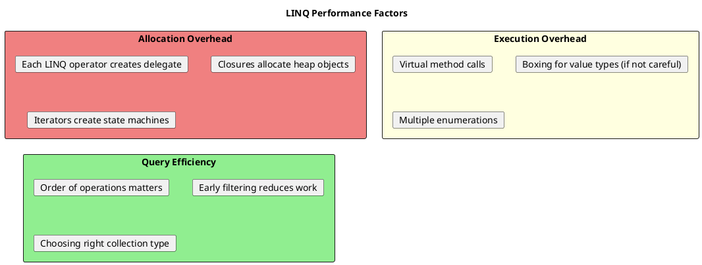
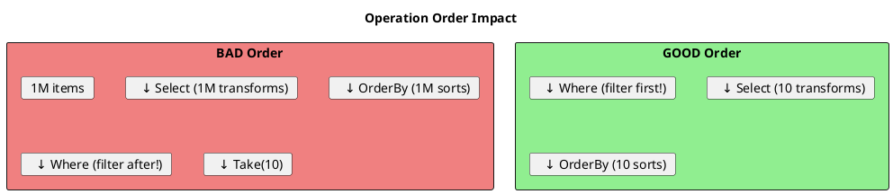

# LINQ Performance - Optimization Guide

## Performance Overview



## LINQ vs Loops - When Does It Matter?

```csharp
// ═══════════════════════════════════════════════════════
// FOR MOST CODE: LINQ IS FINE
// ═══════════════════════════════════════════════════════

// LINQ - Clear and maintainable
var adults = users.Where(u => u.Age >= 18).Select(u => u.Name).ToList();

// Loop equivalent - More verbose, minimal performance gain
var adults = new List<string>();
foreach (var u in users)
{
    if (u.Age >= 18)
        adults.Add(u.Name);
}

// ═══════════════════════════════════════════════════════
// FOR HOT PATHS: Consider loops or Span
// ═══════════════════════════════════════════════════════

// Called millions of times per second?
// LINQ allocations become significant.

// Benchmark results (processing 1000 items, 1M iterations):
// LINQ:  ~50ms, 40MB allocations
// Loop:  ~20ms, 0 allocations
```

## Allocation Patterns

```csharp
// ═══════════════════════════════════════════════════════
// ALLOCATIONS IN LINQ
// ═══════════════════════════════════════════════════════

// Each operator allocates:
var result = items
    .Where(x => x > 5)      // WhereIterator + delegate
    .Select(x => x * 2)     // SelectIterator + delegate
    .ToList();              // List<T>

// ═══════════════════════════════════════════════════════
// CLOSURE ALLOCATIONS
// ═══════════════════════════════════════════════════════

int threshold = 10;
var filtered = items.Where(x => x > threshold);  // Closure allocated!

// The lambda captures 'threshold', creating a closure class instance

// ═══════════════════════════════════════════════════════
// REDUCING ALLOCATIONS
// ═══════════════════════════════════════════════════════

// Static lambdas (C# 9+) - no closure if no capture
var filtered = items.Where(static x => x > 10);  // No closure

// Cached delegate for reuse
private static readonly Func<int, bool> _isPositive = x => x > 0;

public IEnumerable<int> GetPositive(IEnumerable<int> items)
{
    return items.Where(_isPositive);  // Reuses delegate
}
```

## Order of Operations



```csharp
// ═══════════════════════════════════════════════════════
// BAD: Processing more than needed
// ═══════════════════════════════════════════════════════

var result = items
    .Select(x => ExpensiveTransform(x))  // Transforms ALL items
    .Where(x => x.IsValid)               // Then filters
    .Take(10)
    .ToList();

// ═══════════════════════════════════════════════════════
// GOOD: Filter first, reduce work
// ═══════════════════════════════════════════════════════

var result = items
    .Where(x => x.IsValid)               // Filter FIRST
    .Take(10)                            // Only need 10
    .Select(x => ExpensiveTransform(x))  // Transform only 10
    .ToList();

// ═══════════════════════════════════════════════════════
// SORTING CONSIDERATIONS
// ═══════════════════════════════════════════════════════

// BAD: Sort 1M items, take 10
var top10 = items.OrderByDescending(x => x.Score).Take(10);

// BETTER: Use partial sort / heap for top-N scenarios
// In .NET, OrderBy must still sort all items

// For IQueryable (database): Let DB optimize
var top10 = _context.Users
    .OrderByDescending(x => x.Score)
    .Take(10)
    .ToList();
// SQL: SELECT TOP 10 ... ORDER BY Score DESC (efficient!)
```

## Multiple Enumeration

```csharp
// ═══════════════════════════════════════════════════════
// THE PROBLEM
// ═══════════════════════════════════════════════════════

IEnumerable<User> GetExpensiveData() => _context.Users.ToList();

var users = GetExpensiveData();  // Returns IEnumerable

var count = users.Count();       // Enumerates #1
var first = users.First();       // Enumerates #2
var list = users.ToList();       // Enumerates #3

// For lazy sequences, this means 3 executions!

// ═══════════════════════════════════════════════════════
// THE FIX: Materialize once
// ═══════════════════════════════════════════════════════

var users = GetExpensiveData().ToList();  // Materialize ONCE

var count = users.Count;          // O(1) - property access
var first = users[0];             // O(1) - index access
var list = users;                 // Already a list

// ═══════════════════════════════════════════════════════
// DETECTING IN CODE
// ═══════════════════════════════════════════════════════

// ReSharper/Rider warns: "Possible multiple enumeration"

// Pattern: Accept IReadOnlyList<T> to force materialization
public void Process(IReadOnlyList<User> users)
{
    var count = users.Count;  // Safe, O(1)
    var first = users[0];     // Safe, O(1)
}
```

## Collection Type Selection

```csharp
// ═══════════════════════════════════════════════════════
// CONTAINS CHECK
// ═══════════════════════════════════════════════════════

// BAD: O(n) per check
var ids = validIds.ToList();
var filtered = items.Where(x => ids.Contains(x.Id));  // O(n*m)!

// GOOD: O(1) per check
var ids = validIds.ToHashSet();
var filtered = items.Where(x => ids.Contains(x.Id));  // O(n)

// ═══════════════════════════════════════════════════════
// LOOKUP BY KEY
// ═══════════════════════════════════════════════════════

// BAD: O(n) per lookup
var users = GetUsers().ToList();
var user = users.First(u => u.Id == targetId);  // O(n)

// GOOD: O(1) per lookup
var usersById = GetUsers().ToDictionary(u => u.Id);
var user = usersById[targetId];  // O(1)

// ═══════════════════════════════════════════════════════
// GROUP LOOKUPS
// ═══════════════════════════════════════════════════════

// ToLookup for one-to-many relationships
var ordersByCustomer = orders.ToLookup(o => o.CustomerId);

var customer1Orders = ordersByCustomer[1];  // O(1) to get group
var customer2Orders = ordersByCustomer[2];  // O(1) to get group
```

## Avoiding Boxing

```csharp
// ═══════════════════════════════════════════════════════
// BOXING IN LINQ
// ═══════════════════════════════════════════════════════

// Non-generic interfaces cause boxing
IEnumerable nonGeneric = new int[] { 1, 2, 3 };
foreach (object item in nonGeneric)  // Boxing each int!
{
    Console.WriteLine(item);
}

// Generic interfaces avoid boxing
IEnumerable<int> generic = new int[] { 1, 2, 3 };
foreach (int item in generic)  // No boxing
{
    Console.WriteLine(item);
}

// ═══════════════════════════════════════════════════════
// AGGREGATE WITH VALUE TYPES
// ═══════════════════════════════════════════════════════

// Sum, Average, etc. have optimized overloads for primitive types
var sum = numbers.Sum();  // No boxing - uses int overload

// Custom aggregation - be careful
// BAD: Using object-based Aggregate
var result = items.Aggregate<Item, object>(null, (acc, item) => ...);

// GOOD: Use typed Aggregate
var result = items.Aggregate(0, (acc, item) => acc + item.Value);
```

## Span<T> and Memory<T> for Performance

```csharp
// ═══════════════════════════════════════════════════════
// SPAN FOR ZERO-ALLOCATION PROCESSING
// ═══════════════════════════════════════════════════════

// Traditional LINQ - allocations
string[] parts = line.Split(',');
var trimmed = parts.Select(p => p.Trim()).ToArray();

// Span-based - zero allocations for parsing
ReadOnlySpan<char> span = line.AsSpan();
foreach (var range in span.Split(','))
{
    var part = span[range].Trim();
    // Process part directly
}

// ═══════════════════════════════════════════════════════
// ARRAY SLICING
// ═══════════════════════════════════════════════════════

// LINQ - creates new array
var subset = array.Skip(10).Take(5).ToArray();

// Span - no allocation, view into same memory
var subset = array.AsSpan(10, 5);

// ═══════════════════════════════════════════════════════
// STACKALLOC FOR SMALL BUFFERS
// ═══════════════════════════════════════════════════════

// Heap allocation
byte[] buffer = new byte[256];

// Stack allocation - faster, no GC
Span<byte> buffer = stackalloc byte[256];
```

## Parallel LINQ (PLINQ)

```csharp
// ═══════════════════════════════════════════════════════
// BASIC PLINQ
// ═══════════════════════════════════════════════════════

var results = items
    .AsParallel()
    .Where(x => ExpensiveCheck(x))
    .Select(x => ExpensiveTransform(x))
    .ToList();

// ═══════════════════════════════════════════════════════
// WHEN TO USE PLINQ
// ═══════════════════════════════════════════════════════

// GOOD: CPU-bound operations on large datasets
var results = largeCollection
    .AsParallel()
    .Where(x => CpuIntensiveCheck(x))  // Benefits from parallelism
    .ToList();

// BAD: Small collections
var results = smallList
    .AsParallel()  // Overhead outweighs benefit
    .Select(x => x * 2)
    .ToList();

// BAD: I/O-bound operations
var results = files
    .AsParallel()  // Better to use async I/O
    .Select(f => File.ReadAllText(f))
    .ToList();

// ═══════════════════════════════════════════════════════
// PLINQ OPTIONS
// ═══════════════════════════════════════════════════════

var results = items
    .AsParallel()
    .WithDegreeOfParallelism(4)        // Limit threads
    .WithExecutionMode(ParallelExecutionMode.ForceParallelism)
    .WithMergeOptions(ParallelMergeOptions.NotBuffered)
    .Where(x => Check(x))
    .ToList();

// Preserve order (slower)
var ordered = items
    .AsParallel()
    .AsOrdered()
    .Select(x => Transform(x))
    .ToList();
```

## Benchmarking LINQ

```csharp
// Using BenchmarkDotNet
[MemoryDiagnoser]
public class LinqBenchmarks
{
    private int[] _data = Enumerable.Range(0, 10000).ToArray();

    [Benchmark]
    public int LinqSum() => _data.Where(x => x % 2 == 0).Sum();

    [Benchmark]
    public int LoopSum()
    {
        int sum = 0;
        foreach (var x in _data)
        {
            if (x % 2 == 0)
                sum += x;
        }
        return sum;
    }

    [Benchmark]
    public int SpanSum()
    {
        int sum = 0;
        foreach (var x in _data.AsSpan())
        {
            if (x % 2 == 0)
                sum += x;
        }
        return sum;
    }
}

// Results (example):
// | Method   | Mean       | Allocated |
// |----------|------------|-----------|
// | LinqSum  | 45.32 μs   | 96 B      |
// | LoopSum  | 12.45 μs   | 0 B       |
// | SpanSum  | 11.89 μs   | 0 B       |
```

## Performance Checklist

```
┌─────────────────────────────────────────────────────────────┐
│                 LINQ PERFORMANCE CHECKLIST                   │
├─────────────────────────────────────────────────────────────┤
│ □ Filter (Where) before Transform (Select)                  │
│ □ Take early if you only need subset                        │
│ □ Use HashSet for Contains checks                           │
│ □ Use Dictionary for key lookups                            │
│ □ Materialize once, enumerate multiple times                │
│ □ Use AsNoTracking() for read-only EF queries              │
│ □ Use static lambdas when not capturing variables           │
│ □ Cache delegates if reused frequently                      │
│ □ Consider loops/Span for hot paths                         │
│ □ Profile before optimizing (don't guess!)                  │
└─────────────────────────────────────────────────────────────┘
```

## Senior Interview Questions

**Q: When would you NOT use LINQ?**

- Extremely hot code paths (millions of calls/second)
- Memory-constrained environments
- When allocation overhead is unacceptable
- Simple operations where a loop is clearer

**Q: How do you optimize a slow LINQ query?**

1. Check for multiple enumeration
2. Verify filter order (filter early)
3. Check collection types (HashSet for Contains)
4. Look for N+1 queries (in EF)
5. Profile to find actual bottleneck
6. Consider materialization vs lazy evaluation

**Q: What's the memory overhead of a typical LINQ query?**

Each operator typically allocates:
- Iterator state machine (~50-100 bytes)
- Delegate for lambda (~32-64 bytes)
- Closure if capturing variables (~24-48 bytes + captured)

For 3 operators: ~200-400 bytes minimum.
