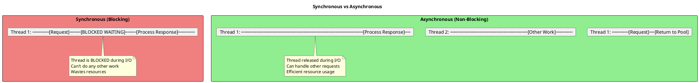
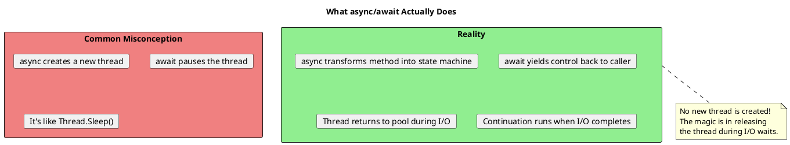
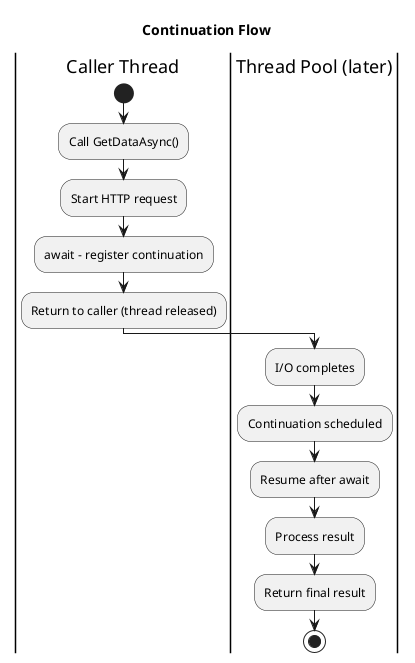
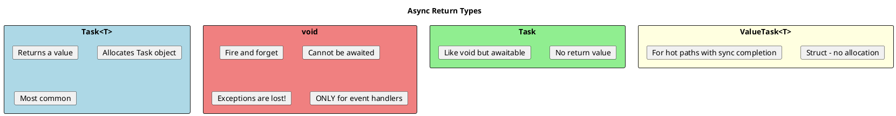

# Async/Await Fundamentals - Deep Dive

## Why Async Matters

Asynchronous programming allows your application to remain responsive while waiting for I/O operations (network, disk, database).



## The Core Concept: async Does NOT Create Threads

This is the **most important** thing to understand:



## How async/await Works Under the Hood

```plantuml
@startuml
skinparam monochrome false

title async/await State Machine

rectangle "Your Code" as code #LightBlue {
  card "async Task DoWorkAsync()"
  card "{"
  card "    var data = await GetDataAsync();"
  card "    Process(data);"
  card "}"
}

rectangle "Compiler Generates" as gen #LightGreen {
  rectangle "State Machine Class" {
    card "int state = 0;"
    card "TaskAwaiter awaiter;"
    card ""
    card "void MoveNext()"
    card "{"
    card "  switch(state) {"
    card "    case 0:"
    card "      awaiter = GetDataAsync().GetAwaiter();"
    card "      if (!awaiter.IsCompleted) {"
    card "        state = 1;"
    card "        builder.AwaitUnsafeOnCompleted(awaiter, this);"
    card "        return; // Exit, continue later"
    card "      }"
    card "      goto case 1;"
    card "    case 1:"
    card "      var data = awaiter.GetResult();"
    card "      Process(data);"
    card "      builder.SetResult();"
    card "  }"
    card "}"
  }
}

code --> gen : Compiler transforms
@enduml
```

```csharp
// What you write:
public async Task<string> GetUserNameAsync(int id)
{
    Console.WriteLine("Before await");
    var user = await _userService.GetByIdAsync(id);
    Console.WriteLine("After await");
    return user.Name;
}

// What the compiler generates (simplified):
public Task<string> GetUserNameAsync(int id)
{
    var stateMachine = new GetUserNameAsyncStateMachine
    {
        _id = id,
        _this = this,
        _builder = AsyncTaskMethodBuilder<string>.Create(),
        _state = -1
    };
    stateMachine._builder.Start(ref stateMachine);
    return stateMachine._builder.Task;
}

private struct GetUserNameAsyncStateMachine : IAsyncStateMachine
{
    public int _state;
    public AsyncTaskMethodBuilder<string> _builder;
    public int _id;
    public YourClass _this;
    private TaskAwaiter<User> _awaiter;

    public void MoveNext()
    {
        try
        {
            if (_state == -1)
            {
                Console.WriteLine("Before await");
                _awaiter = _this._userService.GetByIdAsync(_id).GetAwaiter();

                if (!_awaiter.IsCompleted)
                {
                    _state = 0;
                    _builder.AwaitUnsafeOnCompleted(ref _awaiter, ref this);
                    return;  // Exit method, will be resumed later
                }
            }

            // State 0: Continuation after await
            var user = _awaiter.GetResult();
            Console.WriteLine("After await");
            _builder.SetResult(user.Name);
        }
        catch (Exception ex)
        {
            _builder.SetException(ex);
        }
    }
}
```

## Basic async/await Patterns

```csharp
// ═══════════════════════════════════════════════════════
// ASYNC METHOD SIGNATURES
// ═══════════════════════════════════════════════════════

// Returns Task<T> - has result
public async Task<string> GetDataAsync()
{
    var result = await httpClient.GetStringAsync(url);
    return result;
}

// Returns Task - no result
public async Task SaveDataAsync(string data)
{
    await File.WriteAllTextAsync(path, data);
}

// Returns ValueTask<T> - performance optimization
public async ValueTask<int> GetCachedValueAsync()
{
    if (_cache.TryGetValue(key, out var value))
        return value;  // No allocation for sync path

    return await LoadValueAsync();
}

// Returns void - ONLY for event handlers!
private async void Button_Click(object sender, EventArgs e)
{
    await DoWorkAsync();  // Exceptions are lost!
}

// ═══════════════════════════════════════════════════════
// AWAITING MULTIPLE TASKS
// ═══════════════════════════════════════════════════════

// Sequential - total time = sum of all
var result1 = await GetData1Async();
var result2 = await GetData2Async();
var result3 = await GetData3Async();

// Parallel - total time = max of all
var task1 = GetData1Async();
var task2 = GetData2Async();
var task3 = GetData3Async();

await Task.WhenAll(task1, task2, task3);

var result1 = task1.Result;  // Safe, task completed
var result2 = task2.Result;
var result3 = task3.Result;

// Or get all results directly
var results = await Task.WhenAll(
    GetData1Async(),
    GetData2Async(),
    GetData3Async()
);

// Wait for first to complete
var firstResult = await Task.WhenAny(task1, task2, task3);
```

## Understanding Continuations



```csharp
public async Task DemonstrateFlowAsync()
{
    Console.WriteLine($"1. Before await - Thread {Thread.CurrentThread.ManagedThreadId}");

    await Task.Delay(100);

    // This may run on a DIFFERENT thread!
    Console.WriteLine($"2. After await - Thread {Thread.CurrentThread.ManagedThreadId}");
}

// Output (in console app):
// 1. Before await - Thread 1
// 2. After await - Thread 4  (different thread!)

// Output (in WPF/WinForms with SynchronizationContext):
// 1. Before await - Thread 1
// 2. After await - Thread 1  (same thread - UI thread)
```

## Async Return Types



```csharp
// ═══════════════════════════════════════════════════════
// TASK<T> - Standard return with value
// ═══════════════════════════════════════════════════════

public async Task<User> GetUserAsync(int id)
{
    return await _repository.FindAsync(id);
}

// ═══════════════════════════════════════════════════════
// TASK - Standard return without value
// ═══════════════════════════════════════════════════════

public async Task UpdateUserAsync(User user)
{
    await _repository.UpdateAsync(user);
    // No return statement needed
}

// ═══════════════════════════════════════════════════════
// VALUETASK<T> - Performance optimization
// ═══════════════════════════════════════════════════════

// Good when result is often available synchronously
private readonly ConcurrentDictionary<int, User> _cache = new();

public ValueTask<User> GetUserCachedAsync(int id)
{
    // Sync path - no allocation
    if (_cache.TryGetValue(id, out var user))
        return ValueTask.FromResult(user);

    // Async path - allocation required
    return new ValueTask<User>(LoadAndCacheUserAsync(id));
}

private async Task<User> LoadAndCacheUserAsync(int id)
{
    var user = await _repository.FindAsync(id);
    _cache[id] = user;
    return user;
}

// ═══════════════════════════════════════════════════════
// ASYNC VOID - Avoid except for event handlers!
// ═══════════════════════════════════════════════════════

// BAD - Exceptions crash the application
public async void DoWorkBad()
{
    await Task.Delay(100);
    throw new Exception("This crashes the app!");
}

// GOOD - Use Task, handle exceptions
public async Task DoWorkGood()
{
    await Task.Delay(100);
    throw new Exception("This can be caught by caller");
}

// ONLY valid use: Event handlers
private async void Button_Click(object sender, EventArgs e)
{
    try
    {
        await ProcessClickAsync();
    }
    catch (Exception ex)
    {
        MessageBox.Show(ex.Message);  // Handle exception here!
    }
}
```

## Exception Handling in Async

```csharp
// ═══════════════════════════════════════════════════════
// EXCEPTIONS IN ASYNC METHODS
// ═══════════════════════════════════════════════════════

public async Task<int> ThrowsAsync()
{
    await Task.Delay(100);
    throw new InvalidOperationException("Oops!");
}

// Exception is captured in the Task
var task = ThrowsAsync();  // No exception yet!

// Exception thrown when awaited
try
{
    await task;  // Exception thrown here
}
catch (InvalidOperationException ex)
{
    Console.WriteLine(ex.Message);
}

// ═══════════════════════════════════════════════════════
// HANDLING MULTIPLE EXCEPTIONS (WhenAll)
// ═══════════════════════════════════════════════════════

var tasks = new[]
{
    Task.FromException(new Exception("Error 1")),
    Task.FromException(new Exception("Error 2")),
    Task.FromException(new Exception("Error 3"))
};

try
{
    await Task.WhenAll(tasks);
}
catch (Exception ex)
{
    // Only FIRST exception is thrown!
    Console.WriteLine(ex.Message);  // "Error 1"

    // To get ALL exceptions:
    var allTask = Task.WhenAll(tasks);
    try { await allTask; } catch { }

    if (allTask.Exception != null)
    {
        foreach (var innerEx in allTask.Exception.InnerExceptions)
        {
            Console.WriteLine(innerEx.Message);
        }
    }
}

// ═══════════════════════════════════════════════════════
// EXCEPTION BEFORE FIRST AWAIT
// ═══════════════════════════════════════════════════════

public async Task ValidateAndProcessAsync(string data)
{
    // Exception BEFORE await - thrown immediately!
    if (data == null)
        throw new ArgumentNullException(nameof(data));

    await ProcessAsync(data);
}

var task = ValidateAndProcessAsync(null);  // Exception thrown HERE!
```

## Sync over Async (Anti-pattern)

```csharp
// ═══════════════════════════════════════════════════════
// NEVER DO THIS - Causes deadlocks in UI/ASP.NET
// ═══════════════════════════════════════════════════════

// BAD: .Result blocks the thread
public string GetDataBlocking()
{
    return GetDataAsync().Result;  // DEADLOCK in UI/ASP.NET!
}

// BAD: .Wait() blocks the thread
public void SaveDataBlocking()
{
    SaveDataAsync().Wait();  // DEADLOCK in UI/ASP.NET!
}

// BAD: GetAwaiter().GetResult() also blocks
public string GetDataBlocking2()
{
    return GetDataAsync().GetAwaiter().GetResult();  // Still bad!
}

// ═══════════════════════════════════════════════════════
// CORRECT: Async all the way
// ═══════════════════════════════════════════════════════

public async Task<string> GetDataCorrect()
{
    return await GetDataAsync();  // No blocking
}

// ═══════════════════════════════════════════════════════
// IF YOU ABSOLUTELY MUST (Console apps, certain scenarios)
// ═══════════════════════════════════════════════════════

// Safer in console apps (no SynchronizationContext)
public string GetDataInConsoleApp()
{
    return GetDataAsync().GetAwaiter().GetResult();
}

// Or use Task.Run to escape the sync context
public string GetDataSafer()
{
    return Task.Run(() => GetDataAsync()).GetAwaiter().GetResult();
}
```

## Senior Interview Questions

**Q: Does `async` make a method run on a different thread?**

No! `async` transforms the method into a state machine. The method runs on the calling thread until the first incomplete `await`. No new thread is created for I/O operations - the thread is released back to the pool.

**Q: What's the difference between `Task.Run` and `async`?**

- `Task.Run`: Queues work to thread pool, creates a new thread pool task
- `async`: Transforms method into state machine, releases thread during I/O

```csharp
// Task.Run - CPU-bound work on thread pool
await Task.Run(() => HeavyCpuCalculation());

// async/await - I/O-bound work, no new thread
await httpClient.GetStringAsync(url);
```

**Q: Why should you avoid `async void`?**

1. Cannot be awaited
2. Exceptions crash the application (unobserved)
3. Caller has no way to know when it completes
4. Difficult to test

Only use for event handlers where the signature is required.

**Q: What does `await` actually do?**

1. Checks if Task is already completed - if so, continues synchronously
2. If not complete, registers a continuation
3. Returns control to caller (method exits)
4. When Task completes, continuation is scheduled
5. State machine resumes from where it left off
