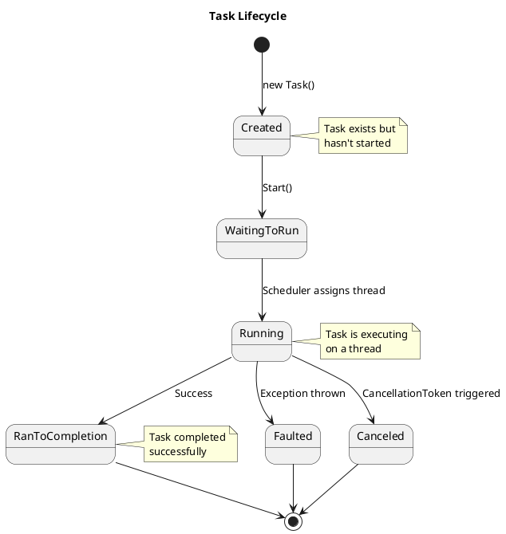
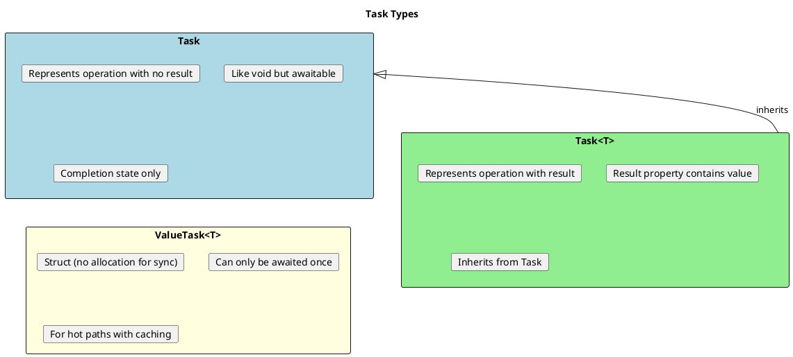
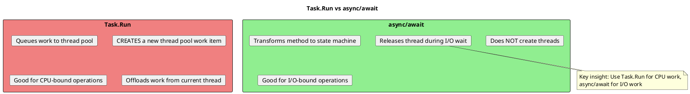
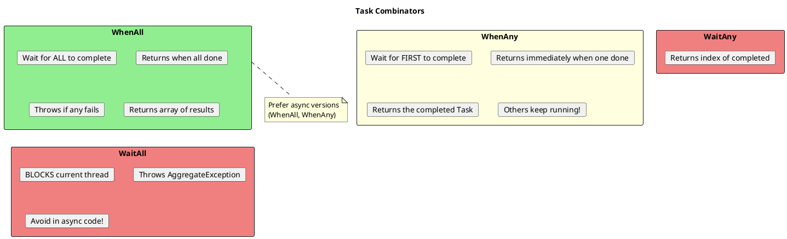
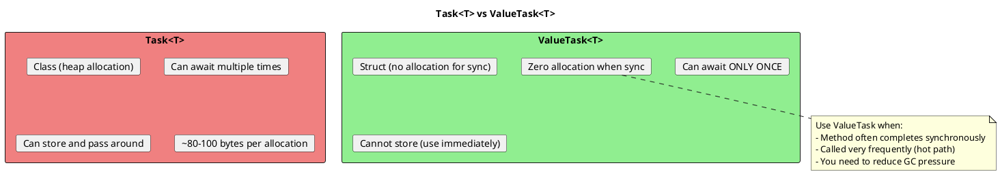

# Task Deep Dive - Understanding Task and Task<T>

## What Is a Task?

A `Task` represents an asynchronous operation. It's a **promise** that work will complete in the future.



## Task vs Task<T>



## Creating Tasks - Multiple Approaches

```csharp
// ═══════════════════════════════════════════════════════
// METHOD 1: Task.Run - Queue work to thread pool
// ═══════════════════════════════════════════════════════

// Best for CPU-bound work
Task<int> task1 = Task.Run(() =>
{
    // Runs on thread pool thread
    return HeavyCalculation();
});

// With async lambda
Task<string> task2 = Task.Run(async () =>
{
    await Task.Delay(100);
    return "Done";
});

// ═══════════════════════════════════════════════════════
// METHOD 2: Task.Factory.StartNew - More control
// ═══════════════════════════════════════════════════════

// Use when you need TaskCreationOptions
Task<int> task3 = Task.Factory.StartNew(
    () => HeavyCalculation(),
    CancellationToken.None,
    TaskCreationOptions.LongRunning,  // Hints to use dedicated thread
    TaskScheduler.Default
);

// WARNING: Doesn't unwrap nested tasks!
// BAD - Returns Task<Task<int>>
var badTask = Task.Factory.StartNew(async () =>
{
    await Task.Delay(100);
    return 42;
});

// GOOD - Use Unwrap() or Task.Run
var goodTask = Task.Factory.StartNew(async () =>
{
    await Task.Delay(100);
    return 42;
}).Unwrap();

// ═══════════════════════════════════════════════════════
// METHOD 3: new Task() - Rarely used directly
// ═══════════════════════════════════════════════════════

// Must manually start
var task4 = new Task(() => DoWork());
task4.Start();  // Don't forget!

// ═══════════════════════════════════════════════════════
// METHOD 4: Task.FromResult - Already completed task
// ═══════════════════════════════════════════════════════

// For returning sync results as Task
Task<int> cached = Task.FromResult(42);  // No thread pool

// ═══════════════════════════════════════════════════════
// METHOD 5: Task.CompletedTask - For Task (no result)
// ═══════════════════════════════════════════════════════

public Task DoNothingAsync()
{
    if (_alreadyDone)
        return Task.CompletedTask;  // No allocation!

    return ActualWorkAsync();
}

// ═══════════════════════════════════════════════════════
// METHOD 6: TaskCompletionSource - Manual control
// ═══════════════════════════════════════════════════════

public Task<int> WrapCallbackAsTask()
{
    var tcs = new TaskCompletionSource<int>();

    // Old callback-based API
    _legacyApi.BeginOperation(result =>
    {
        if (result.Error != null)
            tcs.SetException(result.Error);
        else
            tcs.SetResult(result.Value);
    });

    return tcs.Task;
}
```

## Task.Run vs async/await



```csharp
// ═══════════════════════════════════════════════════════
// CPU-BOUND: Use Task.Run
// ═══════════════════════════════════════════════════════

// In ASP.NET - avoid Task.Run (already on thread pool)
// BAD in ASP.NET:
public async Task<int> BadWebApiMethod()
{
    return await Task.Run(() => Calculate());  // Unnecessary thread switch
}

// GOOD in ASP.NET - just call directly:
public Task<int> GoodWebApiMethod()
{
    return Task.FromResult(Calculate());  // Or just make it sync
}

// In Desktop UI - Task.Run keeps UI responsive
// GOOD in WPF/WinForms:
private async void Button_Click(object sender, EventArgs e)
{
    // Offload CPU work from UI thread
    var result = await Task.Run(() => HeavyCalculation());
    labelResult.Text = result.ToString();
}

// ═══════════════════════════════════════════════════════
// I/O-BOUND: Use async/await directly
// ═══════════════════════════════════════════════════════

// GOOD - No Task.Run needed for I/O
public async Task<string> GetDataAsync()
{
    return await httpClient.GetStringAsync(url);  // I/O, no thread blocked
}

// BAD - Wrapping async in Task.Run is wasteful
public async Task<string> WastefulAsync()
{
    return await Task.Run(async () =>  // Unnecessary thread
    {
        return await httpClient.GetStringAsync(url);
    });
}
```

## Continuations

```csharp
// ═══════════════════════════════════════════════════════
// CONTINUEWITH - The "Old" Way
// ═══════════════════════════════════════════════════════

Task<int> firstTask = GetNumberAsync();

Task<string> continuation = firstTask.ContinueWith(antecedent =>
{
    int result = antecedent.Result;
    return $"Result was: {result}";
});

// With options
firstTask.ContinueWith(
    t => HandleSuccess(t.Result),
    TaskContinuationOptions.OnlyOnRanToCompletion
);

firstTask.ContinueWith(
    t => HandleError(t.Exception),
    TaskContinuationOptions.OnlyOnFaulted
);

// ═══════════════════════════════════════════════════════
// ASYNC/AWAIT - The Modern Way (Preferred)
// ═══════════════════════════════════════════════════════

// Much cleaner than ContinueWith
try
{
    int result = await GetNumberAsync();
    string message = $"Result was: {result}";
}
catch (Exception ex)
{
    HandleError(ex);
}

// ═══════════════════════════════════════════════════════
// WHY AVOID CONTINUEWITH?
// ═══════════════════════════════════════════════════════

// 1. Exception handling is awkward
// BAD:
task.ContinueWith(t =>
{
    if (t.IsFaulted)
    {
        // t.Exception is AggregateException!
        var actual = t.Exception.InnerException;
    }
    else
    {
        var result = t.Result;
    }
});

// 2. Default behavior surprises
// ContinueWith runs on arbitrary thread pool thread by default
// Unlike await which captures SynchronizationContext

// 3. Doesn't unwrap nested tasks automatically
```

## Task Combinators



```csharp
// ═══════════════════════════════════════════════════════
// TASK.WHENALL - Parallel execution, wait for all
// ═══════════════════════════════════════════════════════

var task1 = GetUser1Async();
var task2 = GetUser2Async();
var task3 = GetUser3Async();

// Wait for all, get results
User[] users = await Task.WhenAll(task1, task2, task3);

// Or inline
var results = await Task.WhenAll(
    GetDataFromApi1(),
    GetDataFromApi2(),
    GetDataFromApi3()
);

// With different types - need separate awaits
var userTask = GetUserAsync();
var ordersTask = GetOrdersAsync();
var settingsTask = GetSettingsAsync();

await Task.WhenAll(userTask, ordersTask, settingsTask);

var user = userTask.Result;      // Safe - task completed
var orders = ordersTask.Result;
var settings = settingsTask.Result;

// ═══════════════════════════════════════════════════════
// TASK.WHENANY - First to complete wins
// ═══════════════════════════════════════════════════════

// Racing multiple sources
var fastestTask = await Task.WhenAny(
    GetFromCache(),
    GetFromDatabase(),
    GetFromApi()
);

var result = await fastestTask;  // Get result from winner

// Timeout pattern
var workTask = DoLongWorkAsync();
var timeoutTask = Task.Delay(TimeSpan.FromSeconds(30));

var completed = await Task.WhenAny(workTask, timeoutTask);

if (completed == timeoutTask)
{
    throw new TimeoutException("Operation timed out");
}

var result = await workTask;  // Get actual result

// ═══════════════════════════════════════════════════════
// PROCESSING AS TASKS COMPLETE
// ═══════════════════════════════════════════════════════

var tasks = urls.Select(url => DownloadAsync(url)).ToList();

while (tasks.Count > 0)
{
    var completed = await Task.WhenAny(tasks);
    tasks.Remove(completed);

    try
    {
        var result = await completed;
        Process(result);
    }
    catch (Exception ex)
    {
        Log(ex);
    }
}

// Better approach with C# 8+
await foreach (var result in ProcessAsCompletedAsync(tasks))
{
    Process(result);
}
```

## TaskCompletionSource Deep Dive

```csharp
// ═══════════════════════════════════════════════════════
// WHAT IS TASKCOMPLETIONSOURCE?
// ═══════════════════════════════════════════════════════

// Creates a Task that YOU control when it completes
// Useful for:
// - Wrapping callback-based APIs
// - Creating tasks that complete on events
// - Manual control over task lifecycle

// ═══════════════════════════════════════════════════════
// BASIC USAGE
// ═══════════════════════════════════════════════════════

public Task<string> WaitForUserInputAsync()
{
    var tcs = new TaskCompletionSource<string>();

    _textBox.KeyDown += (s, e) =>
    {
        if (e.Key == Key.Enter)
        {
            tcs.SetResult(_textBox.Text);
        }
    };

    return tcs.Task;
}

// Usage
string userInput = await WaitForUserInputAsync();

// ═══════════════════════════════════════════════════════
// WRAPPING CALLBACK APIs
// ═══════════════════════════════════════════════════════

// Old callback-style API
public void LegacyDownload(string url, Action<byte[]> onSuccess, Action<Exception> onError)
{
    // ... implementation
}

// Modern Task wrapper
public Task<byte[]> DownloadAsync(string url)
{
    var tcs = new TaskCompletionSource<byte[]>();

    LegacyDownload(
        url,
        data => tcs.SetResult(data),
        ex => tcs.SetException(ex)
    );

    return tcs.Task;
}

// ═══════════════════════════════════════════════════════
// SETTING COMPLETION STATE
// ═══════════════════════════════════════════════════════

var tcs = new TaskCompletionSource<int>();

// Success
tcs.SetResult(42);                    // Throws if already set
tcs.TrySetResult(42);                 // Returns false if already set

// Failure
tcs.SetException(new Exception());    // Throws if already set
tcs.TrySetException(new Exception()); // Returns false if already set

// Cancellation
tcs.SetCanceled();                    // Throws if already set
tcs.TrySetCanceled();                 // Returns false if already set

// ═══════════════════════════════════════════════════════
// TIMEOUT PATTERN WITH TCS
// ═══════════════════════════════════════════════════════

public async Task<T> WithTimeout<T>(Task<T> task, TimeSpan timeout)
{
    var tcs = new TaskCompletionSource<T>();

    using var cts = new CancellationTokenSource();

    var timeoutTask = Task.Delay(timeout, cts.Token);

    var completed = await Task.WhenAny(task, timeoutTask);

    if (completed == timeoutTask)
    {
        throw new TimeoutException();
    }

    cts.Cancel();  // Cancel the delay
    return await task;
}

// ═══════════════════════════════════════════════════════
// RUNCONTIUNATIONSASYNCHRONOUSLY
// ═══════════════════════════════════════════════════════

// By default, continuations run synchronously on the thread that completes the TCS
// This can cause issues if SetResult is called while holding a lock

// BAD - Continuation runs while lock is held
lock (_lock)
{
    tcs.SetResult(value);  // Continuation runs HERE, inside lock!
}

// GOOD - Force async continuation
var tcs = new TaskCompletionSource<int>(
    TaskCreationOptions.RunContinuationsAsynchronously
);

lock (_lock)
{
    tcs.SetResult(value);  // Continuation scheduled, not run immediately
}
```

## Unwrapping Nested Tasks

```csharp
// ═══════════════════════════════════════════════════════
// THE PROBLEM
// ═══════════════════════════════════════════════════════

// Task.Factory.StartNew doesn't unwrap async lambdas
Task<Task<int>> nested = Task.Factory.StartNew(async () =>
{
    await Task.Delay(100);
    return 42;
});

// Type is Task<Task<int>>, not Task<int>!

// ═══════════════════════════════════════════════════════
// SOLUTION 1: Use Unwrap()
// ═══════════════════════════════════════════════════════

Task<int> unwrapped = Task.Factory.StartNew(async () =>
{
    await Task.Delay(100);
    return 42;
}).Unwrap();

int result = await unwrapped;

// ═══════════════════════════════════════════════════════
// SOLUTION 2: Use Task.Run (auto-unwraps)
// ═══════════════════════════════════════════════════════

Task<int> autoUnwrapped = Task.Run(async () =>
{
    await Task.Delay(100);
    return 42;
});

int result = await autoUnwrapped;  // Just works!

// ═══════════════════════════════════════════════════════
// WHEN YOU SEE Task<Task<T>>
// ═══════════════════════════════════════════════════════

// If you accidentally get Task<Task<T>>:
Task<Task<string>> badTask = /* ... */;

// Two awaits needed (confusing!)
string result = await await badTask;

// Better: unwrap it
string result = await badTask.Unwrap();
```

## ValueTask<T> - Performance Optimization



```csharp
// ═══════════════════════════════════════════════════════
// WHEN TO USE VALUETASK
// ═══════════════════════════════════════════════════════

// GOOD use case: Caching
private readonly Dictionary<int, User> _cache = new();

public ValueTask<User> GetUserAsync(int id)
{
    // Sync path: cache hit - no allocation!
    if (_cache.TryGetValue(id, out var user))
        return ValueTask.FromResult(user);

    // Async path: cache miss
    return new ValueTask<User>(LoadUserAsync(id));
}

private async Task<User> LoadUserAsync(int id)
{
    var user = await _repository.GetAsync(id);
    _cache[id] = user;
    return user;
}

// ═══════════════════════════════════════════════════════
// VALUETASK RESTRICTIONS
// ═══════════════════════════════════════════════════════

// Rule 1: Only await once!
var valueTask = GetUserAsync(1);
var user1 = await valueTask;
// var user2 = await valueTask;  // WRONG! Undefined behavior

// Rule 2: Don't await after checking IsCompleted
var valueTask = GetUserAsync(1);
if (valueTask.IsCompleted)
{
    // Don't do this in production - just for demonstration
    var result = valueTask.Result;
}
else
{
    var result = await valueTask;  // WRONG if IsCompleted was true!
}

// Rule 3: If you need to do multiple things, convert to Task
var valueTask = GetUserAsync(1);
var task = valueTask.AsTask();  // Now it's a regular Task
await task;
await task;  // OK - Task can be awaited multiple times

// ═══════════════════════════════════════════════════════
// VALUETASK IN INTERFACES
// ═══════════════════════════════════════════════════════

public interface IUserRepository
{
    // Good for potentially cached results
    ValueTask<User> GetByIdAsync(int id);

    // Regular Task for always-async operations
    Task SaveAsync(User user);
}

// ═══════════════════════════════════════════════════════
// IASYNCENUMERABLE USES VALUETASK
// ═══════════════════════════════════════════════════════

public interface IAsyncEnumerator<T> : IAsyncDisposable
{
    T Current { get; }
    ValueTask<bool> MoveNextAsync();  // ValueTask because often sync
}

public interface IAsyncDisposable
{
    ValueTask DisposeAsync();  // ValueTask because often sync
}
```

## Task Status and Properties

```csharp
// ═══════════════════════════════════════════════════════
// TASK STATUS ENUM
// ═══════════════════════════════════════════════════════

public enum TaskStatus
{
    Created,            // Task created but not started
    WaitingForActivation, // Waiting to be scheduled
    WaitingToRun,       // Scheduled but not running
    Running,            // Executing
    WaitingForChildrenToComplete, // Waiting for attached children
    RanToCompletion,    // Completed successfully
    Canceled,           // Canceled
    Faulted             // Exception occurred
}

// ═══════════════════════════════════════════════════════
// CHECKING STATUS
// ═══════════════════════════════════════════════════════

Task task = DoWorkAsync();

// Boolean properties
task.IsCompleted       // True if RanToCompletion, Canceled, or Faulted
task.IsCompletedSuccessfully  // True only if RanToCompletion (C# 7.3+)
task.IsCanceled        // True if Canceled
task.IsFaulted         // True if Faulted

// Status enum
task.Status            // TaskStatus enum value

// Exception (only if Faulted)
task.Exception         // AggregateException containing actual exceptions

// Result (only for Task<T>, blocks if not complete!)
task.Result            // The result value (blocks!)

// ═══════════════════════════════════════════════════════
// WAITING PATTERNS
// ═══════════════════════════════════════════════════════

// GOOD - Async wait
var result = await task;

// BAD - Blocking wait (can deadlock!)
task.Wait();                    // Blocks, throws AggregateException
var result = task.Result;       // Blocks, throws AggregateException
var result = task.GetAwaiter().GetResult(); // Blocks, unwraps exception

// Timeout wait
bool completed = task.Wait(TimeSpan.FromSeconds(5));
if (!completed)
{
    // Task didn't complete in time
}
```

## Senior Interview Questions

**Q: What's the difference between Task.Run and Task.Factory.StartNew?**

Key differences:
1. `Task.Run` automatically unwraps nested `Task<Task<T>>` from async lambdas
2. `Task.Run` defaults to `TaskScheduler.Default` (thread pool)
3. `Task.Factory.StartNew` allows more options (LongRunning, custom scheduler)
4. `Task.Run` is simpler and preferred for most cases

```csharp
// Task.Run - unwraps automatically
Task<int> a = Task.Run(async () => { await X(); return 1; });  // Task<int>

// StartNew - returns nested task
Task<Task<int>> b = Task.Factory.StartNew(async () => { await X(); return 1; });
Task<int> c = b.Unwrap();  // Need to unwrap
```

**Q: When would you use TaskCompletionSource?**

1. Wrapping callback-based APIs into Task-based
2. Creating tasks that complete based on external events
3. Implementing custom async patterns
4. Unit testing async code

**Q: What's the difference between Task.WhenAll and Task.WaitAll?**

- `WhenAll`: Returns `Task`, non-blocking, use with await
- `WaitAll`: Returns void, BLOCKS current thread, avoid in async code

```csharp
// Good - non-blocking
await Task.WhenAll(task1, task2);

// Bad in async - blocks thread
Task.WaitAll(task1, task2);  // Can deadlock with SynchronizationContext!
```

**Q: When should you use ValueTask<T> instead of Task<T>?**

Use `ValueTask<T>` when:
1. Method frequently completes synchronously (caching, buffering)
2. Method is called very frequently (hot paths)
3. Allocation overhead of Task<T> is measured as a problem

Remember: ValueTask can only be awaited once and shouldn't be stored.
