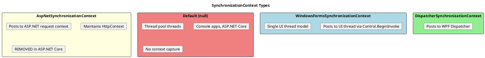
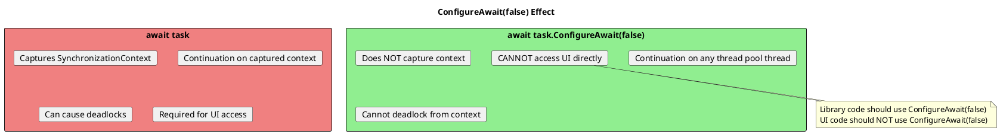
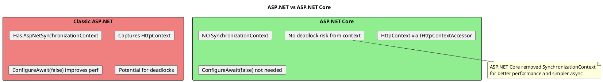
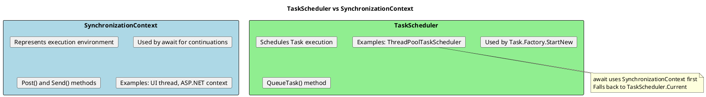

# SynchronizationContext and ConfigureAwait - Deep Dive

## What Is SynchronizationContext?

`SynchronizationContext` is an abstraction that represents the "context" in which code should execute. It allows posting work back to a specific thread or execution environment.



## How SynchronizationContext Works

```plantuml
@startuml
skinparam monochrome false

title Context Capture on Await

|UI Thread|
start
:Click Button;
:Capture SynchronizationContext;
:Start async operation;
:await httpClient.GetStringAsync();
note right: Context captured BEFORE await
:Thread released to do other work;

|Thread Pool|
:HTTP request completes;
:Post continuation to captured context;

|UI Thread|
:Continuation runs on UI thread;
:Update UI label;
stop

note bottom
  The SynchronizationContext ensures
  code after await runs on the
  original (UI) thread
end note
@enduml
```

```csharp
// ═══════════════════════════════════════════════════════
// HOW CONTEXT CAPTURE WORKS
// ═══════════════════════════════════════════════════════

// In WPF/WinForms application:
private async void Button_Click(object sender, EventArgs e)
{
    // Thread: UI Thread (ID: 1)
    // SynchronizationContext.Current: WindowsFormsSynchronizationContext

    label.Text = "Loading...";

    var data = await httpClient.GetStringAsync(url);
    // await captures current SynchronizationContext

    // Thread: UI Thread (ID: 1) - SAME THREAD!
    // Continuation posted back to UI context
    label.Text = data;  // Safe to access UI!
}

// ═══════════════════════════════════════════════════════
// MANUAL CONTEXT OPERATIONS
// ═══════════════════════════════════════════════════════

var context = SynchronizationContext.Current;

// Post work to context (async, fire and forget)
context?.Post(_ =>
{
    // Runs on context's thread
    UpdateUI();
}, null);

// Send work to context (sync, blocks until complete)
context?.Send(_ =>
{
    // Runs on context's thread, caller waits
    UpdateUI();
}, null);
```

## ConfigureAwait Explained



```csharp
// ═══════════════════════════════════════════════════════
// CONFIGUREAWAIT(TRUE) - The Default
// ═══════════════════════════════════════════════════════

// These are equivalent:
var data = await GetDataAsync();
var data = await GetDataAsync().ConfigureAwait(true);

// Behavior:
// 1. Captures current SynchronizationContext
// 2. Posts continuation back to that context
// 3. Continuation runs on original context (e.g., UI thread)

// ═══════════════════════════════════════════════════════
// CONFIGUREAWAIT(FALSE) - Skip Context
// ═══════════════════════════════════════════════════════

var data = await GetDataAsync().ConfigureAwait(false);

// Behavior:
// 1. Does NOT capture SynchronizationContext
// 2. Continuation runs on any available thread pool thread
// 3. No context switch overhead

// ═══════════════════════════════════════════════════════
// WHEN TO USE EACH
// ═══════════════════════════════════════════════════════

// UI APPLICATION CODE - Use default (or true)
private async void Button_Click(object sender, EventArgs e)
{
    var data = await LoadDataAsync();  // Context captured
    label.Text = data;                  // Safe - on UI thread!
}

// LIBRARY CODE - Use ConfigureAwait(false)
public async Task<string> GetDataAsync()
{
    var response = await _httpClient
        .GetStringAsync(url)
        .ConfigureAwait(false);  // Library doesn't need UI context

    var processed = Process(response);

    return await SaveAsync(processed)
        .ConfigureAwait(false);  // Every await should have it
}
```

## ConfigureAwait(false) - Best Practices

```csharp
// ═══════════════════════════════════════════════════════
// RULE: Library code should ALWAYS use ConfigureAwait(false)
// ═══════════════════════════════════════════════════════

public class DataService  // Library class
{
    private readonly HttpClient _httpClient;

    public async Task<User> GetUserAsync(int id)
    {
        var json = await _httpClient
            .GetStringAsync($"/users/{id}")
            .ConfigureAwait(false);

        var user = JsonSerializer.Deserialize<User>(json);

        // Apply to EVERY await
        await ValidateUserAsync(user)
            .ConfigureAwait(false);

        await LogAccessAsync(user.Id)
            .ConfigureAwait(false);

        return user;
    }
}

// ═══════════════════════════════════════════════════════
// RULE: Application "edge" code keeps context
// ═══════════════════════════════════════════════════════

// Controllers, View Models, Event Handlers - keep context
public class UserController : Controller
{
    private readonly DataService _service;

    public async Task<IActionResult> GetUser(int id)
    {
        // No ConfigureAwait needed in ASP.NET Core
        // (no SynchronizationContext anyway)
        var user = await _service.GetUserAsync(id);
        return Ok(user);
    }
}

// WPF ViewModel
public class MainViewModel
{
    public async Task LoadAsync()
    {
        IsLoading = true;

        // Keep context to update UI-bound properties
        var data = await _dataService.GetDataAsync();

        Data = data;  // Must be on UI thread for binding
        IsLoading = false;
    }
}

// ═══════════════════════════════════════════════════════
// COMMON MISTAKE: Mixing contexts
// ═══════════════════════════════════════════════════════

// BAD - Inconsistent usage
public async Task BadMixedUsageAsync()
{
    await Task1().ConfigureAwait(false);  // Now on thread pool

    // CRASH! We're no longer on UI thread
    label.Text = "Done";  // InvalidOperationException!
}

// GOOD - All or nothing after ConfigureAwait(false)
public async Task GoodPatternAsync()
{
    await Task1().ConfigureAwait(false);
    await Task2().ConfigureAwait(false);
    var result = await Task3().ConfigureAwait(false);

    return result;  // Return value, don't touch UI
}
```

## ASP.NET Core Has No SynchronizationContext!



```csharp
// ═══════════════════════════════════════════════════════
// ASP.NET CORE - ConfigureAwait(false) IS OPTIONAL
// ═══════════════════════════════════════════════════════

public class ProductsController : ControllerBase
{
    // Both work identically in ASP.NET Core:

    public async Task<IActionResult> Option1(int id)
    {
        var product = await _service.GetProductAsync(id);
        return Ok(product);
    }

    public async Task<IActionResult> Option2(int id)
    {
        var product = await _service.GetProductAsync(id)
            .ConfigureAwait(false);  // Unnecessary but not harmful
        return Ok(product);
    }
}

// ═══════════════════════════════════════════════════════
// HOWEVER: Libraries should still use ConfigureAwait(false)
// ═══════════════════════════════════════════════════════

// Why? Your library might be used in:
// - WPF apps
// - WinForms apps
// - Classic ASP.NET
// - Xamarin/MAUI apps

// All of these HAVE a SynchronizationContext!

public class MyNuGetLibrary
{
    public async Task<Data> GetDataAsync()
    {
        // Always use ConfigureAwait(false) in libraries
        return await _client.GetDataAsync()
            .ConfigureAwait(false);
    }
}
```

## Context in Different Environments

```csharp
// ═══════════════════════════════════════════════════════
// CONSOLE APPLICATION
// ═══════════════════════════════════════════════════════

// SynchronizationContext.Current is NULL
// Continuation runs on any thread pool thread

static async Task Main()
{
    Console.WriteLine($"Before: Thread {Thread.CurrentThread.ManagedThreadId}");

    await Task.Delay(100);

    // May be different thread!
    Console.WriteLine($"After: Thread {Thread.CurrentThread.ManagedThreadId}");
}

// Output example:
// Before: Thread 1
// After: Thread 4

// ═══════════════════════════════════════════════════════
// WPF APPLICATION
// ═══════════════════════════════════════════════════════

// SynchronizationContext.Current is DispatcherSynchronizationContext
// Continuation runs on UI thread

private async void Button_Click(object sender, RoutedEventArgs e)
{
    Debug.WriteLine($"Before: Thread {Thread.CurrentThread.ManagedThreadId}");

    await Task.Delay(100);

    // Same UI thread!
    Debug.WriteLine($"After: Thread {Thread.CurrentThread.ManagedThreadId}");
}

// Output:
// Before: Thread 1
// After: Thread 1

// ═══════════════════════════════════════════════════════
// XUNIT TEST WITH SYNCHRONIZATIONCONTEXT
// ═══════════════════════════════════════════════════════

// xUnit sets up a SynchronizationContext for tests
[Fact]
public async Task TestWithContext()
{
    var context = SynchronizationContext.Current;
    // context is not null in xUnit!

    await Task.Delay(100);
    // Continuation posted back to test context
}
```

## Custom SynchronizationContext

```csharp
// ═══════════════════════════════════════════════════════
// SINGLE-THREADED SYNCHRONIZATIONCONTEXT
// ═══════════════════════════════════════════════════════

public class SingleThreadSynchronizationContext : SynchronizationContext
{
    private readonly BlockingCollection<(SendOrPostCallback, object?)> _queue
        = new();

    public override void Post(SendOrPostCallback d, object? state)
    {
        _queue.Add((d, state));
    }

    public override void Send(SendOrPostCallback d, object? state)
    {
        // Sync version - blocks until complete
        var mre = new ManualResetEventSlim(false);
        Post(_ =>
        {
            d(state);
            mre.Set();
        }, null);
        mre.Wait();
    }

    public void RunOnCurrentThread()
    {
        SetSynchronizationContext(this);

        foreach (var (callback, state) in _queue.GetConsumingEnumerable())
        {
            callback(state);
        }
    }

    public void Complete() => _queue.CompleteAdding();
}

// Usage
var context = new SingleThreadSynchronizationContext();

Task.Run(async () =>
{
    SynchronizationContext.SetSynchronizationContext(context);

    await DoWorkAsync();  // Continuations go to our context

    context.Complete();
});

context.RunOnCurrentThread();  // Process work on main thread
```

## TaskScheduler vs SynchronizationContext



```csharp
// ═══════════════════════════════════════════════════════
// TASKSCHEDULER FOR TASK EXECUTION
// ═══════════════════════════════════════════════════════

// Default scheduler (thread pool)
var scheduler = TaskScheduler.Default;

// Current scheduler (context-aware)
var currentScheduler = TaskScheduler.Current;

// UI scheduler (WPF/WinForms)
var uiScheduler = TaskScheduler.FromCurrentSynchronizationContext();

// Using with ContinueWith
Task.Run(() => HeavyWork())
    .ContinueWith(
        t => UpdateUI(t.Result),
        uiScheduler  // Run continuation on UI thread
    );

// ═══════════════════════════════════════════════════════
// CUSTOM TASKSCHEDULER
// ═══════════════════════════════════════════════════════

// Limit concurrency
var limitedScheduler = new ConcurrentExclusiveSchedulerPair(
    TaskScheduler.Default,
    maxConcurrencyLevel: 4
).ConcurrentScheduler;

// Run max 4 tasks concurrently
Task.Factory.StartNew(
    () => DoWork(),
    CancellationToken.None,
    TaskCreationOptions.None,
    limitedScheduler
);
```

## Senior Interview Questions

**Q: What is SynchronizationContext and why does it matter?**

SynchronizationContext represents the execution environment for async continuations. It allows async code to resume on a specific thread (like UI thread) after an await. Without it, continuations run on arbitrary thread pool threads.

Key points:
- Captured at `await` by default
- UI frameworks use it to ensure continuations run on UI thread
- ASP.NET Core doesn't have one (removed for performance)
- `ConfigureAwait(false)` skips capturing it

**Q: When should you use ConfigureAwait(false)?**

Use `ConfigureAwait(false)` in library code and any code that:
1. Doesn't need to resume on a specific context
2. Doesn't access UI elements
3. Doesn't need HttpContext (classic ASP.NET)

Don't use it when you need to access UI elements or context-specific resources after the await.

```csharp
// Library - always use
await _http.GetAsync(url).ConfigureAwait(false);

// UI code - don't use
await LoadDataAsync();  // Need to stay on UI thread
label.Text = "Done";
```

**Q: Why doesn't ASP.NET Core have a SynchronizationContext?**

Microsoft removed it because:
1. Performance - no overhead of capturing/posting to context
2. Simplicity - no deadlock issues from blocking on async
3. HttpContext is available via IHttpContextAccessor instead
4. No UI thread to marshal back to

**Q: Can ConfigureAwait(false) improve performance?**

Yes, slightly:
1. Avoids capturing the context (small allocation)
2. Avoids posting to context (thread switch)
3. In high-throughput scenarios, these add up

But the main reason is preventing deadlocks, not performance.

**Q: What happens if you await without a SynchronizationContext?**

The continuation runs on any available thread pool thread (or the completing thread if already complete). This is the default behavior in console apps and ASP.NET Core.
