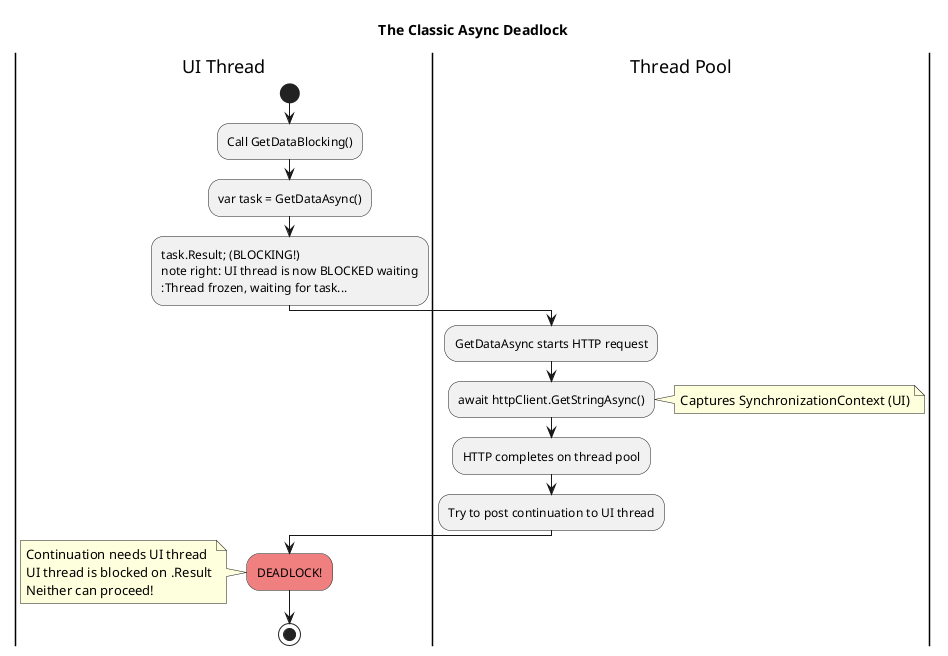
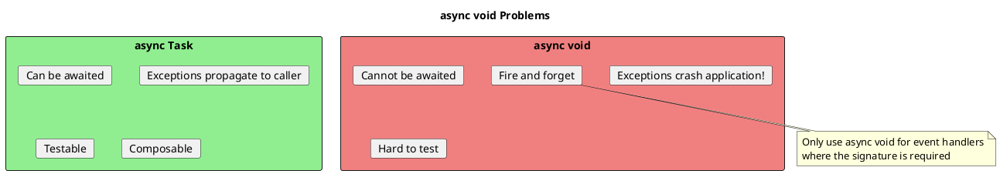

# Deadlocks and Common Async Pitfalls

## The Classic Async Deadlock

This is the **most important** async issue to understand. It occurs when blocking on async code in an environment with a SynchronizationContext.



```csharp
// ═══════════════════════════════════════════════════════
// THE DEADLOCK SCENARIO
// ═══════════════════════════════════════════════════════

// In WPF/WinForms application:
public class MainWindow
{
    private async Task<string> GetDataAsync()
    {
        await Task.Delay(100);  // Captures UI SynchronizationContext
        return "data";
    }

    private void Button_Click(object sender, EventArgs e)
    {
        // DEADLOCK! This blocks the UI thread
        var data = GetDataAsync().Result;

        // Never reaches here
        label.Text = data;
    }
}

// What happens:
// 1. Button_Click runs on UI thread
// 2. GetDataAsync() starts, captures UI context at first await
// 3. .Result blocks the UI thread
// 4. Task.Delay completes, tries to resume on UI thread
// 5. UI thread is blocked on .Result - DEADLOCK!

// ═══════════════════════════════════════════════════════
// THE FIX: Don't block on async!
// ═══════════════════════════════════════════════════════

// SOLUTION 1: Async all the way
private async void Button_Click(object sender, EventArgs e)
{
    var data = await GetDataAsync();  // No blocking!
    label.Text = data;
}

// SOLUTION 2: ConfigureAwait(false) in library code
private async Task<string> GetDataAsync()
{
    await Task.Delay(100).ConfigureAwait(false);  // Don't capture context
    return "data";
}

// Now .Result won't deadlock (but still not recommended)
var data = GetDataAsync().Result;  // Works, but avoid!
```

## All Blocking Anti-Patterns

```csharp
// ═══════════════════════════════════════════════════════
// ANTI-PATTERNS THAT CAN DEADLOCK
// ═══════════════════════════════════════════════════════

// BAD: .Result blocks and can deadlock
var data = GetDataAsync().Result;

// BAD: .Wait() blocks and can deadlock
GetDataAsync().Wait();

// BAD: .GetAwaiter().GetResult() still blocks!
var data = GetDataAsync().GetAwaiter().GetResult();
// (But doesn't wrap exceptions in AggregateException)

// BAD: Task.WaitAll blocks all tasks
Task.WaitAll(task1, task2, task3);

// BAD: Task.WaitAny blocks until any completes
Task.WaitAny(task1, task2, task3);

// ═══════════════════════════════════════════════════════
// CORRECT ALTERNATIVES
// ═══════════════════════════════════════════════════════

// GOOD: await doesn't block
var data = await GetDataAsync();

// GOOD: Task.WhenAll is async
await Task.WhenAll(task1, task2, task3);

// GOOD: Task.WhenAny is async
var first = await Task.WhenAny(task1, task2, task3);
```

## When Blocking Is "Safe"

```csharp
// ═══════════════════════════════════════════════════════
// CONSOLE APPLICATIONS (No SynchronizationContext)
// ═══════════════════════════════════════════════════════

static void Main(string[] args)
{
    // Works because no SynchronizationContext
    var result = GetDataAsync().GetAwaiter().GetResult();
    Console.WriteLine(result);
}

// BUT BETTER: Use async Main
static async Task Main(string[] args)
{
    var result = await GetDataAsync();
    Console.WriteLine(result);
}

// ═══════════════════════════════════════════════════════
// ASP.NET CORE (No SynchronizationContext)
// ═══════════════════════════════════════════════════════

public class StartupService : IHostedService
{
    public Task StartAsync(CancellationToken ct)
    {
        // Technically won't deadlock in ASP.NET Core
        // But still wastes a thread - avoid!
        var data = GetDataAsync().GetAwaiter().GetResult();
        return Task.CompletedTask;
    }
}

// BETTER: Make the method properly async
public async Task StartAsync(CancellationToken ct)
{
    var data = await GetDataAsync();
}

// ═══════════════════════════════════════════════════════
// IF YOU ABSOLUTELY MUST BLOCK (Legacy code constraints)
// ═══════════════════════════════════════════════════════

// Use Task.Run to escape the SynchronizationContext
public string GetDataBlocking()
{
    // Task.Run runs on thread pool (no SynchronizationContext)
    return Task.Run(() => GetDataAsync()).GetAwaiter().GetResult();
}

// Or use JoinableTaskFactory (VS SDK) for complex scenarios
```

## Async Void Pitfalls



```csharp
// ═══════════════════════════════════════════════════════
// PROBLEM 1: Exceptions crash the application
// ═══════════════════════════════════════════════════════

// BAD: Exception crashes app!
public async void CrashTheApp()
{
    await Task.Delay(100);
    throw new Exception("Unhandled!");  // Application crashes!
}

// GOOD: Exception can be caught
public async Task HandleExceptionProperly()
{
    await Task.Delay(100);
    throw new Exception("Can be caught");
}

try
{
    await HandleExceptionProperly();
}
catch (Exception ex)
{
    // Exception handled
}

// ═══════════════════════════════════════════════════════
// PROBLEM 2: Cannot wait for completion
// ═══════════════════════════════════════════════════════

// BAD: No way to know when done
public async void FireAndForget()
{
    await DoLongOperationAsync();
}

public void CallerMethod()
{
    FireAndForget();  // Returns immediately
    // No way to wait for FireAndForget to complete!
}

// GOOD: Can await completion
public async Task ProperAsync()
{
    await DoLongOperationAsync();
}

public async Task CallerMethodAsync()
{
    await ProperAsync();  // Waits for completion
}

// ═══════════════════════════════════════════════════════
// ONLY VALID USE: Event handlers
// ═══════════════════════════════════════════════════════

private async void Button_Click(object sender, EventArgs e)
{
    try
    {
        await DoWorkAsync();
    }
    catch (Exception ex)
    {
        // MUST handle exceptions here - they won't propagate!
        MessageBox.Show(ex.Message);
    }
}

// If you need to test, extract the logic:
internal async Task Button_Click_Implementation()
{
    await DoWorkAsync();  // Testable
}

private async void Button_Click(object sender, EventArgs e)
{
    try
    {
        await Button_Click_Implementation();
    }
    catch (Exception ex)
    {
        MessageBox.Show(ex.Message);
    }
}
```

## Forgetting to Await

```csharp
// ═══════════════════════════════════════════════════════
// PROBLEM: Task runs, but nobody awaits it
// ═══════════════════════════════════════════════════════

public async Task ProcessDataAsync()
{
    var data = await LoadDataAsync();

    // BAD: Fire and forget - no await!
    SaveAuditLogAsync(data);  // Warning: not awaited

    // What happens:
    // - SaveAuditLogAsync starts
    // - ProcessDataAsync continues/returns
    // - If SaveAuditLogAsync throws, exception is lost!
}

// FIX 1: Await it
public async Task ProcessDataAsync()
{
    var data = await LoadDataAsync();
    await SaveAuditLogAsync(data);  // Properly awaited
}

// FIX 2: If intentionally fire-and-forget, be explicit
public async Task ProcessDataAsync()
{
    var data = await LoadDataAsync();

    // Explicit fire-and-forget with error handling
    _ = SaveAuditLogAsync(data).ContinueWith(
        t => _logger.LogError(t.Exception, "Audit log failed"),
        TaskContinuationOptions.OnlyOnFaulted
    );
}

// Or use a helper method
public static void FireAndForget(
    this Task task,
    Action<Exception>? errorHandler = null)
{
    task.ContinueWith(
        t =>
        {
            if (t.Exception != null)
                errorHandler?.Invoke(t.Exception.GetBaseException());
        },
        TaskContinuationOptions.OnlyOnFaulted
    );
}

// Usage
SaveAuditLogAsync(data).FireAndForget(ex => _logger.LogError(ex, "Failed"));
```

## Common Anti-Patterns

```csharp
// ═══════════════════════════════════════════════════════
// ANTI-PATTERN 1: Async over Sync
// ═══════════════════════════════════════════════════════

// BAD: Wrapping sync code in Task.Run
public async Task<int> BadAsync()
{
    return await Task.Run(() =>
    {
        return SynchronousCalculation();  // Fake async!
    });
}

// In ASP.NET, this is WORSE than just sync:
// - Uses extra thread pool thread
// - Context switch overhead
// - No real async benefit

// GOOD: If it's sync, leave it sync
public int JustSync()
{
    return SynchronousCalculation();
}

// GOOD: If calling async from sync is needed, use proper patterns
// (See blocking section)

// ═══════════════════════════════════════════════════════
// ANTI-PATTERN 2: Sync over Async (in wrong context)
// ═══════════════════════════════════════════════════════

// BAD: Blocking in UI or ASP.NET (can deadlock)
public void BadSync()
{
    var result = GetDataAsync().Result;  // Can deadlock!
}

// ═══════════════════════════════════════════════════════
// ANTI-PATTERN 3: Unnecessary async/await
// ═══════════════════════════════════════════════════════

// BAD: Unnecessary state machine
public async Task<int> UnnecessaryAsync()
{
    return await GetNumberAsync();  // Just wrapping
}

// GOOD: Pass through the task directly
public Task<int> BetterAsync()
{
    return GetNumberAsync();  // No state machine overhead
}

// EXCEPTION: Keep async for exception handling
public async Task<int> KeepForTryCatch()
{
    try
    {
        return await GetNumberAsync();  // Needed for catch
    }
    catch (Exception ex)
    {
        _logger.LogError(ex);
        return -1;
    }
}

// EXCEPTION: Keep for using statements
public async Task<string> KeepForUsing()
{
    using var client = new HttpClient();
    return await client.GetStringAsync(url);  // Need async for disposal
}

// ═══════════════════════════════════════════════════════
// ANTI-PATTERN 4: Capturing loop variable
// ═══════════════════════════════════════════════════════

// BAD: Classic closure bug
var tasks = new List<Task<int>>();
for (int i = 0; i < 10; i++)
{
    // BUG: All tasks capture same variable 'i'
    tasks.Add(Task.Run(() => i * 2));  // All return 20!
}

// FIX: Capture by copying
var tasks = new List<Task<int>>();
for (int i = 0; i < 10; i++)
{
    int local = i;  // Create local copy
    tasks.Add(Task.Run(() => local * 2));  // Correct: 0, 2, 4, ...
}

// BETTER: Use LINQ
var tasks = Enumerable.Range(0, 10)
    .Select(i => Task.Run(() => i * 2))  // Each iteration has its own 'i'
    .ToList();

// ═══════════════════════════════════════════════════════
// ANTI-PATTERN 5: Sequential instead of parallel
// ═══════════════════════════════════════════════════════

// BAD: Sequential execution
var result1 = await GetData1Async();  // Wait
var result2 = await GetData2Async();  // Then wait
var result3 = await GetData3Async();  // Then wait
// Total time: sum of all three

// GOOD: Parallel execution
var task1 = GetData1Async();  // Start
var task2 = GetData2Async();  // Start
var task3 = GetData3Async();  // Start

await Task.WhenAll(task1, task2, task3);  // Wait for all
// Total time: max of all three

// Or directly
var results = await Task.WhenAll(
    GetData1Async(),
    GetData2Async(),
    GetData3Async()
);
```

## Exception Handling Pitfalls

```csharp
// ═══════════════════════════════════════════════════════
// PITFALL 1: Exception swallowed in fire-and-forget
// ═══════════════════════════════════════════════════════

public void StartBackgroundWork()
{
    // Exception is lost!
    _ = DoWorkAsync();  // Not awaited, exception disappears
}

// ═══════════════════════════════════════════════════════
// PITFALL 2: Only first exception in WhenAll
// ═══════════════════════════════════════════════════════

try
{
    await Task.WhenAll(
        Task.FromException(new Exception("Error 1")),
        Task.FromException(new Exception("Error 2")),
        Task.FromException(new Exception("Error 3"))
    );
}
catch (Exception ex)
{
    // Only sees "Error 1"!
    Console.WriteLine(ex.Message);
}

// To get ALL exceptions:
var allTasks = Task.WhenAll(tasks);
try
{
    await allTasks;
}
catch
{
    // Get all exceptions from the task itself
    var allExceptions = allTasks.Exception?.InnerExceptions;
    foreach (var ex in allExceptions ?? Enumerable.Empty<Exception>())
    {
        Console.WriteLine(ex.Message);
    }
}

// ═══════════════════════════════════════════════════════
// PITFALL 3: Exceptions before first await
// ═══════════════════════════════════════════════════════

public async Task<int> ProcessAsync(int[] data)
{
    // This throws IMMEDIATELY (before any await)
    if (data == null)
        throw new ArgumentNullException(nameof(data));

    await Task.Delay(100);
    return data.Length;
}

var task = ProcessAsync(null);  // Exception thrown HERE!

// If you want exception to be in the Task:
public async Task<int> ProcessAsyncDeferred(int[] data)
{
    await Task.Yield();  // Force async behavior

    if (data == null)
        throw new ArgumentNullException(nameof(data));

    return data.Length;
}

var task = ProcessAsyncDeferred(null);  // No exception yet
await task;  // Exception thrown here
```

## Debugging Async Deadlocks

```csharp
// ═══════════════════════════════════════════════════════
// TECHNIQUE 1: Identify the deadlock pattern
// ═══════════════════════════════════════════════════════

// Look for these patterns in code:
// - .Result
// - .Wait()
// - .GetAwaiter().GetResult()
// - Task.WaitAll()

// Combined with UI or ASP.NET (non-Core) context

// ═══════════════════════════════════════════════════════
// TECHNIQUE 2: Use debugger async call stack
// ═══════════════════════════════════════════════════════

// In Visual Studio:
// - Debug > Windows > Parallel Stacks
// - Debug > Windows > Tasks
// Shows async call stacks and task states

// ═══════════════════════════════════════════════════════
// TECHNIQUE 3: Add timeout to identify stuck tasks
// ═══════════════════════════════════════════════════════

public async Task<T> WithTimeout<T>(Task<T> task, TimeSpan timeout)
{
    var completed = await Task.WhenAny(task, Task.Delay(timeout));

    if (completed != task)
    {
        throw new TimeoutException("Possible deadlock detected");
    }

    return await task;
}

// ═══════════════════════════════════════════════════════
// TECHNIQUE 4: Dump thread states
// ═══════════════════════════════════════════════════════

// Use SOS debugger extension:
// !threads - list all threads
// !dumpstack - show stack for current thread
// !syncblk - show synchronization blocks
```

## Senior Interview Questions

**Q: Explain the classic async deadlock and how to prevent it.**

The deadlock occurs when:
1. Code blocks on async (.Result, .Wait())
2. The async method captures a SynchronizationContext
3. The continuation needs that context, but it's blocked

Prevention:
- Don't block on async - use async all the way
- Use ConfigureAwait(false) in library code
- Use Task.Run to escape the context if blocking is unavoidable

**Q: Why is async void dangerous?**

1. Exceptions crash the application (can't be caught by caller)
2. Cannot be awaited (caller can't wait for completion)
3. Hard to test (no Task to assert against)

Only use for event handlers where the signature is required.

**Q: What's wrong with `.GetAwaiter().GetResult()`?**

It still blocks the thread, just like .Result. The only difference is it throws the original exception instead of wrapping in AggregateException. It can still deadlock in contexts with SynchronizationContext.

**Q: How do you handle exceptions from multiple tasks in WhenAll?**

```csharp
var whenAllTask = Task.WhenAll(tasks);
try
{
    await whenAllTask;
}
catch
{
    // Get all exceptions
    foreach (var ex in whenAllTask.Exception!.InnerExceptions)
    {
        Log(ex);
    }
}
```

**Q: When is it safe to use .Result or .Wait()?**

1. Console applications (no SynchronizationContext)
2. After Task.Run escapes the context
3. When you're certain the task is already completed
4. ASP.NET Core (no SynchronizationContext, but still wastes threads)

Even when "safe", prefer async patterns for cleaner code.
