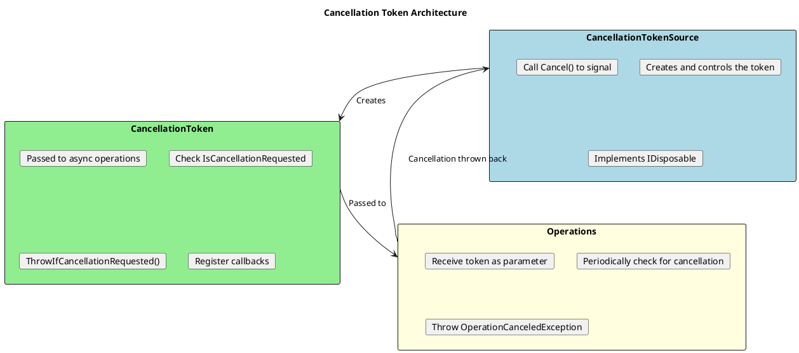
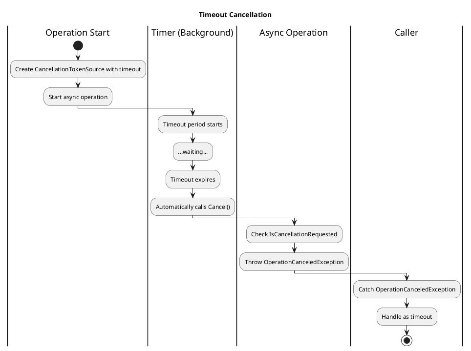

# Cancellation in Async Programming

## The Cancellation Pattern

.NET uses a cooperative cancellation model: operations check for cancellation and throw `OperationCanceledException` when requested to cancel.



## Basic Cancellation Usage

```csharp
// ═══════════════════════════════════════════════════════
// CREATING AND USING CANCELLATION
// ═══════════════════════════════════════════════════════

// Create the source (controller)
using var cts = new CancellationTokenSource();

// Get the token (read-only, passed to operations)
CancellationToken token = cts.Token;

// Start async work with the token
Task task = DoWorkAsync(token);

// Later: signal cancellation
cts.Cancel();

// The work will throw OperationCanceledException
try
{
    await task;
}
catch (OperationCanceledException)
{
    Console.WriteLine("Operation was cancelled");
}

// ═══════════════════════════════════════════════════════
// IMPLEMENTING CANCELLATION IN YOUR METHODS
// ═══════════════════════════════════════════════════════

public async Task DoWorkAsync(CancellationToken cancellationToken = default)
{
    for (int i = 0; i < 100; i++)
    {
        // Option 1: Throw if cancelled
        cancellationToken.ThrowIfCancellationRequested();

        // Or Option 2: Check and handle gracefully
        if (cancellationToken.IsCancellationRequested)
        {
            // Cleanup if needed
            break;
        }

        await Task.Delay(100, cancellationToken);  // Pass to other async calls

        await ProcessItemAsync(i, cancellationToken);
    }
}

// ═══════════════════════════════════════════════════════
// PASSING TOKEN TO FRAMEWORK METHODS
// ═══════════════════════════════════════════════════════

public async Task<string> GetDataAsync(CancellationToken ct = default)
{
    // HttpClient accepts cancellation token
    var response = await _httpClient.GetAsync(url, ct);

    // ReadAsStringAsync also accepts it
    return await response.Content.ReadAsStringAsync(ct);
}

public async Task<User?> GetUserAsync(int id, CancellationToken ct = default)
{
    // Entity Framework accepts cancellation token
    return await _context.Users
        .FirstOrDefaultAsync(u => u.Id == id, ct);
}
```

## Cancellation with Timeout



```csharp
// ═══════════════════════════════════════════════════════
// TIMEOUT VIA CONSTRUCTOR
// ═══════════════════════════════════════════════════════

// Automatically cancels after 30 seconds
using var cts = new CancellationTokenSource(TimeSpan.FromSeconds(30));

try
{
    await DoLongWorkAsync(cts.Token);
}
catch (OperationCanceledException)
{
    Console.WriteLine("Operation timed out");
}

// ═══════════════════════════════════════════════════════
// TIMEOUT VIA CancelAfter
// ═══════════════════════════════════════════════════════

using var cts = new CancellationTokenSource();
cts.CancelAfter(TimeSpan.FromSeconds(30));  // Set timeout

await DoLongWorkAsync(cts.Token);

// ═══════════════════════════════════════════════════════
// COMBINING TIMEOUT WITH USER CANCELLATION
// ═══════════════════════════════════════════════════════

public async Task<Result> ExecuteWithTimeoutAsync(
    CancellationToken userToken = default)
{
    // Create timeout token
    using var timeoutCts = new CancellationTokenSource(TimeSpan.FromSeconds(30));

    // Link user token and timeout token
    using var linkedCts = CancellationTokenSource.CreateLinkedTokenSource(
        userToken,
        timeoutCts.Token
    );

    try
    {
        return await DoWorkAsync(linkedCts.Token);
    }
    catch (OperationCanceledException) when (timeoutCts.IsCancellationRequested)
    {
        throw new TimeoutException("Operation timed out");
    }
    // If userToken was cancelled, OperationCanceledException propagates
}
```

## Linked Cancellation Tokens

```csharp
// ═══════════════════════════════════════════════════════
// LINKING MULTIPLE TOKENS
// ═══════════════════════════════════════════════════════

// Scenario: Cancel when ANY source requests cancellation
public async Task ProcessWithMultipleSources(
    CancellationToken requestToken,      // From HTTP request
    CancellationToken applicationToken)  // From application shutdown
{
    // If EITHER token is cancelled, linkedToken is cancelled
    using var linkedCts = CancellationTokenSource.CreateLinkedTokenSource(
        requestToken,
        applicationToken
    );

    await ProcessAsync(linkedCts.Token);
}

// ═══════════════════════════════════════════════════════
// ASP.NET CORE EXAMPLE
// ═══════════════════════════════════════════════════════

public class MyService
{
    private readonly IHostApplicationLifetime _lifetime;

    public MyService(IHostApplicationLifetime lifetime)
    {
        _lifetime = lifetime;
    }

    public async Task DoWorkAsync(CancellationToken requestToken)
    {
        // Cancel on request completion OR application shutdown
        using var linkedCts = CancellationTokenSource.CreateLinkedTokenSource(
            requestToken,
            _lifetime.ApplicationStopping
        );

        await LongRunningOperationAsync(linkedCts.Token);
    }
}

// ═══════════════════════════════════════════════════════
// COMBINING WITH TIMEOUT
// ═══════════════════════════════════════════════════════

public async Task<T> ExecuteAsync<T>(
    Func<CancellationToken, Task<T>> operation,
    CancellationToken externalToken = default,
    TimeSpan? timeout = null)
{
    var sources = new List<CancellationToken> { externalToken };

    CancellationTokenSource? timeoutCts = null;
    if (timeout.HasValue)
    {
        timeoutCts = new CancellationTokenSource(timeout.Value);
        sources.Add(timeoutCts.Token);
    }

    using var linkedCts = CancellationTokenSource.CreateLinkedTokenSource(
        sources.ToArray()
    );

    try
    {
        return await operation(linkedCts.Token);
    }
    finally
    {
        timeoutCts?.Dispose();
    }
}
```

## Cancellation Callbacks

```csharp
// ═══════════════════════════════════════════════════════
// REGISTERING CANCELLATION CALLBACKS
// ═══════════════════════════════════════════════════════

using var cts = new CancellationTokenSource();

// Register a callback when cancellation is requested
CancellationTokenRegistration registration = cts.Token.Register(() =>
{
    Console.WriteLine("Cancellation requested!");
    // Cleanup resources, abort connections, etc.
});

// Registration is IDisposable - unregister when done
// (important to prevent memory leaks)
registration.Dispose();

// Or use 'using':
using var reg = cts.Token.Register(() => Cleanup());

// ═══════════════════════════════════════════════════════
// USEFUL FOR INTEGRATING WITH NON-ASYNC APIS
// ═══════════════════════════════════════════════════════

public async Task<Response> CallLegacyApiAsync(CancellationToken ct)
{
    var tcs = new TaskCompletionSource<Response>();

    // Start legacy operation
    var handle = LegacyApi.BeginOperation(
        result => tcs.SetResult(result),
        error => tcs.SetException(error)
    );

    // Register cancellation to abort the operation
    using var registration = ct.Register(() =>
    {
        LegacyApi.AbortOperation(handle);
        tcs.TrySetCanceled(ct);
    });

    return await tcs.Task;
}

// ═══════════════════════════════════════════════════════
// ASYNC CALLBACK (C# 8+)
// ═══════════════════════════════════════════════════════

using var registration = cts.Token.Register(async () =>
{
    await CleanupAsync();  // Async cleanup
}, useSynchronizationContext: false);
```

## Cancellation in Different Scenarios

```csharp
// ═══════════════════════════════════════════════════════
// ASP.NET CORE CONTROLLER
// ═══════════════════════════════════════════════════════

[ApiController]
public class ProductsController : ControllerBase
{
    // HttpContext.RequestAborted is automatically cancelled
    // when client disconnects

    [HttpGet]
    public async Task<IActionResult> GetProducts(CancellationToken ct)
    {
        // ct is bound from HttpContext.RequestAborted
        var products = await _service.GetProductsAsync(ct);
        return Ok(products);
    }

    // Manual access
    [HttpGet("{id}")]
    public async Task<IActionResult> GetProduct(int id)
    {
        var ct = HttpContext.RequestAborted;
        var product = await _service.GetProductAsync(id, ct);
        return Ok(product);
    }
}

// ═══════════════════════════════════════════════════════
// BACKGROUND SERVICE
// ═══════════════════════════════════════════════════════

public class MyBackgroundService : BackgroundService
{
    protected override async Task ExecuteAsync(CancellationToken stoppingToken)
    {
        // stoppingToken is signaled when host is stopping

        while (!stoppingToken.IsCancellationRequested)
        {
            try
            {
                await DoWorkAsync(stoppingToken);
                await Task.Delay(TimeSpan.FromMinutes(1), stoppingToken);
            }
            catch (OperationCanceledException) when (stoppingToken.IsCancellationRequested)
            {
                // Normal shutdown, don't throw
                break;
            }
        }
    }
}

// ═══════════════════════════════════════════════════════
// UI APPLICATION (WPF Example)
// ═══════════════════════════════════════════════════════

public class MainViewModel : INotifyPropertyChanged
{
    private CancellationTokenSource? _currentOperation;

    public async Task StartOperationAsync()
    {
        // Cancel any existing operation
        _currentOperation?.Cancel();
        _currentOperation = new CancellationTokenSource();

        try
        {
            IsLoading = true;
            Data = await LoadDataAsync(_currentOperation.Token);
        }
        catch (OperationCanceledException)
        {
            // New operation started, ignore this one
        }
        finally
        {
            IsLoading = false;
        }
    }

    public void CancelOperation()
    {
        _currentOperation?.Cancel();
    }
}

// ═══════════════════════════════════════════════════════
// PARALLEL PROCESSING
// ═══════════════════════════════════════════════════════

public async Task ProcessItemsAsync(
    IEnumerable<Item> items,
    CancellationToken ct = default)
{
    var options = new ParallelOptions
    {
        CancellationToken = ct,
        MaxDegreeOfParallelism = Environment.ProcessorCount
    };

    await Parallel.ForEachAsync(items, options, async (item, token) =>
    {
        await ProcessItemAsync(item, token);
    });
}
```

## IAsyncEnumerable with Cancellation

```csharp
// ═══════════════════════════════════════════════════════
// ASYNC ITERATORS WITH CANCELLATION
// ═══════════════════════════════════════════════════════

public async IAsyncEnumerable<int> GetNumbersAsync(
    [EnumeratorCancellation] CancellationToken ct = default)
{
    for (int i = 0; i < int.MaxValue; i++)
    {
        ct.ThrowIfCancellationRequested();

        await Task.Delay(100, ct);  // Simulate async work

        yield return i;
    }
}

// Consuming with cancellation
using var cts = new CancellationTokenSource(TimeSpan.FromSeconds(5));

try
{
    await foreach (var number in GetNumbersAsync(cts.Token))
    {
        Console.WriteLine(number);
    }
}
catch (OperationCanceledException)
{
    Console.WriteLine("Enumeration cancelled");
}

// ═══════════════════════════════════════════════════════
// WITHCANCELLATION EXTENSION
// ═══════════════════════════════════════════════════════

// If the method doesn't have [EnumeratorCancellation]
public async IAsyncEnumerable<int> GetNumbersOldStyleAsync()
{
    for (int i = 0; ; i++)
    {
        await Task.Delay(100);
        yield return i;
    }
}

// Use WithCancellation to inject token
await foreach (var number in GetNumbersOldStyleAsync().WithCancellation(cts.Token))
{
    Console.WriteLine(number);
}
```

## Best Practices

```csharp
// ═══════════════════════════════════════════════════════
// ALWAYS DISPOSE CancellationTokenSource
// ═══════════════════════════════════════════════════════

// BAD: Memory leak potential
var cts = new CancellationTokenSource();
// Never disposed!

// GOOD: Always dispose
using var cts = new CancellationTokenSource();

// Or in class fields
public class MyService : IDisposable
{
    private readonly CancellationTokenSource _cts = new();

    public void Dispose()
    {
        _cts.Cancel();  // Signal cancellation first
        _cts.Dispose(); // Then dispose
    }
}

// ═══════════════════════════════════════════════════════
// USE DEFAULT PARAMETER VALUE
// ═══════════════════════════════════════════════════════

// GOOD: Optional parameter allows easy calling
public async Task DoWorkAsync(CancellationToken ct = default)
{
    await Task.Delay(100, ct);
}

// Can call with or without token:
await DoWorkAsync();
await DoWorkAsync(someToken);

// ═══════════════════════════════════════════════════════
// PASS TOKEN THROUGH THE CALL CHAIN
// ═══════════════════════════════════════════════════════

// GOOD: Token flows through all async calls
public async Task<Result> ProcessAsync(CancellationToken ct = default)
{
    var data = await LoadDataAsync(ct);       // Pass it down
    var validated = await ValidateAsync(data, ct);
    return await TransformAsync(validated, ct);
}

// BAD: Token doesn't flow
public async Task<Result> ProcessBadAsync(CancellationToken ct = default)
{
    var data = await LoadDataAsync();         // No token!
    var validated = await ValidateAsync(data); // No token!
    return await TransformAsync(validated);    // No token!
}

// ═══════════════════════════════════════════════════════
// CHECK CANCELLATION IN LOOPS
// ═══════════════════════════════════════════════════════

public async Task ProcessManyItemsAsync(
    IEnumerable<Item> items,
    CancellationToken ct = default)
{
    foreach (var item in items)
    {
        // Check at start of each iteration
        ct.ThrowIfCancellationRequested();

        await ProcessItemAsync(item, ct);
    }
}

// ═══════════════════════════════════════════════════════
// DIFFERENTIATE TIMEOUT VS USER CANCELLATION
// ═══════════════════════════════════════════════════════

public async Task<T> ExecuteWithTimeoutAsync<T>(
    Func<CancellationToken, Task<T>> operation,
    TimeSpan timeout,
    CancellationToken userToken = default)
{
    using var timeoutCts = new CancellationTokenSource(timeout);
    using var linkedCts = CancellationTokenSource.CreateLinkedTokenSource(
        userToken, timeoutCts.Token);

    try
    {
        return await operation(linkedCts.Token);
    }
    catch (OperationCanceledException ex)
    {
        if (timeoutCts.IsCancellationRequested && !userToken.IsCancellationRequested)
        {
            throw new TimeoutException("Operation timed out", ex);
        }
        throw;  // User cancelled, rethrow as-is
    }
}
```

## Senior Interview Questions

**Q: Explain the difference between CancellationTokenSource and CancellationToken.**

- `CancellationTokenSource`: The controller - creates tokens and signals cancellation
- `CancellationToken`: Read-only struct passed to operations - can only observe, not trigger

Separation of concerns: code that signals cancellation (source) is separate from code that responds to cancellation (token).

**Q: Why is .NET cancellation "cooperative"?**

Operations must voluntarily check for cancellation and throw. The system cannot forcibly terminate code. This ensures:
- Resources are properly cleaned up
- State remains consistent
- No abrupt thread termination (which is dangerous)

**Q: What happens if you don't dispose CancellationTokenSource?**

Potential memory leaks because:
- Internal timer resources (if using timeout)
- Registered callbacks
- Linked token references

Always dispose, especially with timeouts.

**Q: How do you handle cancellation in a long-running loop?**

```csharp
while (moreWork)
{
    ct.ThrowIfCancellationRequested();  // Check at loop start
    await DoWorkAsync(ct);              // Pass to async calls
}
```

Check at meaningful intervals - not so often that it affects performance, not so rarely that cancellation is delayed.

**Q: How do you combine multiple cancellation tokens?**

Use `CancellationTokenSource.CreateLinkedTokenSource`:

```csharp
using var linked = CancellationTokenSource.CreateLinkedTokenSource(
    token1, token2, token3
);
// linked.Token is cancelled when ANY source is cancelled
```
