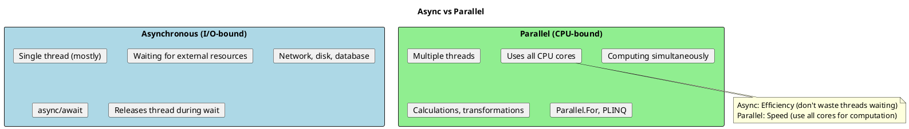
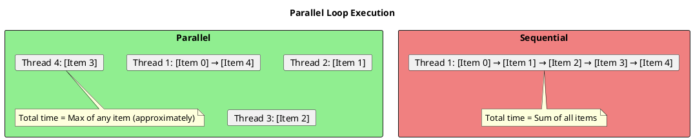
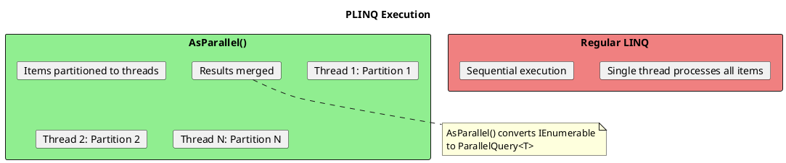

# Parallel Programming - CPU-Bound Operations

## Async vs Parallel: Understanding the Difference



```csharp
// ═══════════════════════════════════════════════════════
// I/O-BOUND: Use async/await
// ═══════════════════════════════════════════════════════

// Thread released during HTTP call
public async Task<string> FetchDataAsync()
{
    return await httpClient.GetStringAsync(url);
}

// ═══════════════════════════════════════════════════════
// CPU-BOUND: Use Parallel
// ═══════════════════════════════════════════════════════

// Use multiple CPU cores
public void ProcessImages(List<Image> images)
{
    Parallel.ForEach(images, image =>
    {
        ApplyFilter(image);  // CPU-intensive work
    });
}

// ═══════════════════════════════════════════════════════
// MIXED: Combine both
// ═══════════════════════════════════════════════════════

public async Task ProcessAsync()
{
    // I/O-bound: fetch data
    var data = await FetchDataAsync();

    // CPU-bound: process data in parallel
    await Task.Run(() =>
    {
        Parallel.ForEach(data.Items, item => Process(item));
    });
}
```

## Parallel.For and Parallel.ForEach



```csharp
// ═══════════════════════════════════════════════════════
// PARALLEL.FOR - Index-based iteration
// ═══════════════════════════════════════════════════════

// Simple Parallel.For
Parallel.For(0, items.Length, i =>
{
    Process(items[i]);
});

// With ParallelLoopResult
ParallelLoopResult result = Parallel.For(0, 1000, i =>
{
    DoWork(i);
});

Console.WriteLine($"Completed: {result.IsCompleted}");

// ═══════════════════════════════════════════════════════
// PARALLEL.FOREACH - Collection iteration
// ═══════════════════════════════════════════════════════

var items = new List<string> { "a", "b", "c", "d" };

Parallel.ForEach(items, item =>
{
    Process(item);
});

// With index
Parallel.ForEach(items, (item, state, index) =>
{
    Console.WriteLine($"Item {index}: {item}");
});

// ═══════════════════════════════════════════════════════
// PARALLELOPTIONS - Control execution
// ═══════════════════════════════════════════════════════

var options = new ParallelOptions
{
    MaxDegreeOfParallelism = 4,                    // Limit threads
    CancellationToken = cancellationToken,          // Support cancellation
    TaskScheduler = TaskScheduler.Default           // Custom scheduler
};

Parallel.ForEach(items, options, item =>
{
    Process(item);
});

// ═══════════════════════════════════════════════════════
// BREAKING AND STOPPING
// ═══════════════════════════════════════════════════════

// Break: Stop scheduling new iterations, but complete running ones
Parallel.For(0, 1000, (i, state) =>
{
    if (FoundResult(i))
    {
        state.Break();  // No iterations with index > i will start
    }
    Process(i);
});

// Stop: Stop as soon as possible
Parallel.For(0, 1000, (i, state) =>
{
    if (state.IsStopped) return;  // Check if another iteration stopped

    if (FatalError())
    {
        state.Stop();  // Signal immediate stop
        return;
    }
    Process(i);
});

// Result shows what happened
ParallelLoopResult result = Parallel.For(0, 1000, (i, state) =>
{
    if (i == 500) state.Break();
    Process(i);
});

Console.WriteLine($"IsCompleted: {result.IsCompleted}");
Console.WriteLine($"LowestBreakIteration: {result.LowestBreakIteration}");
```

## Parallel.ForEachAsync (.NET 6+)

```csharp
// ═══════════════════════════════════════════════════════
// ASYNC PARALLEL PROCESSING
// ═══════════════════════════════════════════════════════

// Process items in parallel with async work
await Parallel.ForEachAsync(items, async (item, ct) =>
{
    await ProcessAsync(item, ct);
});

// With options
await Parallel.ForEachAsync(
    items,
    new ParallelOptions
    {
        MaxDegreeOfParallelism = 10,
        CancellationToken = cancellationToken
    },
    async (item, ct) =>
    {
        await DownloadAndProcessAsync(item, ct);
    }
);

// ═══════════════════════════════════════════════════════
// COMPARING APPROACHES
// ═══════════════════════════════════════════════════════

// Sequential async (slow)
foreach (var url in urls)
{
    await DownloadAsync(url);  // One at a time
}

// Task.WhenAll (all at once, may overwhelm server)
var tasks = urls.Select(url => DownloadAsync(url));
await Task.WhenAll(tasks);  // All 1000 requests at once!

// Parallel.ForEachAsync (controlled parallelism)
await Parallel.ForEachAsync(
    urls,
    new ParallelOptions { MaxDegreeOfParallelism = 10 },
    async (url, ct) => await DownloadAsync(url, ct)
);
// Max 10 concurrent requests

// ═══════════════════════════════════════════════════════
// SEMAPHORE SLIM ALTERNATIVE (Pre-.NET 6)
// ═══════════════════════════════════════════════════════

public async Task ProcessWithThrottling(IEnumerable<string> items)
{
    using var semaphore = new SemaphoreSlim(10);  // Max 10 concurrent

    var tasks = items.Select(async item =>
    {
        await semaphore.WaitAsync();
        try
        {
            await ProcessAsync(item);
        }
        finally
        {
            semaphore.Release();
        }
    });

    await Task.WhenAll(tasks);
}
```

## PLINQ (Parallel LINQ)



```csharp
// ═══════════════════════════════════════════════════════
// BASIC PLINQ
// ═══════════════════════════════════════════════════════

var results = items
    .AsParallel()
    .Where(x => x.IsValid)
    .Select(x => Transform(x))
    .ToList();

// ═══════════════════════════════════════════════════════
// PLINQ OPTIONS
// ═══════════════════════════════════════════════════════

var results = items
    .AsParallel()
    .WithDegreeOfParallelism(4)                    // Limit threads
    .WithCancellation(cancellationToken)            // Support cancel
    .WithExecutionMode(ParallelExecutionMode.ForceParallelism)
    .WithMergeOptions(ParallelMergeOptions.NotBuffered)
    .Where(x => ExpensiveCheck(x))
    .Select(x => ExpensiveTransform(x))
    .ToList();

// ═══════════════════════════════════════════════════════
// PRESERVE ORDER (Slower)
// ═══════════════════════════════════════════════════════

// By default, PLINQ doesn't preserve order
var unordered = items.AsParallel().Select(x => Process(x));  // Faster

// To preserve order (has overhead)
var ordered = items
    .AsParallel()
    .AsOrdered()           // Preserve input order
    .Select(x => Process(x))
    .ToList();

// ═══════════════════════════════════════════════════════
// WHEN PLINQ HELPS
// ═══════════════════════════════════════════════════════

// GOOD: CPU-intensive operations on large datasets
var results = largeCollection
    .AsParallel()
    .Where(x => ExpensivePredicate(x))   // CPU work
    .Select(x => ExpensiveTransform(x))   // CPU work
    .ToList();

// BAD: Small collections (overhead > benefit)
var small = new[] { 1, 2, 3 }
    .AsParallel()  // Waste - overhead exceeds benefit
    .Select(x => x * 2)
    .ToList();

// BAD: I/O-bound operations (threads block)
var files = paths
    .AsParallel()  // Bad - threads will block on I/O
    .Select(p => File.ReadAllText(p))  // Use async instead!
    .ToList();

// ═══════════════════════════════════════════════════════
// AGGREGATE OPERATIONS
// ═══════════════════════════════════════════════════════

// Sum in parallel
var sum = numbers.AsParallel().Sum();

// Custom aggregate
var total = numbers
    .AsParallel()
    .Aggregate(
        seed: 0,
        func: (subtotal, item) => subtotal + item,
        resultSelector: finalTotal => finalTotal
    );

// Thread-safe aggregate for complex types
var result = items
    .AsParallel()
    .Aggregate(
        seedFactory: () => new List<int>(),                    // Per-thread
        updateAccumulatorFunc: (localList, item) =>
        {
            localList.Add(Process(item));
            return localList;
        },
        combineAccumulatorsFunc: (list1, list2) =>
        {
            list1.AddRange(list2);
            return list1;
        },
        resultSelector: finalList => finalList.ToArray()
    );
```

## Task Parallel Library (TPL)

```csharp
// ═══════════════════════════════════════════════════════
// TASK.WHENALL FOR PARALLEL ASYNC
// ═══════════════════════════════════════════════════════

// Start multiple independent async operations
var task1 = GetUserAsync(1);
var task2 = GetUserAsync(2);
var task3 = GetUserAsync(3);

// Wait for all to complete
var users = await Task.WhenAll(task1, task2, task3);

// Or inline
var results = await Task.WhenAll(
    urls.Select(url => DownloadAsync(url))
);

// ═══════════════════════════════════════════════════════
// DATAFLOW (TPL DATAFLOW LIBRARY)
// ═══════════════════════════════════════════════════════

// Install: System.Threading.Tasks.Dataflow

// Create a pipeline
var downloadBlock = new TransformBlock<string, byte[]>(
    async url => await DownloadAsync(url),
    new ExecutionDataflowBlockOptions { MaxDegreeOfParallelism = 4 }
);

var processBlock = new TransformBlock<byte[], ProcessedData>(
    data => Process(data),
    new ExecutionDataflowBlockOptions { MaxDegreeOfParallelism = 8 }
);

var saveBlock = new ActionBlock<ProcessedData>(
    async data => await SaveAsync(data),
    new ExecutionDataflowBlockOptions { MaxDegreeOfParallelism = 2 }
);

// Link the blocks
downloadBlock.LinkTo(processBlock);
processBlock.LinkTo(saveBlock);

// Post items
foreach (var url in urls)
{
    await downloadBlock.SendAsync(url);
}

// Complete and wait
downloadBlock.Complete();
await saveBlock.Completion;

// ═══════════════════════════════════════════════════════
// CHANNELS (Modern Producer-Consumer)
// ═══════════════════════════════════════════════════════

var channel = Channel.CreateBounded<WorkItem>(100);

// Producer
async Task ProduceAsync()
{
    foreach (var item in items)
    {
        await channel.Writer.WriteAsync(item);
    }
    channel.Writer.Complete();
}

// Consumer(s)
async Task ConsumeAsync()
{
    await foreach (var item in channel.Reader.ReadAllAsync())
    {
        await ProcessAsync(item);
    }
}

// Run multiple consumers in parallel
await Task.WhenAll(
    ProduceAsync(),
    ConsumeAsync(),
    ConsumeAsync(),
    ConsumeAsync()
);
```

## Partitioning

```csharp
// ═══════════════════════════════════════════════════════
// CUSTOM PARTITIONING FOR PARALLEL
// ═══════════════════════════════════════════════════════

// Default partitioning works for most cases
Parallel.ForEach(items, item => Process(item));

// Custom partitioning for specific scenarios
var partitioner = Partitioner.Create(items, loadBalance: true);

Parallel.ForEach(partitioner, item =>
{
    Process(item);
});

// Range partitioning for arrays (contiguous memory)
var array = new int[1000000];
var rangePartitioner = Partitioner.Create(0, array.Length, rangeSize: 10000);

Parallel.ForEach(rangePartitioner, range =>
{
    for (int i = range.Item1; i < range.Item2; i++)
    {
        array[i] = Compute(i);
    }
});

// ═══════════════════════════════════════════════════════
// CHUNKING FOR BATCH PROCESSING
// ═══════════════════════════════════════════════════════

// Process in chunks to reduce overhead
var chunks = items.Chunk(100);  // .NET 6+

Parallel.ForEach(chunks, chunk =>
{
    foreach (var item in chunk)
    {
        Process(item);
    }
});

// Or manual chunking
foreach (var batch in items.Chunk(1000))
{
    Parallel.ForEach(batch, item => Process(item));
}
```

## Common Pitfalls

```csharp
// ═══════════════════════════════════════════════════════
// PITFALL 1: Shared state without synchronization
// ═══════════════════════════════════════════════════════

// BAD: Race condition!
int count = 0;
Parallel.For(0, 1000, i =>
{
    count++;  // NOT thread-safe!
});
// count may not be 1000!

// GOOD: Use Interlocked
int count = 0;
Parallel.For(0, 1000, i =>
{
    Interlocked.Increment(ref count);
});

// BETTER: Use thread-local state
int count = 0;
Parallel.For(
    0, 1000,
    () => 0,  // Local init
    (i, state, localCount) => localCount + 1,  // Body
    localCount => Interlocked.Add(ref count, localCount)  // Local finally
);

// ═══════════════════════════════════════════════════════
// PITFALL 2: Exceptions in parallel
// ═══════════════════════════════════════════════════════

// Multiple exceptions get wrapped
try
{
    Parallel.ForEach(items, item =>
    {
        if (item.IsInvalid) throw new Exception($"Invalid: {item}");
    });
}
catch (AggregateException ae)
{
    foreach (var ex in ae.InnerExceptions)
    {
        Console.WriteLine(ex.Message);
    }
}

// ═══════════════════════════════════════════════════════
// PITFALL 3: Over-parallelization
// ═══════════════════════════════════════════════════════

// BAD: Nested parallelism
Parallel.ForEach(outerItems, outerItem =>
{
    Parallel.ForEach(innerItems, innerItem =>  // Too many threads!
    {
        Process(outerItem, innerItem);
    });
});

// GOOD: Flatten or limit
var allPairs = outerItems.SelectMany(
    o => innerItems.Select(i => (o, i))
);
Parallel.ForEach(allPairs, pair =>
{
    Process(pair.o, pair.i);
});

// ═══════════════════════════════════════════════════════
// PITFALL 4: Parallel for small work
// ═══════════════════════════════════════════════════════

// BAD: Work too small, overhead exceeds benefit
Parallel.For(0, 10, i =>
{
    result[i] = i * 2;  // Trivial - sequential is faster!
});

// GOOD: Only parallelize substantial work
Parallel.For(0, 10, i =>
{
    result[i] = ExpensiveCalculation(i);  // Worth parallelizing
});
```

## Senior Interview Questions

**Q: When should you use async/await vs Parallel?**

- **async/await**: I/O-bound operations (network, disk, database). Releases threads during waits.
- **Parallel**: CPU-bound operations (calculations, image processing). Uses multiple cores.

```csharp
// I/O: async
await httpClient.GetAsync(url);

// CPU: Parallel
Parallel.For(0, 1000, i => HeavyCalculation(i));
```

**Q: What's the difference between Parallel.ForEach and Task.WhenAll with Select?**

- `Parallel.ForEach`: Designed for CPU-bound work, manages thread pool efficiently
- `Task.WhenAll`: Better for I/O-bound work, all tasks start immediately

```csharp
// Parallel.ForEach: CPU-bound, controlled parallelism
Parallel.ForEach(items, new ParallelOptions { MaxDegreeOfParallelism = 4 },
    item => CpuWork(item));

// Task.WhenAll: I/O-bound, all at once (may need throttling)
await Task.WhenAll(items.Select(item => IoWorkAsync(item)));
```

**Q: How do you handle thread safety in parallel code?**

1. Avoid shared state when possible
2. Use thread-local state for accumulation
3. Use Interlocked for simple counters
4. Use concurrent collections (ConcurrentDictionary, etc.)
5. Use locks for complex shared state (but minimize)

**Q: What's the purpose of AsOrdered() in PLINQ?**

By default, PLINQ doesn't preserve order for performance. `AsOrdered()` maintains input order but adds overhead. Use only when order matters.

**Q: How do you choose MaxDegreeOfParallelism?**

- **CPU-bound**: `Environment.ProcessorCount` or slightly higher
- **I/O-bound with semaphore**: Based on resource limits (API rate limits, connection pool size)
- **Mixed**: Experiment and measure

Default is typically good for CPU-bound; explicit limits needed for I/O to avoid overwhelming resources.
