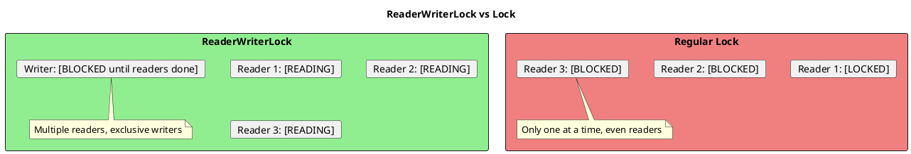
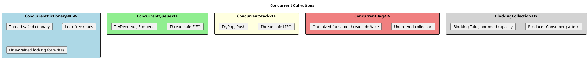

# Thread Safety and Synchronization

## Understanding Race Conditions

A race condition occurs when multiple threads access shared data and at least one modifies it, with the result depending on timing.

```plantuml
@startuml
skinparam monochrome false

title Race Condition Example: count++

rectangle "count++ is NOT atomic!" #LightCoral {
  card "Step 1: Read count (0)"
  card "Step 2: Add 1 (0+1=1)"
  card "Step 3: Write count (1)"
}

|Thread 1|
:Read count = 0;
:Add 1 = 1;

|Thread 2|
:Read count = 0;
note right: Still 0! Thread 1 hasn't written yet
:Add 1 = 1;

|Thread 1|
:Write count = 1;

|Thread 2|
:Write count = 1;
note right: Overwrites Thread 1's write!

note bottom
  Expected: count = 2
  Actual: count = 1
  Lost update!
end note
@enduml
```

```csharp
// ═══════════════════════════════════════════════════════
// THE PROBLEM
// ═══════════════════════════════════════════════════════

private int _count = 0;

// This is NOT thread-safe!
public void Increment()
{
    _count++;  // Read-Modify-Write: 3 operations, not atomic
}

// Running from multiple threads
Parallel.For(0, 1000, _ => Increment());
Console.WriteLine(_count);  // Less than 1000!

// ═══════════════════════════════════════════════════════
// WHY IT HAPPENS
// ═══════════════════════════════════════════════════════

// _count++ compiles to:
// 1. temp = _count     (read)
// 2. temp = temp + 1   (modify)
// 3. _count = temp     (write)

// Between steps, another thread can read the old value
```

## Interlocked Operations

For simple operations, `Interlocked` provides lock-free thread safety.

```csharp
// ═══════════════════════════════════════════════════════
// BASIC INTERLOCKED OPERATIONS
// ═══════════════════════════════════════════════════════

private int _count = 0;
private long _total = 0;

// Atomic increment
Interlocked.Increment(ref _count);       // Returns new value
Interlocked.Decrement(ref _count);       // Returns new value

// Atomic add
Interlocked.Add(ref _count, 5);          // Add 5 atomically
Interlocked.Add(ref _total, 100L);       // For long

// Atomic exchange (set and get old value)
int oldValue = Interlocked.Exchange(ref _count, 10);

// Compare and exchange (CAS - the foundation of lock-free)
int expected = 5;
int newValue = 10;
int original = Interlocked.CompareExchange(ref _count, newValue, expected);
// If _count == 5, set to 10 and return 5
// If _count != 5, return current value, don't change

// ═══════════════════════════════════════════════════════
// PATTERNS WITH INTERLOCKED
// ═══════════════════════════════════════════════════════

// Thread-safe counter
public class Counter
{
    private int _value;

    public int Value => Volatile.Read(ref _value);

    public int Increment() => Interlocked.Increment(ref _value);
    public int Decrement() => Interlocked.Decrement(ref _value);
    public int Add(int amount) => Interlocked.Add(ref _value, amount);
}

// Thread-safe lazy initialization
private object? _instance;

public object GetInstance()
{
    if (_instance != null) return _instance;

    var newInstance = CreateInstance();
    Interlocked.CompareExchange(ref _instance, newInstance, null);
    return _instance;  // Return whatever won
}

// Spin-wait pattern for custom atomic operations
public void AtomicUpdate(Func<int, int> transform)
{
    SpinWait spin = default;
    while (true)
    {
        int current = _count;
        int newValue = transform(current);
        if (Interlocked.CompareExchange(ref _count, newValue, current) == current)
            return;
        spin.SpinOnce();  // Backoff
    }
}
```

## Lock (Monitor)

For protecting complex operations or multiple variables.

```plantuml
@startuml
skinparam monochrome false

title Lock Behavior

|Thread 1|
:Acquire lock;
:Execute critical section;
:Release lock;

|Thread 2|
:Try to acquire lock;
#LightCoral:BLOCKED (waiting);
:Lock acquired;
:Execute critical section;
:Release lock;

note bottom
  Only one thread can hold the lock
  Others block until it's released
end note
@enduml
```

```csharp
// ═══════════════════════════════════════════════════════
// BASIC LOCK USAGE
// ═══════════════════════════════════════════════════════

private readonly object _lock = new();
private List<string> _items = new();

public void AddItem(string item)
{
    lock (_lock)
    {
        _items.Add(item);
    }
}

public int Count
{
    get
    {
        lock (_lock)
        {
            return _items.Count;
        }
    }
}

// ═══════════════════════════════════════════════════════
// LOCK OBJECT BEST PRACTICES
// ═══════════════════════════════════════════════════════

// GOOD: Private, dedicated lock object
private readonly object _stateLock = new();

// BAD: Locking on 'this'
lock (this)  // External code could lock on same object!
{
}

// BAD: Locking on Type
lock (typeof(MyClass))  // Global, could conflict with other code
{
}

// BAD: Locking on string
lock ("my lock")  // Strings are interned - same reference!
{
}

// ═══════════════════════════════════════════════════════
// MONITOR CLASS (What lock compiles to)
// ═══════════════════════════════════════════════════════

// lock is syntactic sugar for:
bool lockTaken = false;
try
{
    Monitor.Enter(_lock, ref lockTaken);
    // Critical section
}
finally
{
    if (lockTaken)
        Monitor.Exit(_lock);
}

// TryEnter with timeout
if (Monitor.TryEnter(_lock, TimeSpan.FromSeconds(5)))
{
    try
    {
        // Critical section
    }
    finally
    {
        Monitor.Exit(_lock);
    }
}
else
{
    // Couldn't acquire lock in time
}

// Pulse/Wait for producer-consumer
Monitor.Wait(_lock);     // Release lock and wait for Pulse
Monitor.Pulse(_lock);    // Wake one waiting thread
Monitor.PulseAll(_lock); // Wake all waiting threads
```

## ReaderWriterLockSlim

For scenarios with many reads and few writes.



```csharp
// ═══════════════════════════════════════════════════════
// BASIC USAGE
// ═══════════════════════════════════════════════════════

private readonly ReaderWriterLockSlim _rwLock = new();
private Dictionary<int, string> _cache = new();

public string? Read(int key)
{
    _rwLock.EnterReadLock();
    try
    {
        return _cache.TryGetValue(key, out var value) ? value : null;
    }
    finally
    {
        _rwLock.ExitReadLock();
    }
}

public void Write(int key, string value)
{
    _rwLock.EnterWriteLock();
    try
    {
        _cache[key] = value;
    }
    finally
    {
        _rwLock.ExitWriteLock();
    }
}

// ═══════════════════════════════════════════════════════
// UPGRADEABLE LOCK (Read, then maybe Write)
// ═══════════════════════════════════════════════════════

public void AddIfNotExists(int key, string value)
{
    _rwLock.EnterUpgradeableReadLock();
    try
    {
        if (!_cache.ContainsKey(key))
        {
            _rwLock.EnterWriteLock();
            try
            {
                _cache[key] = value;
            }
            finally
            {
                _rwLock.ExitWriteLock();
            }
        }
    }
    finally
    {
        _rwLock.ExitUpgradeableReadLock();
    }
}

// ═══════════════════════════════════════════════════════
// WITH TIMEOUT
// ═══════════════════════════════════════════════════════

if (_rwLock.TryEnterReadLock(TimeSpan.FromSeconds(5)))
{
    try
    {
        return _cache[key];
    }
    finally
    {
        _rwLock.ExitReadLock();
    }
}

throw new TimeoutException("Couldn't acquire read lock");

// ═══════════════════════════════════════════════════════
// IMPORTANT: Dispose the lock
// ═══════════════════════════════════════════════════════

public class CacheService : IDisposable
{
    private readonly ReaderWriterLockSlim _rwLock = new();

    public void Dispose()
    {
        _rwLock.Dispose();
    }
}
```

## SemaphoreSlim

For limiting concurrent access to a resource.

```csharp
// ═══════════════════════════════════════════════════════
// LIMITING CONCURRENT OPERATIONS
// ═══════════════════════════════════════════════════════

private readonly SemaphoreSlim _semaphore = new(
    initialCount: 3,   // Allow 3 concurrent operations
    maxCount: 3        // Max count
);

public async Task ProcessAsync(Item item)
{
    await _semaphore.WaitAsync();  // Async wait
    try
    {
        await DoWorkAsync(item);
    }
    finally
    {
        _semaphore.Release();
    }
}

// ═══════════════════════════════════════════════════════
// THROTTLING API CALLS
// ═══════════════════════════════════════════════════════

public class ThrottledApiClient
{
    private readonly SemaphoreSlim _throttle = new(10);  // Max 10 concurrent
    private readonly HttpClient _client;

    public async Task<string> GetAsync(string url, CancellationToken ct = default)
    {
        await _throttle.WaitAsync(ct);
        try
        {
            return await _client.GetStringAsync(url, ct);
        }
        finally
        {
            _throttle.Release();
        }
    }
}

// ═══════════════════════════════════════════════════════
// AS ASYNC LOCK (Initial count = 1)
// ═══════════════════════════════════════════════════════

private readonly SemaphoreSlim _asyncLock = new(1, 1);

public async Task CriticalSectionAsync()
{
    await _asyncLock.WaitAsync();
    try
    {
        // Only one at a time
        await DoWorkAsync();
    }
    finally
    {
        _asyncLock.Release();
    }
}

// ═══════════════════════════════════════════════════════
// WITH TIMEOUT
// ═══════════════════════════════════════════════════════

if (await _semaphore.WaitAsync(TimeSpan.FromSeconds(5)))
{
    try
    {
        await DoWorkAsync();
    }
    finally
    {
        _semaphore.Release();
    }
}
else
{
    throw new TimeoutException();
}
```

## Concurrent Collections

Thread-safe collections from `System.Collections.Concurrent`.



```csharp
// ═══════════════════════════════════════════════════════
// CONCURRENTDICTIONARY
// ═══════════════════════════════════════════════════════

var cache = new ConcurrentDictionary<int, User>();

// Thread-safe operations
cache[1] = user;                           // Set
var user = cache[1];                        // Get (throws if missing)
bool exists = cache.TryGetValue(1, out var u);
bool added = cache.TryAdd(1, user);         // Returns false if exists
bool removed = cache.TryRemove(1, out var removed);

// Atomic GetOrAdd
var user = cache.GetOrAdd(1, key => LoadUser(key));

// Atomic GetOrAdd with async factory (careful!)
// Factory may be called multiple times - use Lazy<T>
var cache = new ConcurrentDictionary<int, Lazy<Task<User>>>();
var lazy = cache.GetOrAdd(id, key => new Lazy<Task<User>>(() => LoadUserAsync(key)));
var user = await lazy.Value;

// AddOrUpdate
cache.AddOrUpdate(
    key: 1,
    addValue: newUser,
    updateValueFactory: (key, existing) => UpdateUser(existing)
);

// ═══════════════════════════════════════════════════════
// CONCURRENTQUEUE
// ═══════════════════════════════════════════════════════

var queue = new ConcurrentQueue<WorkItem>();

// Producer
queue.Enqueue(workItem);

// Consumer
if (queue.TryDequeue(out var item))
{
    Process(item);
}

// Check without removing
if (queue.TryPeek(out var next))
{
    Console.WriteLine($"Next: {next}");
}

// ═══════════════════════════════════════════════════════
// BLOCKINGCOLLECTION (Producer-Consumer)
// ═══════════════════════════════════════════════════════

var collection = new BlockingCollection<WorkItem>(boundedCapacity: 100);

// Producer
Task.Run(() =>
{
    foreach (var item in source)
    {
        collection.Add(item);  // Blocks if at capacity
    }
    collection.CompleteAdding();
});

// Consumer
Task.Run(() =>
{
    foreach (var item in collection.GetConsumingEnumerable())
    {
        Process(item);  // Blocks if empty
    }
});

// With timeout
if (collection.TryTake(out var item, TimeSpan.FromSeconds(5)))
{
    Process(item);
}

// ═══════════════════════════════════════════════════════
// CHANNEL (Modern alternative to BlockingCollection)
// ═══════════════════════════════════════════════════════

var channel = Channel.CreateBounded<WorkItem>(100);

// Producer
await channel.Writer.WriteAsync(item);
channel.Writer.Complete();

// Consumer
await foreach (var item in channel.Reader.ReadAllAsync())
{
    await ProcessAsync(item);
}
```

## Immutability for Thread Safety

```csharp
// ═══════════════════════════════════════════════════════
// IMMUTABLE OBJECTS ARE INHERENTLY THREAD-SAFE
// ═══════════════════════════════════════════════════════

// Immutable record
public record User(int Id, string Name, string Email);

// No synchronization needed
var user = new User(1, "John", "john@example.com");
// user cannot be modified, only replaced

// ═══════════════════════════════════════════════════════
// IMMUTABLE COLLECTIONS
// ═══════════════════════════════════════════════════════

using System.Collections.Immutable;

// ImmutableList
var list = ImmutableList<int>.Empty;
list = list.Add(1);  // Returns new list, original unchanged

// ImmutableDictionary
var dict = ImmutableDictionary<int, string>.Empty;
dict = dict.Add(1, "one");

// ImmutableArray (stack-allocated, fast)
var array = ImmutableArray.Create(1, 2, 3);

// ═══════════════════════════════════════════════════════
// PATTERN: Replace reference atomically
// ═══════════════════════════════════════════════════════

private ImmutableList<User> _users = ImmutableList<User>.Empty;

public void AddUser(User user)
{
    // Replace with Interlocked for thread safety
    ImmutableList<User> original, updated;
    do
    {
        original = _users;
        updated = original.Add(user);
    }
    while (Interlocked.CompareExchange(ref _users, updated, original) != original);
}

// Or using ImmutableInterlocked helper
public void AddUserSimpler(User user)
{
    ImmutableInterlocked.Update(ref _users, list => list.Add(user));
}
```

## Common Thread Safety Patterns

```csharp
// ═══════════════════════════════════════════════════════
// DOUBLE-CHECKED LOCKING (for lazy initialization)
// ═══════════════════════════════════════════════════════

private volatile object? _instance;
private readonly object _lock = new();

public object Instance
{
    get
    {
        if (_instance == null)  // First check (no lock)
        {
            lock (_lock)
            {
                if (_instance == null)  // Second check (with lock)
                {
                    _instance = CreateInstance();
                }
            }
        }
        return _instance;
    }
}

// BETTER: Use Lazy<T>
private readonly Lazy<ExpensiveObject> _lazy =
    new(() => new ExpensiveObject(), LazyThreadSafetyMode.ExecutionAndPublication);

public ExpensiveObject Instance => _lazy.Value;

// ═══════════════════════════════════════════════════════
// THREAD-SAFE EVENT INVOCATION
// ═══════════════════════════════════════════════════════

public event EventHandler? DataReceived;

protected void OnDataReceived(EventArgs e)
{
    // Copy reference to avoid race condition
    var handler = DataReceived;  // or Volatile.Read(ref DataReceived)
    handler?.Invoke(this, e);
}

// ═══════════════════════════════════════════════════════
// COPY-ON-WRITE PATTERN
// ═══════════════════════════════════════════════════════

private volatile List<string> _items = new();
private readonly object _writeLock = new();

public IReadOnlyList<string> Items => _items;

public void AddItem(string item)
{
    lock (_writeLock)
    {
        var newList = new List<string>(_items) { item };
        _items = newList;  // Atomic reference assignment
    }
}

// Readers don't need locks - they see a consistent snapshot
```

## Volatile and Memory Barriers

```csharp
// ═══════════════════════════════════════════════════════
// VOLATILE KEYWORD
// ═══════════════════════════════════════════════════════

// Without volatile, compiler/CPU can optimize:
// - Cache value in register
// - Reorder reads/writes

private volatile bool _stopping;  // Prevents some optimizations

public void Stop()
{
    _stopping = true;  // Other threads will see this change
}

public void Run()
{
    while (!_stopping)  // Will actually read from memory
    {
        DoWork();
    }
}

// ═══════════════════════════════════════════════════════
// VOLATILE CLASS METHODS
// ═══════════════════════════════════════════════════════

private int _value;

// Read with acquire fence (subsequent reads won't be reordered before this)
int val = Volatile.Read(ref _value);

// Write with release fence (previous writes won't be reordered after this)
Volatile.Write(ref _value, 42);

// ═══════════════════════════════════════════════════════
// WHEN TO USE VOLATILE
// ═══════════════════════════════════════════════════════

// Use for:
// - Simple flags that signal state between threads
// - When you don't need atomicity (just visibility)

// Don't use for:
// - Complex operations (use locks or Interlocked)
// - Compound operations (read-modify-write)

// volatile does NOT make ++ atomic!
private volatile int _count;
_count++;  // Still a race condition!
```

## Senior Interview Questions

**Q: What's the difference between lock and Interlocked?**

- `lock`: Mutual exclusion, can protect any code block, has overhead
- `Interlocked`: Atomic operations on single variables, lock-free, lower overhead

Use `Interlocked` for simple counters/flags, `lock` for complex operations.

**Q: Why shouldn't you lock on `this` or Type objects?**

1. External code could lock on the same object, causing deadlocks
2. Reduces encapsulation
3. Type objects are shared across AppDomains

Always use a private, dedicated lock object.

**Q: What is a race condition?**

When the result depends on timing/order of thread execution. Happens when multiple threads access shared data without proper synchronization, and at least one modifies it.

**Q: When would you use ReaderWriterLockSlim vs lock?**

`ReaderWriterLockSlim` when:
- Many more reads than writes
- Read operations are relatively long
- Allowing concurrent readers improves performance

`lock` when:
- Operations are short
- Read/write ratio is similar
- Simpler code is preferred

**Q: What makes ConcurrentDictionary thread-safe?**

- Uses fine-grained locking (locks on hash buckets, not entire dictionary)
- Some operations are lock-free (reads)
- Atomic compound operations (GetOrAdd, AddOrUpdate)

**Q: Explain double-checked locking and why Lazy<T> is preferred.**

Double-checked locking:
1. Check without lock (fast path)
2. If needed, lock and check again
3. Initialize if still needed

Problems: Can be tricky to implement correctly (memory barriers). Lazy<T> handles all the complexity correctly and is more readable.
