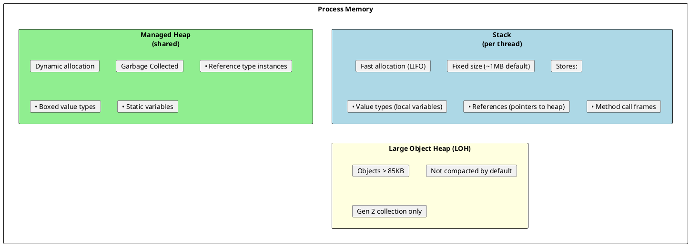
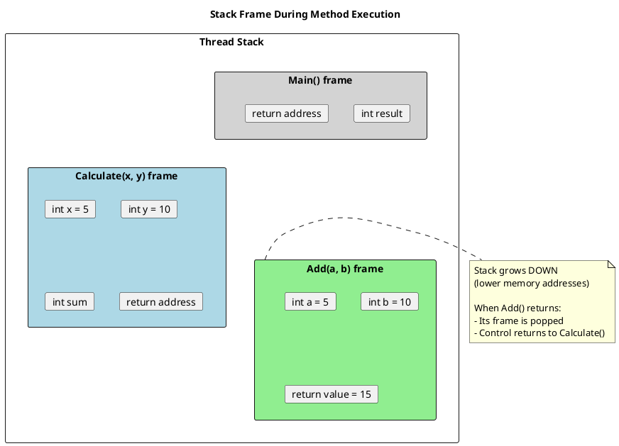
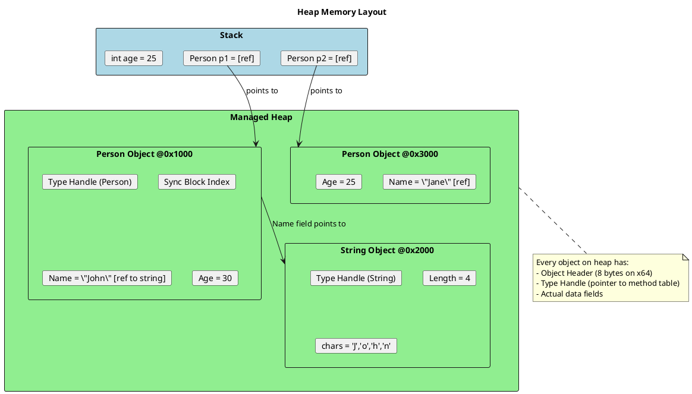
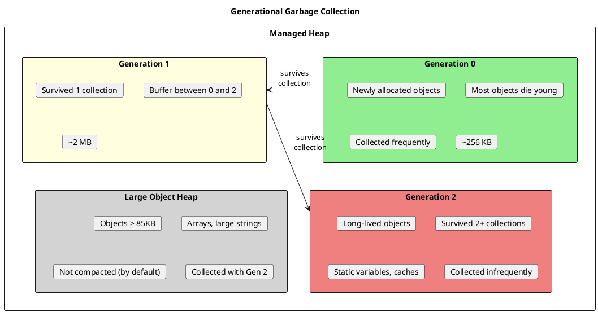
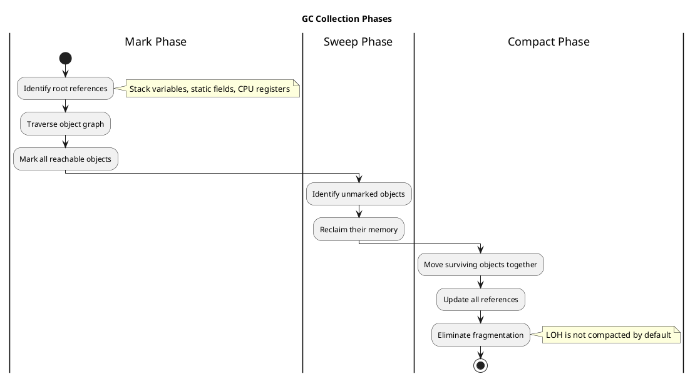
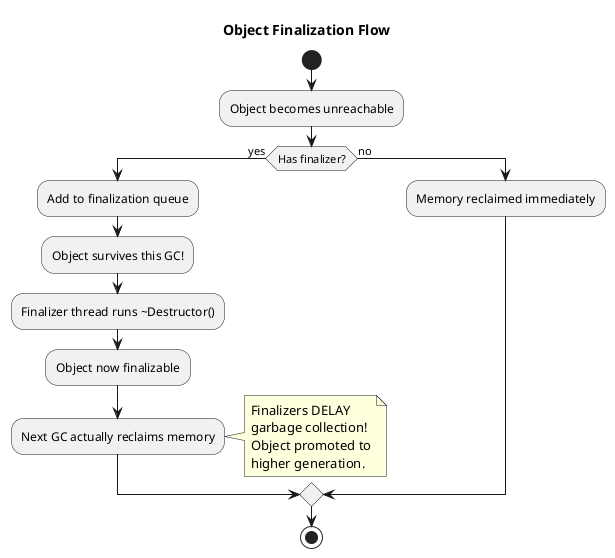

# Memory Management in .NET - Stack, Heap & GC

## Overview: Where Does Memory Live?

.NET manages two primary memory regions: the **Stack** and the **Heap**. Understanding this is fundamental to writing performant code.



## Stack Deep Dive

The stack is a LIFO (Last In, First Out) data structure used for method execution.



### Stack Characteristics

```csharp
void StackExample()
{
    int x = 10;        // Allocated on stack
    int y = 20;        // Allocated on stack
    int result = Add(x, y);  // New stack frame created

    // When method ends, entire frame is "popped" - instant cleanup!
}

int Add(int a, int b)  // Parameters copied to new stack frame
{
    int sum = a + b;   // Local variable on stack
    return sum;        // Value returned, frame will be popped
}
```

**Key Points:**
- Stack allocation is extremely fast (just move stack pointer)
- No garbage collection needed - automatic cleanup when frame pops
- Size is limited (~1MB per thread by default)
- `StackOverflowException` if you exceed it (deep recursion)

## Heap Deep Dive

The heap is where reference type instances live.



### Object Layout on Heap

```csharp
public class Person
{
    public string Name;  // 8 bytes (reference)
    public int Age;      // 4 bytes
    public bool IsActive; // 1 byte (padded to 4 or 8)
}

// Actual memory layout (x64):
// [Object Header]     8 bytes  - Sync block, hash code
// [Type Handle]       8 bytes  - Pointer to method table
// [Name reference]    8 bytes  - Pointer to string object
// [Age]               4 bytes  - Actual int value
// [IsActive + padding] 4 bytes - Bool + alignment padding
// Total: 32 bytes minimum (plus the string object!)
```

## Generational Garbage Collection

The GC divides the heap into generations for efficiency.



### GC Collection Process



### GC Modes

```csharp
// Check current GC mode
bool isServerGC = GCSettings.IsServerGC;

// Workstation GC (default for desktop apps)
// - Single GC thread
// - Lower latency, lower throughput

// Server GC (default for ASP.NET)
// - One GC thread per CPU core
// - Higher throughput, higher latency spikes

// Configure in csproj:
// <ServerGarbageCollection>true</ServerGarbageCollection>
```

## Memory Pressure and Performance

### Allocation Patterns to Avoid

```csharp
// BAD: Creates many temporary objects
public string BuildMessage(string[] parts)
{
    string result = "";
    foreach (var part in parts)
    {
        result += part + ", ";  // Each += creates new string!
    }
    return result;
}

// GOOD: Single allocation
public string BuildMessage(string[] parts)
{
    return string.Join(", ", parts);
}

// BETTER: For complex scenarios
public string BuildMessageOptimized(string[] parts)
{
    var sb = new StringBuilder(parts.Length * 10); // Pre-size
    foreach (var part in parts)
    {
        if (sb.Length > 0) sb.Append(", ");
        sb.Append(part);
    }
    return sb.ToString();
}
```

### Span<T> and Stack Allocation

```csharp
// Traditional: Allocates on heap
byte[] buffer = new byte[256];

// Modern: Allocates on STACK (no GC pressure!)
Span<byte> stackBuffer = stackalloc byte[256];

// Use case: Parsing without allocations
public static bool TryParseCoordinate(ReadOnlySpan<char> input,
    out int x, out int y)
{
    var comma = input.IndexOf(',');
    if (comma < 0) { x = y = 0; return false; }

    return int.TryParse(input[..comma], out x) &&
           int.TryParse(input[(comma + 1)..], out y);
}

// Zero allocations!
ReadOnlySpan<char> coord = "100,200";
TryParseCoordinate(coord, out var x, out var y);
```

### ArrayPool for Reusable Buffers

```csharp
// BAD: Allocates new array every time
byte[] buffer = new byte[4096];
// ... use buffer
// buffer becomes garbage

// GOOD: Rent from pool
byte[] buffer = ArrayPool<byte>.Shared.Rent(4096);
try
{
    // ... use buffer (may be larger than requested!)
}
finally
{
    ArrayPool<byte>.Shared.Return(buffer);
}
```

## Measuring Memory

```csharp
// Get current memory usage
long beforeBytes = GC.GetTotalMemory(forceFullCollection: false);

// ... do work ...

long afterBytes = GC.GetTotalMemory(forceFullCollection: true);
Console.WriteLine($"Allocated: {afterBytes - beforeBytes:N0} bytes");

// GC statistics
var info = GC.GetGCMemoryInfo();
Console.WriteLine($"Heap size: {info.HeapSizeBytes:N0}");
Console.WriteLine($"Gen 0 collections: {GC.CollectionCount(0)}");
Console.WriteLine($"Gen 1 collections: {GC.CollectionCount(1)}");
Console.WriteLine($"Gen 2 collections: {GC.CollectionCount(2)}");
```

## Finalizers and IDisposable



### The Dispose Pattern

```csharp
public class ResourceHandler : IDisposable
{
    private IntPtr _unmanagedResource;  // Native handle
    private Stream _managedResource;     // Managed object
    private bool _disposed = false;

    public void Dispose()
    {
        Dispose(disposing: true);
        GC.SuppressFinalize(this);  // Prevent finalizer from running
    }

    protected virtual void Dispose(bool disposing)
    {
        if (_disposed) return;

        if (disposing)
        {
            // Dispose managed resources
            _managedResource?.Dispose();
        }

        // Always clean up unmanaged resources
        if (_unmanagedResource != IntPtr.Zero)
        {
            CloseHandle(_unmanagedResource);
            _unmanagedResource = IntPtr.Zero;
        }

        _disposed = true;
    }

    ~ResourceHandler()  // Finalizer - safety net
    {
        Dispose(disposing: false);
    }
}
```

## Senior Interview Questions

**Q: What triggers a garbage collection?**

1. Gen 0 threshold reached (~256KB allocated)
2. `GC.Collect()` called explicitly
3. System low memory notification
4. Application unload

**Q: Why is Gen 2 collection expensive?**

- Must scan entire heap (all generations)
- Suspends all managed threads (Stop-the-World)
- Often triggers LOH collection too
- LOH compaction even more expensive

**Q: How do you reduce GC pressure?**

1. Use `struct` for small, short-lived types
2. Use `Span<T>` and `stackalloc` for temp buffers
3. Pool objects with `ArrayPool<T>` or `ObjectPool<T>`
4. Avoid boxing (use generic collections)
5. Reuse objects instead of creating new ones
6. Use `StringBuilder` for string concatenation
