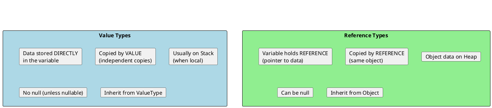
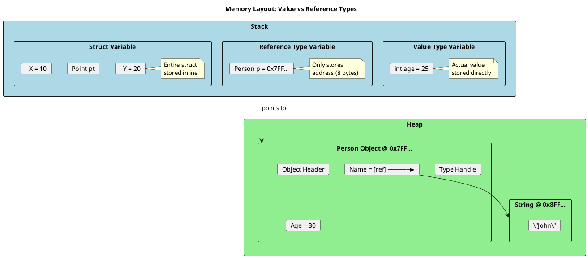
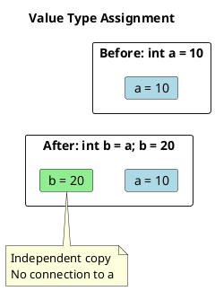
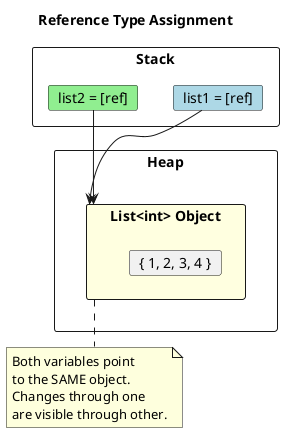
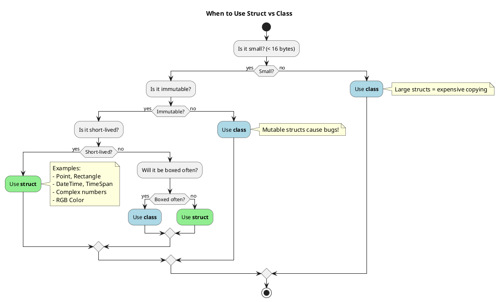
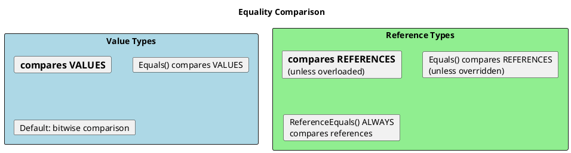
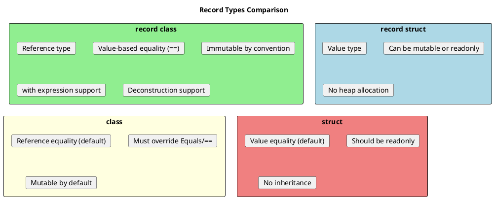

# Value Types vs Reference Types - The Complete Picture

## The Fundamental Difference

This is one of the most important concepts in C#. Every interview will test this.



## Visual Memory Layout



## The Assignment Behavior

This is where bugs often hide:

```csharp
// ═══════════════════════════════════════════════════════
// VALUE TYPE: Assignment creates INDEPENDENT COPY
// ═══════════════════════════════════════════════════════
int a = 10;
int b = a;      // b gets a COPY of the value
b = 20;         // Modifying b does NOT affect a

Console.WriteLine(a);  // 10 (unchanged)
Console.WriteLine(b);  // 20

// ═══════════════════════════════════════════════════════
// REFERENCE TYPE: Assignment copies the REFERENCE
// ═══════════════════════════════════════════════════════
var list1 = new List<int> { 1, 2, 3 };
var list2 = list1;  // list2 points to SAME object
list2.Add(4);       // Modifying through list2...

Console.WriteLine(list1.Count);  // 4 (affected!)
Console.WriteLine(list2.Count);  // 4

// Both variables point to the same object
Console.WriteLine(ReferenceEquals(list1, list2));  // True
```





## Struct vs Class - The Senior Developer's Choice

When do you choose struct over class?



### Struct Guidelines (Official Microsoft)

```csharp
// GOOD STRUCT: Small, immutable, logically represents single value
public readonly struct Point
{
    public int X { get; }
    public int Y { get; }

    public Point(int x, int y) => (X, Y) = (x, y);

    // Value equality (override for structs!)
    public override bool Equals(object? obj) =>
        obj is Point p && X == p.X && Y == p.Y;

    public override int GetHashCode() => HashCode.Combine(X, Y);
}

// BAD STRUCT: Too large, will be expensive to copy
public struct BadLargeStruct  // DON'T DO THIS
{
    public byte[] Data;  // Reference in struct
    public decimal Value1, Value2, Value3, Value4;  // 64 bytes just here!
    public string Name;
    // Total: Way more than 16 bytes
}

// BAD STRUCT: Mutable causes unexpected behavior
public struct MutablePoint  // DANGEROUS
{
    public int X;
    public int Y;

    public void Move(int dx, int dy)
    {
        X += dx;
        Y += dy;
    }
}
```

### The Mutable Struct Trap

```csharp
public struct MutablePoint
{
    public int X, Y;
    public void MoveRight() => X++;
}

// THE BUG
var points = new List<MutablePoint>
{
    new MutablePoint { X = 0, Y = 0 }
};

// This does NOT modify the point in the list!
points[0].MoveRight();  // Operates on a COPY!

Console.WriteLine(points[0].X);  // Still 0! 😱

// Why? points[0] returns a COPY of the struct.
// MoveRight() modifies the copy, then copy is discarded.

// Fix: Use readonly struct + return new instance
public readonly struct ImmutablePoint
{
    public int X { get; }
    public int Y { get; }

    public ImmutablePoint(int x, int y) => (X, Y) = (x, y);

    public ImmutablePoint MoveRight() => new(X + 1, Y);
}
```

## Equality: The Critical Difference



```csharp
// VALUE TYPE EQUALITY
int x = 5;
int y = 5;
Console.WriteLine(x == y);       // True (value comparison)
Console.WriteLine(x.Equals(y));  // True (value comparison)

// REFERENCE TYPE EQUALITY (class)
var p1 = new Person { Name = "John" };
var p2 = new Person { Name = "John" };

Console.WriteLine(p1 == p2);              // False! (different objects)
Console.WriteLine(p1.Equals(p2));         // False! (default behavior)
Console.WriteLine(ReferenceEquals(p1, p2)); // False

// After overriding Equals and ==:
public class Person
{
    public string Name { get; set; }

    public override bool Equals(object? obj) =>
        obj is Person p && Name == p.Name;

    public override int GetHashCode() => Name?.GetHashCode() ?? 0;

    public static bool operator ==(Person? a, Person? b) =>
        a?.Equals(b) ?? b is null;

    public static bool operator !=(Person? a, Person? b) => !(a == b);
}

// Now:
Console.WriteLine(p1 == p2);      // True
Console.WriteLine(p1.Equals(p2)); // True

// STRING is special - already overloads ==
string s1 = "hello";
string s2 = "hello";
Console.WriteLine(s1 == s2);              // True (content comparison)
Console.WriteLine(ReferenceEquals(s1, s2)); // True (string interning!)
```

## Record Types: Best of Both Worlds

C# 9 introduced `record` - reference type with value semantics:

```csharp
// Record class (reference type with value semantics)
public record Person(string Name, int Age);

var p1 = new Person("John", 30);
var p2 = new Person("John", 30);

Console.WriteLine(p1 == p2);               // True! (value equality)
Console.WriteLine(ReferenceEquals(p1, p2)); // False (different objects)

// Non-destructive mutation
var p3 = p1 with { Age = 31 };

// Record struct (C# 10) - true value type with generated equality
public record struct Point(int X, int Y);
```



## Performance Implications

```csharp
// Benchmark: Creating 1 million objects

// CLASS: ~50ms, causes GC pressure
var classObjects = new Person[1_000_000];
for (int i = 0; i < 1_000_000; i++)
    classObjects[i] = new Person { Name = "Test", Age = i };

// STRUCT: ~10ms, no GC (if local)
var structObjects = new PersonStruct[1_000_000];  // Single allocation!
for (int i = 0; i < 1_000_000; i++)
    structObjects[i] = new PersonStruct { Name = "Test", Age = i };

// Note: PersonStruct.Name is a reference, so strings still allocated
```

## The `in`, `ref`, and `out` Keywords with Structs

```csharp
public readonly struct LargeStruct
{
    public readonly double A, B, C, D, E, F, G, H;  // 64 bytes

    public LargeStruct(double value) =>
        (A, B, C, D, E, F, G, H) = (value, value, value, value, value, value, value, value);
}

// BAD: Copies 64 bytes on every call
void ProcessByValue(LargeStruct s) { }

// GOOD: Passes by reference (8 bytes), readonly prevents modification
void ProcessByRef(in LargeStruct s)
{
    Console.WriteLine(s.A);
    // s.A = 10;  // Error! 'in' means readonly
}

// Usage
var large = new LargeStruct(42);
ProcessByRef(in large);  // 'in' is optional at call site but recommended
```

## Senior Interview Questions

**Q: Can a struct contain a reference type field?**

Yes, but be careful:

```csharp
public struct Container
{
    public List<int> Items;  // Reference to heap object

    public Container(int capacity)
    {
        Items = new List<int>(capacity);
    }
}

var c1 = new Container(10);
var c2 = c1;  // Struct copied, but Items points to SAME list!

c2.Items.Add(42);
Console.WriteLine(c1.Items.Count);  // 1 - c1 affected!
```

**Q: What's the default value of a struct vs class variable?**

```csharp
Person classVar;     // null (reference type)
Point structVar;     // Point with all fields at default (0, 0)

// In older C#, classVar would compile without assignment
// In newer C# with nullable enabled, you get a warning
```

**Q: Why does `DateTime.Now` not need `new`?**

Because `DateTime.Now` is a static property that returns a new `DateTime` struct:

```csharp
public struct DateTime
{
    public static DateTime Now => new DateTime(/* current ticks */);
}
```

**Q: What's the difference between `null` and `default` for reference types?**

They're the same for reference types, but `default` is more generic:

```csharp
string s1 = null;      // Only works for reference types
string s2 = default;   // Works for both, null for reference types

int i1 = default;      // 0 (value type default)
// int i2 = null;      // Error! Value types can't be null
int? i3 = null;        // OK - Nullable<int>
```
