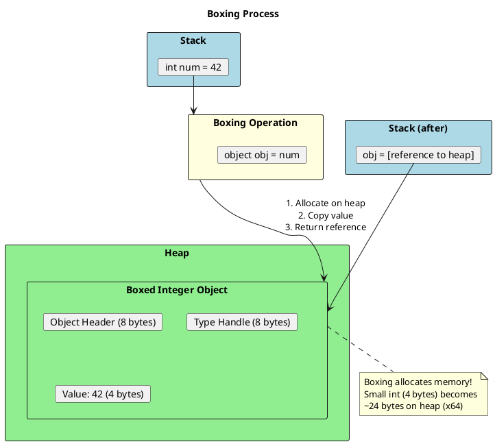
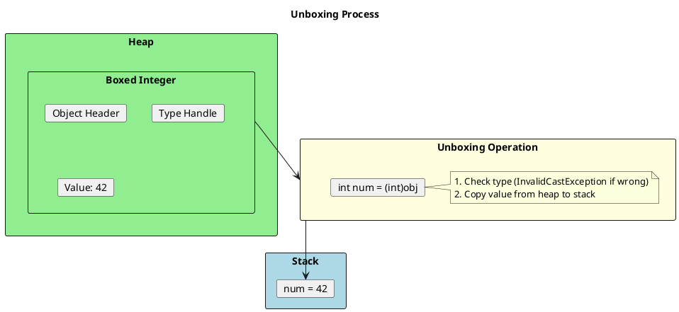
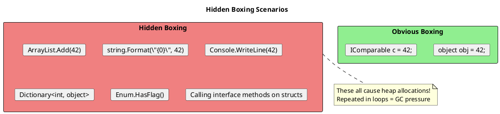
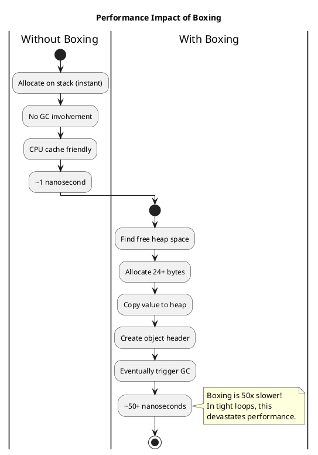

# Boxing and Unboxing - The Hidden Performance Killer

## What Is Boxing?

Boxing is the process of converting a value type to a reference type (object or interface). This is one of the most common sources of hidden allocations and performance problems.



## What Is Unboxing?

Unboxing is the reverse: extracting the value type from a boxed object.



## Code Examples

```csharp
// ═══════════════════════════════════════════════════════
// EXPLICIT BOXING
// ═══════════════════════════════════════════════════════
int number = 42;
object boxed = number;  // Boxing occurs here

// ═══════════════════════════════════════════════════════
// EXPLICIT UNBOXING
// ═══════════════════════════════════════════════════════
int unboxed = (int)boxed;  // Unboxing occurs here

// ═══════════════════════════════════════════════════════
// WRONG TYPE = EXCEPTION
// ═══════════════════════════════════════════════════════
// long wrong = (long)boxed;  // InvalidCastException!
// Must unbox to EXACT type first:
long correct = (int)boxed;   // Unbox to int, then implicit conversion

// ═══════════════════════════════════════════════════════
// INTERFACE BOXING
// ═══════════════════════════════════════════════════════
int value = 10;
IComparable comparable = value;  // Boxing! int implements IComparable
```

## Hidden Boxing - Where Bugs Hide

This is what separates senior developers from juniors: spotting hidden boxing.



### Hidden Boxing Examples

```csharp
// ═══════════════════════════════════════════════════════
// 1. NON-GENERIC COLLECTIONS (Legacy)
// ═══════════════════════════════════════════════════════
ArrayList list = new ArrayList();
list.Add(42);      // Boxing!
list.Add(100);     // Boxing!
int first = (int)list[0];  // Unboxing!

// FIX: Use generic collections
List<int> genericList = new List<int>();
genericList.Add(42);  // No boxing!

// ═══════════════════════════════════════════════════════
// 2. STRING FORMATTING
// ═══════════════════════════════════════════════════════
int count = 42;
string bad = string.Format("Count: {0}", count);  // Boxing!
string bad2 = $"Count: {count}";  // Also boxing in older C#!

// FIX: Use ToString() or modern interpolation
string good = $"Count: {count.ToString()}";  // No boxing
string good2 = string.Concat("Count: ", count.ToString());

// Note: C# 10+ with interpolated string handlers may avoid boxing

// ═══════════════════════════════════════════════════════
// 3. CONSOLE.WRITELINE
// ═══════════════════════════════════════════════════════
Console.WriteLine(42);  // Boxing! (params object[])

// FIX:
Console.WriteLine(42.ToString());  // No boxing

// ═══════════════════════════════════════════════════════
// 4. ENUM.HASFLAG (Before .NET Core 2.1)
// ═══════════════════════════════════════════════════════
[Flags]
enum Permissions { None = 0, Read = 1, Write = 2 }

var perms = Permissions.Read | Permissions.Write;
bool canRead = perms.HasFlag(Permissions.Read);  // Boxing in old .NET!

// FIX (or use .NET Core 2.1+):
bool canReadFixed = (perms & Permissions.Read) == Permissions.Read;

// ═══════════════════════════════════════════════════════
// 5. CALLING INTERFACE METHODS ON STRUCTS
// ═══════════════════════════════════════════════════════
public struct MyStruct : IComparable<MyStruct>
{
    public int Value;
    public int CompareTo(MyStruct other) => Value.CompareTo(other.Value);
}

MyStruct s1 = new MyStruct { Value = 10 };
MyStruct s2 = new MyStruct { Value = 20 };

// No boxing - generic constraint
int Compare<T>(T a, T b) where T : IComparable<T> => a.CompareTo(b);
Compare(s1, s2);  // No boxing!

// Boxing - non-generic interface
int CompareBoxing(IComparable a, IComparable b) => a.CompareTo(b);
CompareBoxing(s1, s2);  // Boxing both structs!

// ═══════════════════════════════════════════════════════
// 6. DICTIONARY WITH VALUE TYPE KEYS (GetHashCode)
// ═══════════════════════════════════════════════════════
// If struct doesn't override GetHashCode, boxing occurs!
var dict = new Dictionary<MyStruct, string>();  // Potential boxing

// FIX: Always override GetHashCode and Equals in structs
public readonly struct MyStructFixed : IEquatable<MyStructFixed>
{
    public int Value { get; }
    public bool Equals(MyStructFixed other) => Value == other.Value;
    public override bool Equals(object? obj) => obj is MyStructFixed s && Equals(s);
    public override int GetHashCode() => Value.GetHashCode();
}
```

## The Cost of Boxing



### Benchmark Results

```csharp
// Benchmark: Sum 1 million integers

// WITHOUT BOXING: ~2ms
int sum1 = 0;
List<int> numbers = Enumerable.Range(0, 1_000_000).ToList();
foreach (int n in numbers)
    sum1 += n;

// WITH BOXING: ~150ms (75x slower!)
int sum2 = 0;
ArrayList boxedNumbers = new ArrayList(Enumerable.Range(0, 1_000_000).Cast<object>());
foreach (object obj in boxedNumbers)
    sum2 += (int)obj;  // Unboxing each iteration
```

## Detecting Boxing

### 1. IL Inspection

```csharp
int x = 42;
object o = x;  // Look for 'box' instruction

// IL Code:
// IL_0001: ldc.i4.s 42
// IL_0003: stloc.0
// IL_0004: ldloc.0
// IL_0005: box [System.Runtime]System.Int32  <-- BOXING!
// IL_000a: stloc.1
```

### 2. Use Tools

- **Visual Studio**: View IL with ILSpy or dnSpy
- **BenchmarkDotNet**: `[MemoryDiagnoser]` shows allocations
- **dotMemory/PerfView**: Profile heap allocations
- **Rider**: Built-in heap allocation viewer

### 3. Roslyn Analyzers

```xml
<!-- Add to .csproj -->
<ItemGroup>
  <PackageReference Include="Microsoft.CodeAnalysis.NetAnalyzers" Version="8.0.0" />
  <PackageReference Include="ClrHeapAllocationAnalyzer" Version="3.0.0" />
</ItemGroup>
```

## Avoiding Boxing - Best Practices

```plantuml
@startuml
skinparam monochrome false

title Strategies to Avoid Boxing

rectangle "Use Generic Collections" #LightGreen {
  card "List<int> instead of ArrayList"
  card "Dictionary<int, string> instead of Hashtable"
}

rectangle "Use Generic Methods" #LightGreen {
  card "void Process<T>(T value)"
  card "Generic constraints preserve type"
}

rectangle "Override Equality in Structs" #LightBlue {
  card "Implement IEquatable<T>"
  card "Override Equals and GetHashCode"
}

rectangle "Use Span<T> and Memory<T>" #LightBlue {
  card "Stack-based, no boxing"
  card "Works with value types"
}

rectangle "Avoid Interface Variables" #LightYellow {
  card "Keep value types as concrete types"
  card "Use generic constraints instead"
}
@enduml
```



### Practical Example: Avoiding Boxing in Event Args

```csharp
// BAD: Boxing when passing event args
public event EventHandler<int> ValueChanged;  // int gets boxed in EventArgs

// BETTER: Use strongly-typed args
public class ValueChangedEventArgs : EventArgs
{
    public int NewValue { get; }
    public ValueChangedEventArgs(int value) => NewValue = value;
}
public event EventHandler<ValueChangedEventArgs> ValueChanged;

// BEST: If high performance needed, avoid EventHandler entirely
public delegate void ValueChangedHandler(int newValue);
public event ValueChangedHandler ValueChanged;
```

### Practical Example: Generic Math (C# 11)

```csharp
// Before C# 11: Boxing when doing math with generics
public T Sum<T>(T[] values)
{
    dynamic sum = default(T);  // Boxing!
    foreach (var v in values)
        sum += v;  // Boxing!
    return sum;
}

// C# 11: No boxing with static abstract interfaces
public T Sum<T>(T[] values) where T : INumber<T>
{
    T sum = T.Zero;
    foreach (var v in values)
        sum += v;  // No boxing!
    return sum;
}
```

## Senior Interview Questions

**Q: Does this code cause boxing?**

```csharp
int x = 5;
Console.WriteLine(x);
```

Yes! `Console.WriteLine(int)` overload exists, but it internally converts to string. In older .NET, `Console.WriteLine(object)` was often called, causing boxing. Best practice: `Console.WriteLine(x.ToString())`.

**Q: How many boxing operations occur here?**

```csharp
int a = 1, b = 2, c = 3;
string result = string.Format("{0} + {1} = {2}", a, b, c);
```

Three boxing operations (one for each int). Fix:
```csharp
string result = $"{a} + {b} = {c}";  // Modern C# may optimize this
// Or:
string result = string.Concat(a.ToString(), " + ", b.ToString(), " = ", c.ToString());
```

**Q: Why doesn't this box?**

```csharp
List<int> numbers = new() { 1, 2, 3 };
int sum = numbers.Sum();
```

Because `List<T>` is generic, the int is never converted to object. LINQ's `Sum()` also has overloads for primitive types that avoid boxing.

**Q: Is this boxing?**

```csharp
int? nullable = 42;
object obj = nullable;
```

Yes! `Nullable<T>` is a struct, and assigning to `object` boxes it. However, if `nullable` is `null`, the result is `null` reference, not a boxed null.
