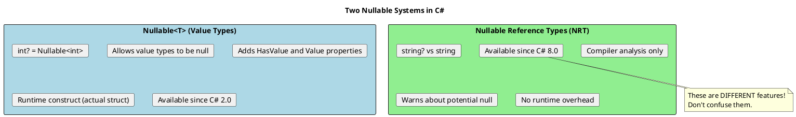
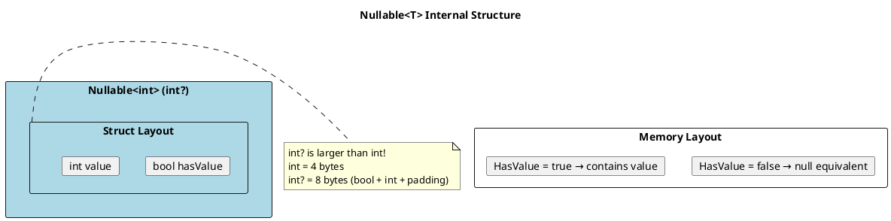
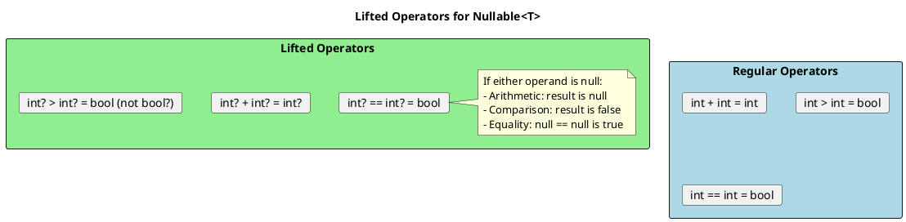
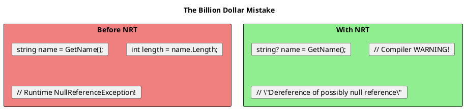
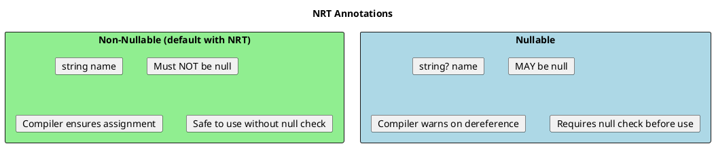

# Nullable Types - Complete Guide

## Two Different "Nullable" Concepts

C# has two distinct nullable features that solve different problems:



## Part 1: Nullable Value Types (Nullable<T>)

### How It Works Internally



```csharp
// Nullable<T> is a struct - it's a VALUE TYPE!
public struct Nullable<T> where T : struct
{
    private readonly bool hasValue;
    private readonly T value;

    public bool HasValue => hasValue;

    public T Value
    {
        get
        {
            if (!hasValue)
                throw new InvalidOperationException("No value");
            return value;
        }
    }

    public T GetValueOrDefault() => hasValue ? value : default;
    public T GetValueOrDefault(T defaultValue) => hasValue ? value : defaultValue;
}
```

### Usage Patterns

```csharp
// ═══════════════════════════════════════════════════════
// DECLARATION
// ═══════════════════════════════════════════════════════
int? nullableInt = null;
int? anotherInt = 42;
Nullable<int> sameAsThat = 42;  // Equivalent

// ═══════════════════════════════════════════════════════
// CHECKING FOR VALUE
// ═══════════════════════════════════════════════════════
// Option 1: HasValue property
if (nullableInt.HasValue)
{
    int value = nullableInt.Value;
}

// Option 2: Pattern matching (preferred in modern C#)
if (nullableInt is int value)
{
    Console.WriteLine(value);
}

// Option 3: Comparison to null
if (nullableInt != null)
{
    // Compiler knows nullableInt has value here
}

// ═══════════════════════════════════════════════════════
// NULL COALESCING
// ═══════════════════════════════════════════════════════
int result = nullableInt ?? 0;  // Use 0 if null
int result2 = nullableInt ?? throw new ArgumentNullException();

// ═══════════════════════════════════════════════════════
// NULL COALESCING ASSIGNMENT (C# 8+)
// ═══════════════════════════════════════════════════════
int? x = null;
x ??= 10;  // Assign 10 only if x is null
// x is now 10

// ═══════════════════════════════════════════════════════
// NULL CONDITIONAL
// ═══════════════════════════════════════════════════════
int? length = nullableString?.Length;  // null if nullableString is null
```

### Lifted Operators



```csharp
int? a = 5;
int? b = null;
int? c = 10;

// Arithmetic with null
int? sum = a + b;      // null (any null operand = null result)
int? sum2 = a + c;     // 15

// Comparison with null
bool greater = a > b;   // false (comparison with null is always false)
bool less = a < b;      // false
bool equal = b == null; // true

// This is why you can't use > or < to check for null!
int? x = null;
if (x > 0) { }    // This is FALSE, but x isn't negative - it's null!
if (x <= 0) { }   // This is also FALSE!

// Correct way:
if (x.HasValue && x.Value > 0) { }
if (x is > 0) { }  // Pattern matching (C# 9+)
```

### Nullable Boxing Behavior

```csharp
int? hasValue = 42;
int? noValue = null;

object boxedWithValue = hasValue;  // Boxes to int (not int?)
object boxedNull = noValue;        // Results in null reference (not boxed null)

Console.WriteLine(boxedWithValue.GetType());  // System.Int32 (not Nullable<Int32>)
Console.WriteLine(boxedNull == null);         // True

// Unboxing
int? unboxed1 = (int?)boxedWithValue;  // 42
int? unboxed2 = (int?)boxedNull;       // null
int unboxed3 = (int)boxedWithValue;    // 42 (direct unbox works)
// int unboxed4 = (int)boxedNull;      // NullReferenceException!
```

## Part 2: Nullable Reference Types (C# 8+)

### The Problem It Solves



### Enabling NRT

```xml
<!-- In .csproj file -->
<PropertyGroup>
  <Nullable>enable</Nullable>  <!-- Project-wide -->
</PropertyGroup>
```

```csharp
// Or per-file
#nullable enable   // Enable NRT for this file
#nullable disable  // Disable NRT
#nullable restore  // Use project default

// Or for specific code sections
#nullable enable warnings   // Only warnings, no annotations
#nullable enable annotations // Only annotations, no warnings
```

### Understanding the Annotations



```csharp
#nullable enable

public class Person
{
    // Non-nullable: MUST be initialized, cannot be null
    public string Name { get; set; }  // Warning: must initialize!

    // Nullable: can be null
    public string? MiddleName { get; set; }  // OK, null is valid

    // Fix for non-nullable
    public string Name { get; set; } = "";  // Initialize to non-null
    // OR
    public required string Name { get; set; }  // C# 11: must be set in initializer
}

public void ProcessPerson(Person person)
{
    // Safe: Name cannot be null
    int nameLength = person.Name.Length;

    // Warning: MiddleName might be null
    int middleLength = person.MiddleName.Length;  // ⚠️ Warning!

    // Fix 1: Null check
    if (person.MiddleName != null)
    {
        int len = person.MiddleName.Length;  // OK, compiler knows it's not null
    }

    // Fix 2: Null conditional
    int? len = person.MiddleName?.Length;

    // Fix 3: Null forgiving operator (you promise it's not null)
    int len2 = person.MiddleName!.Length;  // Suppresses warning (dangerous!)
}
```

### Null Forgiving Operator (!)

```csharp
// The ! operator tells compiler "trust me, this isn't null"
// Use sparingly - it defeats the purpose of NRT!

string? nullable = GetPossiblyNullString();

// You KNOW it's not null (maybe from external validation)
string definitelyNotNull = nullable!;

// Common legitimate uses:
// 1. After validation
if (Validate(nullable))
{
    ProcessString(nullable!);  // Validated externally
}

// 2. Lazy initialization with guaranteed init
private string _cache = null!;  // Will be initialized before use
public void Initialize() => _cache = LoadFromDatabase();

// 3. Test scenarios
[Test]
public void TestMethod()
{
    var result = GetResult();
    Assert.NotNull(result);
    result!.DoSomething();  // After assertion
}
```

### Null State Analysis

```csharp
#nullable enable

string? GetName() => DateTime.Now.Second % 2 == 0 ? "John" : null;

void ProcessName()
{
    string? name = GetName();

    // Compiler tracks null state through flow analysis
    if (name == null)
    {
        Console.WriteLine("No name");
        return;  // After return, name is "maybe null"
    }

    // Here compiler KNOWS name is not null
    Console.WriteLine(name.Length);  // No warning!
}

// Pattern matching also affects null state
void ProcessWithPattern(string? input)
{
    if (input is string s)
    {
        // s is definitely not null
        Console.WriteLine(s.Length);
    }

    if (input is { Length: > 0 })
    {
        // input is definitely not null here
        Console.WriteLine(input.ToUpper());
    }
}
```

### Attributes for Null Analysis

```csharp
using System.Diagnostics.CodeAnalysis;

// NotNull: Parameter will not be null after method returns
public void EnsureNotNull([NotNull] ref string? value)
{
    value ??= "default";
    // Caller's variable is now considered non-null
}

// MaybeNull: Return might be null even if T is non-nullable
[return: MaybeNull]
public T Find<T>(Predicate<T> predicate) { ... }

// NotNullWhen: Parameter is not null when method returns specified bool
public bool TryGetValue(string key, [NotNullWhen(true)] out string? value)
{
    value = dictionary.GetValueOrDefault(key);
    return value != null;
}

// MemberNotNull: Specified member is not null after method
[MemberNotNull(nameof(_cache))]
private void Initialize()
{
    _cache = new Cache();
}

// DoesNotReturn: Method never returns (throws)
[DoesNotReturn]
private void ThrowError() => throw new Exception();

// NotNullIfNotNull: Return is not null if parameter is not null
[return: NotNullIfNotNull(nameof(input))]
public string? Process(string? input)
{
    return input?.ToUpper();
}
```

## Combining Both Nullable Systems

```csharp
#nullable enable

// T? means different things for value and reference types!
public T? GetOrDefault<T>(Dictionary<string, T> dict, string key)
{
    // If T is int: returns int? (Nullable<int>)
    // If T is string: returns string? (nullable reference)
    return dict.TryGetValue(key, out var value) ? value : default;
}

// Constraining for value types
public T? GetValueOrNull<T>(T value, bool returnNull) where T : struct
{
    return returnNull ? null : value;  // Returns Nullable<T>
}

// Constraining for reference types
public T? GetRefOrNull<T>(T value, bool returnNull) where T : class
{
    return returnNull ? null : value;  // Returns nullable reference
}
```

## Senior Interview Questions

**Q: Can you have `int??` (double nullable)?**

No! `Nullable<T>` requires `T : struct`, and `Nullable<int>` is itself a struct, but the constraint prevents nesting:
```csharp
int?? doubleNullable;  // Compile error!
Nullable<Nullable<int>> alsoError;  // Same error
```

**Q: What's the difference between `default(int?)` and `new int?()`?**

```csharp
int? a = default(int?);   // null (HasValue = false)
int? b = new int?();      // null (default constructor)
int? c = new int?(0);     // 0 (HasValue = true, Value = 0)

// They're both null, but created differently
Console.WriteLine(a == b);  // True
```

**Q: Does NRT have runtime overhead?**

No! NRT is purely a compile-time feature. The `?` on reference types generates no IL code. It only affects compiler warnings.

```csharp
// These compile to IDENTICAL IL:
string s1 = "hello";
string? s2 = "hello";

// The ? is only metadata for the compiler
```

**Q: How do you handle nullability in legacy code?**

```csharp
// Gradually enable with attributes
#nullable enable

public void NewCode(string nonNull, string? nullable)
{
    LegacyMethod(nonNull);  // May warn about legacy method
}

// Mark legacy return types
[return: MaybeNull]
public extern string LegacyMethod(string input);

// Or use ! to suppress in calling code (less safe)
string result = LegacyMethod(input)!;
```
