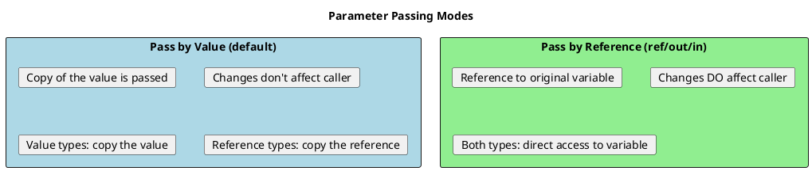
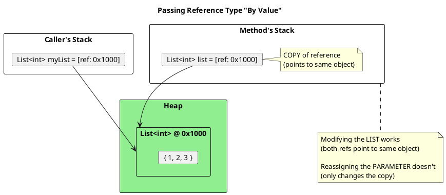
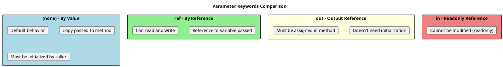
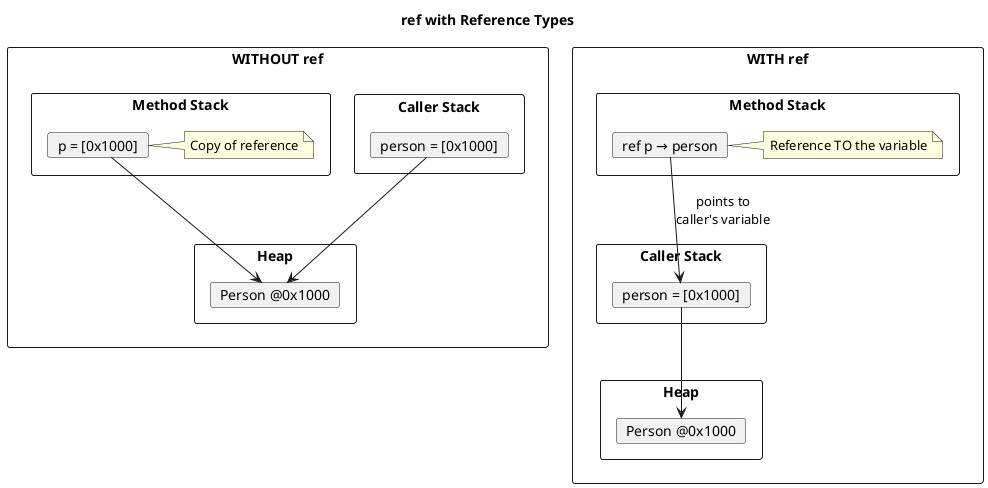
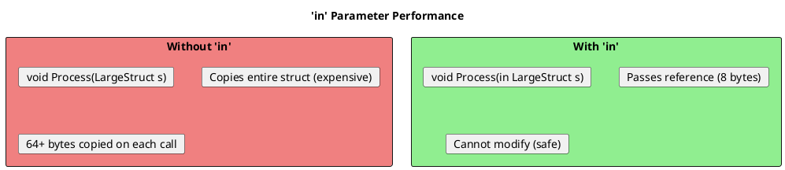

# Parameter Passing in C# - The Complete Picture

## The Core Concept

Understanding how parameters are passed is crucial because it affects whether changes inside a method affect the caller's variables.



## The Confusing Part: Reference Types "By Value"

This is where most developers get confused:



```csharp
void ModifyList(List<int> list)  // Reference passed BY VALUE
{
    // This WORKS - modifying the object both refs point to
    list.Add(4);  // Caller's list is affected!

    // This does NOT affect caller - only reassigns local copy
    list = new List<int> { 100, 200 };  // Caller's list unchanged!
}

List<int> myList = new List<int> { 1, 2, 3 };
ModifyList(myList);

Console.WriteLine(string.Join(", ", myList));  // "1, 2, 3, 4"
// Note: 100, 200 are NOT there - reassignment didn't affect caller
```

## The Four Parameter Keywords



### Detailed Examples

```csharp
// ═══════════════════════════════════════════════════════
// BY VALUE (Default)
// ═══════════════════════════════════════════════════════
void IncrementByValue(int x)
{
    x++;  // Only affects local copy
}

int num = 10;
IncrementByValue(num);
Console.WriteLine(num);  // Still 10

// ═══════════════════════════════════════════════════════
// REF - Pass by Reference
// ═══════════════════════════════════════════════════════
void IncrementByRef(ref int x)
{
    x++;  // Modifies caller's variable
}

int num2 = 10;
IncrementByRef(ref num2);  // Must use 'ref' at call site
Console.WriteLine(num2);   // 11

// ═══════════════════════════════════════════════════════
// OUT - Output Parameter
// ═══════════════════════════════════════════════════════
void GetValues(out int a, out int b)
{
    // MUST assign both before returning
    a = 10;
    b = 20;
}

int x, y;  // Don't need to initialize
GetValues(out x, out y);
Console.WriteLine($"{x}, {y}");  // 10, 20

// Inline declaration (C# 7+)
GetValues(out int p, out int q);
Console.WriteLine($"{p}, {q}");

// Discard unwanted out parameters
GetValues(out int wanted, out _);

// ═══════════════════════════════════════════════════════
// IN - Readonly Reference
// ═══════════════════════════════════════════════════════
void PrintValue(in int x)
{
    Console.WriteLine(x);
    // x = 10;  // Error! Cannot modify 'in' parameter
}

int value = 42;
PrintValue(in value);  // 'in' optional at call site
PrintValue(value);     // Also valid
```

## Deep Dive: ref with Reference Types



```csharp
class Person { public string Name { get; set; } }

// WITHOUT ref: can modify object, cannot reassign caller's variable
void ChangePersonNoRef(Person p)
{
    p.Name = "Changed";          // Works! Modifies same object
    p = new Person { Name = "New" };  // Does NOT affect caller
}

// WITH ref: can do both
void ChangePersonWithRef(ref Person p)
{
    p.Name = "Changed";          // Works! Modifies same object
    p = new Person { Name = "New" };  // DOES affect caller!
}

Person person = new Person { Name = "Original" };

ChangePersonNoRef(person);
Console.WriteLine(person.Name);  // "Changed"

person = new Person { Name = "Original" };
ChangePersonWithRef(ref person);
Console.WriteLine(person.Name);  // "New" - completely different object!
```

## in Parameter - Performance Optimization

The `in` keyword is primarily for **performance** with large structs:



```csharp
public readonly struct LargeStruct
{
    public readonly long A, B, C, D, E, F, G, H;  // 64 bytes

    public LargeStruct(long value) =>
        (A, B, C, D, E, F, G, H) = (value, value, value, value, value, value, value, value);

    public long Sum() => A + B + C + D + E + F + G + H;
}

// BAD: Copies 64 bytes
void ProcessCopy(LargeStruct s)
{
    Console.WriteLine(s.Sum());
}

// GOOD: Passes 8-byte reference
void ProcessRef(in LargeStruct s)
{
    Console.WriteLine(s.Sum());
    // s.A = 10;  // Error! Cannot modify
}

// Usage
var large = new LargeStruct(42);
ProcessRef(in large);  // Efficient
ProcessRef(large);     // Also works, 'in' is optional at call site
```

### Defensive Copies with `in`

**Important Senior Knowledge**: If you pass a non-readonly struct with `in`, the compiler creates defensive copies!

```csharp
// Non-readonly struct
public struct MutableStruct
{
    public int Value;
    public void Increment() => Value++;
}

void ProcessMutable(in MutableStruct s)
{
    // Compiler creates a COPY to call Increment()
    // because Increment() might modify the struct!
    s.Increment();  // This doesn't modify the original

    // To avoid defensive copies, use readonly struct
}

// Readonly struct - no defensive copies
public readonly struct ImmutableStruct
{
    public readonly int Value;
    public int GetValue() => Value;  // No copy needed
}
```

## ref Returns and ref Locals

Advanced feature for performance-critical code:

```csharp
public class Matrix
{
    private int[,] _data = new int[100, 100];

    // Return reference to array element
    public ref int GetElement(int row, int col)
    {
        return ref _data[row, col];
    }
}

var matrix = new Matrix();

// Modify directly without copying
ref int element = ref matrix.GetElement(5, 5);
element = 42;  // Directly modifies _data[5, 5]

// Or in one line
matrix.GetElement(10, 10) = 100;

// ref readonly - return read-only reference
public ref readonly int GetElementReadonly(int row, int col)
{
    return ref _data[row, col];
}

ref readonly int readonlyRef = ref matrix.GetElementReadonly(0, 0);
// readonlyRef = 10;  // Error! Cannot modify
```

## Common Patterns

### TryParse Pattern (out)

```csharp
// The classic TryParse pattern
if (int.TryParse(input, out int result))
{
    Console.WriteLine($"Parsed: {result}");
}
else
{
    Console.WriteLine("Invalid input");
}

// Your own TryGet pattern
public bool TryGetUser(int id, out User? user)
{
    user = _cache.GetValueOrDefault(id);
    return user != null;
}
```

### Swap Pattern (ref)

```csharp
void Swap<T>(ref T a, ref T b)
{
    T temp = a;
    a = b;
    b = temp;
}

int x = 1, y = 2;
Swap(ref x, ref y);
// x = 2, y = 1
```

### Extension Methods with ref/in

```csharp
// ref extension on struct (modifies in place)
public static class VectorExtensions
{
    public static void Normalize(ref this Vector3 v)
    {
        var length = Math.Sqrt(v.X * v.X + v.Y * v.Y + v.Z * v.Z);
        v.X /= length;
        v.Y /= length;
        v.Z /= length;
    }
}

Vector3 vec = new(3, 4, 0);
vec.Normalize();  // Modifies in place

// in extension (readonly, for large structs)
public static double Length(in this Vector3 v)
{
    return Math.Sqrt(v.X * v.X + v.Y * v.Y + v.Z * v.Z);
}
```

## Summary Diagram

```plantuml
@startuml
skinparam monochrome false

title Parameter Passing Summary

|= Mode |= Keyword |= Initialized? |= Can Modify? |= Best For |
| By Value | (none) | Yes | No* | Default, safety |
| By Reference | ref | Yes | Yes | Modify caller's var |
| Output | out | No | Must | Return multiple values |
| Readonly Ref | in | Yes | No | Large struct perf |

note bottom
  * "No" for value types. For reference types,
  can modify the object but not reassign the variable.
end note
@enduml
```

## Senior Interview Questions

**Q: What happens if you pass a string with `ref`?**

```csharp
void ChangeString(ref string s)
{
    s = "Modified";  // This DOES change caller's variable
}

string text = "Original";
ChangeString(ref text);
Console.WriteLine(text);  // "Modified"

// This works because we're changing which string the variable points to,
// not modifying the string itself (strings are immutable)
```

**Q: Can you overload methods that differ only by ref/out/in?**

```csharp
void Method(int x) { }
void Method(ref int x) { }    // OK - different from by-value
void Method(out int x) { }    // ERROR! Cannot overload ref vs out
void Method(in int x) { }     // ERROR! Cannot overload ref vs in
```

Ref, out, and in are considered the same signature for overloading purposes.

**Q: What's the difference between `out` and returning a tuple?**

```csharp
// out parameter style
bool TryParse(string s, out int result);

// Tuple style (C# 7+)
(bool success, int result) TryParse(string s);

// Modern preference: Tuples are often clearer
// But out parameters integrate better with if statements:
if (int.TryParse(s, out int value)) { }
```

**Q: Can you pass a property or indexer by ref?**

```csharp
class Example
{
    public int Value { get; set; }
    public int[] Array { get; } = new int[10];
}

var ex = new Example();
// void Modify(ref int x);

// Modify(ref ex.Value);     // ERROR! Properties cannot be passed by ref
// Modify(ref ex.Array[0]);  // OK! Array indexer returns actual storage

int local = ex.Value;
Modify(ref local);            // OK, but doesn't update property
ex.Value = local;             // Must manually assign back
```
