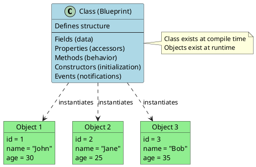
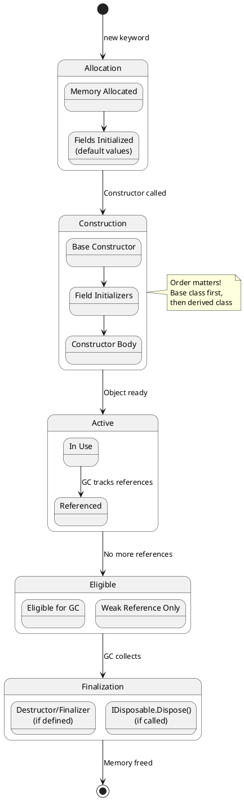
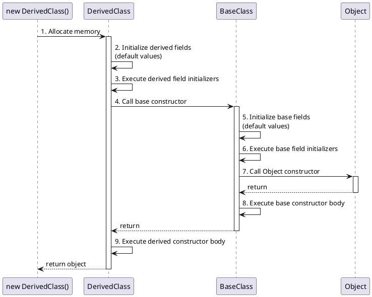
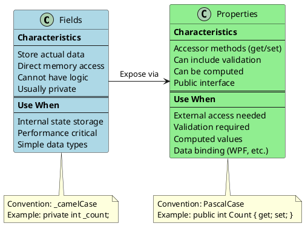
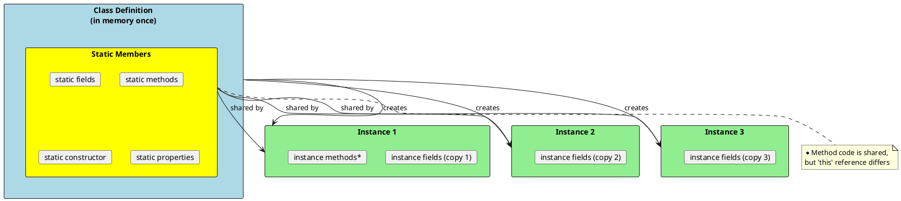
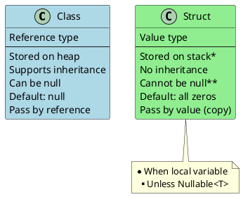

# Classes and Objects - The Building Blocks

## Understanding Classes vs Objects

A **class** is a blueprint; an **object** is an instance of that blueprint.



## Anatomy of a Class

```csharp
public class Employee
{
    // Fields - store the state (usually private)
    private readonly int _id;
    private string _name;
    private decimal _salary;

    // Static field - shared across all instances
    private static int _employeeCount = 0;

    // Constant - compile-time constant
    public const int MaxNameLength = 100;

    // Readonly static - runtime constant
    public static readonly DateTime CompanyFounded = new DateTime(2020, 1, 1);

    // Properties - controlled access to data
    public int Id => _id;  // Read-only property

    public string Name
    {
        get => _name;
        set => _name = value ?? throw new ArgumentNullException(nameof(value));
    }

    public decimal Salary
    {
        get => _salary;
        set
        {
            if (value < 0)
                throw new ArgumentException("Salary cannot be negative");
            _salary = value;
        }
    }

    // Auto-implemented property
    public string Department { get; set; }

    // Computed property
    public string DisplayName => $"{Name} ({Department})";

    // Static property
    public static int EmployeeCount => _employeeCount;

    // Constructor
    public Employee(int id, string name)
    {
        _id = id;
        _name = name ?? throw new ArgumentNullException(nameof(name));
        _employeeCount++;
    }

    // Instance method
    public void GiveRaise(decimal percentage)
    {
        Salary *= (1 + percentage / 100);
    }

    // Static method
    public static Employee CreateIntern(string name)
    {
        return new Employee(++_employeeCount, name)
        {
            Salary = 30000,
            Department = "Internship"
        };
    }
}
```

## Object Lifecycle



## Constructors Deep Dive

### Constructor Types

```csharp
public class Product
{
    public int Id { get; }
    public string Name { get; set; }
    public decimal Price { get; set; }
    public string Category { get; set; }

    // Default constructor (implicit if no constructors defined)
    public Product()
    {
        Id = 0;
        Name = "Unknown";
    }

    // Parameterized constructor
    public Product(int id, string name)
    {
        Id = id;
        Name = name;
    }

    // Constructor with optional parameters
    public Product(int id, string name, decimal price = 0, string category = "General")
        : this(id, name)  // Constructor chaining
    {
        Price = price;
        Category = category;
    }

    // Copy constructor
    public Product(Product other)
    {
        Id = other.Id;
        Name = other.Name;
        Price = other.Price;
        Category = other.Category;
    }

    // Static constructor - runs once per type
    static Product()
    {
        // Initialize static members
        Console.WriteLine("Product type initialized");
    }

    // Private constructor - for factory pattern or singleton
    private Product(int id) => Id = id;

    // Factory method using private constructor
    public static Product CreateWithId(int id) => new Product(id);
}
```

### Constructor Execution Order



```csharp
public class BaseClass
{
    protected string baseName = InitBaseName(); // Step 6

    public BaseClass()
    {
        Console.WriteLine("BaseClass constructor"); // Step 8
    }

    private static string InitBaseName()
    {
        Console.WriteLine("Base field initializer");
        return "Base";
    }
}

public class DerivedClass : BaseClass
{
    private string derivedName = InitDerivedName(); // Step 3

    public DerivedClass() : base()
    {
        Console.WriteLine("DerivedClass constructor"); // Step 9
    }

    private static string InitDerivedName()
    {
        Console.WriteLine("Derived field initializer");
        return "Derived";
    }
}

// Output when creating new DerivedClass():
// Derived field initializer
// Base field initializer
// BaseClass constructor
// DerivedClass constructor
```

## Members: Fields vs Properties



### Property Patterns

```csharp
public class PropertyExamples
{
    // 1. Auto-implemented property
    public string Name { get; set; }

    // 2. Read-only auto property (set only in constructor)
    public int Id { get; }

    // 3. Init-only property (C# 9+)
    public DateTime CreatedAt { get; init; }

    // 4. Computed property (no backing field)
    public string FullName => $"{FirstName} {LastName}";

    // 5. Property with backing field and validation
    private decimal _price;
    public decimal Price
    {
        get => _price;
        set
        {
            if (value < 0)
                throw new ArgumentException("Price cannot be negative");
            _price = value;
        }
    }

    // 6. Lazy-loaded property
    private List<Order>? _orders;
    public List<Order> Orders => _orders ??= LoadOrders();

    // 7. Property with different access levels
    public string Status { get; private set; }

    // 8. Required property (C# 11+)
    public required string RequiredField { get; set; }

    // 9. Expression-bodied property with set
    private string _email;
    public string Email
    {
        get => _email;
        set => _email = value?.ToLower() ?? throw new ArgumentNullException();
    }

    public string FirstName { get; set; }
    public string LastName { get; set; }

    private List<Order> LoadOrders() => new List<Order>();
}
```

## Static vs Instance Members



```csharp
public class Counter
{
    // Static field - one copy shared by all instances
    private static int _totalCount = 0;

    // Instance field - each instance has its own copy
    private int _instanceCount = 0;

    // Static property
    public static int TotalCount => _totalCount;

    // Instance property
    public int InstanceCount => _instanceCount;

    public void Increment()
    {
        _instanceCount++;   // Only this instance
        _totalCount++;      // Affects all instances
    }

    // Static method - no access to instance members
    public static void ResetTotal() => _totalCount = 0;

    // Instance method - can access both static and instance
    public void Reset()
    {
        _instanceCount = 0;
        // Can also access _totalCount here
    }
}

// Usage
var c1 = new Counter();
var c2 = new Counter();

c1.Increment();  // c1.InstanceCount = 1, TotalCount = 1
c1.Increment();  // c1.InstanceCount = 2, TotalCount = 2
c2.Increment();  // c2.InstanceCount = 1, TotalCount = 3

Console.WriteLine(Counter.TotalCount);  // 3
Console.WriteLine(c1.InstanceCount);    // 2
Console.WriteLine(c2.InstanceCount);    // 1
```

## Object Initialization Patterns

```csharp
public class Order
{
    public int Id { get; set; }
    public string Customer { get; set; }
    public List<string> Items { get; set; } = new();
    public DateTime OrderDate { get; init; }
}

// Pattern 1: Constructor
var order1 = new Order();
order1.Id = 1;
order1.Customer = "John";

// Pattern 2: Object initializer
var order2 = new Order
{
    Id = 2,
    Customer = "Jane",
    OrderDate = DateTime.Now
};

// Pattern 3: Object initializer with collection
var order3 = new Order
{
    Id = 3,
    Customer = "Bob",
    Items = { "Item1", "Item2", "Item3" }  // Collection initializer
};

// Pattern 4: Target-typed new (C# 9+)
Order order4 = new()
{
    Id = 4,
    Customer = "Alice"
};

// Pattern 5: With expression for records/structs (C# 9+)
public record OrderRecord(int Id, string Customer);
var original = new OrderRecord(1, "John");
var modified = original with { Customer = "Jane" };
```

## Interview Questions & Answers

### Q1: What's the difference between a class and a struct?



### Q2: When is a static constructor called?

**Answer**: A static constructor is called automatically:
1. Before the first instance is created, OR
2. Before any static members are referenced

It runs only **once** per application domain and cannot be called directly.

### Q3: What happens if a constructor throws an exception?

**Answer**:
- The object is never fully constructed
- Memory may still be allocated (GC will reclaim it)
- If the object implements `IDisposable`, `Dispose()` won't be called
- **Best practice**: Avoid heavy logic in constructors; use factory methods instead

### Q4: Can you have a class without any constructor?

**Answer**: Yes, C# provides a **default parameterless constructor** if you don't define any. However, if you define ANY constructor, the default one is NOT provided automatically.

```csharp
// Has default constructor
public class A { }

// NO default constructor - must use A(int)
public class B
{
    public B(int x) { }
}

// To have both:
public class C
{
    public C() { }
    public C(int x) { }
}
```
