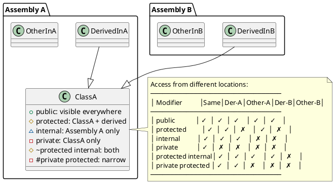
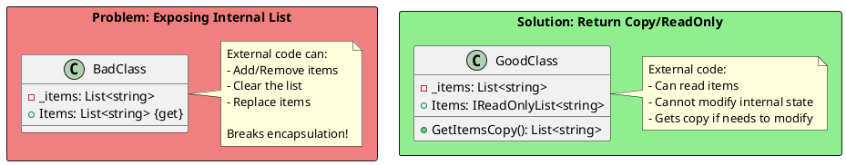
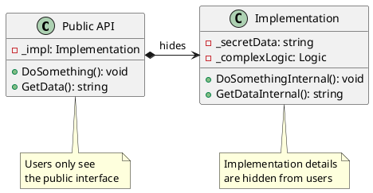
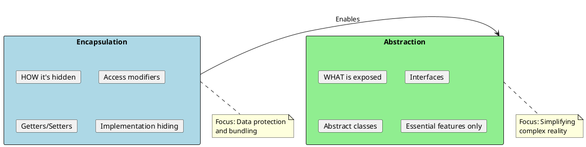

# Encapsulation - Protecting Your Data

## What is Encapsulation?

Encapsulation is the bundling of data (fields) and methods that operate on that data within a single unit (class), while **restricting direct access** to some of the object's components.

```plantuml
@startuml
skinparam monochrome false
skinparam shadowing false

rectangle "Without Encapsulation" as bad #LightCoral {
  class BankAccount {
    +balance: decimal
    +accountNumber: string
    +pin: string
  }

  actor "External Code" as ext
  ext --> BankAccount : balance = -1000\npin = "hacked"

  note bottom of BankAccount
    Anyone can modify
    anything directly!
    No validation!
  end note
}

rectangle "With Encapsulation" as good #LightGreen {
  class SecureBankAccount {
    -_balance: decimal
    -_accountNumber: string
    -_pin: string
    --
    +Deposit(amount): void
    +Withdraw(amount): bool
    +Balance: decimal {get}
  }

  actor "External Code" as ext2
  ext2 --> SecureBankAccount : Withdraw(100)

  note bottom of SecureBankAccount
    Access only through
    controlled methods
    Validation enforced!
  end note
}
@enduml
```

## Access Modifiers in C#



### Access Modifier Summary

| Modifier | Same Class | Derived (Same Assembly) | Same Assembly | Derived (Other Assembly) | Other Assembly |
|----------|------------|------------------------|---------------|--------------------------|----------------|
| `public` | ✓ | ✓ | ✓ | ✓ | ✓ |
| `private` | ✓ | ✗ | ✗ | ✗ | ✗ |
| `protected` | ✓ | ✓ | ✗ | ✓ | ✗ |
| `internal` | ✓ | ✓ | ✓ | ✗ | ✗ |
| `protected internal` | ✓ | ✓ | ✓ | ✓ | ✗ |
| `private protected` | ✓ | ✓ | ✗ | ✗ | ✗ |

## Encapsulation Best Practices

### 1. Make Fields Private

```csharp
// ❌ BAD: Public fields
public class Employee
{
    public string name;        // Anyone can set to null
    public decimal salary;     // Anyone can set to -1000
    public DateTime hireDate;  // Anyone can set future date
}

// ✅ GOOD: Private fields with property accessors
public class Employee
{
    private string _name;
    private decimal _salary;
    private readonly DateTime _hireDate;

    public string Name
    {
        get => _name;
        set => _name = value ?? throw new ArgumentNullException(nameof(value));
    }

    public decimal Salary
    {
        get => _salary;
        set
        {
            if (value < 0)
                throw new ArgumentOutOfRangeException(nameof(value));
            _salary = value;
        }
    }

    public DateTime HireDate => _hireDate;  // Read-only

    public Employee(string name, DateTime hireDate)
    {
        Name = name;  // Uses validation
        _hireDate = hireDate <= DateTime.Now
            ? hireDate
            : throw new ArgumentException("Hire date cannot be in the future");
    }
}
```

### 2. Return Copies of Mutable Objects



```csharp
public class ShoppingCart
{
    private readonly List<CartItem> _items = new();

    // ❌ BAD: Exposing internal list
    public List<CartItem> Items => _items;

    // ✅ GOOD: Read-only view
    public IReadOnlyList<CartItem> Items => _items.AsReadOnly();

    // ✅ GOOD: Return a copy if modification is needed
    public List<CartItem> GetItemsCopy() => new List<CartItem>(_items);

    // ✅ GOOD: Controlled modification through methods
    public void AddItem(CartItem item)
    {
        if (item == null) throw new ArgumentNullException(nameof(item));
        if (item.Quantity <= 0) throw new ArgumentException("Quantity must be positive");

        var existing = _items.Find(i => i.ProductId == item.ProductId);
        if (existing != null)
            existing.Quantity += item.Quantity;
        else
            _items.Add(item);
    }

    public bool RemoveItem(int productId)
    {
        return _items.RemoveAll(i => i.ProductId == productId) > 0;
    }
}
```

### 3. Immutability for Thread Safety

```csharp
// ✅ Immutable class - inherently thread-safe
public sealed class ImmutablePerson
{
    public string FirstName { get; }
    public string LastName { get; }
    public DateTime BirthDate { get; }

    public ImmutablePerson(string firstName, string lastName, DateTime birthDate)
    {
        FirstName = firstName ?? throw new ArgumentNullException(nameof(firstName));
        LastName = lastName ?? throw new ArgumentNullException(nameof(lastName));
        BirthDate = birthDate;
    }

    // Create modified copy instead of mutating
    public ImmutablePerson WithFirstName(string firstName)
        => new ImmutablePerson(firstName, LastName, BirthDate);

    public ImmutablePerson WithLastName(string lastName)
        => new ImmutablePerson(FirstName, lastName, BirthDate);
}

// ✅ Even better: Use records (C# 9+)
public record Person(string FirstName, string LastName, DateTime BirthDate);

// Usage:
var person = new Person("John", "Doe", new DateTime(1990, 1, 1));
var updated = person with { FirstName = "Jane" };  // Creates new instance
```

## Information Hiding Patterns

### 1. Pimpl Pattern (Pointer to Implementation)



```csharp
// Public interface - in public assembly
public interface IPaymentProcessor
{
    PaymentResult ProcessPayment(PaymentRequest request);
}

// Internal implementation - details hidden
internal class StripePaymentProcessor : IPaymentProcessor
{
    private readonly string _secretKey;
    private readonly IHttpClient _httpClient;
    private readonly ILogger _logger;

    internal StripePaymentProcessor(string secretKey, IHttpClient httpClient, ILogger logger)
    {
        _secretKey = secretKey;
        _httpClient = httpClient;
        _logger = logger;
    }

    public PaymentResult ProcessPayment(PaymentRequest request)
    {
        // Complex implementation hidden from consumers
        _logger.LogInformation("Processing payment...");
        var stripeRequest = MapToStripeRequest(request);
        var response = _httpClient.Post("https://api.stripe.com/v1/charges", stripeRequest);
        return MapFromStripeResponse(response);
    }

    private StripeRequest MapToStripeRequest(PaymentRequest request) { /* ... */ }
    private PaymentResult MapFromStripeResponse(StripeResponse response) { /* ... */ }
}

// Factory - controls instantiation
public static class PaymentProcessorFactory
{
    public static IPaymentProcessor Create(PaymentConfig config)
    {
        // Consumers don't know about StripePaymentProcessor
        return new StripePaymentProcessor(config.SecretKey, new HttpClient(), new Logger());
    }
}
```

### 2. Tell, Don't Ask

```csharp
// ❌ BAD: Asking for data, then making decisions outside
public class OrderService
{
    public void ProcessOrder(Order order)
    {
        // Asking for internal state
        if (order.Status == OrderStatus.Pending &&
            order.Items.Count > 0 &&
            order.Customer.HasValidPayment)
        {
            order.Status = OrderStatus.Processing;
            // Process...
        }
    }
}

// ✅ GOOD: Tell the object what to do
public class Order
{
    private OrderStatus _status;
    private readonly List<OrderItem> _items = new();
    private readonly Customer _customer;

    public void Process()
    {
        // Object makes its own decisions
        if (!CanProcess())
            throw new InvalidOperationException("Order cannot be processed");

        _status = OrderStatus.Processing;
        // Process...
    }

    private bool CanProcess()
    {
        return _status == OrderStatus.Pending &&
               _items.Count > 0 &&
               _customer.HasValidPayment;
    }
}

// Usage: Tell, don't ask
order.Process();
```

## Encapsulation with Nested Classes

```csharp
public class LinkedList<T>
{
    // Node is an implementation detail
    private class Node
    {
        public T Value { get; set; }
        public Node? Next { get; set; }

        public Node(T value) => Value = value;
    }

    private Node? _head;
    private int _count;

    public int Count => _count;

    public void Add(T value)
    {
        var newNode = new Node(value);

        if (_head == null)
        {
            _head = newNode;
        }
        else
        {
            var current = _head;
            while (current.Next != null)
                current = current.Next;
            current.Next = newNode;
        }

        _count++;
    }

    // Users never see or interact with Node directly
    public IEnumerator<T> GetEnumerator()
    {
        var current = _head;
        while (current != null)
        {
            yield return current.Value;
            current = current.Next;
        }
    }
}
```

## Interview Questions & Answers

### Q1: What's the difference between encapsulation and abstraction?



**Answer**:
- **Encapsulation** is about **hiding the internal state** and requiring all interaction through methods. It's the mechanism (private fields, public methods).
- **Abstraction** is about **hiding complexity** and showing only essential features. It's the concept (interfaces, abstract classes).

Encapsulation enables abstraction by hiding implementation details.

### Q2: Why should we avoid public fields?

**Answer**:
1. **No validation**: Anyone can set invalid values
2. **No change tracking**: Can't log or audit changes
3. **Breaking changes**: Changing to a property breaks binary compatibility
4. **No lazy loading**: Can't defer initialization
5. **No computed values**: Can't derive value from other fields
6. **Thread safety**: Can't add synchronization

### Q3: What is the `internal` access modifier used for?

**Answer**: `internal` restricts access to the **same assembly**. Use cases:
1. **Helper classes** that shouldn't be public API
2. **Implementation details** of a library
3. **Testing**: `InternalsVisibleTo` attribute allows test assemblies access
4. **Modular design**: Hide complexity between modules

```csharp
// In your library assembly
internal class DatabaseHelper { }  // Hidden from library consumers

// In AssemblyInfo.cs or .csproj
[assembly: InternalsVisibleTo("MyLibrary.Tests")]
```

### Q4: How do you make a class truly immutable?

**Answer**:
1. Make all fields `readonly`
2. Initialize fields only in constructor
3. Don't expose mutable objects (return copies)
4. Make the class `sealed` (prevent mutable derived classes)
5. Don't provide setters

```csharp
public sealed class ImmutableConfig
{
    private readonly string[] _values;

    public string Name { get; }
    public int Timeout { get; }
    public IReadOnlyList<string> Values => Array.AsReadOnly(_values);

    public ImmutableConfig(string name, int timeout, string[] values)
    {
        Name = name;
        Timeout = timeout;
        _values = (string[])values.Clone();  // Defensive copy
    }
}
```
