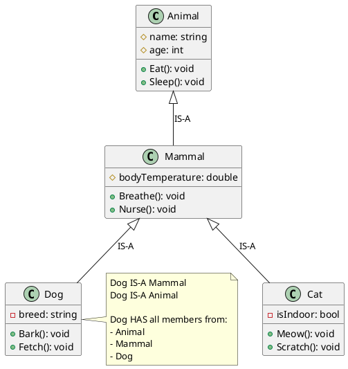
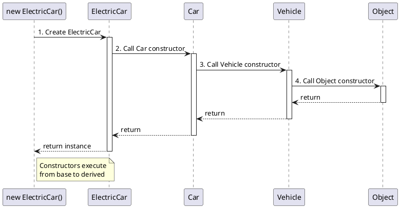
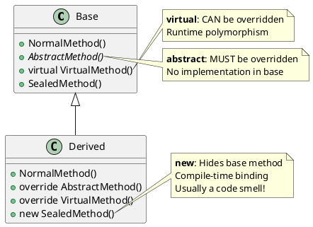
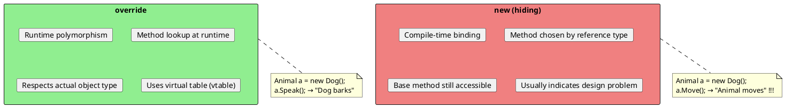
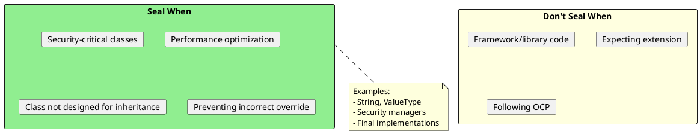
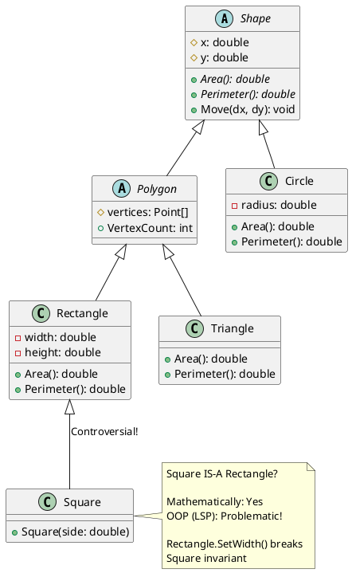
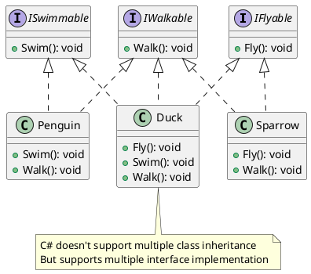
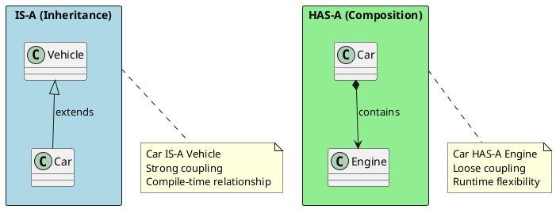
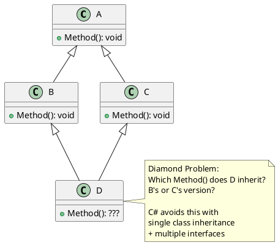

# Inheritance - Building on What Exists

## What is Inheritance?

Inheritance allows a class (derived/child) to acquire properties and behaviors from another class (base/parent). It establishes an **IS-A** relationship.



## Inheritance in C#

### Basic Syntax

```csharp
// Base class
public class Vehicle
{
    public string Brand { get; set; }
    public int Year { get; set; }

    public virtual void Start()
    {
        Console.WriteLine("Vehicle starting...");
    }

    public void Stop()
    {
        Console.WriteLine("Vehicle stopping...");
    }
}

// Derived class
public class Car : Vehicle
{
    public int NumberOfDoors { get; set; }

    // Override base behavior
    public override void Start()
    {
        Console.WriteLine("Car engine starting...");
        base.Start();  // Optionally call base implementation
    }

    // New method specific to Car
    public void Honk()
    {
        Console.WriteLine("Beep beep!");
    }
}

// Further derived class
public class ElectricCar : Car
{
    public int BatteryCapacity { get; set; }

    public override void Start()
    {
        Console.WriteLine("Electric motor starting silently...");
    }

    public void Charge()
    {
        Console.WriteLine("Charging battery...");
    }
}
```

## Constructor Chain



```csharp
public class Animal
{
    public string Name { get; }

    public Animal(string name)
    {
        Console.WriteLine("Animal constructor");
        Name = name;
    }
}

public class Dog : Animal
{
    public string Breed { get; }

    // Must call base constructor explicitly when base has no parameterless constructor
    public Dog(string name, string breed) : base(name)
    {
        Console.WriteLine("Dog constructor");
        Breed = breed;
    }
}

public class Labrador : Dog
{
    public string Color { get; }

    public Labrador(string name, string color)
        : base(name, "Labrador")  // Calls Dog constructor
    {
        Console.WriteLine("Labrador constructor");
        Color = color;
    }
}

// Output when creating new Labrador("Max", "Yellow"):
// Animal constructor
// Dog constructor
// Labrador constructor
```

## Virtual, Override, and New Keywords



### The Difference: Override vs New

```csharp
public class Animal
{
    public virtual void Speak() => Console.WriteLine("Animal speaks");
    public void Move() => Console.WriteLine("Animal moves");
}

public class Dog : Animal
{
    public override void Speak() => Console.WriteLine("Dog barks");  // Override
    public new void Move() => Console.WriteLine("Dog runs");          // Hide
}

// Usage - THE CRITICAL DIFFERENCE
Animal animal = new Dog();  // Reference type is Animal

animal.Speak();  // Output: "Dog barks"  (runtime polymorphism)
animal.Move();   // Output: "Animal moves" (compile-time binding!)

Dog dog = new Dog();
dog.Speak();     // Output: "Dog barks"
dog.Move();      // Output: "Dog runs"
```



## Sealed Classes and Methods

```csharp
// Sealed class - cannot be inherited
public sealed class String
{
    // ...
}

// public class MyString : String { }  // ❌ Compile error

// Sealed method - cannot be further overridden
public class Animal
{
    public virtual void Eat() => Console.WriteLine("Eating");
}

public class Mammal : Animal
{
    public sealed override void Eat()  // Can be overridden, but seals it
    {
        Console.WriteLine("Mammal eating");
    }
}

public class Dog : Mammal
{
    // public override void Eat() { }  // ❌ Compile error - Eat is sealed
}
```

### When to Seal



## Protected Members

```csharp
public class BankAccount
{
    private decimal _balance;                    // Only this class
    protected string AccountNumber { get; }     // This + derived classes
    protected internal int BranchCode { get; }  // This + derived + same assembly

    protected BankAccount(string accountNumber)
    {
        AccountNumber = accountNumber;
    }

    protected virtual void OnBalanceChanged(decimal oldBalance, decimal newBalance)
    {
        // Hook for derived classes
    }

    public void Deposit(decimal amount)
    {
        var old = _balance;
        _balance += amount;
        OnBalanceChanged(old, _balance);
    }
}

public class SavingsAccount : BankAccount
{
    private decimal _interestRate;

    public SavingsAccount(string accountNumber, decimal interestRate)
        : base(accountNumber)
    {
        _interestRate = interestRate;
        // Can access AccountNumber here (protected)
        Console.WriteLine($"Created savings account: {AccountNumber}");
    }

    protected override void OnBalanceChanged(decimal oldBalance, decimal newBalance)
    {
        // Custom logic for savings account
        if (newBalance > 10000)
            Console.WriteLine("You qualify for premium interest!");
    }
}
```

## Inheritance Hierarchy Design



### The Square-Rectangle Problem (LSP Violation)

```csharp
// ❌ PROBLEMATIC design
public class Rectangle
{
    public virtual int Width { get; set; }
    public virtual int Height { get; set; }

    public int Area() => Width * Height;
}

public class Square : Rectangle
{
    public override int Width
    {
        get => base.Width;
        set { base.Width = value; base.Height = value; }
    }

    public override int Height
    {
        get => base.Height;
        set { base.Height = value; base.Width = value; }
    }
}

// This breaks Liskov Substitution Principle!
void ProcessRectangle(Rectangle r)
{
    r.Width = 5;
    r.Height = 10;
    Debug.Assert(r.Area() == 50);  // Fails for Square!
}

// ✅ BETTER: Use composition or separate types
public interface IShape
{
    double Area { get; }
}

public class Rectangle : IShape
{
    public int Width { get; }
    public int Height { get; }
    public double Area => Width * Height;

    public Rectangle(int width, int height)
    {
        Width = width;
        Height = height;
    }
}

public class Square : IShape
{
    public int Side { get; }
    public double Area => Side * Side;

    public Square(int side) => Side = side;
}
```

## Multiple Inheritance - C# Solution



```csharp
public interface IFlyable
{
    void Fly();
    int MaxAltitude { get; }
}

public interface ISwimmable
{
    void Swim();
    int MaxDepth { get; }
}

// Duck implements multiple interfaces
public class Duck : IFlyable, ISwimmable
{
    public int MaxAltitude => 1000;
    public int MaxDepth => 5;

    public void Fly() => Console.WriteLine("Duck flying");
    public void Swim() => Console.WriteLine("Duck swimming");
}

// Using default interface methods (C# 8+)
public interface ILogger
{
    void Log(string message);

    // Default implementation
    void LogError(string message) => Log($"ERROR: {message}");
    void LogWarning(string message) => Log($"WARNING: {message}");
}

public class ConsoleLogger : ILogger
{
    public void Log(string message) => Console.WriteLine(message);
    // LogError and LogWarning work without implementation!
}
```

## Interview Questions & Answers

### Q1: Can constructors be inherited?

**Answer**: No, constructors are NOT inherited. Each class must define its own constructors. However, derived class constructors must call a base class constructor (explicitly or implicitly via parameterless constructor).

### Q2: What's the difference between `is-a` and `has-a`?



### Q3: Why is multiple inheritance not allowed in C#?

**Answer**: Multiple class inheritance creates the **Diamond Problem**:



### Q4: When should you use inheritance vs interfaces?

| Use Inheritance When | Use Interfaces When |
|---------------------|---------------------|
| True IS-A relationship | Defining capabilities |
| Sharing implementation | Multiple types need same contract |
| Single hierarchy makes sense | Flexibility needed |
| Base class has significant code | Testing/mocking required |

### Q5: What does `sealed` prevent and why use it?

**Answer**: `sealed` prevents inheritance. Use it when:
1. **Security**: Prevent malicious override of security-critical methods
2. **Performance**: JIT can inline methods (slight optimization)
3. **Design intent**: Class wasn't designed for extension
4. **Correctness**: Prevent broken overrides of complex logic
