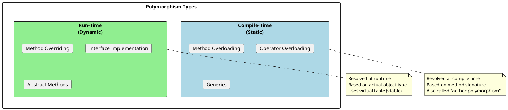
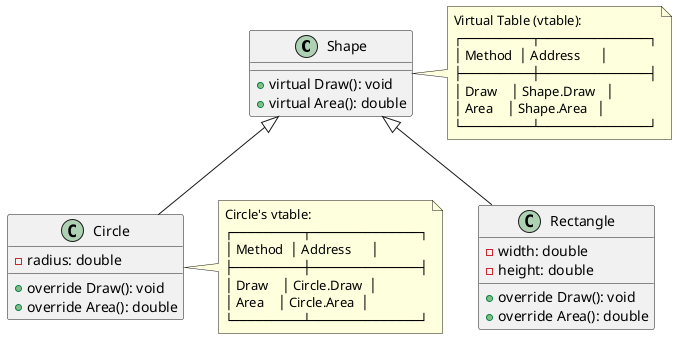
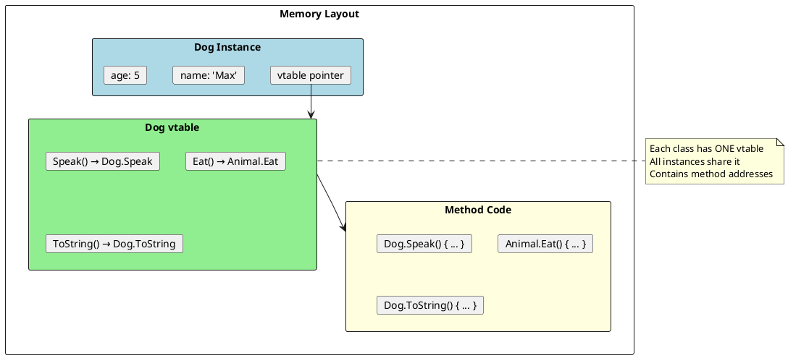

# Polymorphism - Many Forms, One Interface

## What is Polymorphism?

Polymorphism means "many forms." It allows objects of different types to be treated as objects of a common base type, while each responds in its own way.

```plantuml
@startuml
skinparam monochrome false
skinparam shadowing false

interface "Draw()" as draw

class Circle {
  +Draw()
}

class Rectangle {
  +Draw()
}

class Triangle {
  +Draw()
}

draw <|.. Circle : implements
draw <|.. Rectangle : implements
draw <|.. Triangle : implements

note bottom of draw
  Same method signature
  Different implementations
  Client code treats all as "Drawable"
end note

rectangle "Client Code" as client #LightBlue {
  card "foreach (shape in shapes)"
  card "    shape.Draw()"
}

client --> draw : uses interface
@enduml
```

## Types of Polymorphism



## Compile-Time Polymorphism

### Method Overloading

```csharp
public class Calculator
{
    // Overloaded methods - same name, different signatures

    public int Add(int a, int b)
        => a + b;

    public int Add(int a, int b, int c)
        => a + b + c;

    public double Add(double a, double b)
        => a + b;

    public string Add(string a, string b)
        => a + b;

    // With optional parameters (alternative to overloading)
    public decimal Add(decimal a, decimal b, decimal c = 0, decimal d = 0)
        => a + b + c + d;
}

// Compiler chooses the right method based on arguments
var calc = new Calculator();
calc.Add(1, 2);           // Calls Add(int, int)
calc.Add(1, 2, 3);        // Calls Add(int, int, int)
calc.Add(1.5, 2.5);       // Calls Add(double, double)
calc.Add("Hello", "World"); // Calls Add(string, string)
```

### Operator Overloading

```csharp
public struct Money
{
    public decimal Amount { get; }
    public string Currency { get; }

    public Money(decimal amount, string currency)
    {
        Amount = amount;
        Currency = currency;
    }

    // Binary operator overloading
    public static Money operator +(Money a, Money b)
    {
        if (a.Currency != b.Currency)
            throw new InvalidOperationException("Currency mismatch");
        return new Money(a.Amount + b.Amount, a.Currency);
    }

    public static Money operator -(Money a, Money b)
    {
        if (a.Currency != b.Currency)
            throw new InvalidOperationException("Currency mismatch");
        return new Money(a.Amount - b.Amount, a.Currency);
    }

    // Unary operator
    public static Money operator -(Money a)
        => new Money(-a.Amount, a.Currency);

    // Comparison operators (must implement in pairs)
    public static bool operator ==(Money a, Money b)
        => a.Amount == b.Amount && a.Currency == b.Currency;

    public static bool operator !=(Money a, Money b)
        => !(a == b);

    public static bool operator >(Money a, Money b)
    {
        if (a.Currency != b.Currency)
            throw new InvalidOperationException("Currency mismatch");
        return a.Amount > b.Amount;
    }

    public static bool operator <(Money a, Money b)
    {
        if (a.Currency != b.Currency)
            throw new InvalidOperationException("Currency mismatch");
        return a.Amount < b.Amount;
    }

    // Implicit/Explicit conversion
    public static implicit operator decimal(Money m) => m.Amount;
    public static explicit operator Money(decimal d) => new Money(d, "USD");

    public override string ToString() => $"{Amount:C} {Currency}";
}

// Usage
var price = new Money(100, "USD");
var tax = new Money(8.5m, "USD");
var total = price + tax;  // Uses operator +
Console.WriteLine(total); // $108.50 USD
```

## Run-Time Polymorphism

### Method Overriding



```csharp
public abstract class Shape
{
    public abstract double Area();
    public abstract void Draw();

    // Non-virtual method - same for all shapes
    public void PrintInfo()
    {
        Console.WriteLine($"Shape with area: {Area()}");
    }
}

public class Circle : Shape
{
    public double Radius { get; }

    public Circle(double radius) => Radius = radius;

    public override double Area() => Math.PI * Radius * Radius;

    public override void Draw()
        => Console.WriteLine($"Drawing circle with radius {Radius}");
}

public class Rectangle : Shape
{
    public double Width { get; }
    public double Height { get; }

    public Rectangle(double width, double height)
    {
        Width = width;
        Height = height;
    }

    public override double Area() => Width * Height;

    public override void Draw()
        => Console.WriteLine($"Drawing rectangle {Width}x{Height}");
}

// Polymorphic usage
List<Shape> shapes = new()
{
    new Circle(5),
    new Rectangle(4, 6),
    new Circle(3)
};

foreach (var shape in shapes)
{
    shape.Draw();       // Calls the appropriate override
    shape.PrintInfo();  // Same implementation for all
}
```

### Interface Polymorphism

```csharp
public interface IPaymentProcessor
{
    PaymentResult Process(PaymentRequest request);
    bool CanProcess(PaymentRequest request);
}

public class CreditCardProcessor : IPaymentProcessor
{
    public bool CanProcess(PaymentRequest request)
        => request.Method == PaymentMethod.CreditCard;

    public PaymentResult Process(PaymentRequest request)
    {
        // Credit card specific logic
        return new PaymentResult { Success = true, TransactionId = Guid.NewGuid() };
    }
}

public class PayPalProcessor : IPaymentProcessor
{
    public bool CanProcess(PaymentRequest request)
        => request.Method == PaymentMethod.PayPal;

    public PaymentResult Process(PaymentRequest request)
    {
        // PayPal specific logic
        return new PaymentResult { Success = true, TransactionId = Guid.NewGuid() };
    }
}

public class CryptoProcessor : IPaymentProcessor
{
    public bool CanProcess(PaymentRequest request)
        => request.Method == PaymentMethod.Crypto;

    public PaymentResult Process(PaymentRequest request)
    {
        // Crypto specific logic
        return new PaymentResult { Success = true, TransactionId = Guid.NewGuid() };
    }
}

// Polymorphic usage - strategy pattern
public class PaymentService
{
    private readonly IEnumerable<IPaymentProcessor> _processors;

    public PaymentService(IEnumerable<IPaymentProcessor> processors)
    {
        _processors = processors;
    }

    public PaymentResult ProcessPayment(PaymentRequest request)
    {
        var processor = _processors.FirstOrDefault(p => p.CanProcess(request))
            ?? throw new NotSupportedException($"No processor for {request.Method}");

        return processor.Process(request);
    }
}
```

## Covariance and Contravariance

```plantuml
@startuml
skinparam monochrome false
skinparam shadowing false

class Animal
class Dog
class Cat

Animal <|-- Dog
Animal <|-- Cat

rectangle "Covariance (out)" as cov #LightGreen {
  card "IEnumerable<Dog> → IEnumerable<Animal>"
  card "Can return more derived type"
  card "Output positions"
}

rectangle "Contravariance (in)" as contra #LightBlue {
  card "Action<Animal> → Action<Dog>"
  card "Can accept more base type"
  card "Input positions"
}

rectangle "Invariance" as inv #LightYellow {
  card "List<Dog> ≠ List<Animal>"
  card "No automatic conversion"
  card "Both input and output"
}

note bottom of cov
  IEnumerable<out T>
  Func<out TResult>
end note

note bottom of contra
  Action<in T>
  IComparer<in T>
end note
@enduml
```

```csharp
// Covariance - IEnumerable<out T>
IEnumerable<Dog> dogs = new List<Dog> { new Dog(), new Dog() };
IEnumerable<Animal> animals = dogs;  // ✅ Works! Covariance

// Contravariance - Action<in T>
Action<Animal> animalAction = animal => Console.WriteLine(animal.Name);
Action<Dog> dogAction = animalAction;  // ✅ Works! Contravariance
dogAction(new Dog());

// Invariance - List<T>
List<Dog> dogList = new List<Dog>();
// List<Animal> animalList = dogList;  // ❌ Compile error!

// Why List<T> is invariant:
List<Animal> animalList = new List<Animal>();
// If this were allowed:
// List<Animal> animalList = dogList;
// animalList.Add(new Cat());  // Would corrupt dogList!

// Custom covariant interface
public interface IReadOnlyRepository<out T>
{
    T GetById(int id);
    IEnumerable<T> GetAll();
}

// Custom contravariant interface
public interface IHandler<in T>
{
    void Handle(T item);
}
```

## Polymorphism Patterns

### Pattern 1: Template Method

```csharp
public abstract class DataExporter
{
    // Template method - defines the algorithm skeleton
    public void Export(IEnumerable<Record> records)
    {
        OpenConnection();
        WriteHeader();

        foreach (var record in records)
        {
            WriteRecord(record);  // Abstract - must override
        }

        WriteFooter();
        CloseConnection();
    }

    protected virtual void OpenConnection() { }
    protected virtual void CloseConnection() { }
    protected virtual void WriteHeader() { }
    protected virtual void WriteFooter() { }

    protected abstract void WriteRecord(Record record);  // Force override
}

public class CsvExporter : DataExporter
{
    private StreamWriter _writer;

    protected override void OpenConnection()
        => _writer = new StreamWriter("output.csv");

    protected override void WriteHeader()
        => _writer.WriteLine("Id,Name,Value");

    protected override void WriteRecord(Record record)
        => _writer.WriteLine($"{record.Id},{record.Name},{record.Value}");

    protected override void CloseConnection()
        => _writer?.Dispose();
}

public class JsonExporter : DataExporter
{
    private JsonWriter _writer;

    protected override void WriteRecord(Record record)
        => _writer.WriteObject(record);
}
```

### Pattern 2: Factory with Polymorphism

```csharp
public interface INotificationSender
{
    Task SendAsync(Notification notification);
}

public class EmailSender : INotificationSender
{
    public async Task SendAsync(Notification notification)
    {
        // Send email
        await Task.CompletedTask;
    }
}

public class SmsSender : INotificationSender
{
    public async Task SendAsync(Notification notification)
    {
        // Send SMS
        await Task.CompletedTask;
    }
}

public class PushSender : INotificationSender
{
    public async Task SendAsync(Notification notification)
    {
        // Send push notification
        await Task.CompletedTask;
    }
}

// Factory creates appropriate sender
public class NotificationSenderFactory
{
    public INotificationSender Create(NotificationType type) => type switch
    {
        NotificationType.Email => new EmailSender(),
        NotificationType.Sms => new SmsSender(),
        NotificationType.Push => new PushSender(),
        _ => throw new ArgumentException($"Unknown type: {type}")
    };
}
```

## Virtual Method Table (vtable)



## Interview Questions & Answers

### Q1: What's the difference between method overloading and overriding?

| Aspect | Overloading | Overriding |
|--------|-------------|------------|
| **When** | Compile-time | Run-time |
| **Where** | Same class | Base and derived class |
| **Signature** | Different parameters | Same signature |
| **Keywords** | None | `virtual`/`override` |
| **Purpose** | Multiple versions | Change behavior |

### Q2: Can you override a private virtual method?

**Answer**: No, you cannot even declare a private method as virtual. Virtual methods must be accessible to derived classes (public, protected, or internal).

### Q3: What happens if you forget the `override` keyword?

**Answer**: The method becomes a **hiding method** (implicitly `new`). The compiler warns you. The base class method will be called when using a base class reference, breaking polymorphism.

### Q4: Can you call a base class method after overriding it?

```csharp
public class Derived : Base
{
    public override void Method()
    {
        base.Method();  // ✅ Yes, use base keyword
        // Additional logic
    }
}
```

### Q5: Why use interfaces for polymorphism instead of abstract classes?

**Answer**:
1. **Multiple inheritance**: Class can implement multiple interfaces
2. **Loose coupling**: No implementation dependency
3. **Testability**: Easy to mock interfaces
4. **Evolution**: Interfaces (with default methods in C# 8+) can evolve

```csharp
// Interface allows multiple "behaviors"
public class Duck : IBird, ISwimmer, IWalker
{
    // Can be a Bird AND Swimmer AND Walker
}

// Abstract class limits to single hierarchy
public class Duck : Bird  // Can ONLY be a Bird
{
}
```
