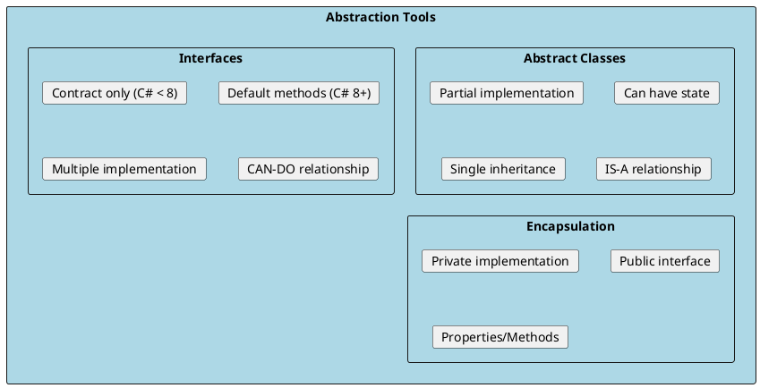
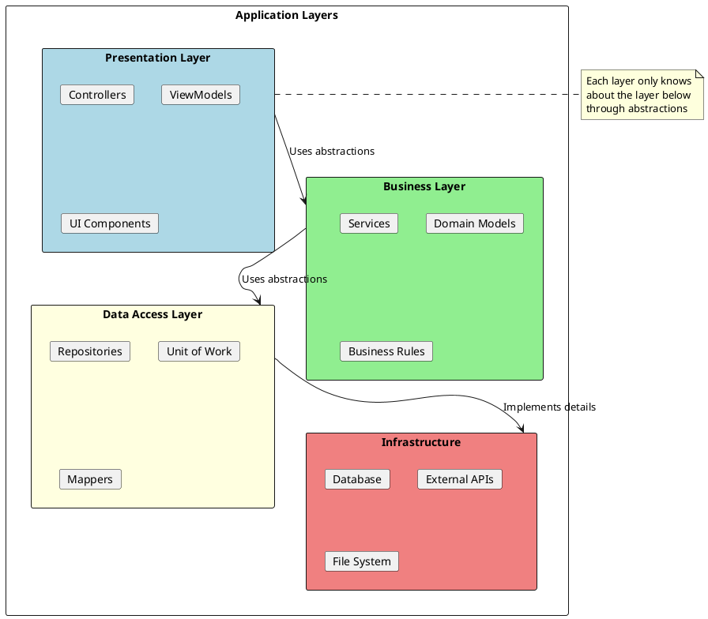
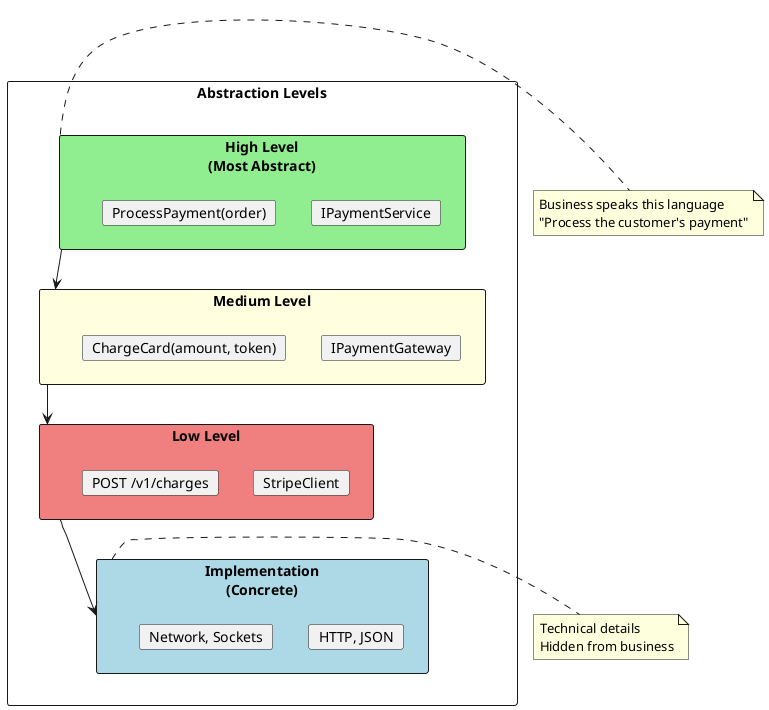
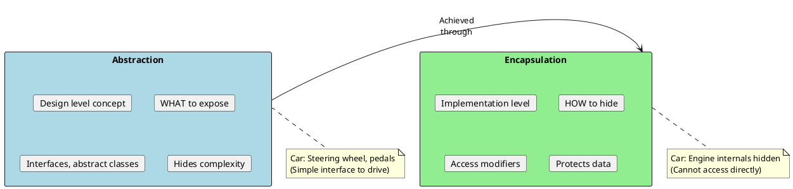

# Abstraction - Hiding Complexity

## What is Abstraction?

Abstraction is the process of hiding complex implementation details and showing only the necessary features of an object. It's about **what** an object does, not **how** it does it.

```plantuml
@startuml
skinparam monochrome false
skinparam shadowing false

rectangle "Without Abstraction" as bad #LightCoral {
  actor User
  class "Complex System" as complex {
    +Connect()
    +Authenticate()
    +ValidateInput()
    +TransformData()
    +ExecuteQuery()
    +HandleErrors()
    +LogResults()
    +CloseConnection()
  }
  User --> complex : Must understand\nall details
}

rectangle "With Abstraction" as good #LightGreen {
  actor User2 as "User"
  interface "Simple Interface" as simple {
    +GetData(id): Data
    +SaveData(data): void
  }
  class "Hidden Implementation" as hidden {
    All complexity hidden
  }
  User2 --> simple : Uses simple\ninterface
  simple <|.. hidden
}
@enduml
```

## Abstraction Mechanisms in C#



## Abstract Classes

```csharp
public abstract class Document
{
    // State - abstract classes can have fields
    protected string _content;
    protected DateTime _createdAt;

    // Abstract property - must be implemented
    public abstract string FileExtension { get; }

    // Abstract method - must be implemented
    public abstract void Parse(string rawContent);

    // Virtual method - can be overridden
    public virtual void Save(string path)
    {
        File.WriteAllText(path + FileExtension, _content);
    }

    // Concrete method - shared implementation
    public string GetMetadata()
    {
        return $"Created: {_createdAt}, Size: {_content?.Length ?? 0}";
    }

    // Protected constructor - cannot instantiate directly
    protected Document()
    {
        _createdAt = DateTime.Now;
    }
}

public class JsonDocument : Document
{
    public override string FileExtension => ".json";

    public override void Parse(string rawContent)
    {
        // Validate and format JSON
        _content = JsonSerializer.Serialize(
            JsonSerializer.Deserialize<object>(rawContent),
            new JsonSerializerOptions { WriteIndented = true });
    }
}

public class XmlDocument : Document
{
    public override string FileExtension => ".xml";

    public override void Parse(string rawContent)
    {
        // Parse and validate XML
        var doc = System.Xml.Linq.XDocument.Parse(rawContent);
        _content = doc.ToString();
    }

    // Override virtual method
    public override void Save(string path)
    {
        // Add XML declaration
        var fullContent = "<?xml version=\"1.0\"?>\n" + _content;
        File.WriteAllText(path + FileExtension, fullContent);
    }
}
```

## Abstraction Layers



### Repository Pattern - Abstraction Example

```csharp
// Abstraction - what operations are available
public interface IRepository<T> where T : class
{
    Task<T?> GetByIdAsync(int id);
    Task<IEnumerable<T>> GetAllAsync();
    Task<T> AddAsync(T entity);
    Task UpdateAsync(T entity);
    Task DeleteAsync(int id);
}

// Higher-level abstraction with specifications
public interface ISpecification<T>
{
    Expression<Func<T, bool>> Criteria { get; }
    List<Expression<Func<T, object>>> Includes { get; }
}

public interface IReadRepository<T> where T : class
{
    Task<T?> FirstOrDefaultAsync(ISpecification<T> spec);
    Task<IEnumerable<T>> ListAsync(ISpecification<T> spec);
}

// Concrete implementation - hidden from consumers
internal class EfRepository<T> : IRepository<T> where T : class
{
    private readonly DbContext _context;
    private readonly DbSet<T> _dbSet;

    public EfRepository(DbContext context)
    {
        _context = context;
        _dbSet = context.Set<T>();
    }

    public async Task<T?> GetByIdAsync(int id)
        => await _dbSet.FindAsync(id);

    public async Task<IEnumerable<T>> GetAllAsync()
        => await _dbSet.ToListAsync();

    public async Task<T> AddAsync(T entity)
    {
        await _dbSet.AddAsync(entity);
        await _context.SaveChangesAsync();
        return entity;
    }

    // ... other implementations
}

// Consumer only knows about the interface
public class OrderService
{
    private readonly IRepository<Order> _orderRepository;

    public OrderService(IRepository<Order> orderRepository)
    {
        _orderRepository = orderRepository;
    }

    public async Task<Order?> GetOrderAsync(int id)
    {
        // Doesn't know or care about EF, SQL, etc.
        return await _orderRepository.GetByIdAsync(id);
    }
}
```

## Levels of Abstraction



```csharp
// High level abstraction - business language
public interface IPaymentService
{
    Task<PaymentResult> ProcessOrderPaymentAsync(Order order);
}

// Medium level - payment concepts
public interface IPaymentGateway
{
    Task<ChargeResult> ChargeAsync(decimal amount, string paymentToken);
    Task<RefundResult> RefundAsync(string chargeId, decimal amount);
}

// Low level - specific provider
public interface IStripeClient
{
    Task<StripeCharge> CreateChargeAsync(StripeChargeRequest request);
}

// Implementation
public class PaymentService : IPaymentService
{
    private readonly IPaymentGateway _gateway;

    public async Task<PaymentResult> ProcessOrderPaymentAsync(Order order)
    {
        // High-level orchestration
        var result = await _gateway.ChargeAsync(order.Total, order.PaymentToken);
        return new PaymentResult { Success = result.Success };
    }
}

public class StripePaymentGateway : IPaymentGateway
{
    private readonly IStripeClient _client;

    public async Task<ChargeResult> ChargeAsync(decimal amount, string paymentToken)
    {
        // Medium-level: translate to Stripe concepts
        var request = new StripeChargeRequest
        {
            Amount = (int)(amount * 100), // Stripe uses cents
            Currency = "usd",
            Source = paymentToken
        };

        var charge = await _client.CreateChargeAsync(request);
        return new ChargeResult { Success = charge.Status == "succeeded" };
    }
}
```

## Abstraction Best Practices

### 1. Program to Interfaces

```csharp
// ❌ BAD: Depends on concrete implementation
public class OrderProcessor
{
    private readonly SqlOrderRepository _repository;  // Concrete!
    private readonly SmtpEmailSender _emailSender;    // Concrete!

    public OrderProcessor()
    {
        _repository = new SqlOrderRepository();  // Hard-coded!
        _emailSender = new SmtpEmailSender();    // Hard-coded!
    }
}

// ✅ GOOD: Depends on abstractions
public class OrderProcessor
{
    private readonly IOrderRepository _repository;
    private readonly IEmailSender _emailSender;

    public OrderProcessor(
        IOrderRepository repository,  // Injected abstraction
        IEmailSender emailSender)     // Injected abstraction
    {
        _repository = repository;
        _emailSender = emailSender;
    }
}
```

### 2. Don't Leak Implementation Details

```csharp
// ❌ BAD: Leaking SQL concepts
public interface IUserRepository
{
    User GetById(int id);
    void ExecuteSqlCommand(string sql);  // Leaks SQL!
    DbConnection GetConnection();         // Leaks DB!
}

// ✅ GOOD: Pure abstraction
public interface IUserRepository
{
    Task<User?> GetByIdAsync(int id);
    Task<User?> GetByEmailAsync(string email);
    Task<IEnumerable<User>> GetActiveUsersAsync();
    Task SaveAsync(User user);
}
```

### 3. Right Level of Abstraction

```csharp
// ❌ BAD: Too abstract (meaningless)
public interface IProcessor
{
    object Process(object input);
}

// ❌ BAD: Too specific (not reusable)
public interface IUserEmailValidator
{
    bool ValidateUserEmail(string email, int userId, DateTime registrationDate);
}

// ✅ GOOD: Right level of abstraction
public interface IEmailValidator
{
    ValidationResult Validate(string email);
}

public interface IUserValidator
{
    ValidationResult Validate(User user);
}
```

## Interview Questions & Answers

### Q1: What's the difference between abstraction and encapsulation?



### Q2: When should you use abstract class vs interface?

**Use Abstract Class when:**
- You need shared implementation
- You need state (fields)
- Classes have IS-A relationship
- You want to provide base functionality

**Use Interface when:**
- Multiple inheritance needed
- Defining capabilities (CAN-DO)
- Loose coupling required
- Testing/mocking is important

### Q3: Can an abstract class have a constructor?

**Answer**: Yes! Abstract class constructors are called when derived classes are instantiated. They're used to:
1. Initialize base class state
2. Enforce required parameters
3. Set up invariants

```csharp
public abstract class Entity
{
    public int Id { get; }
    public DateTime CreatedAt { get; }

    protected Entity(int id)
    {
        Id = id;
        CreatedAt = DateTime.UtcNow;
    }
}

public class User : Entity
{
    public string Name { get; }

    public User(int id, string name) : base(id)
    {
        Name = name;
    }
}
```

### Q4: What is "leaky abstraction"?

**Answer**: A leaky abstraction exposes implementation details that should be hidden. Examples:
- SQL exceptions bubbling through repository interface
- HTTP status codes in business layer
- ORM entities exposed to API layer

```csharp
// ❌ Leaky: SqlException can leak through
public interface IUserRepository
{
    User GetById(int id);  // Can throw SqlException!
}

// ✅ Better: Wrap in domain exception
public interface IUserRepository
{
    User GetById(int id);  // Throws RepositoryException
}
```
