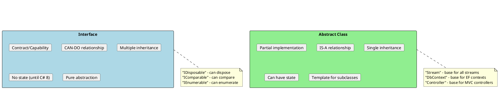
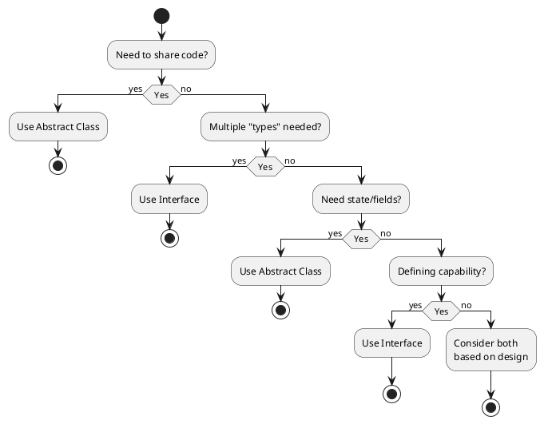
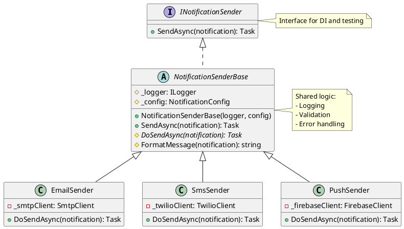
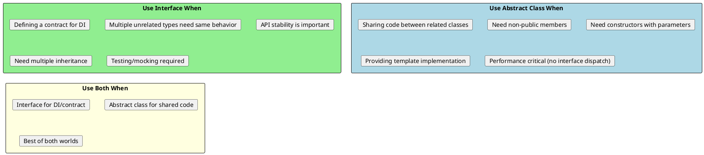
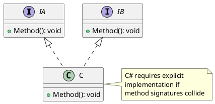

# Interfaces vs Abstract Classes

## The Fundamental Question

One of the most common interview questions: **When do you use an interface vs an abstract class?**



## Side-by-Side Comparison

| Feature | Interface | Abstract Class |
|---------|-----------|----------------|
| **Inheritance** | Multiple | Single |
| **Fields** | No (constants only) | Yes |
| **Constructors** | No | Yes |
| **Access Modifiers** | All public (C# < 8) | Any |
| **Default Implementation** | Yes (C# 8+) | Yes |
| **Static Members** | Yes (C# 11+) | Yes |
| **Purpose** | Define contract | Provide base implementation |
| **Relationship** | CAN-DO | IS-A |

## When to Use Each



## Real-World Examples

### Example 1: Logging (Interface)

```csharp
// Interface - defines capability
public interface ILogger
{
    void Log(LogLevel level, string message);
    void LogError(Exception ex, string message);
}

// Multiple implementations
public class ConsoleLogger : ILogger
{
    public void Log(LogLevel level, string message)
        => Console.WriteLine($"[{level}] {message}");

    public void LogError(Exception ex, string message)
        => Console.WriteLine($"[ERROR] {message}: {ex.Message}");
}

public class FileLogger : ILogger
{
    private readonly string _path;

    public FileLogger(string path) => _path = path;

    public void Log(LogLevel level, string message)
        => File.AppendAllText(_path, $"[{level}] {message}\n");

    public void LogError(Exception ex, string message)
        => File.AppendAllText(_path, $"[ERROR] {message}: {ex}\n");
}

public class AzureLogger : ILogger
{
    // Logs to Azure Application Insights
}

// Can combine multiple interfaces
public interface IAuditLogger : ILogger
{
    void LogAuditEvent(string userId, string action);
}
```

### Example 2: Data Access (Abstract Class)

```csharp
// Abstract class - shares implementation
public abstract class RepositoryBase<T> where T : class
{
    protected readonly DbContext Context;
    protected readonly DbSet<T> DbSet;

    protected RepositoryBase(DbContext context)
    {
        Context = context;
        DbSet = context.Set<T>();
    }

    // Shared implementation
    public virtual async Task<T?> GetByIdAsync(int id)
        => await DbSet.FindAsync(id);

    public virtual async Task<IEnumerable<T>> GetAllAsync()
        => await DbSet.ToListAsync();

    public virtual async Task AddAsync(T entity)
    {
        await DbSet.AddAsync(entity);
        await Context.SaveChangesAsync();
    }

    // Force derived classes to implement
    public abstract Task<IEnumerable<T>> GetActiveAsync();
}

public class UserRepository : RepositoryBase<User>
{
    public UserRepository(DbContext context) : base(context) { }

    public override async Task<IEnumerable<User>> GetActiveAsync()
        => await DbSet.Where(u => u.IsActive).ToListAsync();

    // Additional user-specific methods
    public async Task<User?> GetByEmailAsync(string email)
        => await DbSet.FirstOrDefaultAsync(u => u.Email == email);
}

public class ProductRepository : RepositoryBase<Product>
{
    public ProductRepository(DbContext context) : base(context) { }

    public override async Task<IEnumerable<Product>> GetActiveAsync()
        => await DbSet.Where(p => p.IsAvailable && p.Stock > 0).ToListAsync();
}
```

### Example 3: Both Together



```csharp
// Interface for DI/testing
public interface INotificationSender
{
    Task<SendResult> SendAsync(Notification notification);
}

// Abstract class for shared implementation
public abstract class NotificationSenderBase : INotificationSender
{
    protected readonly ILogger Logger;
    protected readonly NotificationConfig Config;

    protected NotificationSenderBase(ILogger logger, NotificationConfig config)
    {
        Logger = logger;
        Config = config;
    }

    // Template method pattern
    public async Task<SendResult> SendAsync(Notification notification)
    {
        try
        {
            Logger.Log(LogLevel.Info, $"Sending {GetType().Name}");

            if (!Validate(notification))
                return SendResult.ValidationFailed;

            var result = await DoSendAsync(notification);

            Logger.Log(LogLevel.Info, $"Sent successfully: {result.Id}");
            return result;
        }
        catch (Exception ex)
        {
            Logger.LogError(ex, "Failed to send notification");
            return SendResult.Failed(ex.Message);
        }
    }

    // Shared validation
    protected virtual bool Validate(Notification notification)
        => !string.IsNullOrEmpty(notification.Recipient);

    // Abstract - must implement
    protected abstract Task<SendResult> DoSendAsync(Notification notification);
}

// Concrete implementations
public class EmailSender : NotificationSenderBase
{
    private readonly ISmtpClient _smtp;

    public EmailSender(ILogger logger, NotificationConfig config, ISmtpClient smtp)
        : base(logger, config)
    {
        _smtp = smtp;
    }

    protected override bool Validate(Notification notification)
    {
        return base.Validate(notification) &&
               notification.Recipient.Contains("@");
    }

    protected override async Task<SendResult> DoSendAsync(Notification notification)
    {
        await _smtp.SendMailAsync(new MailMessage
        {
            To = { notification.Recipient },
            Subject = notification.Subject,
            Body = notification.Body
        });
        return SendResult.Success(Guid.NewGuid().ToString());
    }
}
```

## Default Interface Methods (C# 8+)

```csharp
// Modern interface with default implementation
public interface ILogger
{
    void Log(LogLevel level, string message);

    // Default implementations (C# 8+)
    void LogDebug(string message) => Log(LogLevel.Debug, message);
    void LogInfo(string message) => Log(LogLevel.Info, message);
    void LogWarning(string message) => Log(LogLevel.Warning, message);
    void LogError(string message) => Log(LogLevel.Error, message);

    // Default implementation with logic
    void LogException(Exception ex, string? context = null)
    {
        var message = context != null
            ? $"{context}: {ex.Message}"
            : ex.Message;
        Log(LogLevel.Error, message);
    }
}

// Only need to implement the core method
public class SimpleLogger : ILogger
{
    public void Log(LogLevel level, string message)
        => Console.WriteLine($"[{level}] {message}");

    // Gets LogDebug, LogInfo, LogWarning, LogError, LogException for free!
}

// Can still override defaults
public class DetailedLogger : ILogger
{
    public void Log(LogLevel level, string message)
        => Console.WriteLine($"[{DateTime.Now}] [{level}] {message}");

    // Override default
    public void LogException(Exception ex, string? context = null)
    {
        Log(LogLevel.Error, $"EXCEPTION in {context}");
        Log(LogLevel.Error, ex.ToString());  // Full stack trace
    }
}
```

## Static Abstract Members (C# 11+)

```csharp
// Interface with static abstract members
public interface IParsable<TSelf> where TSelf : IParsable<TSelf>
{
    static abstract TSelf Parse(string s);
    static abstract bool TryParse(string s, out TSelf result);
}

public readonly struct Money : IParsable<Money>
{
    public decimal Amount { get; }
    public string Currency { get; }

    public Money(decimal amount, string currency)
    {
        Amount = amount;
        Currency = currency;
    }

    public static Money Parse(string s)
    {
        // Parse "100.50 USD"
        var parts = s.Split(' ');
        return new Money(decimal.Parse(parts[0]), parts[1]);
    }

    public static bool TryParse(string s, out Money result)
    {
        try
        {
            result = Parse(s);
            return true;
        }
        catch
        {
            result = default;
            return false;
        }
    }
}

// Generic method using static interface
public T ParseValue<T>(string input) where T : IParsable<T>
{
    return T.Parse(input);  // Calls static method on T
}
```

## Design Guidelines



## Interview Questions & Answers

### Q1: Can you have fields in an interface?

**Answer**:
- **Before C# 8**: No, only method/property signatures
- **C# 8+**: Still no instance fields, but can have:
  - Constants
  - Static fields
  - Default method implementations

### Q2: Can an abstract class implement an interface partially?

**Answer**: Yes! An abstract class can implement some interface members and leave others abstract:

```csharp
public interface IRepository<T>
{
    Task<T> GetByIdAsync(int id);
    Task<IEnumerable<T>> GetAllAsync();
    Task SaveAsync(T entity);
}

public abstract class RepositoryBase<T> : IRepository<T>
{
    // Implement some
    public virtual Task<T> GetByIdAsync(int id) { /* ... */ }
    public virtual Task<IEnumerable<T>> GetAllAsync() { /* ... */ }

    // Leave for derived classes
    public abstract Task SaveAsync(T entity);
}
```

### Q3: Why would you choose interface over abstract class for DI?

**Answer**:
1. **Loose coupling**: No implementation dependency
2. **Testability**: Easy to mock interfaces
3. **Multiple interfaces**: A class can implement many
4. **API stability**: Changing abstract class can break derived classes

### Q4: What's the diamond problem and how does C# handle it?



```csharp
public interface IA { void Method(); }
public interface IB { void Method(); }

public class C : IA, IB
{
    // Explicit interface implementation resolves ambiguity
    void IA.Method() => Console.WriteLine("IA.Method");
    void IB.Method() => Console.WriteLine("IB.Method");

    // Optional: public version
    public void Method() => Console.WriteLine("C.Method");
}

// Usage
var c = new C();
c.Method();          // "C.Method"
((IA)c).Method();    // "IA.Method"
((IB)c).Method();    // "IB.Method"
```

### Q5: Should you prefer composition over inheritance?

**Answer**: Generally yes. The guidance "favor composition over inheritance" exists because:

1. **Flexibility**: Can change behavior at runtime
2. **Loose coupling**: No fragile base class problem
3. **Testability**: Easy to mock dependencies
4. **Single responsibility**: Smaller, focused classes

But inheritance is still valuable for true IS-A relationships and code reuse through template patterns.
