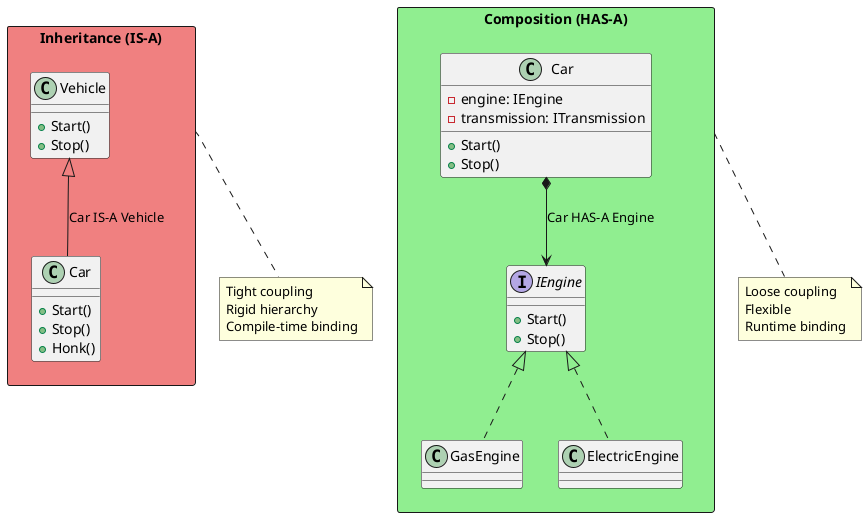
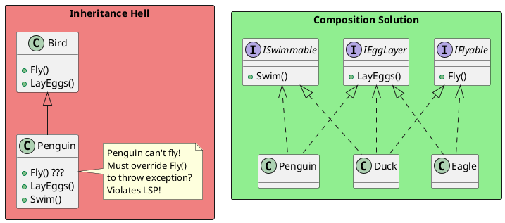
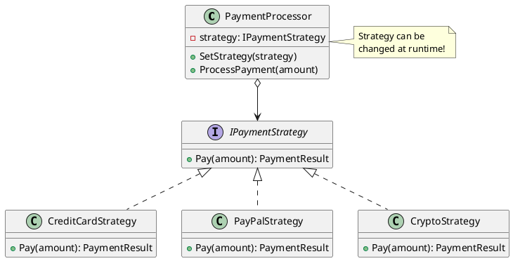
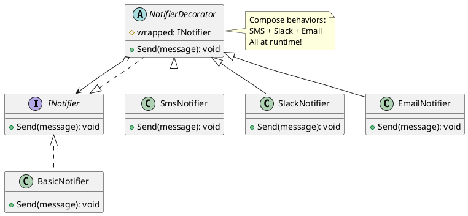
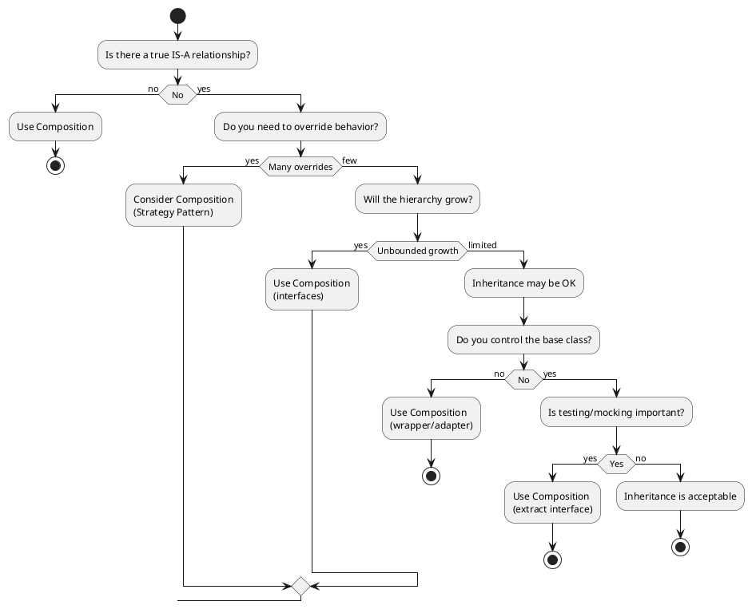

# Composition Over Inheritance

## The Principle

"Favor composition over inheritance" is one of the most important OOP design principles. It suggests using **HAS-A** relationships instead of **IS-A** relationships when possible.



## Why Composition is Preferred

### Problem 1: Fragile Base Class

```csharp
// ❌ INHERITANCE: Fragile base class problem
public class ArrayList
{
    private object[] _items;
    private int _count;

    public virtual void Add(object item)
    {
        _items[_count++] = item;
    }

    public virtual void AddRange(object[] items)
    {
        foreach (var item in items)
            Add(item);  // Calls virtual Add
    }
}

public class CountingArrayList : ArrayList
{
    public int AddCount { get; private set; }

    public override void Add(object item)
    {
        AddCount++;
        base.Add(item);
    }

    // Bug: If base AddRange changes to not call Add,
    // our counting breaks!
}

// If base class changes AddRange to:
// public virtual void AddRange(object[] items)
// {
//     Array.Copy(items, 0, _items, _count, items.Length);
//     _count += items.Length;
// }
// Our CountingArrayList count is now WRONG!
```

```csharp
// ✅ COMPOSITION: Immune to base class changes
public class CountingList<T>
{
    private readonly List<T> _list = new();
    public int AddCount { get; private set; }

    public void Add(T item)
    {
        AddCount++;
        _list.Add(item);
    }

    public void AddRange(IEnumerable<T> items)
    {
        foreach (var item in items)
            Add(item);  // Always increments count
    }

    // Delegate other methods
    public int Count => _list.Count;
    public T this[int index] => _list[index];
}
```

### Problem 2: Rigid Hierarchy



```csharp
// ✅ COMPOSITION: Flexible behaviors
public interface IMovementBehavior
{
    void Move();
}

public class FlyingBehavior : IMovementBehavior
{
    public void Move() => Console.WriteLine("Flying through the air");
}

public class SwimmingBehavior : IMovementBehavior
{
    public void Move() => Console.WriteLine("Swimming through water");
}

public class WalkingBehavior : IMovementBehavior
{
    public void Move() => Console.WriteLine("Walking on land");
}

public class Bird
{
    private readonly IMovementBehavior _movement;
    private readonly string _name;

    public Bird(string name, IMovementBehavior movement)
    {
        _name = name;
        _movement = movement;
    }

    public void Move()
    {
        Console.Write($"{_name} is ");
        _movement.Move();
    }
}

// Usage
var eagle = new Bird("Eagle", new FlyingBehavior());
var penguin = new Bird("Penguin", new SwimmingBehavior());
var duck = new Bird("Duck", new FlyingBehavior());  // Can change!

eagle.Move();   // "Eagle is Flying through the air"
penguin.Move(); // "Penguin is Swimming through water"
```

## Composition Patterns

### Strategy Pattern



```csharp
public interface IPaymentStrategy
{
    Task<PaymentResult> PayAsync(decimal amount);
}

public class CreditCardStrategy : IPaymentStrategy
{
    private readonly string _cardNumber;

    public CreditCardStrategy(string cardNumber) => _cardNumber = cardNumber;

    public async Task<PaymentResult> PayAsync(decimal amount)
    {
        // Process credit card
        return new PaymentResult { Success = true };
    }
}

public class PayPalStrategy : IPaymentStrategy
{
    private readonly string _email;

    public PayPalStrategy(string email) => _email = email;

    public async Task<PaymentResult> PayAsync(decimal amount)
    {
        // Process PayPal
        return new PaymentResult { Success = true };
    }
}

public class PaymentProcessor
{
    private IPaymentStrategy _strategy;

    public void SetStrategy(IPaymentStrategy strategy)
        => _strategy = strategy;

    public async Task<PaymentResult> ProcessAsync(decimal amount)
    {
        if (_strategy == null)
            throw new InvalidOperationException("Strategy not set");

        return await _strategy.PayAsync(amount);
    }
}

// Usage - can change strategy at runtime
var processor = new PaymentProcessor();

processor.SetStrategy(new CreditCardStrategy("4111..."));
await processor.ProcessAsync(100);

processor.SetStrategy(new PayPalStrategy("user@email.com"));
await processor.ProcessAsync(200);
```

### Decorator Pattern



```csharp
public interface INotifier
{
    void Send(string message);
}

public class BasicNotifier : INotifier
{
    public void Send(string message)
        => Console.WriteLine($"Basic: {message}");
}

public abstract class NotifierDecorator : INotifier
{
    protected readonly INotifier _wrapped;

    protected NotifierDecorator(INotifier wrapped) => _wrapped = wrapped;

    public virtual void Send(string message) => _wrapped.Send(message);
}

public class SmsNotifier : NotifierDecorator
{
    public SmsNotifier(INotifier wrapped) : base(wrapped) { }

    public override void Send(string message)
    {
        base.Send(message);
        Console.WriteLine($"SMS: {message}");
    }
}

public class SlackNotifier : NotifierDecorator
{
    public SlackNotifier(INotifier wrapped) : base(wrapped) { }

    public override void Send(string message)
    {
        base.Send(message);
        Console.WriteLine($"Slack: {message}");
    }
}

public class EmailNotifier : NotifierDecorator
{
    public EmailNotifier(INotifier wrapped) : base(wrapped) { }

    public override void Send(string message)
    {
        base.Send(message);
        Console.WriteLine($"Email: {message}");
    }
}

// Usage - compose behaviors
INotifier notifier = new BasicNotifier();
notifier = new SmsNotifier(notifier);
notifier = new SlackNotifier(notifier);
notifier = new EmailNotifier(notifier);

notifier.Send("Server is down!");
// Output:
// Basic: Server is down!
// SMS: Server is down!
// Slack: Server is down!
// Email: Server is down!
```

### Dependency Injection

```csharp
// ✅ Composition through DI
public class OrderService
{
    private readonly IOrderRepository _repository;
    private readonly IPaymentService _payment;
    private readonly IEmailService _email;
    private readonly ILogger<OrderService> _logger;

    public OrderService(
        IOrderRepository repository,
        IPaymentService payment,
        IEmailService email,
        ILogger<OrderService> logger)
    {
        _repository = repository;
        _payment = payment;
        _email = email;
        _logger = logger;
    }

    public async Task<OrderResult> ProcessOrderAsync(Order order)
    {
        _logger.LogInformation("Processing order {OrderId}", order.Id);

        var paymentResult = await _payment.ProcessAsync(order.Total);
        if (!paymentResult.Success)
            return OrderResult.PaymentFailed;

        await _repository.SaveAsync(order);
        await _email.SendOrderConfirmationAsync(order);

        return OrderResult.Success;
    }
}

// Registration in DI container
services.AddScoped<IOrderRepository, SqlOrderRepository>();
services.AddScoped<IPaymentService, StripePaymentService>();
services.AddScoped<IEmailService, SendGridEmailService>();
services.AddScoped<OrderService>();
```

## When to Use Inheritance

Despite "composition over inheritance," inheritance is still valuable:

```plantuml
@startuml
skinparam monochrome false
skinparam shadowing false

rectangle "Good Uses of Inheritance" as good #LightGreen {
  card "True IS-A relationship"
  card "Framework extension points"
  card "Template Method pattern"
  card "Shared implementation"
}

rectangle "Examples" as examples #LightBlue {
  class Exception
  class IOException
  class FileNotFoundException

  Exception <|-- IOException
  IOException <|-- FileNotFoundException

  class Controller
  class HomeController

  Controller <|-- HomeController
}

note bottom of examples
  - Exception hierarchy
  - ASP.NET Controller base
  - Stream classes
  - DbContext
end note
@enduml
```

```csharp
// ✅ Good inheritance: True IS-A, template method
public abstract class ReportGenerator
{
    // Template method
    public Report Generate(ReportRequest request)
    {
        var data = FetchData(request);
        var processed = ProcessData(data);
        var formatted = FormatReport(processed);
        return CreateReport(formatted);
    }

    protected abstract object FetchData(ReportRequest request);
    protected abstract object ProcessData(object data);

    protected virtual string FormatReport(object data)
        => JsonSerializer.Serialize(data);

    protected virtual Report CreateReport(string content)
        => new Report { Content = content, GeneratedAt = DateTime.UtcNow };
}

public class SalesReport : ReportGenerator
{
    private readonly ISalesRepository _sales;

    public SalesReport(ISalesRepository sales) => _sales = sales;

    protected override object FetchData(ReportRequest request)
        => _sales.GetSalesInRange(request.StartDate, request.EndDate);

    protected override object ProcessData(object data)
    {
        var sales = (IEnumerable<Sale>)data;
        return new
        {
            TotalSales = sales.Sum(s => s.Amount),
            Count = sales.Count(),
            Average = sales.Average(s => s.Amount)
        };
    }
}
```

## Composition vs Inheritance Decision Tree



## Interview Questions & Answers

### Q1: What does "favor composition over inheritance" mean?

**Answer**: It means when designing classes, prefer creating objects that contain other objects (HAS-A) rather than inheriting from other classes (IS-A). Benefits:
1. More flexible - can change behavior at runtime
2. Looser coupling - easier to modify and test
3. Avoids fragile base class problem
4. No diamond problem concerns

### Q2: Give an example where inheritance is better than composition.

**Answer**: Exception hierarchies are a good example:

```csharp
// Inheritance is natural here
try
{
    // ...
}
catch (FileNotFoundException ex)  // Most specific
{
    // Handle missing file
}
catch (IOException ex)  // More general
{
    // Handle other I/O issues
}
catch (Exception ex)  // Most general
{
    // Handle anything else
}
```

The IS-A relationship is genuine, and the catch block behavior relies on inheritance.

### Q3: How does composition improve testability?

**Answer**: Composition with interfaces allows easy mocking:

```csharp
// With composition
public class OrderService
{
    private readonly IPaymentGateway _payment;

    public OrderService(IPaymentGateway payment)
        => _payment = payment;
}

// Easy to test
[Fact]
public async Task ProcessOrder_WhenPaymentFails_ReturnsError()
{
    var mockPayment = new Mock<IPaymentGateway>();
    mockPayment.Setup(p => p.ProcessAsync(It.IsAny<decimal>()))
               .ReturnsAsync(PaymentResult.Failed);

    var service = new OrderService(mockPayment.Object);
    var result = await service.ProcessOrderAsync(new Order());

    Assert.False(result.Success);
}
```

### Q4: What is the "fragile base class" problem?

**Answer**: When a derived class depends on implementation details of a base class, changes to the base class can break the derived class unexpectedly. This happens because:
1. Derived class overrides methods that base class calls internally
2. Base class implementation changes how it calls those methods
3. Derived class behavior breaks without any code changes

Composition avoids this by delegating to interfaces, not implementations.

### Q5: Can you combine inheritance and composition?

**Answer**: Yes! A common pattern:
1. Define an interface for the contract
2. Create an abstract base class implementing common logic
3. Derived classes inherit base and compose additional behaviors

```csharp
public interface IRepository<T> { }  // Contract

public abstract class RepositoryBase<T> : IRepository<T>  // Shared code
{
    protected readonly DbContext _context;
    // Common implementation
}

public class UserRepository : RepositoryBase<User>
{
    private readonly ICache _cache;  // Composition

    public UserRepository(DbContext context, ICache cache) : base(context)
    {
        _cache = cache;  // Composed behavior
    }
}
```
