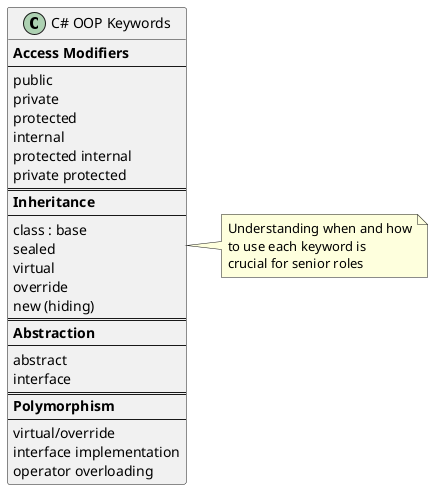

# Object-Oriented Programming Principles

## The Four Pillars of OOP

Object-Oriented Programming is built on four fundamental pillars that enable us to write maintainable, reusable, and scalable code.

```plantuml
@startuml
skinparam monochrome false
skinparam shadowing false
skinparam rectangle {
  RoundCorner 15
}

rectangle "OOP Pillars" as oop #LightBlue {
  rectangle "Encapsulation" as enc #LightGreen {
    card "Hide internal state"
    card "Expose controlled interface"
    card "Protect data integrity"
  }

  rectangle "Inheritance" as inh #LightYellow {
    card "Code reuse"
    card "IS-A relationship"
    card "Hierarchical classification"
  }

  rectangle "Polymorphism" as poly #LightCoral {
    card "One interface, many forms"
    card "Runtime flexibility"
    card "Method overriding"
  }

  rectangle "Abstraction" as abs #LightPurple {
    card "Hide complexity"
    card "Show essential features"
    card "Define contracts"
  }
}

note bottom of oop
  These pillars work together to create
  flexible, maintainable software
end note
@enduml
```

## Why OOP Matters for Senior Engineers

Understanding OOP deeply is crucial because:

1. **Design Decisions**: You'll make architectural decisions daily
2. **Code Reviews**: You need to identify violations and anti-patterns
3. **Mentoring**: Explaining these concepts to junior developers
4. **Interviews**: These are foundational questions for senior positions

## Topics Covered

| Topic | Description | Key Concepts |
|-------|-------------|--------------|
| [Classes & Objects](./01-ClassesAndObjects.md) | Building blocks of OOP | Constructors, fields, methods, properties |
| [Encapsulation](./02-Encapsulation.md) | Data hiding and protection | Access modifiers, properties, immutability |
| [Inheritance](./03-Inheritance.md) | Code reuse through hierarchy | Base/derived classes, virtual methods |
| [Polymorphism](./04-Polymorphism.md) | One interface, many implementations | Overriding, overloading, interfaces |
| [Abstraction](./05-Abstraction.md) | Hiding complexity | Abstract classes, interfaces |
| [Interfaces vs Abstract Classes](./06-InterfacesVsAbstractClasses.md) | When to use which | Design decisions, trade-offs |
| [Composition over Inheritance](./07-CompositionOverInheritance.md) | Modern design principles | HAS-A vs IS-A, flexibility |

## Quick Reference: OOP in C#



## Common Interview Questions Preview

- What's the difference between abstraction and encapsulation?
- When would you use composition over inheritance?
- Can you have multiple inheritance in C#? How do you achieve similar behavior?
- What's the difference between `virtual` and `abstract`?
- Explain the Liskov Substitution Principle in context of inheritance
