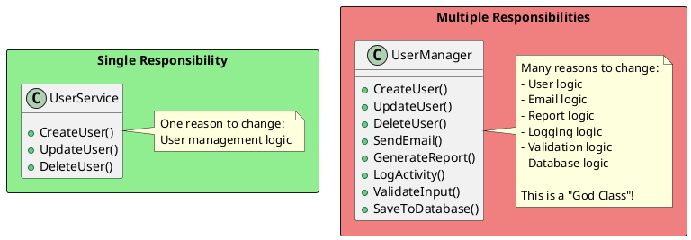
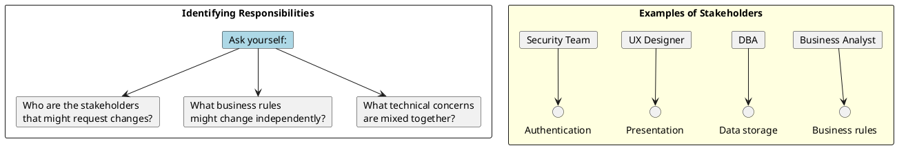
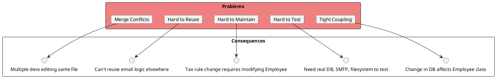
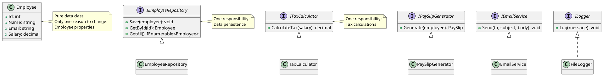
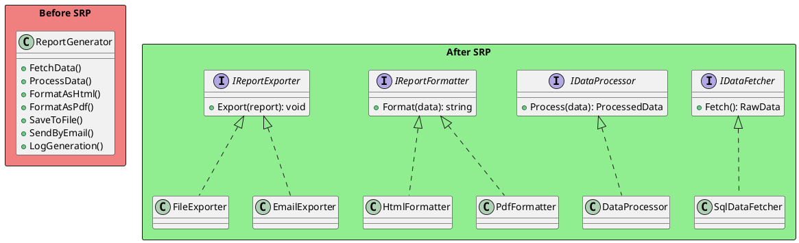
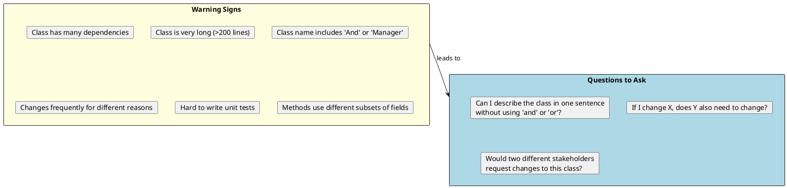
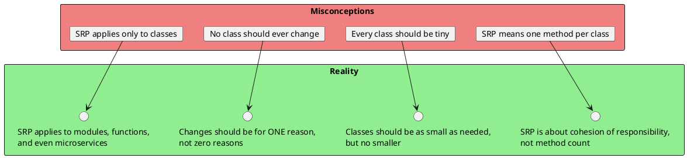

# Single Responsibility Principle (SRP)

## The Principle

> "A class should have one, and only one, reason to change."
> — Robert C. Martin

The Single Responsibility Principle states that every class should have responsibility over a single part of the functionality provided by the software. That responsibility should be entirely encapsulated by the class.



## What is a "Responsibility"?

A responsibility is a **reason to change**. If you can think of more than one motivation for changing a class, it has more than one responsibility.



## Violation Example: The God Class

```csharp
// ❌ BAD: This class violates SRP - has multiple responsibilities
public class Employee
{
    public int Id { get; set; }
    public string Name { get; set; }
    public decimal Salary { get; set; }

    // Responsibility 1: Employee data management
    public void Save()
    {
        using var connection = new SqlConnection("...");
        connection.Open();
        // SQL to save employee
        var cmd = new SqlCommand("INSERT INTO Employees...", connection);
        cmd.ExecuteNonQuery();
    }

    // Responsibility 2: Salary calculations
    public decimal CalculateTax()
    {
        if (Salary > 100000)
            return Salary * 0.35m;
        else if (Salary > 50000)
            return Salary * 0.25m;
        else
            return Salary * 0.15m;
    }

    // Responsibility 3: Report generation
    public string GeneratePaySlip()
    {
        return $@"
            Employee: {Name}
            Gross Salary: {Salary:C}
            Tax: {CalculateTax():C}
            Net Salary: {Salary - CalculateTax():C}
        ";
    }

    // Responsibility 4: Email notifications
    public void SendPaySlipEmail()
    {
        var smtp = new SmtpClient("smtp.company.com");
        var message = new MailMessage
        {
            Subject = "Your Pay Slip",
            Body = GeneratePaySlip()
        };
        smtp.Send(message);
    }

    // Responsibility 5: Logging
    public void LogActivity(string activity)
    {
        File.AppendAllText("employee_log.txt",
            $"{DateTime.Now}: {Name} - {activity}\n");
    }
}
```

### Problems with this approach:



## Refactored Solution: Separated Responsibilities



```csharp
// ✅ GOOD: Each class has a single responsibility

// Responsibility: Employee data representation
public class Employee
{
    public int Id { get; set; }
    public string Name { get; set; }
    public string Email { get; set; }
    public decimal Salary { get; set; }
}

// Responsibility: Data persistence
public interface IEmployeeRepository
{
    Task SaveAsync(Employee employee);
    Task<Employee?> GetByIdAsync(int id);
    Task<IEnumerable<Employee>> GetAllAsync();
}

public class EmployeeRepository : IEmployeeRepository
{
    private readonly DbContext _context;

    public EmployeeRepository(DbContext context) => _context = context;

    public async Task SaveAsync(Employee employee)
    {
        _context.Employees.Add(employee);
        await _context.SaveChangesAsync();
    }

    public async Task<Employee?> GetByIdAsync(int id)
        => await _context.Employees.FindAsync(id);

    public async Task<IEnumerable<Employee>> GetAllAsync()
        => await _context.Employees.ToListAsync();
}

// Responsibility: Tax calculations
public interface ITaxCalculator
{
    decimal CalculateTax(decimal salary);
}

public class ProgressiveTaxCalculator : ITaxCalculator
{
    private readonly TaxBracket[] _brackets;

    public ProgressiveTaxCalculator(TaxBracket[] brackets)
        => _brackets = brackets;

    public decimal CalculateTax(decimal salary)
    {
        foreach (var bracket in _brackets.OrderByDescending(b => b.MinSalary))
        {
            if (salary >= bracket.MinSalary)
                return salary * bracket.Rate;
        }
        return 0;
    }
}

// Responsibility: Pay slip generation
public interface IPaySlipGenerator
{
    PaySlip Generate(Employee employee);
}

public class PaySlipGenerator : IPaySlipGenerator
{
    private readonly ITaxCalculator _taxCalculator;

    public PaySlipGenerator(ITaxCalculator taxCalculator)
        => _taxCalculator = taxCalculator;

    public PaySlip Generate(Employee employee)
    {
        var tax = _taxCalculator.CalculateTax(employee.Salary);
        return new PaySlip
        {
            EmployeeName = employee.Name,
            GrossSalary = employee.Salary,
            Tax = tax,
            NetSalary = employee.Salary - tax,
            GeneratedAt = DateTime.UtcNow
        };
    }
}

// Responsibility: Email sending
public interface IEmailService
{
    Task SendAsync(string to, string subject, string body);
}

public class SmtpEmailService : IEmailService
{
    private readonly SmtpSettings _settings;

    public SmtpEmailService(IOptions<SmtpSettings> settings)
        => _settings = settings.Value;

    public async Task SendAsync(string to, string subject, string body)
    {
        using var client = new SmtpClient(_settings.Host);
        await client.SendMailAsync(new MailMessage(_settings.From, to, subject, body));
    }
}

// Responsibility: Logging
public interface ILogger
{
    void Log(LogLevel level, string message);
}

public class FileLogger : ILogger
{
    private readonly string _filePath;

    public FileLogger(string filePath) => _filePath = filePath;

    public void Log(LogLevel level, string message)
    {
        var entry = $"{DateTime.UtcNow:O} [{level}] {message}";
        File.AppendAllText(_filePath, entry + Environment.NewLine);
    }
}
```

## Orchestrating Classes: Service Layer

```csharp
// ✅ PayrollService orchestrates the responsibilities but doesn't implement them
public class PayrollService
{
    private readonly IEmployeeRepository _employeeRepo;
    private readonly IPaySlipGenerator _paySlipGenerator;
    private readonly IEmailService _emailService;
    private readonly ILogger _logger;

    public PayrollService(
        IEmployeeRepository employeeRepo,
        IPaySlipGenerator paySlipGenerator,
        IEmailService emailService,
        ILogger logger)
    {
        _employeeRepo = employeeRepo;
        _paySlipGenerator = paySlipGenerator;
        _emailService = emailService;
        _logger = logger;
    }

    public async Task ProcessPayrollAsync(int employeeId)
    {
        _logger.Log(LogLevel.Info, $"Processing payroll for employee {employeeId}");

        var employee = await _employeeRepo.GetByIdAsync(employeeId)
            ?? throw new EmployeeNotFoundException(employeeId);

        var paySlip = _paySlipGenerator.Generate(employee);

        await _emailService.SendAsync(
            employee.Email,
            "Your Pay Slip",
            paySlip.ToString());

        _logger.Log(LogLevel.Info, $"Payroll processed for {employee.Name}");
    }
}
```

## Real-World Examples

### Example 1: Report Generation



```csharp
// ✅ SRP-compliant report generation

public interface IDataFetcher<T>
{
    Task<T> FetchAsync(ReportCriteria criteria);
}

public interface IDataProcessor<TIn, TOut>
{
    TOut Process(TIn data);
}

public interface IReportFormatter
{
    string Format(ReportData data);
    string ContentType { get; }
}

public interface IReportExporter
{
    Task ExportAsync(string content, string contentType, ExportOptions options);
}

// Each implementation has one responsibility
public class SalesDataFetcher : IDataFetcher<SalesData>
{
    private readonly ISalesRepository _repository;

    public async Task<SalesData> FetchAsync(ReportCriteria criteria)
        => await _repository.GetSalesDataAsync(criteria.StartDate, criteria.EndDate);
}

public class SalesDataProcessor : IDataProcessor<SalesData, ReportData>
{
    public ReportData Process(SalesData data)
    {
        return new ReportData
        {
            TotalSales = data.Sales.Sum(s => s.Amount),
            SalesByRegion = data.Sales.GroupBy(s => s.Region)
                                     .ToDictionary(g => g.Key, g => g.Sum(s => s.Amount))
        };
    }
}

public class HtmlReportFormatter : IReportFormatter
{
    public string ContentType => "text/html";

    public string Format(ReportData data)
    {
        var sb = new StringBuilder();
        sb.AppendLine("<html><body>");
        sb.AppendLine($"<h1>Total Sales: {data.TotalSales:C}</h1>");
        // ... more HTML formatting
        sb.AppendLine("</body></html>");
        return sb.ToString();
    }
}

public class PdfReportFormatter : IReportFormatter
{
    public string ContentType => "application/pdf";

    public string Format(ReportData data)
    {
        // PDF generation logic
        return "PDF content...";
    }
}

// Orchestrator
public class ReportService
{
    private readonly IDataFetcher<SalesData> _fetcher;
    private readonly IDataProcessor<SalesData, ReportData> _processor;
    private readonly IEnumerable<IReportFormatter> _formatters;
    private readonly IEnumerable<IReportExporter> _exporters;

    public async Task GenerateReportAsync(
        ReportCriteria criteria,
        string format,
        ExportOptions exportOptions)
    {
        var rawData = await _fetcher.FetchAsync(criteria);
        var processedData = _processor.Process(rawData);

        var formatter = _formatters.First(f => f.ContentType.Contains(format));
        var content = formatter.Format(processedData);

        foreach (var exporter in _exporters)
        {
            await exporter.ExportAsync(content, formatter.ContentType, exportOptions);
        }
    }
}
```

### Example 2: User Registration

```csharp
// ❌ BAD: Single class doing everything
public class UserRegistrationHandler
{
    public async Task<User> Register(RegisterRequest request)
    {
        // Validation
        if (string.IsNullOrEmpty(request.Email))
            throw new ValidationException("Email required");
        if (!request.Email.Contains("@"))
            throw new ValidationException("Invalid email");
        if (request.Password.Length < 8)
            throw new ValidationException("Password too short");

        // Check if user exists
        using var conn = new SqlConnection("...");
        var existing = await conn.QueryFirstOrDefaultAsync<User>(
            "SELECT * FROM Users WHERE Email = @Email", request);
        if (existing != null)
            throw new DuplicateUserException();

        // Hash password
        using var sha = SHA256.Create();
        var hash = Convert.ToBase64String(
            sha.ComputeHash(Encoding.UTF8.GetBytes(request.Password)));

        // Create user
        var user = new User { Email = request.Email, PasswordHash = hash };
        await conn.ExecuteAsync("INSERT INTO Users...", user);

        // Send welcome email
        var smtp = new SmtpClient();
        await smtp.SendMailAsync(new MailMessage(
            "noreply@company.com",
            request.Email,
            "Welcome!",
            "Thanks for registering..."));

        // Log registration
        File.AppendAllText("registrations.log",
            $"{DateTime.Now}: {request.Email} registered\n");

        return user;
    }
}
```

```csharp
// ✅ GOOD: Separated responsibilities

public interface IUserValidator
{
    ValidationResult Validate(RegisterRequest request);
}

public interface IPasswordHasher
{
    string Hash(string password);
    bool Verify(string password, string hash);
}

public interface IUserRepository
{
    Task<User?> GetByEmailAsync(string email);
    Task<User> CreateAsync(User user);
}

public interface IWelcomeEmailSender
{
    Task SendAsync(User user);
}

public interface IRegistrationLogger
{
    void LogRegistration(User user);
}

public class UserRegistrationService
{
    private readonly IUserValidator _validator;
    private readonly IPasswordHasher _hasher;
    private readonly IUserRepository _repository;
    private readonly IWelcomeEmailSender _emailSender;
    private readonly IRegistrationLogger _logger;

    public UserRegistrationService(
        IUserValidator validator,
        IPasswordHasher hasher,
        IUserRepository repository,
        IWelcomeEmailSender emailSender,
        IRegistrationLogger logger)
    {
        _validator = validator;
        _hasher = hasher;
        _repository = repository;
        _emailSender = emailSender;
        _logger = logger;
    }

    public async Task<User> RegisterAsync(RegisterRequest request)
    {
        var validation = _validator.Validate(request);
        if (!validation.IsValid)
            throw new ValidationException(validation.Errors);

        var existing = await _repository.GetByEmailAsync(request.Email);
        if (existing != null)
            throw new DuplicateUserException(request.Email);

        var user = new User
        {
            Email = request.Email,
            PasswordHash = _hasher.Hash(request.Password),
            CreatedAt = DateTime.UtcNow
        };

        await _repository.CreateAsync(user);
        await _emailSender.SendAsync(user);
        _logger.LogRegistration(user);

        return user;
    }
}
```

## Identifying SRP Violations



## SRP and Testing

```csharp
// ✅ Easy to test when SRP is followed
public class TaxCalculatorTests
{
    private readonly ProgressiveTaxCalculator _calculator;

    public TaxCalculatorTests()
    {
        _calculator = new ProgressiveTaxCalculator(new[]
        {
            new TaxBracket { MinSalary = 100000, Rate = 0.35m },
            new TaxBracket { MinSalary = 50000, Rate = 0.25m },
            new TaxBracket { MinSalary = 0, Rate = 0.15m }
        });
    }

    [Fact]
    public void CalculateTax_HighIncome_Returns35Percent()
    {
        var tax = _calculator.CalculateTax(150000);
        Assert.Equal(52500, tax);
    }

    [Fact]
    public void CalculateTax_MediumIncome_Returns25Percent()
    {
        var tax = _calculator.CalculateTax(75000);
        Assert.Equal(18750, tax);
    }

    [Fact]
    public void CalculateTax_LowIncome_Returns15Percent()
    {
        var tax = _calculator.CalculateTax(30000);
        Assert.Equal(4500, tax);
    }
}

// ✅ Easy to mock dependencies
public class PayrollServiceTests
{
    [Fact]
    public async Task ProcessPayroll_ValidEmployee_SendsEmail()
    {
        // Arrange
        var mockRepo = new Mock<IEmployeeRepository>();
        var mockGenerator = new Mock<IPaySlipGenerator>();
        var mockEmail = new Mock<IEmailService>();
        var mockLogger = new Mock<ILogger>();

        var employee = new Employee { Id = 1, Name = "John", Email = "john@test.com" };
        mockRepo.Setup(r => r.GetByIdAsync(1)).ReturnsAsync(employee);
        mockGenerator.Setup(g => g.Generate(employee))
                     .Returns(new PaySlip { EmployeeName = "John" });

        var service = new PayrollService(
            mockRepo.Object,
            mockGenerator.Object,
            mockEmail.Object,
            mockLogger.Object);

        // Act
        await service.ProcessPayrollAsync(1);

        // Assert
        mockEmail.Verify(e => e.SendAsync(
            "john@test.com",
            "Your Pay Slip",
            It.IsAny<string>()), Times.Once);
    }
}
```

## Common Misconceptions



## Interview Questions & Answers

### Q1: What is the Single Responsibility Principle?

**Answer**: SRP states that a class should have only one reason to change, meaning it should have only one job or responsibility. This principle promotes cohesion and reduces coupling, making code easier to maintain and test.

### Q2: How do you identify SRP violations?

**Answer**: Look for these signs:
1. Class has many unrelated methods
2. Class name contains "And" or "Manager" or "Handler"
3. Different parts of the class change for different business reasons
4. Difficulty writing focused unit tests
5. Large number of dependencies

### Q3: Give an example of applying SRP.

**Answer**:
```csharp
// Before: Order class handling business logic, persistence, and email
public class Order
{
    public void Process() { /* business logic */ }
    public void SaveToDb() { /* SQL code */ }
    public void SendConfirmation() { /* email code */ }
}

// After: Separated responsibilities
public class Order { /* only order data */ }
public class OrderProcessor { public void Process(Order order) { } }
public class OrderRepository { public void Save(Order order) { } }
public class OrderNotificationService { public void SendConfirmation(Order order) { } }
```

### Q4: What's the relationship between SRP and cohesion?

**Answer**: SRP promotes high cohesion. A class following SRP has all its members working together toward a single purpose. High cohesion means the class's methods and properties are closely related and focused on one responsibility.

### Q5: Can SRP be applied at different levels?

**Answer**: Yes, SRP applies at multiple levels:
- **Method level**: Each method should do one thing
- **Class level**: Each class should have one responsibility
- **Module level**: Each module should have one purpose
- **Service level**: Each microservice should handle one business capability

### Q6: How does SRP relate to other SOLID principles?

**Answer**:
- **OCP**: Classes with single responsibility are easier to extend without modification
- **ISP**: SRP often leads to creating focused interfaces
- **DIP**: Single-responsibility classes are easier to inject as dependencies
- **LSP**: Focused classes are less likely to violate substitution rules
