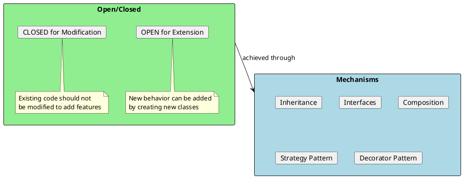
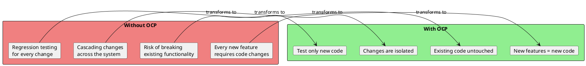
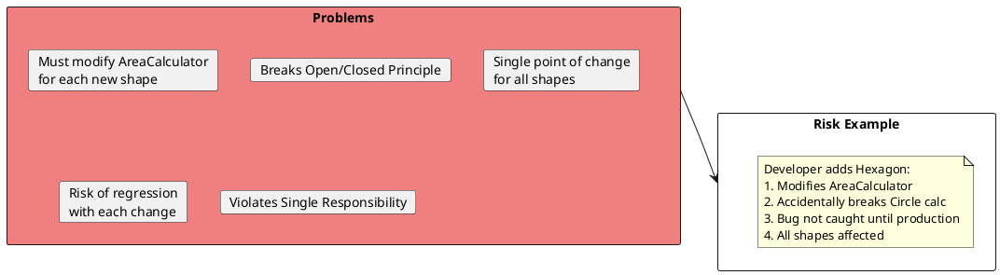
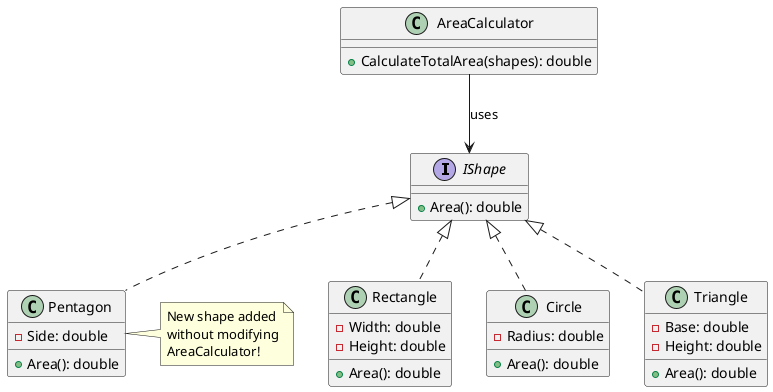
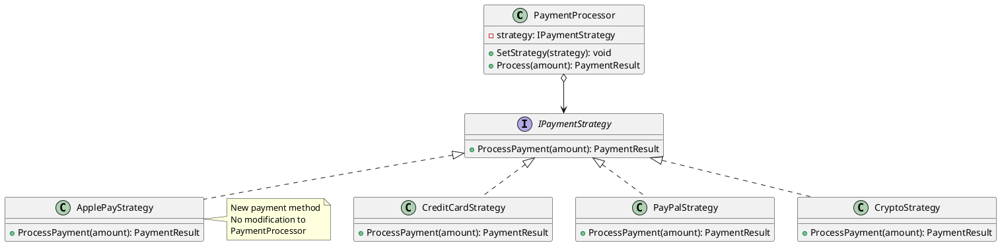
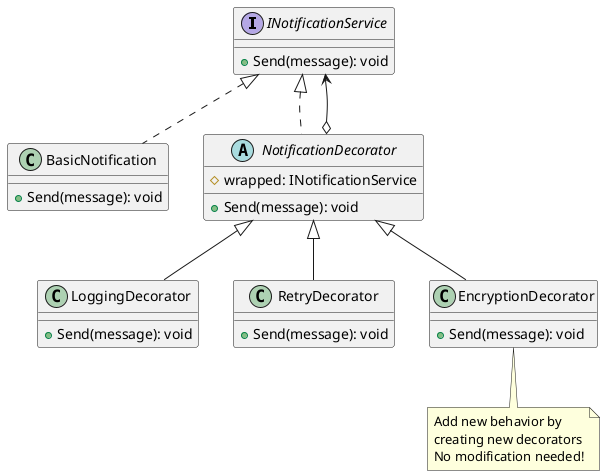
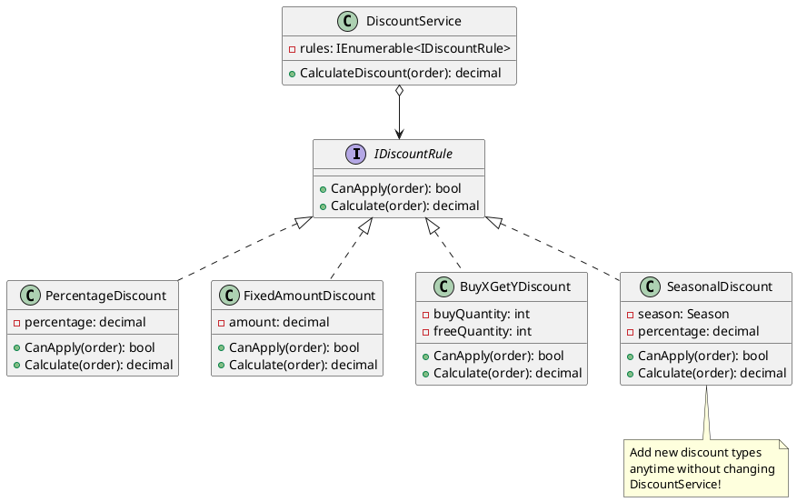
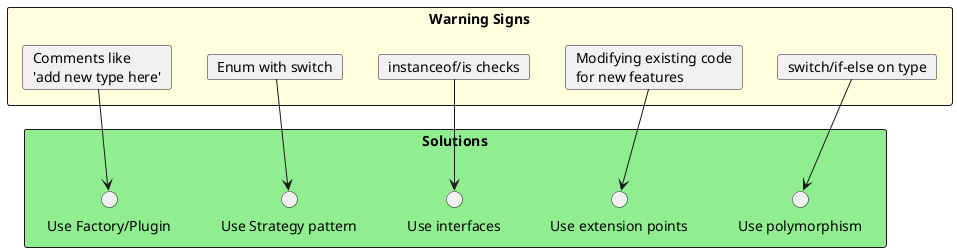

# Open/Closed Principle (OCP)

## The Principle

> "Software entities (classes, modules, functions, etc.) should be open for extension but closed for modification."
> — Bertrand Meyer

The Open/Closed Principle states that you should be able to add new functionality to a system without changing existing code. Instead of modifying existing classes, you extend them.



## Why OCP Matters



## Violation Example: The Switch Statement Smell

```csharp
// ❌ BAD: Violates OCP - must modify this class for every new shape
public class AreaCalculator
{
    public double CalculateArea(object shape)
    {
        if (shape is Rectangle rectangle)
        {
            return rectangle.Width * rectangle.Height;
        }
        else if (shape is Circle circle)
        {
            return Math.PI * circle.Radius * circle.Radius;
        }
        else if (shape is Triangle triangle)
        {
            return 0.5 * triangle.Base * triangle.Height;
        }
        // Adding a new shape requires modifying this method!
        // What about Pentagon? Hexagon? Ellipse?

        throw new NotSupportedException($"Shape {shape.GetType().Name} not supported");
    }
}

// Usage
var calculator = new AreaCalculator();
var shapes = new object[] { new Rectangle(5, 10), new Circle(7), new Triangle(6, 8) };
var totalArea = shapes.Sum(s => calculator.CalculateArea(s));
```

### Problems with this approach:



## Refactored Solution: Polymorphism



```csharp
// ✅ GOOD: Follows OCP - can add new shapes without modification

public interface IShape
{
    double Area { get; }
}

public class Rectangle : IShape
{
    public double Width { get; }
    public double Height { get; }

    public Rectangle(double width, double height)
    {
        Width = width;
        Height = height;
    }

    public double Area => Width * Height;
}

public class Circle : IShape
{
    public double Radius { get; }

    public Circle(double radius) => Radius = radius;

    public double Area => Math.PI * Radius * Radius;
}

public class Triangle : IShape
{
    public double Base { get; }
    public double Height { get; }

    public Triangle(double @base, double height)
    {
        Base = @base;
        Height = height;
    }

    public double Area => 0.5 * Base * Height;
}

// AreaCalculator is CLOSED for modification
public class AreaCalculator
{
    public double CalculateTotalArea(IEnumerable<IShape> shapes)
        => shapes.Sum(shape => shape.Area);
}

// Adding a new shape - Pentagon
// No modification to existing code required!
public class Pentagon : IShape
{
    public double Side { get; }

    public Pentagon(double side) => Side = side;

    public double Area => 0.25 * Math.Sqrt(5 * (5 + 2 * Math.Sqrt(5))) * Side * Side;
}

// Usage - works with any IShape
var shapes = new IShape[]
{
    new Rectangle(5, 10),
    new Circle(7),
    new Triangle(6, 8),
    new Pentagon(5)  // New shape, no changes needed!
};

var calculator = new AreaCalculator();
var totalArea = calculator.CalculateTotalArea(shapes);
```

## OCP with Strategy Pattern



```csharp
// ✅ OCP with Strategy Pattern

public interface IPaymentStrategy
{
    Task<PaymentResult> ProcessAsync(PaymentRequest request);
    bool CanHandle(PaymentMethod method);
}

public class CreditCardStrategy : IPaymentStrategy
{
    public bool CanHandle(PaymentMethod method) => method == PaymentMethod.CreditCard;

    public async Task<PaymentResult> ProcessAsync(PaymentRequest request)
    {
        // Credit card specific processing
        Console.WriteLine("Processing credit card payment...");
        return new PaymentResult { Success = true, TransactionId = Guid.NewGuid() };
    }
}

public class PayPalStrategy : IPaymentStrategy
{
    public bool CanHandle(PaymentMethod method) => method == PaymentMethod.PayPal;

    public async Task<PaymentResult> ProcessAsync(PaymentRequest request)
    {
        // PayPal specific processing
        Console.WriteLine("Processing PayPal payment...");
        return new PaymentResult { Success = true, TransactionId = Guid.NewGuid() };
    }
}

public class CryptoStrategy : IPaymentStrategy
{
    public bool CanHandle(PaymentMethod method) => method == PaymentMethod.Crypto;

    public async Task<PaymentResult> ProcessAsync(PaymentRequest request)
    {
        // Crypto specific processing
        Console.WriteLine("Processing crypto payment...");
        return new PaymentResult { Success = true, TransactionId = Guid.NewGuid() };
    }
}

// PaymentProcessor is CLOSED for modification
public class PaymentProcessor
{
    private readonly IEnumerable<IPaymentStrategy> _strategies;

    public PaymentProcessor(IEnumerable<IPaymentStrategy> strategies)
    {
        _strategies = strategies;
    }

    public async Task<PaymentResult> ProcessAsync(PaymentRequest request)
    {
        var strategy = _strategies.FirstOrDefault(s => s.CanHandle(request.Method))
            ?? throw new NotSupportedException($"Payment method {request.Method} not supported");

        return await strategy.ProcessAsync(request);
    }
}

// Adding Apple Pay - just create new strategy, register in DI
public class ApplePayStrategy : IPaymentStrategy
{
    public bool CanHandle(PaymentMethod method) => method == PaymentMethod.ApplePay;

    public async Task<PaymentResult> ProcessAsync(PaymentRequest request)
    {
        Console.WriteLine("Processing Apple Pay...");
        return new PaymentResult { Success = true, TransactionId = Guid.NewGuid() };
    }
}

// DI Registration
services.AddScoped<IPaymentStrategy, CreditCardStrategy>();
services.AddScoped<IPaymentStrategy, PayPalStrategy>();
services.AddScoped<IPaymentStrategy, CryptoStrategy>();
services.AddScoped<IPaymentStrategy, ApplePayStrategy>();  // Just add this line!
services.AddScoped<PaymentProcessor>();
```

## OCP with Decorator Pattern



```csharp
// ✅ OCP with Decorator Pattern

public interface INotificationService
{
    Task SendAsync(Notification notification);
}

// Base implementation
public class EmailNotificationService : INotificationService
{
    public async Task SendAsync(Notification notification)
    {
        Console.WriteLine($"Sending email: {notification.Message}");
        await Task.CompletedTask;
    }
}

// Decorator base
public abstract class NotificationDecorator : INotificationService
{
    protected readonly INotificationService _wrapped;

    protected NotificationDecorator(INotificationService wrapped)
    {
        _wrapped = wrapped;
    }

    public virtual async Task SendAsync(Notification notification)
    {
        await _wrapped.SendAsync(notification);
    }
}

// Add logging - no modification to existing classes
public class LoggingNotificationDecorator : NotificationDecorator
{
    private readonly ILogger _logger;

    public LoggingNotificationDecorator(INotificationService wrapped, ILogger logger)
        : base(wrapped)
    {
        _logger = logger;
    }

    public override async Task SendAsync(Notification notification)
    {
        _logger.Log(LogLevel.Info, $"Sending notification: {notification.Id}");
        await base.SendAsync(notification);
        _logger.Log(LogLevel.Info, $"Notification sent: {notification.Id}");
    }
}

// Add retry - no modification to existing classes
public class RetryNotificationDecorator : NotificationDecorator
{
    private readonly int _maxRetries;

    public RetryNotificationDecorator(INotificationService wrapped, int maxRetries = 3)
        : base(wrapped)
    {
        _maxRetries = maxRetries;
    }

    public override async Task SendAsync(Notification notification)
    {
        for (int i = 0; i < _maxRetries; i++)
        {
            try
            {
                await base.SendAsync(notification);
                return;
            }
            catch when (i < _maxRetries - 1)
            {
                await Task.Delay(TimeSpan.FromSeconds(Math.Pow(2, i)));
            }
        }
    }
}

// Add encryption - no modification to existing classes
public class EncryptionNotificationDecorator : NotificationDecorator
{
    private readonly IEncryptionService _encryption;

    public EncryptionNotificationDecorator(
        INotificationService wrapped,
        IEncryptionService encryption) : base(wrapped)
    {
        _encryption = encryption;
    }

    public override async Task SendAsync(Notification notification)
    {
        var encrypted = notification with
        {
            Message = _encryption.Encrypt(notification.Message)
        };
        await base.SendAsync(encrypted);
    }
}

// Compose decorators
INotificationService service = new EmailNotificationService();
service = new LoggingNotificationDecorator(service, logger);
service = new RetryNotificationDecorator(service, maxRetries: 3);
service = new EncryptionNotificationDecorator(service, encryptionService);

// Use the decorated service
await service.SendAsync(new Notification { Message = "Hello!" });
```

## OCP with Template Method Pattern

```csharp
// ✅ OCP with Template Method Pattern

public abstract class ReportGenerator
{
    // Template method - CLOSED for modification
    public Report Generate(ReportCriteria criteria)
    {
        var data = FetchData(criteria);
        var processed = ProcessData(data);
        var formatted = FormatData(processed);
        return CreateReport(formatted);
    }

    // Extension points - OPEN for extension
    protected abstract object FetchData(ReportCriteria criteria);
    protected abstract object ProcessData(object data);

    // Default implementation that can be overridden
    protected virtual string FormatData(object data)
        => JsonSerializer.Serialize(data);

    protected virtual Report CreateReport(string content)
        => new Report { Content = content, GeneratedAt = DateTime.UtcNow };
}

// Extend without modifying the template
public class SalesReport : ReportGenerator
{
    private readonly ISalesRepository _repository;

    public SalesReport(ISalesRepository repository)
        => _repository = repository;

    protected override object FetchData(ReportCriteria criteria)
        => _repository.GetSales(criteria.StartDate, criteria.EndDate);

    protected override object ProcessData(object data)
    {
        var sales = (IEnumerable<Sale>)data;
        return new
        {
            TotalSales = sales.Sum(s => s.Amount),
            ByRegion = sales.GroupBy(s => s.Region)
        };
    }
}

// Add new report type without modifying base
public class InventoryReport : ReportGenerator
{
    private readonly IInventoryRepository _repository;

    public InventoryReport(IInventoryRepository repository)
        => _repository = repository;

    protected override object FetchData(ReportCriteria criteria)
        => _repository.GetInventory();

    protected override object ProcessData(object data)
    {
        var inventory = (IEnumerable<Item>)data;
        return new
        {
            TotalItems = inventory.Count(),
            LowStock = inventory.Where(i => i.Quantity < 10)
        };
    }

    protected override string FormatData(object data)
    {
        // Custom CSV formatting
        return "Item,Quantity,Status\n...";
    }
}
```

## Real-World Example: Discount System



```csharp
// ✅ Extensible discount system following OCP

public interface IDiscountRule
{
    bool CanApply(Order order);
    decimal Calculate(Order order);
    int Priority { get; }
}

public class PercentageDiscount : IDiscountRule
{
    private readonly decimal _percentage;
    private readonly decimal _minOrderAmount;

    public int Priority => 1;

    public PercentageDiscount(decimal percentage, decimal minOrderAmount = 0)
    {
        _percentage = percentage;
        _minOrderAmount = minOrderAmount;
    }

    public bool CanApply(Order order) => order.Total >= _minOrderAmount;

    public decimal Calculate(Order order) => order.Total * _percentage;
}

public class FixedAmountDiscount : IDiscountRule
{
    private readonly decimal _amount;
    private readonly decimal _minOrderAmount;

    public int Priority => 2;

    public FixedAmountDiscount(decimal amount, decimal minOrderAmount)
    {
        _amount = amount;
        _minOrderAmount = minOrderAmount;
    }

    public bool CanApply(Order order) => order.Total >= _minOrderAmount;

    public decimal Calculate(Order order) => Math.Min(_amount, order.Total);
}

public class LoyaltyDiscount : IDiscountRule
{
    public int Priority => 3;

    public bool CanApply(Order order)
        => order.Customer.LoyaltyPoints >= 1000;

    public decimal Calculate(Order order)
        => order.Total * (order.Customer.LoyaltyPoints / 10000m);
}

public class FirstTimeCustomerDiscount : IDiscountRule
{
    public int Priority => 4;

    public bool CanApply(Order order)
        => order.Customer.OrderCount == 0;

    public decimal Calculate(Order order) => order.Total * 0.15m;
}

// DiscountService is CLOSED for modification
public class DiscountService
{
    private readonly IEnumerable<IDiscountRule> _rules;

    public DiscountService(IEnumerable<IDiscountRule> rules)
    {
        _rules = rules;
    }

    public decimal CalculateBestDiscount(Order order)
    {
        return _rules
            .Where(r => r.CanApply(order))
            .OrderByDescending(r => r.Calculate(order))
            .FirstOrDefault()
            ?.Calculate(order) ?? 0;
    }

    public decimal CalculateCombinedDiscount(Order order)
    {
        return _rules
            .Where(r => r.CanApply(order))
            .OrderBy(r => r.Priority)
            .Aggregate(0m, (total, rule) => total + rule.Calculate(order));
    }
}

// Add holiday discount - no modification to DiscountService
public class HolidayDiscount : IDiscountRule
{
    private readonly DateTime _startDate;
    private readonly DateTime _endDate;
    private readonly decimal _percentage;

    public int Priority => 0; // Highest priority

    public HolidayDiscount(DateTime start, DateTime end, decimal percentage)
    {
        _startDate = start;
        _endDate = end;
        _percentage = percentage;
    }

    public bool CanApply(Order order)
        => DateTime.Now >= _startDate && DateTime.Now <= _endDate;

    public decimal Calculate(Order order) => order.Total * _percentage;
}
```

## OCP with Configuration

```csharp
// ✅ OCP through configuration - add validators without code changes

public interface IValidator<T>
{
    ValidationResult Validate(T item);
    string RuleName { get; }
}

public class ValidatorFactory<T>
{
    private readonly IServiceProvider _serviceProvider;
    private readonly IEnumerable<Type> _validatorTypes;

    public ValidatorFactory(
        IServiceProvider serviceProvider,
        IConfiguration configuration)
    {
        _serviceProvider = serviceProvider;
        _validatorTypes = configuration
            .GetSection("Validators")
            .Get<string[]>()
            .Select(Type.GetType)
            .Where(t => t != null)
            .ToList();
    }

    public IEnumerable<IValidator<T>> CreateValidators()
    {
        return _validatorTypes
            .Where(t => typeof(IValidator<T>).IsAssignableFrom(t))
            .Select(t => (IValidator<T>)_serviceProvider.GetService(t));
    }
}

// appsettings.json
// {
//   "Validators": [
//     "MyApp.Validators.EmailValidator",
//     "MyApp.Validators.AgeValidator",
//     "MyApp.Validators.AddressValidator"
//   ]
// }

// Add new validator without code changes - just add to config!
```

## Identifying OCP Violations



## Interview Questions & Answers

### Q1: What is the Open/Closed Principle?

**Answer**: OCP states that software entities should be open for extension but closed for modification. This means you can add new functionality by writing new code, without changing existing code. This reduces the risk of breaking working functionality and makes the system more maintainable.

### Q2: How do you implement OCP in C#?

**Answer**: Common techniques include:
1. **Polymorphism** through interfaces and abstract classes
2. **Strategy Pattern** for interchangeable algorithms
3. **Decorator Pattern** for adding behavior
4. **Template Method Pattern** for defining extension points
5. **Dependency Injection** for pluggable components

### Q3: Give an example of an OCP violation.

**Answer**:
```csharp
// Violation: Must modify for each new type
public double CalculateBonus(Employee e)
{
    switch (e.Type)
    {
        case "Manager": return e.Salary * 0.2;
        case "Developer": return e.Salary * 0.1;
        // Must add case for each new type!
    }
}

// Following OCP:
public interface IBonusCalculator
{
    decimal Calculate(decimal salary);
}
// Each employee type implements its own calculator
```

### Q4: What's the relationship between OCP and polymorphism?

**Answer**: Polymorphism is the primary mechanism for achieving OCP in object-oriented programming. By programming to interfaces (abstractions), you can add new implementations without modifying existing code. The code that uses the interface remains unchanged while behavior is extended through new implementing classes.

### Q5: When might you violate OCP intentionally?

**Answer**: Pragmatic reasons to accept OCP violations:
1. **Simple, stable code** that rarely changes
2. **Performance-critical sections** where polymorphism overhead matters
3. **Prototyping/early development** before patterns stabilize
4. **Cost of abstraction** exceeds benefit for the use case

### Q6: How does OCP relate to DIP?

**Answer**: They work together:
- **DIP** tells you to depend on abstractions
- **OCP** shows you how to extend through those abstractions
- Together they enable pluggable architectures where new features are added without modifying existing code
