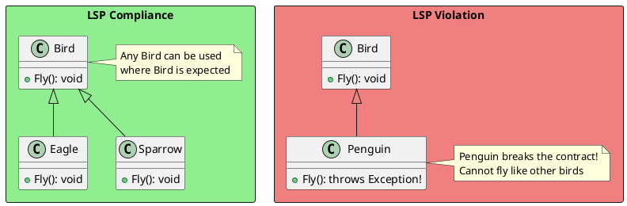
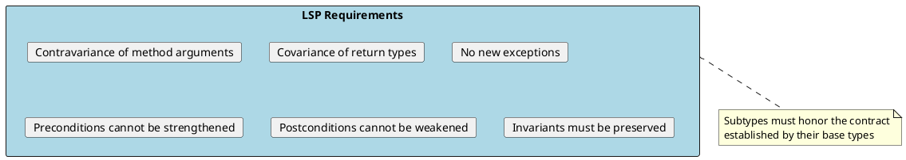
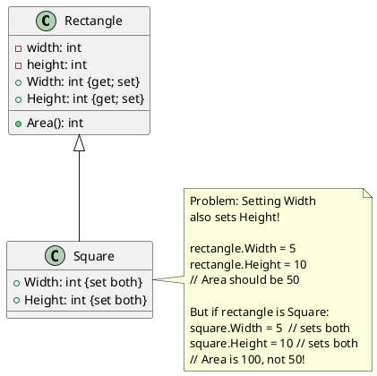
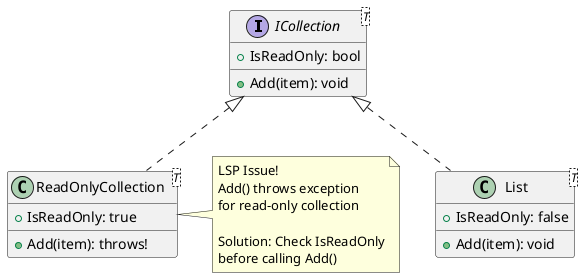
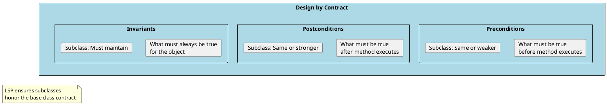
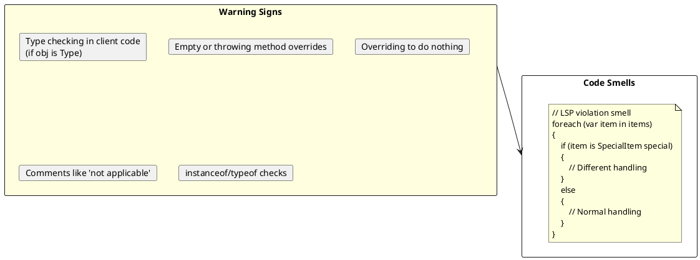

# Liskov Substitution Principle (LSP)

## The Principle

> "Objects of a superclass should be replaceable with objects of its subclasses without breaking the application."
> — Barbara Liskov

The Liskov Substitution Principle, introduced by Barbara Liskov in 1987, states that if S is a subtype of T, then objects of type T may be replaced with objects of type S without altering any of the desirable properties of the program.



## Understanding LSP

LSP is about **behavioral subtyping**. It goes beyond just having the same method signatures—it requires that subclasses behave in ways that don't surprise users of the base class.



## Classic Violation: Square-Rectangle Problem



```csharp
// ❌ BAD: Classic LSP violation

public class Rectangle
{
    public virtual int Width { get; set; }
    public virtual int Height { get; set; }

    public int Area() => Width * Height;
}

public class Square : Rectangle
{
    private int _side;

    public override int Width
    {
        get => _side;
        set => _side = value;  // Sets both dimensions
    }

    public override int Height
    {
        get => _side;
        set => _side = value;  // Sets both dimensions
    }
}

// This code works for Rectangle but breaks for Square
public void ProcessRectangle(Rectangle rect)
{
    rect.Width = 5;
    rect.Height = 10;

    // Postcondition: Area should be 50
    Debug.Assert(rect.Area() == 50);  // Fails for Square!
}

// Usage
var rectangle = new Rectangle();
ProcessRectangle(rectangle);  // ✓ Works

var square = new Square();
ProcessRectangle(square);  // ✗ Assertion fails!
```

### The Solution

```csharp
// ✅ GOOD: Proper design without inheritance

public interface IShape
{
    double Area { get; }
}

public class Rectangle : IShape
{
    public double Width { get; }
    public double Height { get; }

    public Rectangle(double width, double height)
    {
        Width = width;
        Height = height;
    }

    public double Area => Width * Height;
}

public class Square : IShape
{
    public double Side { get; }

    public Square(double side) => Side = side;

    public double Area => Side * Side;
}

// No inheritance relationship - no LSP problem
// Both are shapes, but neither substitutes for the other
```

## Behavioral Contract Violations

### Strengthening Preconditions

```csharp
// ❌ BAD: Subclass strengthens preconditions

public class BankAccount
{
    public virtual void Withdraw(decimal amount)
    {
        if (amount <= 0)
            throw new ArgumentException("Amount must be positive");

        Balance -= amount;
    }
}

public class SavingsAccount : BankAccount
{
    public override void Withdraw(decimal amount)
    {
        // Stronger precondition - not allowed by LSP!
        if (amount < 100)
            throw new ArgumentException("Minimum withdrawal is $100");

        base.Withdraw(amount);
    }
}

// Code that works with BankAccount breaks with SavingsAccount
void MakeWithdrawal(BankAccount account)
{
    account.Withdraw(50);  // Works for BankAccount, fails for SavingsAccount
}
```

### Weakening Postconditions

```csharp
// ❌ BAD: Subclass weakens postconditions

public abstract class Repository<T>
{
    // Postcondition: returns entity or throws NotFoundException
    public abstract T GetById(int id);
}

public class CachedRepository<T> : Repository<T>
{
    // Weakens postcondition by returning null instead of throwing
    public override T GetById(int id)
    {
        var cached = _cache.Get(id);
        return cached;  // Returns null if not found - violates contract!
    }
}

// Code expecting exception gets null instead
void ProcessEntity(Repository<User> repo)
{
    try
    {
        var user = repo.GetById(999);
        // Assumes user is never null here
        Console.WriteLine(user.Name);  // NullReferenceException!
    }
    catch (NotFoundException)
    {
        Console.WriteLine("User not found");
    }
}
```

### Throwing New Exceptions

```csharp
// ❌ BAD: Subclass throws unexpected exceptions

public interface IFileReader
{
    // Contract: May throw IOException
    string ReadAll(string path);
}

public class LocalFileReader : IFileReader
{
    public string ReadAll(string path)
    {
        return File.ReadAllText(path);  // Throws IOException as expected
    }
}

public class NetworkFileReader : IFileReader
{
    public string ReadAll(string path)
    {
        // Throws different exceptions not in base contract!
        throw new NetworkException("Connection failed");
        throw new AuthenticationException("Invalid credentials");
    }
}

// Client code doesn't handle new exceptions
void ProcessFile(IFileReader reader)
{
    try
    {
        var content = reader.ReadAll("data.txt");
    }
    catch (IOException ex)
    {
        // NetworkException and AuthenticationException escape!
    }
}
```

```csharp
// ✅ GOOD: Wrap exceptions to honor contract

public class NetworkFileReader : IFileReader
{
    public string ReadAll(string path)
    {
        try
        {
            // Network logic
        }
        catch (NetworkException ex)
        {
            throw new IOException("Failed to read from network", ex);
        }
        catch (AuthenticationException ex)
        {
            throw new IOException("Authentication failed", ex);
        }
    }
}
```

## Real-World LSP Examples

### Example 1: Collection Interfaces



```csharp
// The .NET Framework solution: IsReadOnly property
void ProcessCollection<T>(ICollection<T> collection, T item)
{
    // Check capability before using
    if (!collection.IsReadOnly)
    {
        collection.Add(item);
    }
}
```

### Example 2: Bird Hierarchy

```csharp
// ❌ BAD: LSP violation with flying birds

public abstract class Bird
{
    public abstract void Fly();
}

public class Eagle : Bird
{
    public override void Fly()
    {
        Console.WriteLine("Eagle soaring high!");
    }
}

public class Penguin : Bird
{
    public override void Fly()
    {
        // What do we do here?
        throw new InvalidOperationException("Penguins can't fly!");
    }
}

// This code assumes all birds can fly
void MigrateBirds(IEnumerable<Bird> birds)
{
    foreach (var bird in birds)
    {
        bird.Fly();  // Throws for Penguin!
    }
}
```

```csharp
// ✅ GOOD: Separate interfaces for capabilities

public interface IBird
{
    string Name { get; }
    void Eat();
}

public interface IFlyingBird : IBird
{
    void Fly();
}

public interface ISwimmingBird : IBird
{
    void Swim();
}

public class Eagle : IFlyingBird
{
    public string Name => "Eagle";
    public void Eat() => Console.WriteLine("Eagle eating");
    public void Fly() => Console.WriteLine("Eagle soaring");
}

public class Penguin : ISwimmingBird
{
    public string Name => "Penguin";
    public void Eat() => Console.WriteLine("Penguin eating fish");
    public void Swim() => Console.WriteLine("Penguin swimming");
}

public class Duck : IFlyingBird, ISwimmingBird
{
    public string Name => "Duck";
    public void Eat() => Console.WriteLine("Duck eating");
    public void Fly() => Console.WriteLine("Duck flying");
    public void Swim() => Console.WriteLine("Duck swimming");
}

// Now we can handle each capability correctly
void MigrateBirds(IEnumerable<IFlyingBird> birds)
{
    foreach (var bird in birds)
    {
        bird.Fly();  // All birds here can fly!
    }
}
```

### Example 3: Payment Processing

```csharp
// ❌ BAD: Subclass can't fulfill base contract

public abstract class PaymentProcessor
{
    public abstract PaymentResult Process(decimal amount);
    public abstract void Refund(string transactionId);
}

public class CreditCardProcessor : PaymentProcessor
{
    public override PaymentResult Process(decimal amount) { /* ... */ }
    public override void Refund(string transactionId) { /* ... */ }
}

public class CryptoProcessor : PaymentProcessor
{
    public override PaymentResult Process(decimal amount) { /* ... */ }

    public override void Refund(string transactionId)
    {
        // Crypto payments are irreversible!
        throw new NotSupportedException("Crypto refunds not supported");
    }
}
```

```csharp
// ✅ GOOD: Separate interfaces for different capabilities

public interface IPaymentProcessor
{
    PaymentResult Process(PaymentRequest request);
}

public interface IRefundablePayment
{
    RefundResult Refund(string transactionId);
}

public class CreditCardProcessor : IPaymentProcessor, IRefundablePayment
{
    public PaymentResult Process(PaymentRequest request) { /* ... */ }
    public RefundResult Refund(string transactionId) { /* ... */ }
}

public class CryptoProcessor : IPaymentProcessor
{
    // Only implements what it can actually do
    public PaymentResult Process(PaymentRequest request) { /* ... */ }
}

// Handle refunds only for processors that support it
void ProcessRefund(IPaymentProcessor processor, string transactionId)
{
    if (processor is IRefundablePayment refundable)
    {
        refundable.Refund(transactionId);
    }
    else
    {
        Console.WriteLine("This payment method doesn't support refunds");
    }
}
```

## LSP and Design by Contract



```csharp
// ✅ Example of proper contract adherence

public abstract class Account
{
    public decimal Balance { get; protected set; }

    // Precondition: amount > 0
    // Postcondition: Balance reduced by amount, returns true
    //                OR Balance unchanged, returns false (insufficient funds)
    // Invariant: Balance >= 0
    public abstract bool Withdraw(decimal amount);
}

public class CheckingAccount : Account
{
    public override bool Withdraw(decimal amount)
    {
        // Same precondition (not stronger)
        if (amount <= 0)
            throw new ArgumentException("Amount must be positive");

        // Same or stronger postcondition
        if (Balance >= amount)
        {
            Balance -= amount;
            return true;
        }
        return false;

        // Invariant maintained: Balance >= 0
    }
}

public class SavingsAccount : Account
{
    private readonly decimal _minimumBalance = 100;

    public override bool Withdraw(decimal amount)
    {
        // Same precondition (not stronger)
        if (amount <= 0)
            throw new ArgumentException("Amount must be positive");

        // Stronger postcondition is OK (more restrictive)
        if (Balance - amount >= _minimumBalance)
        {
            Balance -= amount;
            return true;
        }
        return false;

        // Invariant maintained: Balance >= 0 (actually >= 100)
    }
}

// Both can be used wherever Account is expected
void ProcessWithdrawal(Account account, decimal amount)
{
    if (account.Withdraw(amount))
    {
        Console.WriteLine($"Withdrew {amount:C}");
    }
    else
    {
        Console.WriteLine("Insufficient funds");
    }
    // Invariant: Balance is never negative
}
```

## Testing for LSP Compliance

```csharp
// ✅ Tests that verify LSP compliance

public abstract class ShapeTestBase<T> where T : IShape
{
    protected abstract T CreateShape();

    [Fact]
    public void Area_ShouldBePositive()
    {
        var shape = CreateShape();
        Assert.True(shape.Area >= 0);
    }

    [Fact]
    public void Area_ShouldBeConsistent()
    {
        var shape = CreateShape();
        var area1 = shape.Area;
        var area2 = shape.Area;
        Assert.Equal(area1, area2);
    }
}

public class RectangleTests : ShapeTestBase<Rectangle>
{
    protected override Rectangle CreateShape() => new Rectangle(5, 10);

    [Fact]
    public void Area_ShouldBeWidthTimesHeight()
    {
        var rect = new Rectangle(5, 10);
        Assert.Equal(50, rect.Area);
    }
}

public class CircleTests : ShapeTestBase<Circle>
{
    protected override Circle CreateShape() => new Circle(5);

    [Fact]
    public void Area_ShouldBePiRSquared()
    {
        var circle = new Circle(5);
        Assert.Equal(Math.PI * 25, circle.Area, 5);
    }
}

// If Square inherited from Rectangle, these tests would fail:
public class SquareAsRectangleTests
{
    [Fact]
    public void SettingWidth_ShouldNotAffectHeight()
    {
        Rectangle rect = new Square(5);  // LSP test
        rect.Width = 10;
        // If this fails, LSP is violated
        Assert.Equal(5, rect.Height);
    }
}
```

## Identifying LSP Violations



## Interview Questions & Answers

### Q1: What is the Liskov Substitution Principle?

**Answer**: LSP states that objects of a superclass should be replaceable with objects of its subclasses without affecting the correctness of the program. If S is a subtype of T, then objects of type T can be replaced with objects of type S without altering program behavior.

### Q2: Why is the Square-Rectangle problem a classic LSP violation?

**Answer**: A Square inheriting from Rectangle violates LSP because:
1. Rectangle has independent width and height
2. Square's invariant is width == height
3. Setting width on a Square also changes height
4. Code expecting Rectangle behavior (independent dimensions) breaks with Square

The solution is either immutable shapes or not using inheritance between them.

### Q3: What are the rules for maintaining LSP?

**Answer**:
1. **Preconditions cannot be strengthened** in a subtype
2. **Postconditions cannot be weakened** in a subtype
3. **Invariants** of the supertype must be preserved
4. **History constraint**: Subtype shouldn't allow state changes the supertype doesn't allow
5. **No new exceptions** that base class callers don't expect

### Q4: How do you test for LSP compliance?

**Answer**:
1. Write tests against the base class/interface
2. Run those same tests against all derived classes
3. If any test fails for a subclass, LSP is violated
4. Use abstract test base classes to enforce common behavior
5. Check that substituting types doesn't change program behavior

### Q5: How does LSP relate to other SOLID principles?

**Answer**:
- **SRP**: Classes with single responsibility are easier to subclass correctly
- **OCP**: LSP enables OCP by ensuring substitutes work correctly
- **ISP**: Small interfaces reduce chance of LSP violations
- **DIP**: LSP ensures abstractions can be safely substituted

### Q6: Give a real-world example of LSP violation and fix.

**Answer**:
```csharp
// Violation: ReadOnlyList throwing on Add()
IList<int> list = new ReadOnlyCollection<int>(new[] {1, 2, 3});
list.Add(4);  // Throws! Violates IList contract

// Fix: Use appropriate interface
IReadOnlyList<int> list = new ReadOnlyCollection<int>(new[] {1, 2, 3});
// No Add() method available - correct interface for the capability
```
