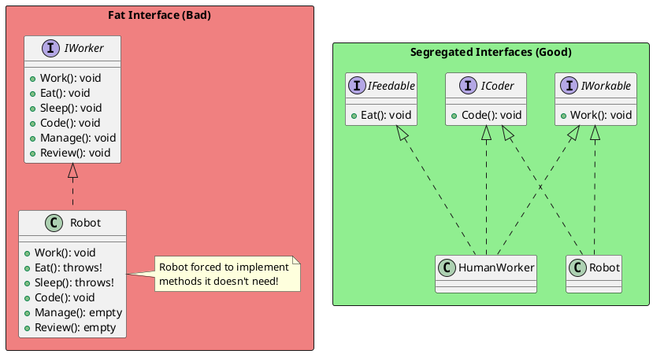
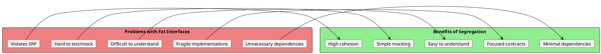
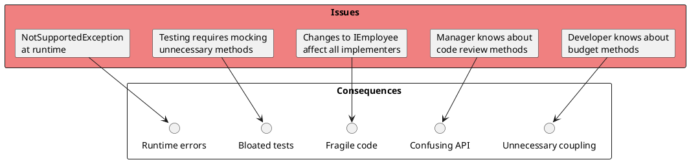
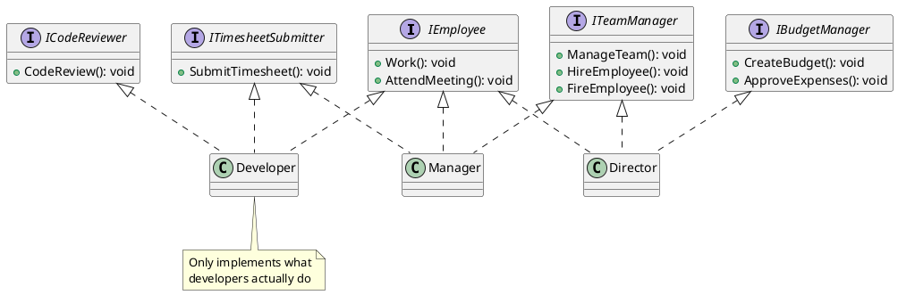
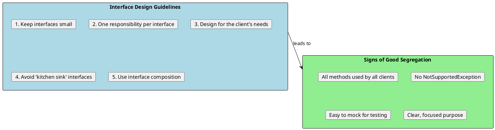
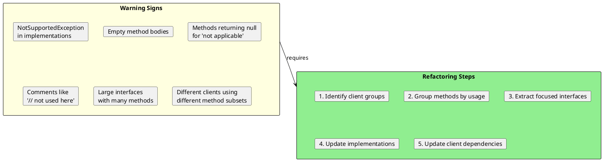

# Interface Segregation Principle (ISP)

## The Principle

> "Clients should not be forced to depend upon interfaces that they do not use."
> — Robert C. Martin

The Interface Segregation Principle states that no client should be forced to depend on methods it does not use. Instead of one large interface, you should have multiple smaller, more specific interfaces.



## Why ISP Matters



## Violation Example: The Fat Interface

```csharp
// ❌ BAD: Fat interface forcing unnecessary implementations

public interface IEmployee
{
    void Work();
    void AttendMeeting();
    void SubmitTimesheet();
    void CodeReview();
    void ManageTeam();
    void HireEmployee();
    void FireEmployee();
    void CreateBudget();
    void ApproveExpenses();
}

public class Developer : IEmployee
{
    public void Work() => Console.WriteLine("Writing code");
    public void AttendMeeting() => Console.WriteLine("Attending standup");
    public void SubmitTimesheet() => Console.WriteLine("Submitting timesheet");
    public void CodeReview() => Console.WriteLine("Reviewing code");

    // Forced to implement methods not relevant to developers
    public void ManageTeam() => throw new NotSupportedException();
    public void HireEmployee() => throw new NotSupportedException();
    public void FireEmployee() => throw new NotSupportedException();
    public void CreateBudget() => throw new NotSupportedException();
    public void ApproveExpenses() => throw new NotSupportedException();
}

public class Manager : IEmployee
{
    public void Work() => Console.WriteLine("Managing projects");
    public void AttendMeeting() => Console.WriteLine("Running meeting");
    public void SubmitTimesheet() => Console.WriteLine("Submitting timesheet");
    public void ManageTeam() => Console.WriteLine("Managing team");
    public void HireEmployee() => Console.WriteLine("Hiring");
    public void FireEmployee() => Console.WriteLine("Firing");

    // Forced to implement methods not relevant to managers
    public void CodeReview() => throw new NotSupportedException();
    public void CreateBudget() => throw new NotSupportedException();
    public void ApproveExpenses() => throw new NotSupportedException();
}

public class Director : IEmployee
{
    // Has to implement ALL methods even if many aren't relevant
    // ...
}
```

### Problems with this approach:



## Refactored Solution: Segregated Interfaces



```csharp
// ✅ GOOD: Segregated interfaces - each focused on specific behavior

public interface IEmployee
{
    void Work();
    void AttendMeeting();
}

public interface ITimesheetSubmitter
{
    void SubmitTimesheet();
}

public interface ICodeReviewer
{
    void ReviewCode(PullRequest pr);
}

public interface ITeamManager
{
    void ManageTeam();
    void HireEmployee(Employee employee);
    void FireEmployee(Employee employee);
}

public interface IBudgetManager
{
    void CreateBudget(Budget budget);
    void ApproveExpense(Expense expense);
}

// Developer only implements relevant interfaces
public class Developer : IEmployee, ITimesheetSubmitter, ICodeReviewer
{
    public void Work() => Console.WriteLine("Writing code");
    public void AttendMeeting() => Console.WriteLine("Attending standup");
    public void SubmitTimesheet() => Console.WriteLine("Submitting timesheet");
    public void ReviewCode(PullRequest pr) => Console.WriteLine($"Reviewing {pr.Title}");
}

// Manager implements different set of interfaces
public class Manager : IEmployee, ITimesheetSubmitter, ITeamManager
{
    public void Work() => Console.WriteLine("Managing projects");
    public void AttendMeeting() => Console.WriteLine("Running meeting");
    public void SubmitTimesheet() => Console.WriteLine("Submitting timesheet");
    public void ManageTeam() => Console.WriteLine("Managing team");
    public void HireEmployee(Employee e) => Console.WriteLine($"Hiring {e.Name}");
    public void FireEmployee(Employee e) => Console.WriteLine($"Firing {e.Name}");
}

// Director has management and budget responsibilities
public class Director : IEmployee, ITeamManager, IBudgetManager
{
    public void Work() => Console.WriteLine("Strategic planning");
    public void AttendMeeting() => Console.WriteLine("Board meeting");
    public void ManageTeam() => Console.WriteLine("Managing managers");
    public void HireEmployee(Employee e) => Console.WriteLine($"Approving hire: {e.Name}");
    public void FireEmployee(Employee e) => Console.WriteLine($"Approving termination: {e.Name}");
    public void CreateBudget(Budget b) => Console.WriteLine($"Creating budget: {b.Amount:C}");
    public void ApproveExpense(Expense e) => Console.WriteLine($"Approving: {e.Amount:C}");
}
```

## Real-World Examples

### Example 1: Printer Interface

```csharp
// ❌ BAD: Fat interface for printer functionality

public interface IMachine
{
    void Print(Document d);
    void Scan(Document d);
    void Fax(Document d);
    void Staple(Document d);
}

public class MultiFunctionPrinter : IMachine
{
    public void Print(Document d) => Console.WriteLine("Printing");
    public void Scan(Document d) => Console.WriteLine("Scanning");
    public void Fax(Document d) => Console.WriteLine("Faxing");
    public void Staple(Document d) => Console.WriteLine("Stapling");
}

public class SimplePrinter : IMachine
{
    public void Print(Document d) => Console.WriteLine("Printing");

    // Forced to implement methods this printer doesn't have!
    public void Scan(Document d) => throw new NotSupportedException();
    public void Fax(Document d) => throw new NotSupportedException();
    public void Staple(Document d) => throw new NotSupportedException();
}
```

```csharp
// ✅ GOOD: Segregated interfaces

public interface IPrinter
{
    void Print(Document d);
}

public interface IScanner
{
    void Scan(Document d);
}

public interface IFax
{
    void Fax(Document d);
}

public interface IStapler
{
    void Staple(Document d);
}

// Simple printer only implements what it can do
public class SimplePrinter : IPrinter
{
    public void Print(Document d) => Console.WriteLine("Printing");
}

// Scanner only implements scanning
public class SimpleScanner : IScanner
{
    public void Scan(Document d) => Console.WriteLine("Scanning");
}

// Multi-function device implements all
public class MultiFunctionPrinter : IPrinter, IScanner, IFax, IStapler
{
    public void Print(Document d) => Console.WriteLine("Printing");
    public void Scan(Document d) => Console.WriteLine("Scanning");
    public void Fax(Document d) => Console.WriteLine("Faxing");
    public void Staple(Document d) => Console.WriteLine("Stapling");
}

// Can combine interfaces for specific needs
public interface IPhotocopier : IPrinter, IScanner { }

public class Photocopier : IPhotocopier
{
    public void Print(Document d) => Console.WriteLine("Printing");
    public void Scan(Document d) => Console.WriteLine("Scanning");

    public void Copy(Document d)
    {
        Scan(d);
        Print(d);
    }
}
```

### Example 2: Repository Pattern

```csharp
// ❌ BAD: One big repository interface

public interface IRepository<T>
{
    T GetById(int id);
    IEnumerable<T> GetAll();
    IEnumerable<T> Find(Expression<Func<T, bool>> predicate);
    void Add(T entity);
    void AddRange(IEnumerable<T> entities);
    void Update(T entity);
    void Remove(T entity);
    void RemoveRange(IEnumerable<T> entities);
    int Count();
    bool Exists(int id);
    void SaveChanges();
}

// Read-only service forced to implement write methods
public class ReportingRepository<T> : IRepository<T>
{
    public T GetById(int id) { /* ... */ }
    public IEnumerable<T> GetAll() { /* ... */ }
    public IEnumerable<T> Find(Expression<Func<T, bool>> predicate) { /* ... */ }
    public int Count() { /* ... */ }
    public bool Exists(int id) { /* ... */ }

    // Must implement even though reporting is read-only!
    public void Add(T entity) => throw new NotSupportedException();
    public void AddRange(IEnumerable<T> entities) => throw new NotSupportedException();
    public void Update(T entity) => throw new NotSupportedException();
    public void Remove(T entity) => throw new NotSupportedException();
    public void RemoveRange(IEnumerable<T> entities) => throw new NotSupportedException();
    public void SaveChanges() => throw new NotSupportedException();
}
```

```csharp
// ✅ GOOD: Segregated repository interfaces

public interface IReadRepository<T>
{
    T GetById(int id);
    IEnumerable<T> GetAll();
    IEnumerable<T> Find(Expression<Func<T, bool>> predicate);
    int Count();
    bool Exists(int id);
}

public interface IWriteRepository<T>
{
    void Add(T entity);
    void AddRange(IEnumerable<T> entities);
    void Update(T entity);
    void Remove(T entity);
    void RemoveRange(IEnumerable<T> entities);
    void SaveChanges();
}

// Combined interface for full CRUD
public interface IRepository<T> : IReadRepository<T>, IWriteRepository<T>
{
}

// Read-only implementation only needs read interface
public class ReportingRepository<T> : IReadRepository<T>
{
    public T GetById(int id) { /* ... */ }
    public IEnumerable<T> GetAll() { /* ... */ }
    public IEnumerable<T> Find(Expression<Func<T, bool>> predicate) { /* ... */ }
    public int Count() { /* ... */ }
    public bool Exists(int id) { /* ... */ }
}

// Full implementation for CRUD operations
public class SqlRepository<T> : IRepository<T>
{
    // Implements all methods from both interfaces
}

// Service can depend on exactly what it needs
public class ReportService
{
    private readonly IReadRepository<Order> _orders;

    public ReportService(IReadRepository<Order> orders)
    {
        _orders = orders;  // Only needs read operations
    }
}

public class OrderService
{
    private readonly IRepository<Order> _orders;

    public OrderService(IRepository<Order> orders)
    {
        _orders = orders;  // Needs full CRUD
    }
}
```

### Example 3: User Notifications

```csharp
// ❌ BAD: One notification interface with all channels

public interface INotificationService
{
    void SendEmail(string to, string subject, string body);
    void SendSms(string phoneNumber, string message);
    void SendPushNotification(string deviceId, string title, string message);
    void SendSlackMessage(string channel, string message);
    void SendTeamsMessage(string channel, string message);
}

// Email-only service forced to implement everything
public class EmailService : INotificationService
{
    public void SendEmail(string to, string subject, string body) { /* ... */ }

    // Not supported
    public void SendSms(string phoneNumber, string message)
        => throw new NotSupportedException();
    public void SendPushNotification(string deviceId, string title, string message)
        => throw new NotSupportedException();
    public void SendSlackMessage(string channel, string message)
        => throw new NotSupportedException();
    public void SendTeamsMessage(string channel, string message)
        => throw new NotSupportedException();
}
```

```csharp
// ✅ GOOD: Segregated notification interfaces

public interface IEmailSender
{
    Task SendEmailAsync(EmailMessage message);
}

public interface ISmsSender
{
    Task SendSmsAsync(SmsMessage message);
}

public interface IPushNotificationSender
{
    Task SendPushAsync(PushNotification notification);
}

public interface ISlackNotifier
{
    Task SendSlackMessageAsync(SlackMessage message);
}

// Each implementation is focused
public class SmtpEmailSender : IEmailSender
{
    public async Task SendEmailAsync(EmailMessage message)
    {
        // SMTP implementation
    }
}

public class TwilioSmsSender : ISmsSender
{
    public async Task SendSmsAsync(SmsMessage message)
    {
        // Twilio implementation
    }
}

public class FirebasePushSender : IPushNotificationSender
{
    public async Task SendPushAsync(PushNotification notification)
    {
        // Firebase implementation
    }
}

// Aggregator for multiple notification channels
public class NotificationService
{
    private readonly IEmailSender? _email;
    private readonly ISmsSender? _sms;
    private readonly IPushNotificationSender? _push;

    public NotificationService(
        IEmailSender? email = null,
        ISmsSender? sms = null,
        IPushNotificationSender? push = null)
    {
        _email = email;
        _sms = sms;
        _push = push;
    }

    public async Task NotifyAsync(Notification notification)
    {
        var tasks = new List<Task>();

        if (notification.Channels.HasFlag(Channel.Email) && _email != null)
            tasks.Add(_email.SendEmailAsync(notification.ToEmail()));

        if (notification.Channels.HasFlag(Channel.Sms) && _sms != null)
            tasks.Add(_sms.SendSmsAsync(notification.ToSms()));

        if (notification.Channels.HasFlag(Channel.Push) && _push != null)
            tasks.Add(_push.SendPushAsync(notification.ToPush()));

        await Task.WhenAll(tasks);
    }
}
```

## ISP Design Guidelines



## Interface Composition

```csharp
// ✅ Building larger interfaces from smaller ones

// Core interfaces
public interface IIdentifiable
{
    int Id { get; }
}

public interface ITimestamped
{
    DateTime CreatedAt { get; }
    DateTime? UpdatedAt { get; }
}

public interface IAuditable
{
    string CreatedBy { get; }
    string? UpdatedBy { get; }
}

public interface ISoftDeletable
{
    bool IsDeleted { get; }
    DateTime? DeletedAt { get; }
}

// Composed interfaces
public interface IEntity : IIdentifiable, ITimestamped
{
}

public interface IAuditableEntity : IEntity, IAuditable
{
}

public interface IFullyTrackedEntity : IAuditableEntity, ISoftDeletable
{
}

// Implementations only need what they actually use
public class LogEntry : IEntity
{
    public int Id { get; set; }
    public DateTime CreatedAt { get; set; }
    public DateTime? UpdatedAt { get; set; }
    public string Message { get; set; }
}

public class Order : IFullyTrackedEntity
{
    public int Id { get; set; }
    public DateTime CreatedAt { get; set; }
    public DateTime? UpdatedAt { get; set; }
    public string CreatedBy { get; set; }
    public string? UpdatedBy { get; set; }
    public bool IsDeleted { get; set; }
    public DateTime? DeletedAt { get; set; }
    // Order-specific properties
    public decimal Total { get; set; }
}
```

## Role Interfaces

```csharp
// ✅ Role interfaces - interfaces representing roles an object can play

// Roles an order can play
public interface IPriceable
{
    decimal CalculatePrice();
}

public interface IShippable
{
    Address ShippingAddress { get; }
    decimal CalculateShipping();
}

public interface ITaxable
{
    decimal CalculateTax();
}

public interface IDiscountable
{
    decimal ApplyDiscount(decimal discountPercent);
}

// Order implements roles it can play
public class Order : IPriceable, IShippable, ITaxable, IDiscountable
{
    public List<OrderItem> Items { get; set; }
    public Address ShippingAddress { get; set; }

    public decimal CalculatePrice() => Items.Sum(i => i.Price * i.Quantity);

    public decimal CalculateShipping()
    {
        // Shipping calculation based on weight and destination
        return 9.99m;
    }

    public decimal CalculateTax() => CalculatePrice() * 0.08m;

    public decimal ApplyDiscount(decimal discountPercent)
        => CalculatePrice() * (1 - discountPercent);
}

// Services work with specific roles
public class TaxService
{
    public decimal CalculateTax(ITaxable item) => item.CalculateTax();
}

public class ShippingService
{
    public decimal CalculateShipping(IShippable item) => item.CalculateShipping();
}

public class DiscountService
{
    public decimal ApplyDiscount(IDiscountable item, decimal percent)
        => item.ApplyDiscount(percent);
}
```

## Identifying ISP Violations



## Testing Benefits of ISP

```csharp
// ✅ Easy to mock small interfaces

public class OrderServiceTests
{
    [Fact]
    public async Task CreateOrder_ShouldCalculateTax()
    {
        // Only need to mock ITaxCalculator, not entire OrderProcessor
        var mockTax = new Mock<ITaxCalculator>();
        mockTax.Setup(t => t.Calculate(100)).Returns(8);

        var service = new OrderService(mockTax.Object);
        var result = await service.CreateOrderAsync(new Order { Subtotal = 100 });

        Assert.Equal(8, result.Tax);
        mockTax.Verify(t => t.Calculate(100), Times.Once);
    }

    [Fact]
    public async Task CreateOrder_ShouldCalculateShipping()
    {
        // Only need to mock IShippingCalculator
        var mockShipping = new Mock<IShippingCalculator>();
        mockShipping.Setup(s => s.Calculate(It.IsAny<Address>())).Returns(9.99m);

        var service = new OrderService(shippingCalculator: mockShipping.Object);
        var result = await service.CreateOrderAsync(new Order());

        Assert.Equal(9.99m, result.ShippingCost);
    }
}

// Compare to mocking a fat interface
[Fact]
public async Task CreateOrder_WithFatInterface_DifficultToMock()
{
    // Must setup all methods even if only using one
    var mock = new Mock<IOrderProcessor>();
    mock.Setup(p => p.CalculateTax(It.IsAny<Order>())).Returns(8);
    mock.Setup(p => p.CalculateShipping(It.IsAny<Order>())).Returns(9.99m);
    mock.Setup(p => p.ValidateOrder(It.IsAny<Order>())).Returns(true);
    mock.Setup(p => p.ApplyDiscount(It.IsAny<Order>())).Returns(0);
    // ... many more setups

    // Test becomes cluttered with irrelevant setup
}
```

## Interview Questions & Answers

### Q1: What is the Interface Segregation Principle?

**Answer**: ISP states that clients should not be forced to depend on interfaces they don't use. Instead of one large interface, we should have multiple smaller, more specific interfaces. This leads to more focused code, easier testing, and lower coupling.

### Q2: How do you identify ISP violations?

**Answer**: Look for these signs:
1. Implementations throwing `NotSupportedException` or `NotImplementedException`
2. Empty method implementations
3. Methods that just return null or default values
4. Different classes using different subsets of an interface's methods
5. Comments indicating methods aren't applicable

### Q3: What's the relationship between ISP and SRP?

**Answer**: They're complementary:
- **SRP** applies to classes (one reason to change)
- **ISP** applies to interfaces (one role or purpose)
- Both promote cohesion and focused design
- A class violating SRP often implements interfaces violating ISP

### Q4: How does ISP improve testability?

**Answer**: Smaller interfaces are easier to mock:
- Fewer methods to set up in mock objects
- Tests only depend on what they actually test
- Clear which behavior is being tested
- Less brittle when interface changes occur

### Q5: When might you intentionally have a larger interface?

**Answer**: Consider a larger interface when:
1. All methods are truly cohesive and used together
2. The interface represents a well-established contract (like `ICollection<T>`)
3. Splitting would create excessive interface explosion
4. The interface has very few methods (2-4) that belong together

### Q6: Give an example of ISP violation and fix.

**Answer**:
```csharp
// Violation
interface IWorker
{
    void Work();
    void Eat();
}

class Robot : IWorker
{
    public void Work() => Console.WriteLine("Working");
    public void Eat() => throw new NotSupportedException(); // ISP violation
}

// Fix
interface IWorkable { void Work(); }
interface IFeedable { void Eat(); }

class Human : IWorkable, IFeedable { /* implements both */ }
class Robot : IWorkable { /* only implements what it can do */ }
```
