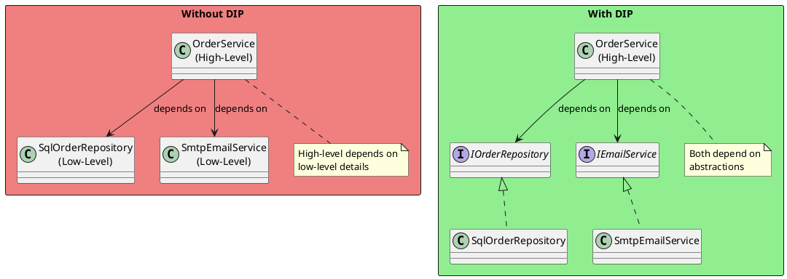
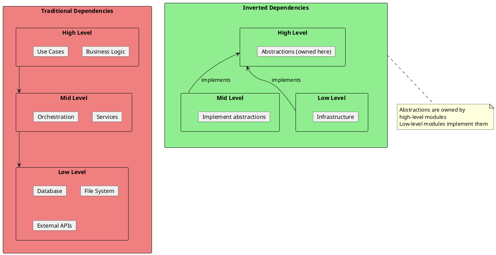
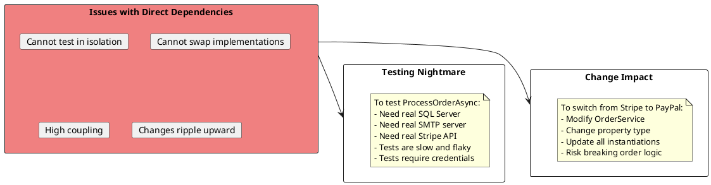
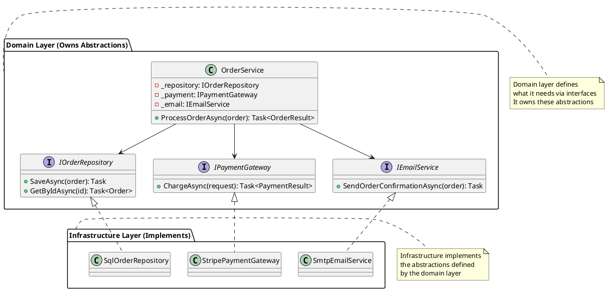
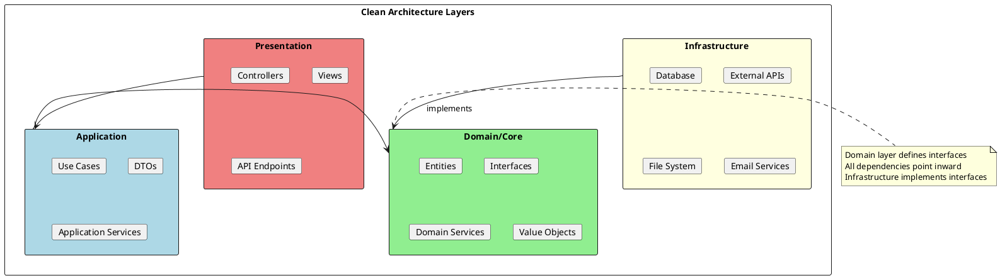
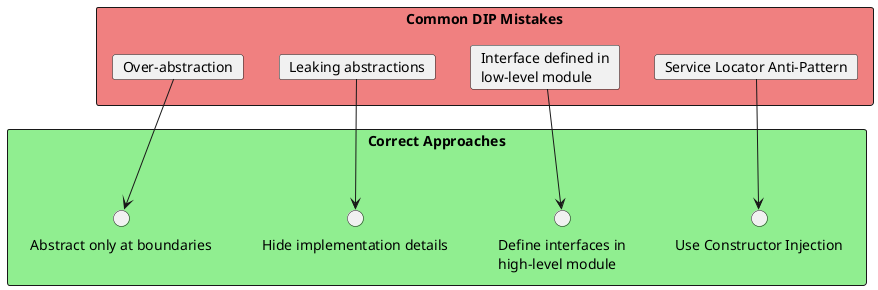

# Dependency Inversion Principle (DIP)

## The Principle

> "High-level modules should not depend on low-level modules. Both should depend on abstractions."
> "Abstractions should not depend on details. Details should depend on abstractions."
> — Robert C. Martin

The Dependency Inversion Principle states that the dependency direction should be inverted from the traditional top-down approach. Instead of high-level modules depending on low-level modules, both should depend on abstractions.



## Understanding DIP



## Violation Example: Direct Dependencies

```csharp
// ❌ BAD: High-level OrderService depends on low-level details

public class OrderService
{
    // Direct dependency on concrete implementation
    private readonly SqlOrderRepository _repository;
    private readonly SmtpEmailService _emailService;
    private readonly StripePaymentGateway _paymentGateway;

    public OrderService()
    {
        // Creating dependencies inside the class
        _repository = new SqlOrderRepository("connection-string");
        _emailService = new SmtpEmailService("smtp.server.com");
        _paymentGateway = new StripePaymentGateway("api-key");
    }

    public async Task<OrderResult> ProcessOrderAsync(Order order)
    {
        // Validate
        if (order.Items.Count == 0)
            return OrderResult.Failed("No items");

        // Process payment - tightly coupled to Stripe
        var paymentResult = await _paymentGateway.ChargeAsync(
            order.Customer.CardNumber,
            order.Total);

        if (!paymentResult.Success)
            return OrderResult.Failed("Payment failed");

        // Save - tightly coupled to SQL Server
        await _repository.SaveAsync(order);

        // Notify - tightly coupled to SMTP
        await _emailService.SendOrderConfirmationAsync(order);

        return OrderResult.Success(order.Id);
    }
}

// Problems:
// 1. Cannot unit test without real DB, SMTP, Stripe
// 2. Cannot switch to different implementations
// 3. Changes in low-level modules affect high-level logic
// 4. Violates OCP - must modify OrderService to change implementations
```

### Problems visualized:



## Refactored Solution: Dependency Inversion



```csharp
// ✅ GOOD: Dependency Inversion - depend on abstractions

// Abstractions owned by high-level module
public interface IOrderRepository
{
    Task SaveAsync(Order order);
    Task<Order?> GetByIdAsync(int id);
    Task<IEnumerable<Order>> GetByCustomerAsync(int customerId);
}

public interface IPaymentGateway
{
    Task<PaymentResult> ChargeAsync(PaymentRequest request);
    Task<RefundResult> RefundAsync(string transactionId, decimal amount);
}

public interface IEmailService
{
    Task SendAsync(EmailMessage message);
}

// High-level module depends on abstractions
public class OrderService
{
    private readonly IOrderRepository _repository;
    private readonly IPaymentGateway _paymentGateway;
    private readonly IEmailService _emailService;
    private readonly ILogger<OrderService> _logger;

    // Dependencies injected through constructor
    public OrderService(
        IOrderRepository repository,
        IPaymentGateway paymentGateway,
        IEmailService emailService,
        ILogger<OrderService> logger)
    {
        _repository = repository;
        _paymentGateway = paymentGateway;
        _emailService = emailService;
        _logger = logger;
    }

    public async Task<OrderResult> ProcessOrderAsync(Order order)
    {
        _logger.LogInformation("Processing order for customer {CustomerId}", order.CustomerId);

        // Validate
        if (!order.Items.Any())
            return OrderResult.Failed("No items in order");

        // Process payment through abstraction
        var paymentResult = await _paymentGateway.ChargeAsync(new PaymentRequest
        {
            Amount = order.Total,
            Currency = "USD",
            CustomerId = order.CustomerId
        });

        if (!paymentResult.Success)
        {
            _logger.LogWarning("Payment failed for order: {Reason}", paymentResult.ErrorMessage);
            return OrderResult.Failed($"Payment failed: {paymentResult.ErrorMessage}");
        }

        order.PaymentTransactionId = paymentResult.TransactionId;
        order.Status = OrderStatus.Paid;

        // Save through abstraction
        await _repository.SaveAsync(order);

        // Notify through abstraction
        await _emailService.SendAsync(new EmailMessage
        {
            To = order.Customer.Email,
            Subject = $"Order Confirmation #{order.Id}",
            Body = BuildOrderConfirmationEmail(order)
        });

        _logger.LogInformation("Order {OrderId} processed successfully", order.Id);
        return OrderResult.Success(order.Id);
    }

    private string BuildOrderConfirmationEmail(Order order)
    {
        // Build email body
        return $"Thank you for your order #{order.Id}";
    }
}

// Low-level implementations
public class SqlOrderRepository : IOrderRepository
{
    private readonly OrderDbContext _context;

    public SqlOrderRepository(OrderDbContext context)
    {
        _context = context;
    }

    public async Task SaveAsync(Order order)
    {
        _context.Orders.Add(order);
        await _context.SaveChangesAsync();
    }

    public async Task<Order?> GetByIdAsync(int id)
        => await _context.Orders
            .Include(o => o.Items)
            .FirstOrDefaultAsync(o => o.Id == id);

    public async Task<IEnumerable<Order>> GetByCustomerAsync(int customerId)
        => await _context.Orders
            .Where(o => o.CustomerId == customerId)
            .ToListAsync();
}

public class StripePaymentGateway : IPaymentGateway
{
    private readonly StripeClient _client;

    public StripePaymentGateway(IOptions<StripeSettings> settings)
    {
        _client = new StripeClient(settings.Value.ApiKey);
    }

    public async Task<PaymentResult> ChargeAsync(PaymentRequest request)
    {
        // Stripe-specific implementation
        var charge = await _client.ChargeAsync(new StripeChargeRequest
        {
            Amount = (long)(request.Amount * 100),
            Currency = request.Currency.ToLower()
        });

        return new PaymentResult
        {
            Success = charge.Status == "succeeded",
            TransactionId = charge.Id
        };
    }

    public async Task<RefundResult> RefundAsync(string transactionId, decimal amount)
    {
        // Stripe refund implementation
    }
}

public class SendGridEmailService : IEmailService
{
    private readonly SendGridClient _client;

    public SendGridEmailService(IOptions<SendGridSettings> settings)
    {
        _client = new SendGridClient(settings.Value.ApiKey);
    }

    public async Task SendAsync(EmailMessage message)
    {
        var msg = new SendGridMessage
        {
            From = new EmailAddress("orders@company.com"),
            Subject = message.Subject,
            PlainTextContent = message.Body
        };
        msg.AddTo(message.To);
        await _client.SendEmailAsync(msg);
    }
}
```

## Dependency Injection Container

```csharp
// ✅ Registering dependencies in ASP.NET Core

public class Startup
{
    public void ConfigureServices(IServiceCollection services)
    {
        // Register abstractions with implementations
        services.AddScoped<IOrderRepository, SqlOrderRepository>();
        services.AddScoped<IPaymentGateway, StripePaymentGateway>();
        services.AddScoped<IEmailService, SendGridEmailService>();

        // Register high-level service (dependencies auto-injected)
        services.AddScoped<OrderService>();

        // Configuration
        services.Configure<StripeSettings>(Configuration.GetSection("Stripe"));
        services.Configure<SendGridSettings>(Configuration.GetSection("SendGrid"));

        // DbContext
        services.AddDbContext<OrderDbContext>(options =>
            options.UseSqlServer(Configuration.GetConnectionString("Orders")));
    }
}

// Controller uses injected services
[ApiController]
[Route("api/orders")]
public class OrdersController : ControllerBase
{
    private readonly OrderService _orderService;

    public OrdersController(OrderService orderService)
    {
        _orderService = orderService;
    }

    [HttpPost]
    public async Task<IActionResult> CreateOrder([FromBody] CreateOrderRequest request)
    {
        var order = request.ToOrder();
        var result = await _orderService.ProcessOrderAsync(order);

        if (!result.IsSuccess)
            return BadRequest(result.ErrorMessage);

        return Ok(new { OrderId = result.OrderId });
    }
}
```

## Testing with DIP

```csharp
// ✅ Easy to test with mocked dependencies

public class OrderServiceTests
{
    private readonly Mock<IOrderRepository> _mockRepository;
    private readonly Mock<IPaymentGateway> _mockPayment;
    private readonly Mock<IEmailService> _mockEmail;
    private readonly Mock<ILogger<OrderService>> _mockLogger;
    private readonly OrderService _service;

    public OrderServiceTests()
    {
        _mockRepository = new Mock<IOrderRepository>();
        _mockPayment = new Mock<IPaymentGateway>();
        _mockEmail = new Mock<IEmailService>();
        _mockLogger = new Mock<ILogger<OrderService>>();

        _service = new OrderService(
            _mockRepository.Object,
            _mockPayment.Object,
            _mockEmail.Object,
            _mockLogger.Object);
    }

    [Fact]
    public async Task ProcessOrderAsync_WithValidOrder_ChargesPayment()
    {
        // Arrange
        var order = CreateTestOrder();
        _mockPayment.Setup(p => p.ChargeAsync(It.IsAny<PaymentRequest>()))
                    .ReturnsAsync(PaymentResult.Successful("txn_123"));

        // Act
        await _service.ProcessOrderAsync(order);

        // Assert
        _mockPayment.Verify(p => p.ChargeAsync(
            It.Is<PaymentRequest>(r => r.Amount == order.Total)),
            Times.Once);
    }

    [Fact]
    public async Task ProcessOrderAsync_WhenPaymentFails_ReturnsError()
    {
        // Arrange
        var order = CreateTestOrder();
        _mockPayment.Setup(p => p.ChargeAsync(It.IsAny<PaymentRequest>()))
                    .ReturnsAsync(PaymentResult.Failed("Insufficient funds"));

        // Act
        var result = await _service.ProcessOrderAsync(order);

        // Assert
        Assert.False(result.IsSuccess);
        Assert.Contains("Payment failed", result.ErrorMessage);

        // Verify order was NOT saved
        _mockRepository.Verify(r => r.SaveAsync(It.IsAny<Order>()), Times.Never);
    }

    [Fact]
    public async Task ProcessOrderAsync_WhenSuccessful_SendsEmail()
    {
        // Arrange
        var order = CreateTestOrder();
        _mockPayment.Setup(p => p.ChargeAsync(It.IsAny<PaymentRequest>()))
                    .ReturnsAsync(PaymentResult.Successful("txn_123"));

        // Act
        await _service.ProcessOrderAsync(order);

        // Assert
        _mockEmail.Verify(e => e.SendAsync(
            It.Is<EmailMessage>(m =>
                m.To == order.Customer.Email &&
                m.Subject.Contains(order.Id.ToString()))),
            Times.Once);
    }

    private Order CreateTestOrder() => new Order
    {
        Id = 1,
        CustomerId = 100,
        Customer = new Customer { Email = "test@example.com" },
        Items = new List<OrderItem> { new OrderItem { ProductId = 1, Quantity = 2, Price = 50 } },
        Total = 100
    };
}
```

## Clean Architecture and DIP



```csharp
// ✅ Clean Architecture with DIP

// Domain Layer - Core business logic and interfaces
namespace Domain
{
    public class Order
    {
        public int Id { get; set; }
        public List<OrderItem> Items { get; set; }
        public decimal Total => Items.Sum(i => i.Price * i.Quantity);
    }

    // Interface defined in domain - owned by high-level module
    public interface IOrderRepository
    {
        Task<Order?> GetByIdAsync(int id);
        Task SaveAsync(Order order);
    }
}

// Application Layer - Use cases
namespace Application
{
    public class CreateOrderUseCase
    {
        private readonly IOrderRepository _repository;
        private readonly IPaymentService _payment;

        public CreateOrderUseCase(
            IOrderRepository repository,
            IPaymentService payment)
        {
            _repository = repository;
            _payment = payment;
        }

        public async Task<OrderResult> ExecuteAsync(CreateOrderCommand command)
        {
            var order = new Order { Items = command.Items };

            var paymentResult = await _payment.ProcessAsync(order.Total);
            if (!paymentResult.Success)
                return OrderResult.Failed(paymentResult.Error);

            await _repository.SaveAsync(order);
            return OrderResult.Success(order.Id);
        }
    }
}

// Infrastructure Layer - Implementations
namespace Infrastructure
{
    public class EfOrderRepository : IOrderRepository
    {
        private readonly AppDbContext _context;

        public EfOrderRepository(AppDbContext context) => _context = context;

        public async Task<Order?> GetByIdAsync(int id)
            => await _context.Orders.FindAsync(id);

        public async Task SaveAsync(Order order)
        {
            _context.Orders.Add(order);
            await _context.SaveChangesAsync();
        }
    }
}
```

## DIP Patterns

### Pattern 1: Constructor Injection (Most Common)

```csharp
// ✅ Constructor Injection - dependencies provided at creation
public class OrderService
{
    private readonly IOrderRepository _repository;
    private readonly ILogger _logger;

    public OrderService(IOrderRepository repository, ILogger logger)
    {
        _repository = repository ?? throw new ArgumentNullException(nameof(repository));
        _logger = logger ?? throw new ArgumentNullException(nameof(logger));
    }
}
```

### Pattern 2: Property Injection

```csharp
// Property Injection - for optional dependencies
public class ReportGenerator
{
    public ILogger? Logger { get; set; }  // Optional

    public void Generate()
    {
        Logger?.LogInformation("Generating report...");
        // Generate report
    }
}
```

### Pattern 3: Method Injection

```csharp
// Method Injection - dependency varies per call
public class Calculator
{
    public decimal Calculate(decimal value, ITaxStrategy strategy)
    {
        return strategy.ApplyTax(value);
    }
}

// Usage
calculator.Calculate(100, new USTaxStrategy());
calculator.Calculate(100, new EUTaxStrategy());
```

### Pattern 4: Factory Pattern

```csharp
// Factory for runtime creation
public interface IConnectionFactory
{
    IDbConnection Create();
}

public class SqlConnectionFactory : IConnectionFactory
{
    private readonly string _connectionString;

    public SqlConnectionFactory(string connectionString)
    {
        _connectionString = connectionString;
    }

    public IDbConnection Create() => new SqlConnection(_connectionString);
}

public class DataService
{
    private readonly IConnectionFactory _factory;

    public DataService(IConnectionFactory factory) => _factory = factory;

    public async Task<Data> GetDataAsync()
    {
        using var connection = _factory.Create();
        // Use connection
    }
}
```

## Common Mistakes



```csharp
// ❌ Service Locator Anti-Pattern
public class OrderService
{
    public void Process(Order order)
    {
        // Bad: Using service locator
        var repository = ServiceLocator.Get<IOrderRepository>();
        var payment = ServiceLocator.Get<IPaymentGateway>();

        // Dependencies are hidden, hard to test
    }
}

// ✅ Constructor Injection
public class OrderService
{
    private readonly IOrderRepository _repository;
    private readonly IPaymentGateway _payment;

    public OrderService(IOrderRepository repository, IPaymentGateway payment)
    {
        _repository = repository;
        _payment = payment;
        // Dependencies are explicit
    }
}
```

```csharp
// ❌ Interface defined in Infrastructure (wrong ownership)
// Infrastructure/IOrderRepository.cs
namespace Infrastructure
{
    public interface IOrderRepository { }
}

// ✅ Interface defined in Domain (correct ownership)
// Domain/IOrderRepository.cs
namespace Domain
{
    public interface IOrderRepository { }
}

// Infrastructure implements domain-defined interface
namespace Infrastructure
{
    public class SqlOrderRepository : Domain.IOrderRepository { }
}
```

## Interview Questions & Answers

### Q1: What is the Dependency Inversion Principle?

**Answer**: DIP has two parts:
1. High-level modules should not depend on low-level modules; both should depend on abstractions
2. Abstractions should not depend on details; details should depend on abstractions

It inverts the traditional dependency direction where high-level depends on low-level.

### Q2: What's the difference between DIP and Dependency Injection?

**Answer**:
- **DIP** is a design principle about the direction of dependencies
- **Dependency Injection** is a technique/pattern to achieve DIP
- DIP says "depend on abstractions"
- DI is "how" you provide those abstractions (via constructor, property, etc.)

### Q3: Where should interfaces be defined?

**Answer**: Interfaces should be owned by the layer that uses them (the high-level module). For example:
- `IOrderRepository` defined in Domain/Application layer
- `SqlOrderRepository` implementing it in Infrastructure layer
- This ensures the domain doesn't depend on infrastructure

### Q4: What is the Service Locator anti-pattern?

**Answer**: Service Locator hides dependencies by looking them up from a global container:
```csharp
// Anti-pattern
var service = ServiceLocator.Get<IService>();
```
Problems:
- Dependencies are hidden
- Hard to test
- Runtime errors instead of compile-time
- Violates DIP (depends on Service Locator)

### Q5: How does DIP enable testing?

**Answer**: DIP makes testing easy because:
1. Dependencies are explicit and injectable
2. Mock/fake implementations can replace real ones
3. No real infrastructure (DB, APIs) needed for unit tests
4. Tests run fast and reliably
5. Each component can be tested in isolation

### Q6: What are the benefits of DIP?

**Answer**:
1. **Flexibility**: Easy to swap implementations
2. **Testability**: Can use mocks and fakes
3. **Maintainability**: Changes isolated to implementations
4. **Parallel development**: Teams can work on different layers
5. **Loose coupling**: Modules are independent
6. **OCP compliance**: Extend by adding new implementations
