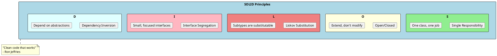
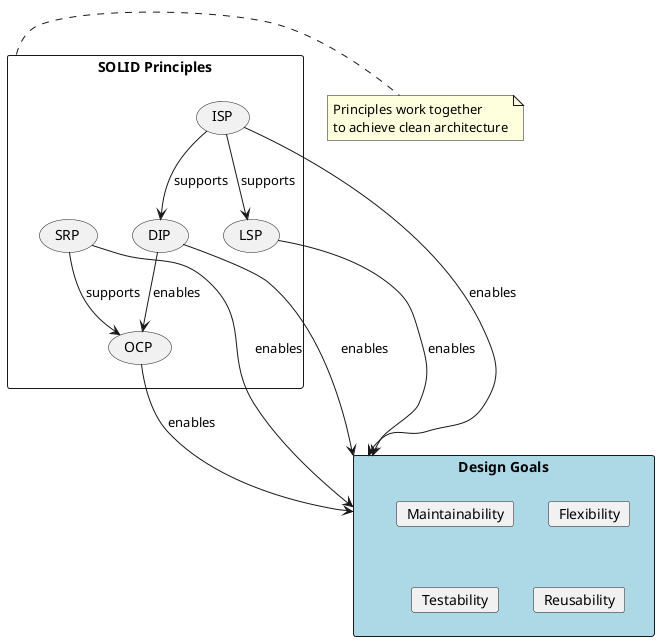
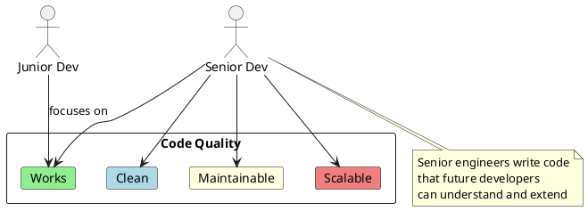
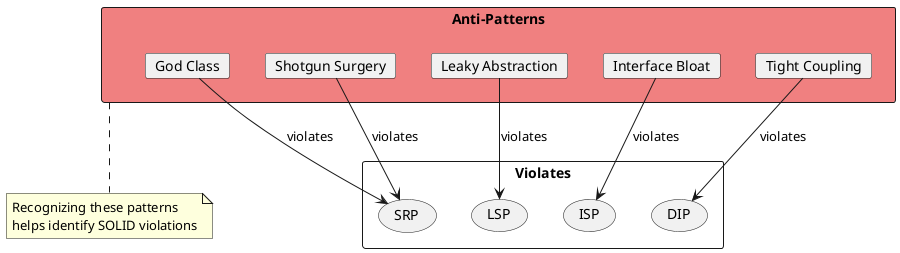

# SOLID Principles

SOLID is an acronym for five design principles introduced by Robert C. Martin (Uncle Bob) that make software designs more understandable, flexible, and maintainable. These principles are fundamental to object-oriented design and are essential knowledge for senior engineers.



## Overview

| Principle | Full Name | Key Concept | Violation Sign |
|-----------|-----------|-------------|----------------|
| **S** | Single Responsibility | A class should have only one reason to change | Class doing too many things |
| **O** | Open/Closed | Open for extension, closed for modification | Modifying existing code for new features |
| **L** | Liskov Substitution | Derived classes must be substitutable for base classes | Subclass breaking parent's contract |
| **I** | Interface Segregation | Many specific interfaces are better than one general | Classes implementing unused methods |
| **D** | Dependency Inversion | Depend on abstractions, not concretions | High-level modules depending on low-level details |

## The Relationship Between Principles



## Files in This Section

| File | Principle | What You'll Learn |
|------|-----------|-------------------|
| [01-SingleResponsibility.md](./01-SingleResponsibility.md) | SRP | How to identify and separate responsibilities |
| [02-OpenClosed.md](./02-OpenClosed.md) | OCP | Extending behavior without modification |
| [03-LiskovSubstitution.md](./03-LiskovSubstitution.md) | LSP | Proper inheritance and behavioral subtyping |
| [04-InterfaceSegregation.md](./04-InterfaceSegregation.md) | ISP | Designing cohesive interfaces |
| [05-DependencyInversion.md](./05-DependencyInversion.md) | DIP | Inverting dependencies for flexibility |

## Why SOLID Matters for Senior Engineers



As a senior engineer, you're expected to:

1. **Design systems that are easy to maintain** - SOLID principles reduce code coupling
2. **Write code that other developers can understand** - Clean separation of concerns
3. **Build flexible architectures that accommodate change** - Open for extension
4. **Lead by example with clean code practices** - Teach through code
5. **Make informed architectural decisions** - Know when to apply each principle

## Quick Reference

```
┌─────────────────────────────────────────────────────────────────────┐
│                        SOLID Quick Reference                         │
├─────────────────────────────────────────────────────────────────────┤
│ SRP: One class = One responsibility = One reason to change          │
│      "A class should have one, and only one, reason to change"      │
├─────────────────────────────────────────────────────────────────────┤
│ OCP: Add new behavior without modifying existing code               │
│      "Software entities should be open for extension,               │
│       but closed for modification"                                  │
├─────────────────────────────────────────────────────────────────────┤
│ LSP: Child classes should work wherever parent is expected          │
│      "Objects of a superclass should be replaceable with            │
│       objects of its subclasses without breaking the application"   │
├─────────────────────────────────────────────────────────────────────┤
│ ISP: Don't force clients to implement methods they don't use        │
│      "Many client-specific interfaces are better than               │
│       one general-purpose interface"                                │
├─────────────────────────────────────────────────────────────────────┤
│ DIP: High-level modules shouldn't depend on low-level modules       │
│      "Depend upon abstractions, not concretions"                    │
└─────────────────────────────────────────────────────────────────────┘
```

## Common Interview Questions

1. **What is SOLID?** - Acronym for five OOP design principles
2. **Why use SOLID?** - Maintainability, testability, flexibility
3. **How do principles relate?** - They complement each other; violating one often leads to violating others
4. **Real-world application?** - Used in dependency injection, plugin architectures, clean architecture

## Anti-Patterns to Avoid



## Best Practices

1. **Don't over-engineer** - Apply principles where they add value
2. **Refactor gradually** - Don't rewrite everything at once
3. **Balance pragmatism** - Perfect is the enemy of good
4. **Use tests as feedback** - Hard to test often means SOLID violation
5. **Code reviews** - Team alignment on principles
