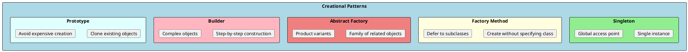
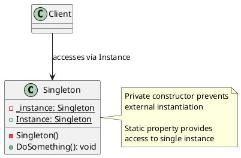
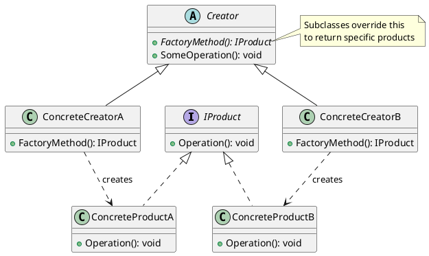
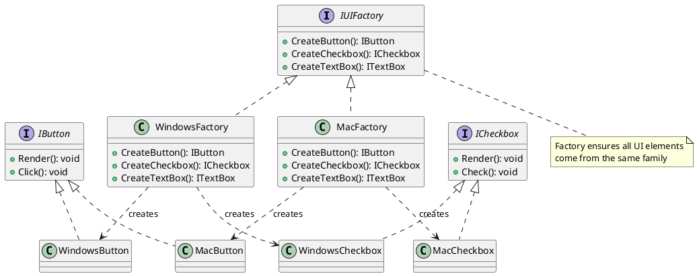
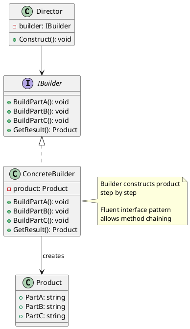
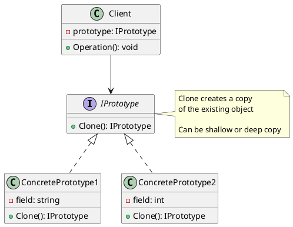

# Creational Design Patterns

Creational patterns abstract the instantiation process. They help make a system independent of how its objects are created, composed, and represented. These patterns become important when systems evolve to depend more on object composition than class inheritance.



---

## Singleton Pattern

### Intent
Ensure a class has only one instance and provide a global point of access to it. This is useful when exactly one object is needed to coordinate actions across the system.

### When to Use
- **Configuration managers** that load settings once
- **Connection pools** that manage shared resources
- **Logging services** that write to a single destination
- **Caches** that need centralized management



### Implementation

```csharp
// ❌ BAD: Not thread-safe
public class NaiveSingleton
{
    private static NaiveSingleton _instance;

    private NaiveSingleton() { }

    public static NaiveSingleton Instance
    {
        get
        {
            if (_instance == null)  // Race condition here!
            {
                _instance = new NaiveSingleton();
            }
            return _instance;
        }
    }
}
```

```csharp
// ✅ GOOD: Thread-safe with lazy initialization
public sealed class Singleton
{
    // Lazy<T> handles thread safety automatically
    private static readonly Lazy<Singleton> _lazy =
        new Lazy<Singleton>(() => new Singleton());

    public static Singleton Instance => _lazy.Value;

    private Singleton()
    {
        // Private constructor prevents external instantiation
    }

    public void DoSomething()
    {
        Console.WriteLine("Singleton is working");
    }
}

// Usage
Singleton.Instance.DoSomething();
```

```csharp
// ✅ GOOD: Using .NET Core DI (preferred approach)
public class AppSettings
{
    public string ConnectionString { get; set; }
    public int MaxRetries { get; set; }
}

// Registration - DI container ensures single instance
services.AddSingleton<AppSettings>(sp =>
{
    var config = sp.GetRequiredService<IConfiguration>();
    return config.GetSection("AppSettings").Get<AppSettings>();
});

// Usage - injected where needed
public class MyService
{
    private readonly AppSettings _settings;

    public MyService(AppSettings settings)
    {
        _settings = settings;  // Same instance everywhere
    }
}
```

### Real-World Example: Logger

```csharp
public sealed class Logger
{
    private static readonly Lazy<Logger> _instance =
        new Lazy<Logger>(() => new Logger());

    private readonly object _lock = new();
    private readonly string _logPath;

    public static Logger Instance => _instance.Value;

    private Logger()
    {
        _logPath = Path.Combine(
            Environment.GetFolderPath(Environment.SpecialFolder.ApplicationData),
            "MyApp",
            "app.log");

        Directory.CreateDirectory(Path.GetDirectoryName(_logPath)!);
    }

    public void Log(LogLevel level, string message)
    {
        var entry = $"{DateTime.UtcNow:O} [{level}] {message}";

        lock (_lock)  // Thread-safe file writing
        {
            File.AppendAllText(_logPath, entry + Environment.NewLine);
        }
    }

    public void Info(string message) => Log(LogLevel.Information, message);
    public void Error(string message) => Log(LogLevel.Error, message);
}

// Usage
Logger.Instance.Info("Application started");
Logger.Instance.Error("Something went wrong");
```

### Pros and Cons

| Pros | Cons |
|------|------|
| Controlled access to single instance | Global state (hidden dependencies) |
| Reduced namespace pollution | Harder to unit test |
| Lazy initialization possible | Violates Single Responsibility |
| Can be subclassed for variants | Tight coupling to concrete class |

---

## Factory Method Pattern

### Intent
Define an interface for creating an object, but let subclasses decide which class to instantiate. Factory Method lets a class defer instantiation to subclasses.

### When to Use
- When you don't know ahead of time what class you need to instantiate
- When you want subclasses to specify the objects they create
- When creation logic is complex and should be centralized
- When you need to return different types based on input



### Implementation

```csharp
// Product interface
public interface INotification
{
    void Send(string message);
}

// Concrete products
public class EmailNotification : INotification
{
    private readonly string _recipient;

    public EmailNotification(string recipient) => _recipient = recipient;

    public void Send(string message)
    {
        Console.WriteLine($"Email to {_recipient}: {message}");
    }
}

public class SmsNotification : INotification
{
    private readonly string _phoneNumber;

    public SmsNotification(string phoneNumber) => _phoneNumber = phoneNumber;

    public void Send(string message)
    {
        Console.WriteLine($"SMS to {_phoneNumber}: {message}");
    }
}

public class PushNotification : INotification
{
    private readonly string _deviceToken;

    public PushNotification(string deviceToken) => _deviceToken = deviceToken;

    public void Send(string message)
    {
        Console.WriteLine($"Push to {_deviceToken}: {message}");
    }
}

// Factory
public interface INotificationFactory
{
    INotification Create(string destination);
}

public class NotificationFactory : INotificationFactory
{
    public INotification Create(NotificationType type, string destination)
    {
        return type switch
        {
            NotificationType.Email => new EmailNotification(destination),
            NotificationType.Sms => new SmsNotification(destination),
            NotificationType.Push => new PushNotification(destination),
            _ => throw new ArgumentException($"Unknown notification type: {type}")
        };
    }
}

// Usage
var factory = new NotificationFactory();
var email = factory.Create(NotificationType.Email, "user@example.com");
var sms = factory.Create(NotificationType.Sms, "+1234567890");

email.Send("Hello via email!");
sms.Send("Hello via SMS!");
```

### Real-World Example: Document Factory

```csharp
public interface IDocument
{
    void Open();
    void Save();
    string Content { get; set; }
}

public class PdfDocument : IDocument
{
    public string Content { get; set; } = "";

    public void Open() => Console.WriteLine("Opening PDF document");
    public void Save() => Console.WriteLine("Saving PDF document");
}

public class WordDocument : IDocument
{
    public string Content { get; set; } = "";

    public void Open() => Console.WriteLine("Opening Word document");
    public void Save() => Console.WriteLine("Saving Word document");
}

public class ExcelDocument : IDocument
{
    public string Content { get; set; } = "";

    public void Open() => Console.WriteLine("Opening Excel document");
    public void Save() => Console.WriteLine("Saving Excel document");
}

// Factory with DI support
public interface IDocumentFactory
{
    IDocument CreateDocument(string filePath);
}

public class DocumentFactory : IDocumentFactory
{
    public IDocument CreateDocument(string filePath)
    {
        var extension = Path.GetExtension(filePath).ToLower();

        return extension switch
        {
            ".pdf" => new PdfDocument(),
            ".doc" or ".docx" => new WordDocument(),
            ".xls" or ".xlsx" => new ExcelDocument(),
            _ => throw new NotSupportedException($"File type {extension} not supported")
        };
    }
}

// Usage with DI
services.AddSingleton<IDocumentFactory, DocumentFactory>();

public class DocumentService
{
    private readonly IDocumentFactory _factory;

    public DocumentService(IDocumentFactory factory) => _factory = factory;

    public void ProcessDocument(string filePath)
    {
        var document = _factory.CreateDocument(filePath);
        document.Open();
        // Process...
        document.Save();
    }
}
```

---

## Abstract Factory Pattern

### Intent
Provide an interface for creating families of related or dependent objects without specifying their concrete classes. This is useful when your system needs to work with multiple families of products.

### When to Use
- When you need to create families of related objects
- When you want to enforce that products from the same family are used together
- When you're building cross-platform UI, database providers, or theme systems



### Implementation

```csharp
// Abstract products
public interface IButton
{
    void Render();
    void OnClick(Action handler);
}

public interface ITextBox
{
    void Render();
    string Text { get; set; }
}

public interface ICheckbox
{
    void Render();
    bool IsChecked { get; set; }
}

// Windows family
public class WindowsButton : IButton
{
    public void Render() => Console.WriteLine("[Windows Button]");
    public void OnClick(Action handler) => handler();
}

public class WindowsTextBox : ITextBox
{
    public string Text { get; set; } = "";
    public void Render() => Console.WriteLine($"[Windows TextBox: {Text}]");
}

public class WindowsCheckbox : ICheckbox
{
    public bool IsChecked { get; set; }
    public void Render() => Console.WriteLine($"[Windows Checkbox: {(IsChecked ? "☑" : "☐")}]");
}

// Mac family
public class MacButton : IButton
{
    public void Render() => Console.WriteLine("(Mac Button)");
    public void OnClick(Action handler) => handler();
}

public class MacTextBox : ITextBox
{
    public string Text { get; set; } = "";
    public void Render() => Console.WriteLine($"(Mac TextBox: {Text})");
}

public class MacCheckbox : ICheckbox
{
    public bool IsChecked { get; set; }
    public void Render() => Console.WriteLine($"(Mac Checkbox: {(IsChecked ? "✓" : "○")})");
}

// Abstract factory
public interface IUIFactory
{
    IButton CreateButton();
    ITextBox CreateTextBox();
    ICheckbox CreateCheckbox();
}

public class WindowsUIFactory : IUIFactory
{
    public IButton CreateButton() => new WindowsButton();
    public ITextBox CreateTextBox() => new WindowsTextBox();
    public ICheckbox CreateCheckbox() => new WindowsCheckbox();
}

public class MacUIFactory : IUIFactory
{
    public IButton CreateButton() => new MacButton();
    public ITextBox CreateTextBox() => new MacTextBox();
    public ICheckbox CreateCheckbox() => new MacCheckbox();
}

// Client code - works with any factory
public class LoginForm
{
    private readonly IButton _submitButton;
    private readonly ITextBox _usernameBox;
    private readonly ITextBox _passwordBox;
    private readonly ICheckbox _rememberMe;

    public LoginForm(IUIFactory factory)
    {
        _submitButton = factory.CreateButton();
        _usernameBox = factory.CreateTextBox();
        _passwordBox = factory.CreateTextBox();
        _rememberMe = factory.CreateCheckbox();
    }

    public void Render()
    {
        Console.WriteLine("=== Login Form ===");
        _usernameBox.Text = "Username";
        _usernameBox.Render();
        _passwordBox.Text = "Password";
        _passwordBox.Render();
        _rememberMe.IsChecked = true;
        _rememberMe.Render();
        _submitButton.Render();
    }
}

// Usage - switch families by changing factory
IUIFactory factory = Environment.OSVersion.Platform == PlatformID.Win32NT
    ? new WindowsUIFactory()
    : new MacUIFactory();

var loginForm = new LoginForm(factory);
loginForm.Render();
```

### .NET Example: DbProviderFactory

```csharp
// .NET Framework provides abstract factories for database access
public abstract class DbProviderFactory
{
    public virtual DbConnection CreateConnection();
    public virtual DbCommand CreateCommand();
    public virtual DbParameter CreateParameter();
    public virtual DbDataAdapter CreateDataAdapter();
}

// SQL Server implementation
public class SqlClientFactory : DbProviderFactory
{
    public override DbConnection CreateConnection() => new SqlConnection();
    public override DbCommand CreateCommand() => new SqlCommand();
    // ...
}

// PostgreSQL implementation
public class NpgsqlFactory : DbProviderFactory
{
    public override DbConnection CreateConnection() => new NpgsqlConnection();
    public override DbCommand CreateCommand() => new NpgsqlCommand();
    // ...
}

// Generic data access - works with any database
public class DataAccess
{
    private readonly DbProviderFactory _factory;
    private readonly string _connectionString;

    public DataAccess(DbProviderFactory factory, string connectionString)
    {
        _factory = factory;
        _connectionString = connectionString;
    }

    public async Task<List<T>> QueryAsync<T>(string sql)
    {
        using var connection = _factory.CreateConnection();
        connection.ConnectionString = _connectionString;

        using var command = _factory.CreateCommand();
        command.Connection = connection;
        command.CommandText = sql;

        await connection.OpenAsync();
        // Execute and map results...
    }
}
```

---

## Builder Pattern

### Intent
Separate the construction of a complex object from its representation so that the same construction process can create different representations. Builders are especially useful when an object has many optional parameters.

### When to Use
- When object construction requires many steps
- When you want to create different representations of a product
- When construction logic should be isolated from the object
- When you have many optional parameters (alternative to telescoping constructors)



### Implementation

```csharp
// Product
public class HttpRequest
{
    public string Method { get; set; } = "GET";
    public string Url { get; set; } = "";
    public Dictionary<string, string> Headers { get; } = new();
    public string? Body { get; set; }
    public TimeSpan Timeout { get; set; } = TimeSpan.FromSeconds(30);
    public bool FollowRedirects { get; set; } = true;

    public override string ToString()
    {
        var sb = new StringBuilder();
        sb.AppendLine($"{Method} {Url}");
        foreach (var header in Headers)
            sb.AppendLine($"{header.Key}: {header.Value}");
        if (!string.IsNullOrEmpty(Body))
            sb.AppendLine($"\n{Body}");
        return sb.ToString();
    }
}

// Builder with fluent interface
public class HttpRequestBuilder
{
    private readonly HttpRequest _request = new();

    public HttpRequestBuilder WithMethod(string method)
    {
        _request.Method = method;
        return this;
    }

    public HttpRequestBuilder WithUrl(string url)
    {
        _request.Url = url;
        return this;
    }

    public HttpRequestBuilder WithHeader(string name, string value)
    {
        _request.Headers[name] = value;
        return this;
    }

    public HttpRequestBuilder WithJsonBody(object body)
    {
        _request.Body = JsonSerializer.Serialize(body);
        _request.Headers["Content-Type"] = "application/json";
        return this;
    }

    public HttpRequestBuilder WithTimeout(TimeSpan timeout)
    {
        _request.Timeout = timeout;
        return this;
    }

    public HttpRequestBuilder WithoutRedirects()
    {
        _request.FollowRedirects = false;
        return this;
    }

    public HttpRequestBuilder WithBearerToken(string token)
    {
        _request.Headers["Authorization"] = $"Bearer {token}";
        return this;
    }

    public HttpRequest Build()
    {
        if (string.IsNullOrEmpty(_request.Url))
            throw new InvalidOperationException("URL is required");

        return _request;
    }
}

// Usage - fluent and readable
var request = new HttpRequestBuilder()
    .WithMethod("POST")
    .WithUrl("https://api.example.com/users")
    .WithHeader("Accept", "application/json")
    .WithBearerToken("eyJhbGciOiJIUzI1NiIs...")
    .WithJsonBody(new { Name = "John", Email = "john@example.com" })
    .WithTimeout(TimeSpan.FromSeconds(10))
    .Build();

Console.WriteLine(request);
```

### Real-World Example: Email Builder

```csharp
public class Email
{
    public string From { get; set; } = "";
    public List<string> To { get; } = new();
    public List<string> Cc { get; } = new();
    public List<string> Bcc { get; } = new();
    public string Subject { get; set; } = "";
    public string Body { get; set; } = "";
    public bool IsHtml { get; set; }
    public List<Attachment> Attachments { get; } = new();
    public Priority Priority { get; set; } = Priority.Normal;
}

public class EmailBuilder
{
    private readonly Email _email = new();

    public EmailBuilder From(string address)
    {
        _email.From = address;
        return this;
    }

    public EmailBuilder To(params string[] addresses)
    {
        _email.To.AddRange(addresses);
        return this;
    }

    public EmailBuilder Cc(params string[] addresses)
    {
        _email.Cc.AddRange(addresses);
        return this;
    }

    public EmailBuilder Bcc(params string[] addresses)
    {
        _email.Bcc.AddRange(addresses);
        return this;
    }

    public EmailBuilder Subject(string subject)
    {
        _email.Subject = subject;
        return this;
    }

    public EmailBuilder Body(string body, bool isHtml = false)
    {
        _email.Body = body;
        _email.IsHtml = isHtml;
        return this;
    }

    public EmailBuilder HtmlBody(string html)
    {
        return Body(html, isHtml: true);
    }

    public EmailBuilder Attach(string filePath)
    {
        _email.Attachments.Add(new Attachment(filePath));
        return this;
    }

    public EmailBuilder HighPriority()
    {
        _email.Priority = Priority.High;
        return this;
    }

    public Email Build()
    {
        // Validation
        if (string.IsNullOrEmpty(_email.From))
            throw new InvalidOperationException("From address is required");
        if (_email.To.Count == 0)
            throw new InvalidOperationException("At least one recipient is required");
        if (string.IsNullOrEmpty(_email.Subject))
            throw new InvalidOperationException("Subject is required");

        return _email;
    }
}

// Usage
var email = new EmailBuilder()
    .From("sender@company.com")
    .To("user1@example.com", "user2@example.com")
    .Cc("manager@company.com")
    .Subject("Monthly Report")
    .HtmlBody("<h1>Report</h1><p>Please find attached...</p>")
    .Attach("/reports/monthly.pdf")
    .HighPriority()
    .Build();
```

### .NET Examples of Builder Pattern

```csharp
// StringBuilder - classic builder
var sb = new StringBuilder()
    .Append("Hello")
    .Append(" ")
    .Append("World")
    .AppendLine("!")
    .ToString();

// HostBuilder - ASP.NET Core
var host = Host.CreateDefaultBuilder(args)
    .ConfigureWebHostDefaults(webBuilder =>
    {
        webBuilder.UseStartup<Startup>();
    })
    .ConfigureLogging(logging =>
    {
        logging.AddConsole();
        logging.AddDebug();
    })
    .Build();

// ConfigurationBuilder
var config = new ConfigurationBuilder()
    .SetBasePath(Directory.GetCurrentDirectory())
    .AddJsonFile("appsettings.json")
    .AddJsonFile($"appsettings.{env}.json", optional: true)
    .AddEnvironmentVariables()
    .AddCommandLine(args)
    .Build();

// HttpClient with HttpRequestMessage
var request = new HttpRequestMessage(HttpMethod.Post, "https://api.example.com/data")
{
    Content = new StringContent(json, Encoding.UTF8, "application/json")
};
request.Headers.Add("X-Custom-Header", "value");
```

---

## Prototype Pattern

### Intent
Specify the kinds of objects to create using a prototypical instance, and create new objects by copying this prototype. This is useful when creating an instance of a class is expensive or complicated.

### When to Use
- When object creation is expensive (database calls, complex calculations)
- When you need copies of objects with small variations
- When classes to instantiate are specified at runtime
- When you want to avoid subclasses of factories



### Implementation

```csharp
// Prototype interface
public interface IPrototype<T>
{
    T Clone();
}

// Shallow copy vs Deep copy example
public class Address : IPrototype<Address>
{
    public string Street { get; set; } = "";
    public string City { get; set; } = "";
    public string Country { get; set; } = "";

    public Address Clone()
    {
        // Shallow copy is sufficient for value types and strings
        return (Address)MemberwiseClone();
    }
}

public class Person : IPrototype<Person>
{
    public string Name { get; set; } = "";
    public int Age { get; set; }
    public Address Address { get; set; } = new();
    public List<string> Skills { get; set; } = new();

    // Shallow clone - reference types share same instance!
    public Person ShallowClone()
    {
        return (Person)MemberwiseClone();
    }

    // Deep clone - creates independent copies
    public Person Clone()
    {
        var clone = (Person)MemberwiseClone();
        clone.Address = Address.Clone();  // Clone reference types
        clone.Skills = new List<string>(Skills);  // New list with same items
        return clone;
    }
}

// Usage demonstrating the difference
var original = new Person
{
    Name = "John",
    Age = 30,
    Address = new Address { City = "New York", Country = "USA" },
    Skills = new List<string> { "C#", "SQL" }
};

// Shallow clone - Address is shared!
var shallowCopy = original.ShallowClone();
shallowCopy.Address.City = "Boston";  // Changes original too!

// Deep clone - Address is independent
var deepCopy = original.Clone();
deepCopy.Address.City = "Chicago";  // Original unaffected
```

### Real-World Example: Document Templates

```csharp
public class DocumentTemplate : IPrototype<DocumentTemplate>
{
    public string Title { get; set; } = "";
    public string Content { get; set; } = "";
    public List<Section> Sections { get; set; } = new();
    public Dictionary<string, string> Placeholders { get; set; } = new();
    public Formatting Formatting { get; set; } = new();

    public DocumentTemplate Clone()
    {
        return new DocumentTemplate
        {
            Title = Title,
            Content = Content,
            Sections = Sections.Select(s => s.Clone()).ToList(),
            Placeholders = new Dictionary<string, string>(Placeholders),
            Formatting = Formatting.Clone()
        };
    }

    public DocumentTemplate WithTitle(string title)
    {
        var clone = Clone();
        clone.Title = title;
        return clone;
    }

    public DocumentTemplate WithPlaceholder(string key, string value)
    {
        var clone = Clone();
        clone.Placeholders[key] = value;
        return clone;
    }
}

// Template registry
public class DocumentTemplateRegistry
{
    private readonly Dictionary<string, DocumentTemplate> _templates = new();

    public void Register(string name, DocumentTemplate template)
    {
        _templates[name] = template;
    }

    public DocumentTemplate Create(string name)
    {
        if (!_templates.TryGetValue(name, out var template))
            throw new KeyNotFoundException($"Template '{name}' not found");

        return template.Clone();  // Return a copy, not the original!
    }
}

// Usage
var registry = new DocumentTemplateRegistry();

// Register templates
registry.Register("invoice", new DocumentTemplate
{
    Title = "Invoice",
    Content = "Invoice for {{CustomerName}}...",
    Sections = new List<Section>
    {
        new Section { Name = "Items", Type = SectionType.Table },
        new Section { Name = "Total", Type = SectionType.Summary }
    }
});

// Create documents from templates
var invoice1 = registry.Create("invoice")
    .WithPlaceholder("CustomerName", "Acme Corp");

var invoice2 = registry.Create("invoice")
    .WithPlaceholder("CustomerName", "Tech Inc");
```

### Using JSON Serialization for Deep Clone

```csharp
public static class DeepCloneExtensions
{
    // Generic deep clone using JSON serialization
    public static T DeepClone<T>(this T source) where T : class
    {
        var json = JsonSerializer.Serialize(source);
        return JsonSerializer.Deserialize<T>(json)!;
    }
}

// Usage - works for any serializable object
var original = new ComplexObject { /* ... */ };
var clone = original.DeepClone();
```

---

## Interview Questions & Answers

### Q1: What is the difference between Factory Method and Abstract Factory?

**Answer**:
- **Factory Method**: Creates ONE type of product. A single method that subclasses override to create specific products.
- **Abstract Factory**: Creates FAMILIES of related products. Multiple factory methods grouped together to ensure products work together.

```csharp
// Factory Method - single product
INotification notification = factory.Create(NotificationType.Email);

// Abstract Factory - family of products
IButton button = uiFactory.CreateButton();
ITextBox textBox = uiFactory.CreateTextBox();
// Both guaranteed to be from same family (Windows or Mac)
```

### Q2: When should you use Builder instead of constructor?

**Answer**: Use Builder when:
1. **Many parameters** (more than 4-5)
2. **Many optional parameters** (telescoping constructor problem)
3. **Complex validation** required during construction
4. **Immutable objects** with many fields
5. **Fluent interface** desired for readability

### Q3: What are the problems with Singleton?

**Answer**:
1. **Hidden dependencies** - hard to see what a class depends on
2. **Global state** - makes testing difficult
3. **Tight coupling** - clients coupled to concrete implementation
4. **Thread safety** - must be carefully implemented
5. **Violates SRP** - manages own lifecycle AND business logic

**Better alternative**: Use DI container with singleton lifetime.

### Q4: Explain shallow vs deep copy in Prototype pattern.

**Answer**:
- **Shallow copy**: Copies field values. Reference type fields point to same objects.
- **Deep copy**: Creates new instances of referenced objects. Completely independent copy.

```csharp
// Shallow: person2.Address == person1.Address (same object)
var person2 = (Person)person1.MemberwiseClone();

// Deep: person2.Address is a new object with same values
var person2 = person1.DeepClone();
```

### Q5: How does Abstract Factory support Open/Closed Principle?

**Answer**: You can add new product families without modifying existing code:
1. Create new concrete factory (e.g., `LinuxUIFactory`)
2. Create new concrete products (e.g., `LinuxButton`, `LinuxTextBox`)
3. Client code works unchanged - just inject different factory

This follows OCP: open for extension (new families), closed for modification (existing code).
