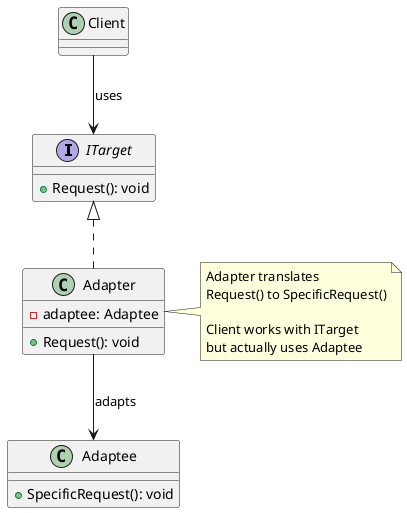
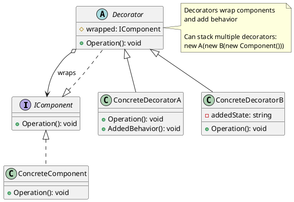
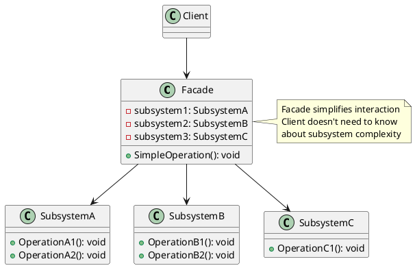
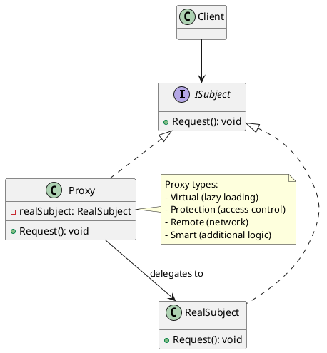
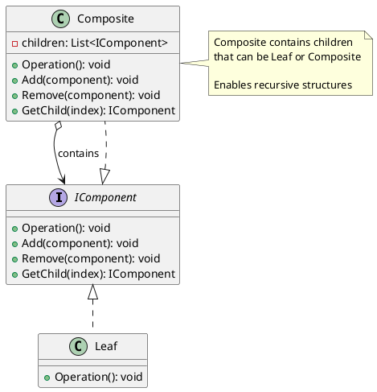

# Structural Design Patterns

Structural patterns explain how to assemble objects and classes into larger structures while keeping these structures flexible and efficient. They use inheritance and composition to create new functionality from existing components.

```plantuml
@startuml
skinparam monochrome false
skinparam shadowing false

rectangle "Structural Patterns" as sp #LightBlue {

  rectangle "Adapter" as adapter #LightGreen {
    card "Convert interface to another"
    card "Make incompatible classes work together"
  }

  rectangle "Decorator" as dec #LightYellow {
    card "Add responsibilities dynamically"
    card "Alternative to subclassing"
  }

  rectangle "Facade" as facade #LightCoral {
    card "Simplified interface"
    card "Hide complex subsystems"
  }

  rectangle "Proxy" as proxy #LightPink {
    card "Placeholder for another object"
    card "Control access"
  }

  rectangle "Composite" as comp #LightCyan {
    card "Tree structures"
    card "Treat individual and groups uniformly"
  }

}
@enduml
```



---

## Adapter Pattern

### Intent
Convert the interface of a class into another interface clients expect. Adapter lets classes work together that couldn't otherwise because of incompatible interfaces. Think of it like a power adapter that lets you plug a US device into a European outlet.

### When to Use
- When you want to use an existing class but its interface doesn't match what you need
- When you need to integrate with legacy code or third-party libraries
- When you want to create a reusable class that cooperates with unrelated classes



### Implementation

```csharp
// Existing third-party payment library (can't modify)
public class LegacyPaymentGateway
{
    public bool MakePayment(string accountId, double amountInCents)
    {
        Console.WriteLine($"Legacy: Charging {amountInCents} cents to {accountId}");
        return true;
    }

    public bool IssueRefund(string accountId, double amountInCents, string reason)
    {
        Console.WriteLine($"Legacy: Refunding {amountInCents} cents to {accountId}");
        return true;
    }
}

// Interface your application expects
public interface IPaymentProcessor
{
    Task<PaymentResult> ProcessPaymentAsync(PaymentRequest request);
    Task<RefundResult> ProcessRefundAsync(RefundRequest request);
}

public class PaymentRequest
{
    public string CustomerId { get; set; } = "";
    public decimal Amount { get; set; }  // In dollars
    public string Currency { get; set; } = "USD";
}

public class RefundRequest
{
    public string CustomerId { get; set; } = "";
    public decimal Amount { get; set; }
    public string Reason { get; set; } = "";
}

// Adapter - makes legacy gateway work with modern interface
public class LegacyPaymentAdapter : IPaymentProcessor
{
    private readonly LegacyPaymentGateway _legacyGateway;

    public LegacyPaymentAdapter(LegacyPaymentGateway legacyGateway)
    {
        _legacyGateway = legacyGateway;
    }

    public Task<PaymentResult> ProcessPaymentAsync(PaymentRequest request)
    {
        // Adapt: convert dollars to cents, async to sync
        var amountInCents = (double)(request.Amount * 100);
        var success = _legacyGateway.MakePayment(request.CustomerId, amountInCents);

        return Task.FromResult(new PaymentResult
        {
            Success = success,
            TransactionId = Guid.NewGuid().ToString()
        });
    }

    public Task<RefundResult> ProcessRefundAsync(RefundRequest request)
    {
        var amountInCents = (double)(request.Amount * 100);
        var success = _legacyGateway.IssueRefund(
            request.CustomerId,
            amountInCents,
            request.Reason);

        return Task.FromResult(new RefundResult { Success = success });
    }
}

// Usage - client works with modern interface
public class PaymentService
{
    private readonly IPaymentProcessor _processor;

    public PaymentService(IPaymentProcessor processor)
    {
        _processor = processor;  // Could be adapter or modern implementation
    }

    public async Task<PaymentResult> ChargeCustomerAsync(string customerId, decimal amount)
    {
        return await _processor.ProcessPaymentAsync(new PaymentRequest
        {
            CustomerId = customerId,
            Amount = amount
        });
    }
}

// DI registration
services.AddSingleton<LegacyPaymentGateway>();
services.AddScoped<IPaymentProcessor, LegacyPaymentAdapter>();
```

### Real-World Example: Data Format Adapter

```csharp
// External API returns XML
public class ExternalWeatherApi
{
    public string GetWeatherXml(string city)
    {
        return $@"<weather>
            <city>{city}</city>
            <temp>72</temp>
            <condition>Sunny</condition>
        </weather>";
    }
}

// Your app expects this interface
public interface IWeatherService
{
    Task<WeatherData> GetWeatherAsync(string city);
}

public class WeatherData
{
    public string City { get; set; } = "";
    public int TemperatureFahrenheit { get; set; }
    public string Condition { get; set; } = "";
}

// Adapter converts XML to your domain model
public class XmlWeatherAdapter : IWeatherService
{
    private readonly ExternalWeatherApi _api;

    public XmlWeatherAdapter(ExternalWeatherApi api) => _api = api;

    public Task<WeatherData> GetWeatherAsync(string city)
    {
        var xml = _api.GetWeatherXml(city);
        var doc = XDocument.Parse(xml);

        var weather = new WeatherData
        {
            City = doc.Root!.Element("city")!.Value,
            TemperatureFahrenheit = int.Parse(doc.Root.Element("temp")!.Value),
            Condition = doc.Root.Element("condition")!.Value
        };

        return Task.FromResult(weather);
    }
}
```

---

## Decorator Pattern

### Intent
Attach additional responsibilities to an object dynamically. Decorators provide a flexible alternative to subclassing for extending functionality. Each decorator wraps the original object and adds behavior before or after delegating to it.

### When to Use
- When you need to add responsibilities to objects dynamically and transparently
- When extension by subclassing is impractical (too many combinations)
- For cross-cutting concerns: logging, caching, validation, retry logic



### Implementation

```csharp
// Component interface
public interface IDataService
{
    Task<string> GetDataAsync(string key);
    Task SetDataAsync(string key, string value);
}

// Concrete component
public class DatabaseDataService : IDataService
{
    public async Task<string> GetDataAsync(string key)
    {
        await Task.Delay(100); // Simulate DB call
        Console.WriteLine($"[DB] Reading {key} from database");
        return $"Data for {key}";
    }

    public async Task SetDataAsync(string key, string value)
    {
        await Task.Delay(100);
        Console.WriteLine($"[DB] Writing {key} to database");
    }
}

// Decorator base class
public abstract class DataServiceDecorator : IDataService
{
    protected readonly IDataService _wrapped;

    protected DataServiceDecorator(IDataService wrapped)
    {
        _wrapped = wrapped;
    }

    public virtual Task<string> GetDataAsync(string key)
        => _wrapped.GetDataAsync(key);

    public virtual Task SetDataAsync(string key, string value)
        => _wrapped.SetDataAsync(key, value);
}

// Logging decorator
public class LoggingDataService : DataServiceDecorator
{
    private readonly ILogger _logger;

    public LoggingDataService(IDataService wrapped, ILogger logger)
        : base(wrapped)
    {
        _logger = logger;
    }

    public override async Task<string> GetDataAsync(string key)
    {
        _logger.LogInformation("Getting data for key: {Key}", key);
        var result = await base.GetDataAsync(key);
        _logger.LogInformation("Got data for key: {Key}", key);
        return result;
    }

    public override async Task SetDataAsync(string key, string value)
    {
        _logger.LogInformation("Setting data for key: {Key}", key);
        await base.SetDataAsync(key, value);
        _logger.LogInformation("Set data for key: {Key}", key);
    }
}

// Caching decorator
public class CachingDataService : DataServiceDecorator
{
    private readonly IMemoryCache _cache;
    private readonly TimeSpan _expiration;

    public CachingDataService(IDataService wrapped, IMemoryCache cache, TimeSpan expiration)
        : base(wrapped)
    {
        _cache = cache;
        _expiration = expiration;
    }

    public override async Task<string> GetDataAsync(string key)
    {
        if (_cache.TryGetValue(key, out string? cached))
        {
            Console.WriteLine($"[Cache] HIT for {key}");
            return cached!;
        }

        Console.WriteLine($"[Cache] MISS for {key}");
        var result = await base.GetDataAsync(key);
        _cache.Set(key, result, _expiration);
        return result;
    }

    public override async Task SetDataAsync(string key, string value)
    {
        await base.SetDataAsync(key, value);
        _cache.Set(key, value, _expiration);
    }
}

// Retry decorator
public class RetryDataService : DataServiceDecorator
{
    private readonly int _maxRetries;
    private readonly TimeSpan _delay;

    public RetryDataService(IDataService wrapped, int maxRetries, TimeSpan delay)
        : base(wrapped)
    {
        _maxRetries = maxRetries;
        _delay = delay;
    }

    public override async Task<string> GetDataAsync(string key)
    {
        for (int i = 0; i < _maxRetries; i++)
        {
            try
            {
                return await base.GetDataAsync(key);
            }
            catch when (i < _maxRetries - 1)
            {
                Console.WriteLine($"[Retry] Attempt {i + 1} failed, retrying...");
                await Task.Delay(_delay * (i + 1)); // Exponential backoff
            }
        }
        throw new Exception("All retries exhausted");
    }
}

// Usage - stack decorators
IDataService service = new DatabaseDataService();
service = new CachingDataService(service, cache, TimeSpan.FromMinutes(5));
service = new RetryDataService(service, maxRetries: 3, delay: TimeSpan.FromSeconds(1));
service = new LoggingDataService(service, logger);

// Now: Logging -> Retry -> Cache -> Database
var data = await service.GetDataAsync("user:123");
```

### .NET Stream Decorators

```csharp
// .NET uses decorator pattern extensively with streams
Stream fileStream = new FileStream("data.txt", FileMode.Open);
Stream buffered = new BufferedStream(fileStream);      // Adds buffering
Stream gzip = new GZipStream(buffered, CompressionMode.Decompress);  // Adds decompression

// Reading goes through: GZip -> Buffer -> File
using var reader = new StreamReader(gzip);
var content = await reader.ReadToEndAsync();
```

---

## Facade Pattern

### Intent
Provide a unified interface to a set of interfaces in a subsystem. Facade defines a higher-level interface that makes the subsystem easier to use. It doesn't hide the subsystem—it provides a simpler interface to it.

### When to Use
- When you want to provide a simple interface to a complex subsystem
- When there are many dependencies between clients and implementation classes
- When you want to layer your subsystems (each layer uses facade to communicate)



### Implementation

```csharp
// Complex subsystems
public class InventoryService
{
    public bool CheckStock(string productId, int quantity)
    {
        Console.WriteLine($"Checking stock for {productId}...");
        return true;
    }

    public void ReserveStock(string productId, int quantity)
    {
        Console.WriteLine($"Reserving {quantity} of {productId}");
    }

    public void ReleaseStock(string productId, int quantity)
    {
        Console.WriteLine($"Releasing {quantity} of {productId}");
    }
}

public class PaymentService
{
    public bool ValidateCard(string cardNumber)
    {
        Console.WriteLine("Validating card...");
        return true;
    }

    public string ChargeCard(string cardNumber, decimal amount)
    {
        Console.WriteLine($"Charging ${amount}...");
        return Guid.NewGuid().ToString();
    }

    public void RefundCard(string transactionId, decimal amount)
    {
        Console.WriteLine($"Refunding ${amount}...");
    }
}

public class ShippingService
{
    public decimal CalculateShipping(string address, decimal weight)
    {
        Console.WriteLine("Calculating shipping...");
        return 9.99m;
    }

    public string CreateShipment(string orderId, string address)
    {
        Console.WriteLine($"Creating shipment for {orderId}...");
        return $"TRACK-{Guid.NewGuid().ToString()[..8].ToUpper()}";
    }
}

public class NotificationService
{
    public void SendOrderConfirmation(string email, string orderId)
    {
        Console.WriteLine($"Sending confirmation to {email}");
    }

    public void SendShippingNotification(string email, string trackingNumber)
    {
        Console.WriteLine($"Sending shipping notification to {email}");
    }
}

// Facade - simplifies order processing
public class OrderFacade
{
    private readonly InventoryService _inventory;
    private readonly PaymentService _payment;
    private readonly ShippingService _shipping;
    private readonly NotificationService _notification;

    public OrderFacade(
        InventoryService inventory,
        PaymentService payment,
        ShippingService shipping,
        NotificationService notification)
    {
        _inventory = inventory;
        _payment = payment;
        _shipping = shipping;
        _notification = notification;
    }

    // Simple interface for complex operation
    public async Task<OrderResult> PlaceOrderAsync(OrderRequest request)
    {
        // 1. Check inventory
        foreach (var item in request.Items)
        {
            if (!_inventory.CheckStock(item.ProductId, item.Quantity))
            {
                return OrderResult.Failed($"Product {item.ProductId} out of stock");
            }
        }

        // 2. Reserve inventory
        foreach (var item in request.Items)
        {
            _inventory.ReserveStock(item.ProductId, item.Quantity);
        }

        // 3. Validate and charge payment
        if (!_payment.ValidateCard(request.CardNumber))
        {
            // Rollback inventory
            foreach (var item in request.Items)
            {
                _inventory.ReleaseStock(item.ProductId, item.Quantity);
            }
            return OrderResult.Failed("Invalid payment method");
        }

        var transactionId = _payment.ChargeCard(request.CardNumber, request.Total);

        // 4. Calculate shipping and create shipment
        var shippingCost = _shipping.CalculateShipping(request.ShippingAddress, request.TotalWeight);
        var orderId = Guid.NewGuid().ToString();
        var trackingNumber = _shipping.CreateShipment(orderId, request.ShippingAddress);

        // 5. Send notifications
        _notification.SendOrderConfirmation(request.CustomerEmail, orderId);
        _notification.SendShippingNotification(request.CustomerEmail, trackingNumber);

        return OrderResult.Success(orderId, trackingNumber);
    }
}

// Client code is simple
var facade = new OrderFacade(inventory, payment, shipping, notification);
var result = await facade.PlaceOrderAsync(new OrderRequest
{
    Items = new[] { new OrderItem("PROD-1", 2) },
    CardNumber = "4111111111111111",
    ShippingAddress = "123 Main St",
    CustomerEmail = "customer@example.com"
});
```

### Real-World Example: HttpClient as Facade

```csharp
// HttpClient is a facade over complex HTTP infrastructure
public class ApiClient
{
    private readonly HttpClient _client;

    public ApiClient(HttpClient client)
    {
        _client = client;
    }

    // Simple facade methods
    public async Task<T> GetAsync<T>(string endpoint)
    {
        var response = await _client.GetAsync(endpoint);
        response.EnsureSuccessStatusCode();
        return await response.Content.ReadFromJsonAsync<T>();
    }

    public async Task<T> PostAsync<T>(string endpoint, object data)
    {
        var response = await _client.PostAsJsonAsync(endpoint, data);
        response.EnsureSuccessStatusCode();
        return await response.Content.ReadFromJsonAsync<T>();
    }
}
```

---

## Proxy Pattern

### Intent
Provide a surrogate or placeholder for another object to control access to it. A proxy controls access to the original object, allowing you to perform something before or after the request gets through to the original object.

### Types of Proxies
- **Virtual Proxy**: Lazy loading of expensive objects
- **Protection Proxy**: Access control based on permissions
- **Remote Proxy**: Local representation of remote object
- **Logging/Caching Proxy**: Add cross-cutting concerns



### Implementation: Virtual Proxy (Lazy Loading)

```csharp
// Expensive object to load
public interface IImage
{
    void Display();
    int Width { get; }
    int Height { get; }
}

public class HighResolutionImage : IImage
{
    private readonly string _filePath;
    private byte[] _imageData;

    public int Width { get; private set; }
    public int Height { get; private set; }

    public HighResolutionImage(string filePath)
    {
        _filePath = filePath;
        LoadImage(); // Expensive operation in constructor
    }

    private void LoadImage()
    {
        Console.WriteLine($"Loading high-resolution image from {_filePath}...");
        Thread.Sleep(2000); // Simulate slow loading
        _imageData = File.ReadAllBytes(_filePath);
        Width = 4000;
        Height = 3000;
        Console.WriteLine("Image loaded!");
    }

    public void Display()
    {
        Console.WriteLine($"Displaying {Width}x{Height} image");
    }
}

// Virtual Proxy - delays loading until needed
public class ImageProxy : IImage
{
    private readonly string _filePath;
    private HighResolutionImage? _realImage;
    private readonly object _lock = new();

    public ImageProxy(string filePath)
    {
        _filePath = filePath;
        // Image NOT loaded yet - just storing the path
    }

    public int Width => GetRealImage().Width;
    public int Height => GetRealImage().Height;

    public void Display()
    {
        GetRealImage().Display();
    }

    private HighResolutionImage GetRealImage()
    {
        if (_realImage == null)
        {
            lock (_lock)
            {
                _realImage ??= new HighResolutionImage(_filePath);
            }
        }
        return _realImage;
    }
}

// Usage
var images = new List<IImage>
{
    new ImageProxy("image1.jpg"),  // Not loaded
    new ImageProxy("image2.jpg"),  // Not loaded
    new ImageProxy("image3.jpg"),  // Not loaded
};

// Only loads when accessed
images[0].Display(); // NOW it loads
```

### Implementation: Protection Proxy

```csharp
public interface IDocument
{
    string Content { get; }
    void Edit(string newContent);
    void Delete();
}

public class Document : IDocument
{
    public string Content { get; private set; }
    public string Name { get; }

    public Document(string name, string content)
    {
        Name = name;
        Content = content;
    }

    public void Edit(string newContent)
    {
        Content = newContent;
        Console.WriteLine($"Document '{Name}' edited");
    }

    public void Delete()
    {
        Console.WriteLine($"Document '{Name}' deleted");
    }
}

// Protection Proxy - controls access based on permissions
public class SecureDocumentProxy : IDocument
{
    private readonly Document _document;
    private readonly IUser _currentUser;
    private readonly IPermissionService _permissions;

    public SecureDocumentProxy(
        Document document,
        IUser currentUser,
        IPermissionService permissions)
    {
        _document = document;
        _currentUser = currentUser;
        _permissions = permissions;
    }

    public string Content
    {
        get
        {
            if (!_permissions.CanRead(_currentUser, _document))
                throw new UnauthorizedAccessException("No read permission");
            return _document.Content;
        }
    }

    public void Edit(string newContent)
    {
        if (!_permissions.CanWrite(_currentUser, _document))
            throw new UnauthorizedAccessException("No write permission");
        _document.Edit(newContent);
    }

    public void Delete()
    {
        if (!_permissions.CanDelete(_currentUser, _document))
            throw new UnauthorizedAccessException("No delete permission");
        _document.Delete();
    }
}
```

### Implementation: Caching Proxy

```csharp
public interface IWeatherService
{
    Task<WeatherData> GetWeatherAsync(string city);
}

public class WeatherApiService : IWeatherService
{
    public async Task<WeatherData> GetWeatherAsync(string city)
    {
        Console.WriteLine($"[API] Fetching weather for {city}...");
        await Task.Delay(1000); // Simulate API call
        return new WeatherData
        {
            City = city,
            Temperature = Random.Shared.Next(50, 90),
            Condition = "Sunny"
        };
    }
}

// Caching Proxy
public class CachingWeatherProxy : IWeatherService
{
    private readonly IWeatherService _realService;
    private readonly Dictionary<string, (WeatherData Data, DateTime CachedAt)> _cache = new();
    private readonly TimeSpan _cacheExpiration;

    public CachingWeatherProxy(IWeatherService realService, TimeSpan cacheExpiration)
    {
        _realService = realService;
        _cacheExpiration = cacheExpiration;
    }

    public async Task<WeatherData> GetWeatherAsync(string city)
    {
        var key = city.ToLower();

        if (_cache.TryGetValue(key, out var cached))
        {
            if (DateTime.UtcNow - cached.CachedAt < _cacheExpiration)
            {
                Console.WriteLine($"[Cache] HIT for {city}");
                return cached.Data;
            }
            Console.WriteLine($"[Cache] EXPIRED for {city}");
        }

        var data = await _realService.GetWeatherAsync(city);
        _cache[key] = (data, DateTime.UtcNow);
        return data;
    }
}

// Usage
IWeatherService service = new WeatherApiService();
service = new CachingWeatherProxy(service, TimeSpan.FromMinutes(10));

var weather1 = await service.GetWeatherAsync("Seattle"); // API call
var weather2 = await service.GetWeatherAsync("Seattle"); // Cache hit!
```

---

## Composite Pattern

### Intent
Compose objects into tree structures to represent part-whole hierarchies. Composite lets clients treat individual objects and compositions of objects uniformly.

### When to Use
- When you want to represent part-whole hierarchies of objects
- When you want clients to ignore the difference between compositions and individual objects
- File systems, UI component trees, organization structures



### Implementation: File System

```csharp
public interface IFileSystemItem
{
    string Name { get; }
    long Size { get; }
    void Display(int indent = 0);
}

// Leaf
public class File : IFileSystemItem
{
    public string Name { get; }
    public long Size { get; }

    public File(string name, long size)
    {
        Name = name;
        Size = size;
    }

    public void Display(int indent = 0)
    {
        Console.WriteLine($"{new string(' ', indent)}- {Name} ({Size} bytes)");
    }
}

// Composite
public class Directory : IFileSystemItem
{
    public string Name { get; }
    private readonly List<IFileSystemItem> _children = new();

    public long Size => _children.Sum(c => c.Size);

    public Directory(string name)
    {
        Name = name;
    }

    public void Add(IFileSystemItem item) => _children.Add(item);
    public void Remove(IFileSystemItem item) => _children.Remove(item);
    public IEnumerable<IFileSystemItem> Children => _children;

    public void Display(int indent = 0)
    {
        Console.WriteLine($"{new string(' ', indent)}+ {Name}/ ({Size} bytes)");
        foreach (var child in _children)
        {
            child.Display(indent + 2);
        }
    }
}

// Usage
var root = new Directory("root");

var documents = new Directory("documents");
documents.Add(new File("resume.pdf", 1024));
documents.Add(new File("cover_letter.docx", 512));

var photos = new Directory("photos");
var vacation = new Directory("vacation");
vacation.Add(new File("beach.jpg", 2048));
vacation.Add(new File("sunset.jpg", 1536));
photos.Add(vacation);
photos.Add(new File("profile.png", 768));

root.Add(documents);
root.Add(photos);
root.Add(new File("readme.txt", 128));

root.Display();
// Output:
// + root/ (6016 bytes)
//   + documents/ (1536 bytes)
//     - resume.pdf (1024 bytes)
//     - cover_letter.docx (512 bytes)
//   + photos/ (4352 bytes)
//     + vacation/ (3584 bytes)
//       - beach.jpg (2048 bytes)
//       - sunset.jpg (1536 bytes)
//     - profile.png (768 bytes)
//   - readme.txt (128 bytes)
```

### Real-World Example: Menu System

```csharp
public interface IMenuComponent
{
    string Name { get; }
    decimal? Price { get; }
    void Print(int indent = 0);
}

public class MenuItem : IMenuComponent
{
    public string Name { get; }
    public decimal? Price { get; }
    public string Description { get; }

    public MenuItem(string name, string description, decimal price)
    {
        Name = name;
        Description = description;
        Price = price;
    }

    public void Print(int indent = 0)
    {
        var prefix = new string(' ', indent);
        Console.WriteLine($"{prefix}{Name} - ${Price:F2}");
        Console.WriteLine($"{prefix}  {Description}");
    }
}

public class Menu : IMenuComponent
{
    public string Name { get; }
    public decimal? Price => null; // Menus don't have prices
    private readonly List<IMenuComponent> _items = new();

    public Menu(string name) => Name = name;

    public void Add(IMenuComponent item) => _items.Add(item);

    public void Print(int indent = 0)
    {
        var prefix = new string(' ', indent);
        Console.WriteLine($"\n{prefix}=== {Name.ToUpper()} ===");
        foreach (var item in _items)
        {
            item.Print(indent + 2);
        }
    }
}

// Build menu structure
var allMenus = new Menu("Restaurant Menu");

var breakfast = new Menu("Breakfast");
breakfast.Add(new MenuItem("Pancakes", "Fluffy with maple syrup", 8.99m));
breakfast.Add(new MenuItem("Omelette", "Three eggs with cheese", 10.99m));

var lunch = new Menu("Lunch");
lunch.Add(new MenuItem("Burger", "Angus beef with fries", 14.99m));
lunch.Add(new MenuItem("Salad", "Fresh garden salad", 9.99m));

var desserts = new Menu("Desserts");
desserts.Add(new MenuItem("Cake", "Chocolate layer cake", 6.99m));
lunch.Add(desserts); // Menu within menu

allMenus.Add(breakfast);
allMenus.Add(lunch);
allMenus.Print();
```

---

## Interview Questions & Answers

### Q1: What's the difference between Adapter and Facade?

**Answer**:
- **Adapter**: Converts one interface to another. Makes incompatible interfaces work together. Focuses on a single class.
- **Facade**: Provides a simplified interface to a complex subsystem. Doesn't change interfaces, just simplifies access.

```csharp
// Adapter - converts interface
INewPayment adapter = new OldPaymentAdapter(oldSystem);

// Facade - simplifies multiple subsystems
var result = facade.PlaceOrder(order); // Hides inventory, payment, shipping
```

### Q2: When would you use Decorator over inheritance?

**Answer**: Use Decorator when:
1. You need to add behavior to specific instances, not all instances
2. Behaviors need to be combined in different ways (logging + caching + retry)
3. You want to add/remove behavior at runtime
4. Inheritance would lead to class explosion

### Q3: What's the difference between Proxy and Decorator?

**Answer**: They look similar structurally but have different intents:
- **Proxy**: Controls access to the object (lazy loading, access control, caching)
- **Decorator**: Adds new behavior/responsibilities to the object

Proxy often creates the real object; Decorator receives it.

### Q4: How does Composite support recursive structures?

**Answer**: Composite allows both leaves and composites to implement the same interface. A composite can contain other composites (recursion), enabling tree structures. Operations traverse the tree automatically:

```csharp
directory.Size; // Recursively sums all files and subdirectories
```

### Q5: Give .NET Framework examples of these patterns.

**Answer**:
- **Adapter**: `StreamReader` (adapts `Stream`), `DbDataAdapter`
- **Decorator**: `BufferedStream`, `GZipStream`, `CryptoStream`
- **Facade**: `HttpClient`, `WebClient`, `SmtpClient`
- **Proxy**: EF Core lazy loading, `DispatchProxy`
- **Composite**: `Control.Controls` in WinForms, `UIElement` in WPF
