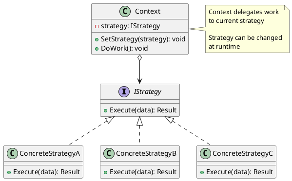
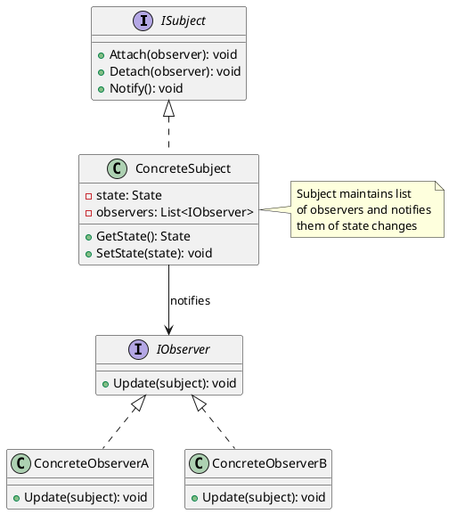
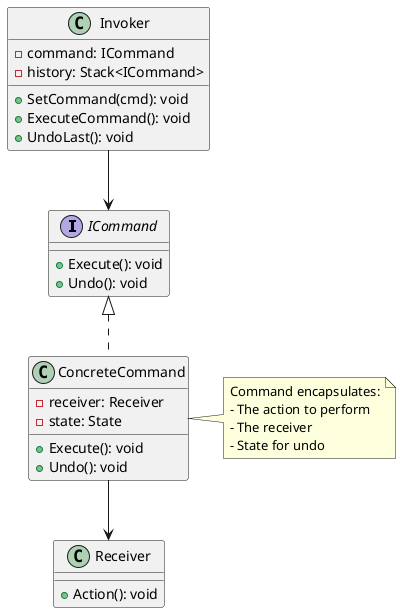
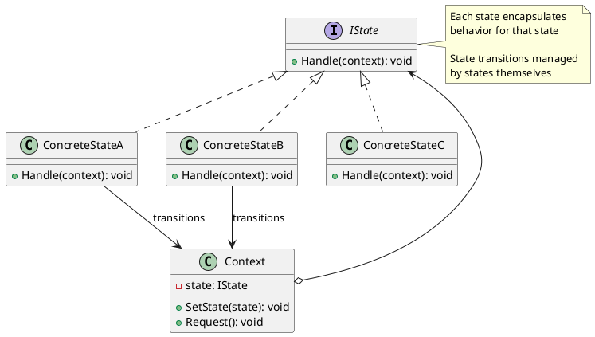
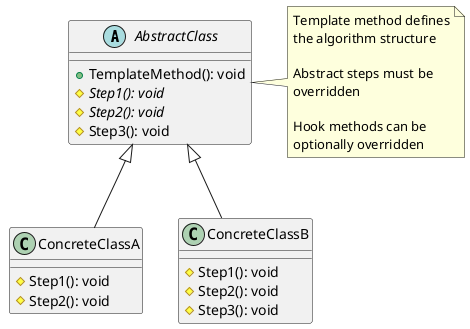
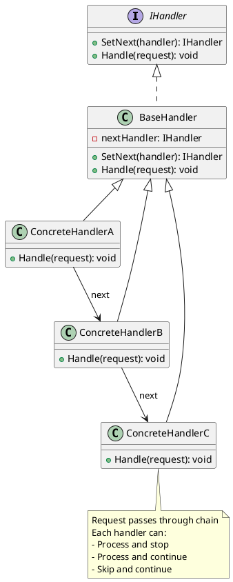

# Behavioral Design Patterns

Behavioral patterns are concerned with algorithms and the assignment of responsibilities between objects. They describe not just patterns of objects or classes but also the patterns of communication between them. These patterns characterize complex control flow that's difficult to follow at runtime.

```plantuml
@startuml
skinparam monochrome false
skinparam shadowing false

rectangle "Behavioral Patterns" as bp #LightBlue {

  rectangle "Strategy" as strat #LightGreen {
    card "Interchangeable algorithms"
    card "Runtime behavior selection"
  }

  rectangle "Observer" as obs #LightYellow {
    card "One-to-many dependency"
    card "Event notification"
  }

  rectangle "Command" as cmd #LightCoral {
    card "Encapsulate requests"
    card "Undo/redo support"
  }

  rectangle "State" as state #LightPink {
    card "Behavior based on state"
    card "State machines"
  }

  rectangle "Template Method" as temp #LightCyan {
    card "Algorithm skeleton"
    card "Defer steps to subclasses"
  }

  rectangle "Chain of Responsibility" as chain #Wheat {
    card "Pass along handler chain"
    card "Middleware pattern"
  }

}
@enduml
```



---

## Strategy Pattern

### Intent
Define a family of algorithms, encapsulate each one, and make them interchangeable. Strategy lets the algorithm vary independently from clients that use it. This is one of the most commonly used patterns, especially with dependency injection.

### When to Use
- When you have multiple algorithms for a specific task
- When you want to choose an algorithm at runtime
- When you have a class with many conditional behaviors
- When algorithm implementation details should be hidden from clients



### Implementation

```csharp
// Strategy interface
public interface IShippingStrategy
{
    decimal CalculateCost(Package package);
    int EstimatedDays { get; }
    string Name { get; }
}

// Concrete strategies
public class StandardShipping : IShippingStrategy
{
    public string Name => "Standard Shipping";
    public int EstimatedDays => 5;

    public decimal CalculateCost(Package package)
    {
        return 5.99m + (package.Weight * 0.50m);
    }
}

public class ExpressShipping : IShippingStrategy
{
    public string Name => "Express Shipping";
    public int EstimatedDays => 2;

    public decimal CalculateCost(Package package)
    {
        return 15.99m + (package.Weight * 1.00m);
    }
}

public class OvernightShipping : IShippingStrategy
{
    public string Name => "Overnight Shipping";
    public int EstimatedDays => 1;

    public decimal CalculateCost(Package package)
    {
        return 29.99m + (package.Weight * 2.00m);
    }
}

public class FreeShipping : IShippingStrategy
{
    public string Name => "Free Shipping";
    public int EstimatedDays => 7;

    public decimal CalculateCost(Package package) => 0;
}

// Context
public class ShippingCalculator
{
    private readonly IEnumerable<IShippingStrategy> _strategies;

    public ShippingCalculator(IEnumerable<IShippingStrategy> strategies)
    {
        _strategies = strategies;
    }

    public IShippingStrategy SelectStrategy(Order order)
    {
        // Business logic to select strategy
        if (order.Total >= 100)
            return _strategies.First(s => s is FreeShipping);

        if (order.IsUrgent)
            return _strategies.First(s => s is OvernightShipping);

        return _strategies.First(s => s is StandardShipping);
    }

    public ShippingQuote GetQuote(Order order, Package package)
    {
        var strategy = SelectStrategy(order);
        return new ShippingQuote
        {
            Method = strategy.Name,
            Cost = strategy.CalculateCost(package),
            EstimatedDays = strategy.EstimatedDays
        };
    }

    public IEnumerable<ShippingQuote> GetAllQuotes(Package package)
    {
        return _strategies.Select(s => new ShippingQuote
        {
            Method = s.Name,
            Cost = s.CalculateCost(package),
            EstimatedDays = s.EstimatedDays
        });
    }
}

// DI Registration
services.AddScoped<IShippingStrategy, StandardShipping>();
services.AddScoped<IShippingStrategy, ExpressShipping>();
services.AddScoped<IShippingStrategy, OvernightShipping>();
services.AddScoped<IShippingStrategy, FreeShipping>();
services.AddScoped<ShippingCalculator>();
```

### Real-World Example: Payment Processing

```csharp
public interface IPaymentStrategy
{
    Task<PaymentResult> ProcessAsync(PaymentRequest request);
    bool CanProcess(PaymentMethod method);
    decimal GetFee(decimal amount);
}

public class CreditCardPayment : IPaymentStrategy
{
    private readonly IStripeClient _stripe;

    public CreditCardPayment(IStripeClient stripe) => _stripe = stripe;

    public bool CanProcess(PaymentMethod method)
        => method == PaymentMethod.CreditCard;

    public decimal GetFee(decimal amount) => amount * 0.029m + 0.30m;

    public async Task<PaymentResult> ProcessAsync(PaymentRequest request)
    {
        var charge = await _stripe.ChargeAsync(new StripeRequest
        {
            Amount = (long)(request.Amount * 100),
            Currency = "usd",
            Source = request.PaymentToken
        });

        return new PaymentResult
        {
            Success = charge.Status == "succeeded",
            TransactionId = charge.Id
        };
    }
}

public class PayPalPayment : IPaymentStrategy
{
    private readonly IPayPalClient _paypal;

    public PayPalPayment(IPayPalClient paypal) => _paypal = paypal;

    public bool CanProcess(PaymentMethod method)
        => method == PaymentMethod.PayPal;

    public decimal GetFee(decimal amount) => amount * 0.034m + 0.49m;

    public async Task<PaymentResult> ProcessAsync(PaymentRequest request)
    {
        var result = await _paypal.ExecutePaymentAsync(request.PaymentToken);
        return new PaymentResult
        {
            Success = result.State == "approved",
            TransactionId = result.Id
        };
    }
}

public class BankTransferPayment : IPaymentStrategy
{
    public bool CanProcess(PaymentMethod method)
        => method == PaymentMethod.BankTransfer;

    public decimal GetFee(decimal amount) => 0; // No fee

    public async Task<PaymentResult> ProcessAsync(PaymentRequest request)
    {
        // Bank transfer is pending until confirmed
        return new PaymentResult
        {
            Success = true,
            Status = PaymentStatus.Pending,
            TransactionId = Guid.NewGuid().ToString()
        };
    }
}

// Usage with DI
public class PaymentService
{
    private readonly IEnumerable<IPaymentStrategy> _strategies;

    public PaymentService(IEnumerable<IPaymentStrategy> strategies)
    {
        _strategies = strategies;
    }

    public async Task<PaymentResult> ProcessPaymentAsync(PaymentRequest request)
    {
        var strategy = _strategies.FirstOrDefault(s => s.CanProcess(request.Method))
            ?? throw new NotSupportedException($"Payment method {request.Method} not supported");

        return await strategy.ProcessAsync(request);
    }
}
```

---

## Observer Pattern

### Intent
Define a one-to-many dependency between objects so that when one object changes state, all its dependents are notified and updated automatically. This pattern is the foundation of event-driven programming.

### When to Use
- When a change to one object requires changing others
- When an object should notify other objects without knowing who they are
- When you want loose coupling between objects
- For implementing event systems, notifications, or data binding



### Implementation with .NET Events

```csharp
// Using .NET built-in event pattern
public class Stock
{
    private decimal _price;

    public string Symbol { get; }

    public decimal Price
    {
        get => _price;
        set
        {
            if (_price != value)
            {
                var oldPrice = _price;
                _price = value;
                OnPriceChanged(new PriceChangedEventArgs(oldPrice, value));
            }
        }
    }

    // Event declaration
    public event EventHandler<PriceChangedEventArgs>? PriceChanged;

    public Stock(string symbol, decimal initialPrice)
    {
        Symbol = symbol;
        _price = initialPrice;
    }

    protected virtual void OnPriceChanged(PriceChangedEventArgs e)
    {
        PriceChanged?.Invoke(this, e);
    }
}

public class PriceChangedEventArgs : EventArgs
{
    public decimal OldPrice { get; }
    public decimal NewPrice { get; }
    public decimal Change => NewPrice - OldPrice;
    public decimal PercentChange => (Change / OldPrice) * 100;

    public PriceChangedEventArgs(decimal oldPrice, decimal newPrice)
    {
        OldPrice = oldPrice;
        NewPrice = newPrice;
    }
}

// Observers
public class StockAlertService
{
    private readonly ILogger _logger;

    public StockAlertService(ILogger logger) => _logger = logger;

    public void Subscribe(Stock stock)
    {
        stock.PriceChanged += OnPriceChanged;
    }

    private void OnPriceChanged(object? sender, PriceChangedEventArgs e)
    {
        var stock = (Stock)sender!;
        if (Math.Abs(e.PercentChange) >= 5)
        {
            _logger.LogWarning(
                "ALERT: {Symbol} changed {Change:P2}",
                stock.Symbol,
                e.PercentChange / 100);
        }
    }
}

public class TradingBot
{
    public void Subscribe(Stock stock)
    {
        stock.PriceChanged += OnPriceChanged;
    }

    private void OnPriceChanged(object? sender, PriceChangedEventArgs e)
    {
        if (e.PercentChange < -3)
        {
            Console.WriteLine($"Trading Bot: BUY signal (price dropped {e.PercentChange:F2}%)");
        }
        else if (e.PercentChange > 3)
        {
            Console.WriteLine($"Trading Bot: SELL signal (price rose {e.PercentChange:F2}%)");
        }
    }
}

// Usage
var apple = new Stock("AAPL", 150.00m);
var alertService = new StockAlertService(logger);
var tradingBot = new TradingBot();

alertService.Subscribe(apple);
tradingBot.Subscribe(apple);

apple.Price = 157.50m;  // Both observers notified
apple.Price = 145.00m;  // Both observers notified
```

### Implementation with IObservable/IObserver

```csharp
// Using reactive extensions pattern
public class TemperatureSensor : IObservable<Temperature>
{
    private readonly List<IObserver<Temperature>> _observers = new();

    public IDisposable Subscribe(IObserver<Temperature> observer)
    {
        if (!_observers.Contains(observer))
            _observers.Add(observer);

        return new Unsubscriber(_observers, observer);
    }

    public void ReportTemperature(Temperature temp)
    {
        foreach (var observer in _observers)
        {
            if (temp.Value < -40 || temp.Value > 100)
                observer.OnError(new Exception($"Temperature out of range: {temp.Value}"));
            else
                observer.OnNext(temp);
        }
    }

    public void Complete()
    {
        foreach (var observer in _observers)
            observer.OnCompleted();
    }

    private class Unsubscriber : IDisposable
    {
        private readonly List<IObserver<Temperature>> _observers;
        private readonly IObserver<Temperature> _observer;

        public Unsubscriber(List<IObserver<Temperature>> observers, IObserver<Temperature> observer)
        {
            _observers = observers;
            _observer = observer;
        }

        public void Dispose() => _observers.Remove(_observer);
    }
}

public class TemperatureDisplay : IObserver<Temperature>
{
    public void OnNext(Temperature value)
        => Console.WriteLine($"Display: {value.Value}°{value.Unit}");

    public void OnError(Exception error)
        => Console.WriteLine($"Display Error: {error.Message}");

    public void OnCompleted()
        => Console.WriteLine("Display: Sensor stopped");
}

// Usage
var sensor = new TemperatureSensor();
var display = new TemperatureDisplay();

using var subscription = sensor.Subscribe(display);
sensor.ReportTemperature(new Temperature(72, "F"));
sensor.ReportTemperature(new Temperature(75, "F"));
```

---

## Command Pattern

### Intent
Encapsulate a request as an object, thereby letting you parameterize clients with different requests, queue or log requests, and support undoable operations.

### When to Use
- When you want to parameterize objects with operations
- When you need to queue, log, or execute requests at different times
- When you need undo/redo functionality
- When you want to decouple the invoker from the receiver



### Implementation: Text Editor

```csharp
// Command interface
public interface ICommand
{
    void Execute();
    void Undo();
}

// Receiver
public class TextDocument
{
    public StringBuilder Content { get; } = new();
    public int CursorPosition { get; set; }

    public void InsertText(int position, string text)
    {
        Content.Insert(position, text);
        CursorPosition = position + text.Length;
    }

    public void DeleteText(int position, int length)
    {
        Content.Remove(position, length);
        CursorPosition = position;
    }

    public override string ToString() => Content.ToString();
}

// Concrete commands
public class InsertTextCommand : ICommand
{
    private readonly TextDocument _document;
    private readonly string _text;
    private readonly int _position;

    public InsertTextCommand(TextDocument document, string text, int position)
    {
        _document = document;
        _text = text;
        _position = position;
    }

    public void Execute()
    {
        _document.InsertText(_position, _text);
    }

    public void Undo()
    {
        _document.DeleteText(_position, _text.Length);
    }
}

public class DeleteTextCommand : ICommand
{
    private readonly TextDocument _document;
    private readonly int _position;
    private readonly int _length;
    private string _deletedText = "";

    public DeleteTextCommand(TextDocument document, int position, int length)
    {
        _document = document;
        _position = position;
        _length = length;
    }

    public void Execute()
    {
        _deletedText = _document.Content.ToString(_position, _length);
        _document.DeleteText(_position, _length);
    }

    public void Undo()
    {
        _document.InsertText(_position, _deletedText);
    }
}

// Invoker with undo/redo
public class TextEditor
{
    private readonly TextDocument _document = new();
    private readonly Stack<ICommand> _undoStack = new();
    private readonly Stack<ICommand> _redoStack = new();

    public string Content => _document.ToString();

    public void ExecuteCommand(ICommand command)
    {
        command.Execute();
        _undoStack.Push(command);
        _redoStack.Clear(); // New command clears redo history
    }

    public void Undo()
    {
        if (_undoStack.Count > 0)
        {
            var command = _undoStack.Pop();
            command.Undo();
            _redoStack.Push(command);
        }
    }

    public void Redo()
    {
        if (_redoStack.Count > 0)
        {
            var command = _redoStack.Pop();
            command.Execute();
            _undoStack.Push(command);
        }
    }

    public void Type(string text)
    {
        var command = new InsertTextCommand(_document, text, _document.CursorPosition);
        ExecuteCommand(command);
    }

    public void Delete(int length)
    {
        var command = new DeleteTextCommand(_document, _document.CursorPosition, length);
        ExecuteCommand(command);
    }
}

// Usage
var editor = new TextEditor();
editor.Type("Hello ");
editor.Type("World!");
Console.WriteLine(editor.Content);  // "Hello World!"

editor.Undo();
Console.WriteLine(editor.Content);  // "Hello "

editor.Redo();
Console.WriteLine(editor.Content);  // "Hello World!"
```

### Real-World Example: Order Processing Queue

```csharp
public interface IOrderCommand
{
    Task ExecuteAsync();
    string Description { get; }
}

public class PlaceOrderCommand : IOrderCommand
{
    private readonly IOrderService _orderService;
    private readonly Order _order;

    public string Description => $"Place order for {_order.CustomerId}";

    public PlaceOrderCommand(IOrderService orderService, Order order)
    {
        _orderService = orderService;
        _order = order;
    }

    public async Task ExecuteAsync()
    {
        await _orderService.PlaceOrderAsync(_order);
    }
}

public class CancelOrderCommand : IOrderCommand
{
    private readonly IOrderService _orderService;
    private readonly int _orderId;
    private readonly string _reason;

    public string Description => $"Cancel order {_orderId}";

    public CancelOrderCommand(IOrderService orderService, int orderId, string reason)
    {
        _orderService = orderService;
        _orderId = orderId;
        _reason = reason;
    }

    public async Task ExecuteAsync()
    {
        await _orderService.CancelOrderAsync(_orderId, _reason);
    }
}

// Command queue processor
public class OrderCommandProcessor : BackgroundService
{
    private readonly Channel<IOrderCommand> _queue;
    private readonly ILogger _logger;

    public OrderCommandProcessor(ILogger<OrderCommandProcessor> logger)
    {
        _queue = Channel.CreateUnbounded<IOrderCommand>();
        _logger = logger;
    }

    public async Task EnqueueAsync(IOrderCommand command)
    {
        await _queue.Writer.WriteAsync(command);
        _logger.LogInformation("Enqueued: {Description}", command.Description);
    }

    protected override async Task ExecuteAsync(CancellationToken stoppingToken)
    {
        await foreach (var command in _queue.Reader.ReadAllAsync(stoppingToken))
        {
            try
            {
                _logger.LogInformation("Executing: {Description}", command.Description);
                await command.ExecuteAsync();
                _logger.LogInformation("Completed: {Description}", command.Description);
            }
            catch (Exception ex)
            {
                _logger.LogError(ex, "Failed: {Description}", command.Description);
            }
        }
    }
}
```

---

## State Pattern

### Intent
Allow an object to alter its behavior when its internal state changes. The object will appear to change its class. This pattern is useful for implementing state machines with complex state-dependent behavior.

### When to Use
- When an object's behavior depends on its state and changes at runtime
- When you have many conditionals based on object state
- When states have distinct, well-defined transitions



### Implementation: Order State Machine

```csharp
// State interface
public interface IOrderState
{
    string Name { get; }
    void Process(OrderContext context);
    void Cancel(OrderContext context);
    void Ship(OrderContext context);
    void Deliver(OrderContext context);
}

// Context
public class OrderContext
{
    private IOrderState _state;

    public int OrderId { get; }
    public string CurrentState => _state.Name;

    public OrderContext(int orderId)
    {
        OrderId = orderId;
        _state = new NewOrderState();
    }

    public void SetState(IOrderState state)
    {
        Console.WriteLine($"Order {OrderId}: {_state.Name} -> {state.Name}");
        _state = state;
    }

    public void Process() => _state.Process(this);
    public void Cancel() => _state.Cancel(this);
    public void Ship() => _state.Ship(this);
    public void Deliver() => _state.Deliver(this);
}

// Concrete states
public class NewOrderState : IOrderState
{
    public string Name => "New";

    public void Process(OrderContext context)
    {
        Console.WriteLine("Processing payment...");
        context.SetState(new ProcessingState());
    }

    public void Cancel(OrderContext context)
    {
        Console.WriteLine("Order cancelled before processing");
        context.SetState(new CancelledState());
    }

    public void Ship(OrderContext context)
        => Console.WriteLine("Cannot ship - order not processed yet");

    public void Deliver(OrderContext context)
        => Console.WriteLine("Cannot deliver - order not shipped yet");
}

public class ProcessingState : IOrderState
{
    public string Name => "Processing";

    public void Process(OrderContext context)
        => Console.WriteLine("Already processing");

    public void Cancel(OrderContext context)
    {
        Console.WriteLine("Cancelling and issuing refund...");
        context.SetState(new CancelledState());
    }

    public void Ship(OrderContext context)
    {
        Console.WriteLine("Payment verified, shipping order...");
        context.SetState(new ShippedState());
    }

    public void Deliver(OrderContext context)
        => Console.WriteLine("Cannot deliver - not shipped yet");
}

public class ShippedState : IOrderState
{
    public string Name => "Shipped";

    public void Process(OrderContext context)
        => Console.WriteLine("Already processed");

    public void Cancel(OrderContext context)
    {
        Console.WriteLine("Cannot cancel - already shipped. Please return instead.");
    }

    public void Ship(OrderContext context)
        => Console.WriteLine("Already shipped");

    public void Deliver(OrderContext context)
    {
        Console.WriteLine("Order delivered successfully!");
        context.SetState(new DeliveredState());
    }
}

public class DeliveredState : IOrderState
{
    public string Name => "Delivered";

    public void Process(OrderContext context)
        => Console.WriteLine("Order already completed");

    public void Cancel(OrderContext context)
        => Console.WriteLine("Cannot cancel delivered order");

    public void Ship(OrderContext context)
        => Console.WriteLine("Already delivered");

    public void Deliver(OrderContext context)
        => Console.WriteLine("Already delivered");
}

public class CancelledState : IOrderState
{
    public string Name => "Cancelled";

    public void Process(OrderContext context)
        => Console.WriteLine("Cannot process cancelled order");

    public void Cancel(OrderContext context)
        => Console.WriteLine("Already cancelled");

    public void Ship(OrderContext context)
        => Console.WriteLine("Cannot ship cancelled order");

    public void Deliver(OrderContext context)
        => Console.WriteLine("Cannot deliver cancelled order");
}

// Usage
var order = new OrderContext(123);
Console.WriteLine($"State: {order.CurrentState}");  // New

order.Process();  // New -> Processing
order.Ship();     // Processing -> Shipped
order.Deliver();  // Shipped -> Delivered

// Invalid transition
order.Cancel();   // "Cannot cancel delivered order"
```

---

## Template Method Pattern

### Intent
Define the skeleton of an algorithm in an operation, deferring some steps to subclasses. Template Method lets subclasses redefine certain steps of an algorithm without changing the algorithm's structure.

### When to Use
- When you want to define the invariant parts of an algorithm once
- When you want subclasses to implement specific steps
- For creating frameworks with extension points



### Implementation

```csharp
public abstract class DataProcessor
{
    // Template method - defines algorithm structure
    public async Task ProcessAsync(string source)
    {
        var data = await LoadDataAsync(source);
        ValidateData(data);
        var processed = TransformData(data);
        await SaveDataAsync(processed);
        OnProcessingComplete();
    }

    // Abstract steps - must be implemented
    protected abstract Task<DataSet> LoadDataAsync(string source);
    protected abstract DataSet TransformData(DataSet data);
    protected abstract Task SaveDataAsync(DataSet data);

    // Hook methods - optional override
    protected virtual void ValidateData(DataSet data)
    {
        if (data == null || data.Rows.Count == 0)
            throw new InvalidDataException("No data to process");
    }

    protected virtual void OnProcessingComplete()
    {
        Console.WriteLine("Processing completed");
    }
}

public class CsvProcessor : DataProcessor
{
    protected override async Task<DataSet> LoadDataAsync(string source)
    {
        Console.WriteLine($"Loading CSV from {source}");
        var lines = await File.ReadAllLinesAsync(source);
        // Parse CSV and return DataSet
        return new DataSet { Rows = lines.Select(ParseLine).ToList() };
    }

    protected override DataSet TransformData(DataSet data)
    {
        Console.WriteLine("Transforming CSV data");
        // Apply CSV-specific transformations
        return data;
    }

    protected override async Task SaveDataAsync(DataSet data)
    {
        Console.WriteLine("Saving to database");
        // Save to database
    }

    private DataRow ParseLine(string line) => new DataRow { Values = line.Split(',') };
}

public class JsonProcessor : DataProcessor
{
    protected override async Task<DataSet> LoadDataAsync(string source)
    {
        Console.WriteLine($"Loading JSON from {source}");
        var json = await File.ReadAllTextAsync(source);
        return JsonSerializer.Deserialize<DataSet>(json)!;
    }

    protected override DataSet TransformData(DataSet data)
    {
        Console.WriteLine("Transforming JSON data");
        return data;
    }

    protected override async Task SaveDataAsync(DataSet data)
    {
        Console.WriteLine("Saving as JSON");
        await File.WriteAllTextAsync("output.json", JsonSerializer.Serialize(data));
    }

    // Override hook
    protected override void OnProcessingComplete()
    {
        base.OnProcessingComplete();
        Console.WriteLine("JSON processing done - notifying API");
    }
}

// Usage
DataProcessor processor = new CsvProcessor();
await processor.ProcessAsync("data.csv");

processor = new JsonProcessor();
await processor.ProcessAsync("data.json");
```

---

## Chain of Responsibility Pattern

### Intent
Avoid coupling the sender of a request to its receiver by giving more than one object a chance to handle the request. Chain the receiving objects and pass the request along the chain until an object handles it.

### When to Use
- When more than one object may handle a request
- When you want to issue a request without specifying the receiver
- For implementing middleware, filters, or validation chains



### Implementation: Validation Chain

```csharp
public interface IValidationHandler<T>
{
    IValidationHandler<T> SetNext(IValidationHandler<T> handler);
    ValidationResult Handle(T request);
}

public abstract class ValidationHandler<T> : IValidationHandler<T>
{
    private IValidationHandler<T>? _nextHandler;

    public IValidationHandler<T> SetNext(IValidationHandler<T> handler)
    {
        _nextHandler = handler;
        return handler;
    }

    public virtual ValidationResult Handle(T request)
    {
        var result = Validate(request);
        if (!result.IsValid)
            return result;

        return _nextHandler?.Handle(request) ?? ValidationResult.Success();
    }

    protected abstract ValidationResult Validate(T request);
}

// Concrete validators
public class NotNullValidator : ValidationHandler<OrderRequest>
{
    protected override ValidationResult Validate(OrderRequest request)
    {
        if (request == null)
            return ValidationResult.Fail("Request cannot be null");
        return ValidationResult.Success();
    }
}

public class CustomerExistsValidator : ValidationHandler<OrderRequest>
{
    private readonly ICustomerRepository _customers;

    public CustomerExistsValidator(ICustomerRepository customers)
        => _customers = customers;

    protected override ValidationResult Validate(OrderRequest request)
    {
        if (!_customers.Exists(request.CustomerId))
            return ValidationResult.Fail($"Customer {request.CustomerId} not found");
        return ValidationResult.Success();
    }
}

public class InventoryValidator : ValidationHandler<OrderRequest>
{
    private readonly IInventoryService _inventory;

    public InventoryValidator(IInventoryService inventory)
        => _inventory = inventory;

    protected override ValidationResult Validate(OrderRequest request)
    {
        foreach (var item in request.Items)
        {
            if (!_inventory.IsInStock(item.ProductId, item.Quantity))
                return ValidationResult.Fail($"Product {item.ProductId} out of stock");
        }
        return ValidationResult.Success();
    }
}

public class PaymentValidator : ValidationHandler<OrderRequest>
{
    protected override ValidationResult Validate(OrderRequest request)
    {
        if (string.IsNullOrEmpty(request.PaymentToken))
            return ValidationResult.Fail("Payment method required");
        return ValidationResult.Success();
    }
}

// Usage - build chain
var notNull = new NotNullValidator();
var customerExists = new CustomerExistsValidator(customerRepo);
var inventory = new InventoryValidator(inventoryService);
var payment = new PaymentValidator();

notNull
    .SetNext(customerExists)
    .SetNext(inventory)
    .SetNext(payment);

var result = notNull.Handle(orderRequest);
if (!result.IsValid)
    Console.WriteLine($"Validation failed: {result.Error}");
```

### ASP.NET Core Middleware Example

```csharp
// ASP.NET Core uses Chain of Responsibility for middleware
public class RequestTimingMiddleware
{
    private readonly RequestDelegate _next;
    private readonly ILogger _logger;

    public RequestTimingMiddleware(RequestDelegate next, ILogger<RequestTimingMiddleware> logger)
    {
        _next = next;
        _logger = logger;
    }

    public async Task InvokeAsync(HttpContext context)
    {
        var stopwatch = Stopwatch.StartNew();

        await _next(context);  // Call next in chain

        stopwatch.Stop();
        _logger.LogInformation(
            "{Method} {Path} completed in {ElapsedMs}ms",
            context.Request.Method,
            context.Request.Path,
            stopwatch.ElapsedMilliseconds);
    }
}

// Registration - order matters!
app.UseMiddleware<RequestTimingMiddleware>();
app.UseMiddleware<AuthenticationMiddleware>();
app.UseMiddleware<AuthorizationMiddleware>();
app.UseRouting();
app.UseEndpoints(endpoints => { });
```

---

## Interview Questions & Answers

### Q1: When would you use Strategy over State?

**Answer**:
- **Strategy**: When you have interchangeable algorithms and the client chooses which one. Strategies are independent and don't transition between each other.
- **State**: When an object's behavior changes based on internal state, and states transition automatically based on actions.

### Q2: What's the difference between Command and Strategy?

**Answer**:
- **Command**: Encapsulates a request with all data needed to perform it. Supports undo, queuing, logging.
- **Strategy**: Encapsulates an algorithm. Different ways to do the same thing.

### Q3: How does Observer support loose coupling?

**Answer**: Subjects don't know concrete observer types - they only know the observer interface. Observers can be added/removed dynamically. Neither side depends on the other's implementation details.

### Q4: When is Template Method better than Strategy?

**Answer**: Use Template Method when:
- Algorithm structure is fixed, only some steps vary
- You control subclasses (framework extension)
- Inheritance is appropriate

Use Strategy when:
- Entire algorithms are interchangeable
- Composition is preferred
- Runtime algorithm selection needed

### Q5: Give .NET examples of behavioral patterns.

**Answer**:
- **Strategy**: `IComparer<T>`, `IEqualityComparer<T>`
- **Observer**: Events, `IObservable<T>`/`IObserver<T>`
- **Command**: `ICommand` (WPF), `Action`/`Func` delegates
- **State**: `WebSocket.State`, workflow engines
- **Template Method**: `Stream.CopyTo()`, `Comparer<T>.Compare()`
- **Chain of Responsibility**: ASP.NET Core middleware
