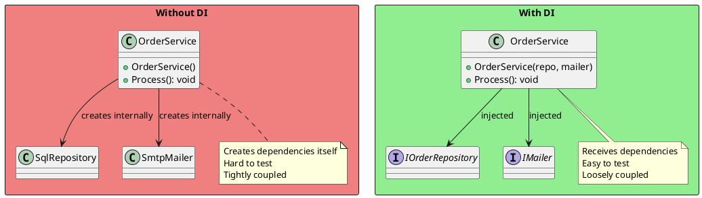
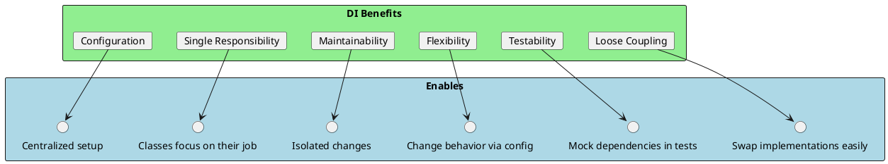
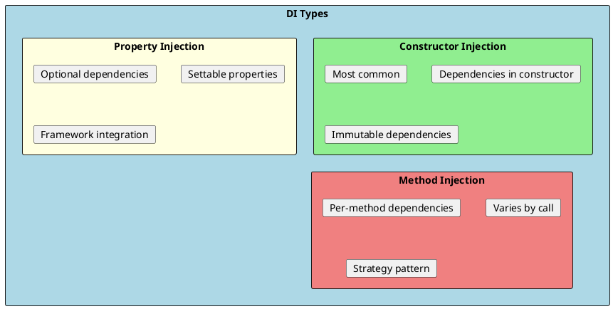
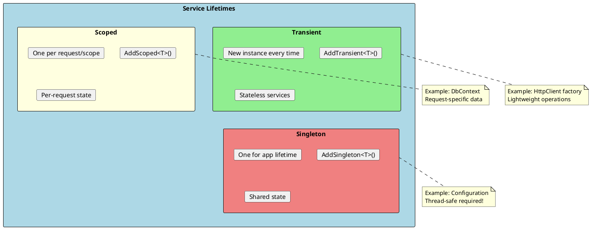
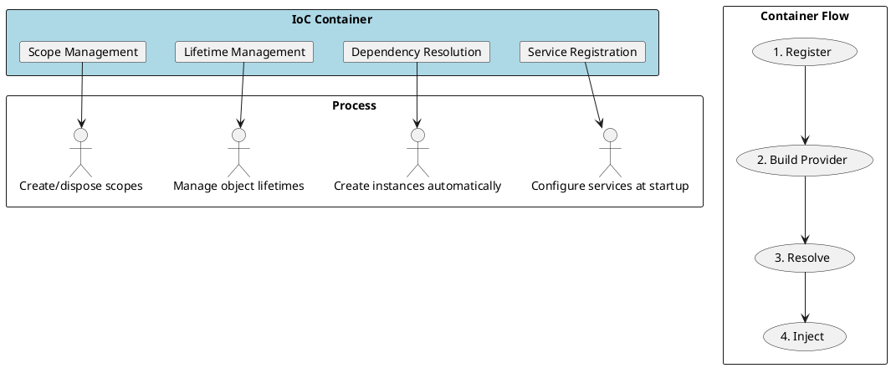
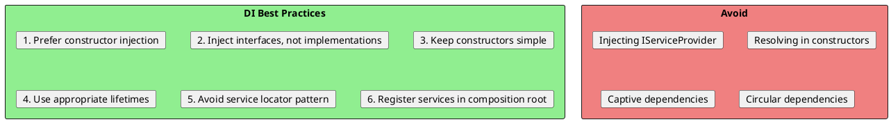

# Dependency Injection Pattern

Dependency Injection (DI) is a design pattern that implements Inversion of Control (IoC) for resolving dependencies. Instead of a class creating its dependencies, they are "injected" from outside. This is the foundation of modern .NET application architecture.



## Why Dependency Injection?

### Problems Without DI

```csharp
// ❌ BAD: Tightly coupled, hard to test
public class OrderService
{
    private readonly SqlOrderRepository _repository;
    private readonly SmtpEmailService _emailService;
    private readonly StripePaymentGateway _paymentGateway;

    public OrderService()
    {
        // Creates own dependencies - tight coupling!
        _repository = new SqlOrderRepository("connection-string");
        _emailService = new SmtpEmailService("smtp.server.com");
        _paymentGateway = new StripePaymentGateway("api-key");
    }

    public async Task ProcessOrderAsync(Order order)
    {
        await _paymentGateway.ChargeAsync(order.Total);
        await _repository.SaveAsync(order);
        await _emailService.SendConfirmationAsync(order);
    }
}

// Testing requires real database, SMTP server, and Stripe!
// Cannot swap implementations
// Cannot configure from outside
```

### Benefits of DI



```csharp
// ✅ GOOD: Dependencies injected
public class OrderService
{
    private readonly IOrderRepository _repository;
    private readonly IEmailService _emailService;
    private readonly IPaymentGateway _paymentGateway;

    public OrderService(
        IOrderRepository repository,
        IEmailService emailService,
        IPaymentGateway paymentGateway)
    {
        _repository = repository;
        _emailService = emailService;
        _paymentGateway = paymentGateway;
    }

    public async Task ProcessOrderAsync(Order order)
    {
        await _paymentGateway.ChargeAsync(order.Total);
        await _repository.SaveAsync(order);
        await _emailService.SendConfirmationAsync(order);
    }
}

// Easy to test with mocks!
// Can swap implementations
// Configuration happens elsewhere
```

---

## Types of Dependency Injection



### Constructor Injection (Recommended)

```csharp
// ✅ Constructor Injection - most common and recommended
public class UserService
{
    private readonly IUserRepository _repository;
    private readonly IEmailService _emailService;
    private readonly ILogger<UserService> _logger;

    // Dependencies required at construction time
    public UserService(
        IUserRepository repository,
        IEmailService emailService,
        ILogger<UserService> logger)
    {
        _repository = repository ?? throw new ArgumentNullException(nameof(repository));
        _emailService = emailService ?? throw new ArgumentNullException(nameof(emailService));
        _logger = logger ?? throw new ArgumentNullException(nameof(logger));
    }

    public async Task<User> CreateUserAsync(CreateUserRequest request)
    {
        _logger.LogInformation("Creating user {Email}", request.Email);

        var user = new User { Email = request.Email, Name = request.Name };
        await _repository.AddAsync(user);
        await _emailService.SendWelcomeEmailAsync(user);

        return user;
    }
}
```

### Property Injection

```csharp
// Property Injection - for optional dependencies
public class ReportGenerator
{
    // Optional - can be null
    public ILogger? Logger { get; set; }

    // Optional cache - works without it
    public ICache? Cache { get; set; }

    public Report Generate(ReportRequest request)
    {
        Logger?.LogInformation("Generating report...");

        // Check cache if available
        if (Cache?.TryGet(request.Key, out Report? cached) == true)
        {
            Logger?.LogInformation("Cache hit!");
            return cached;
        }

        var report = GenerateInternal(request);

        Cache?.Set(request.Key, report);
        return report;
    }

    private Report GenerateInternal(ReportRequest request)
    {
        // Generate report
        return new Report();
    }
}
```

### Method Injection

```csharp
// Method Injection - dependency varies per call
public class Calculator
{
    // Strategy injected per method call
    public decimal Calculate(decimal value, ITaxStrategy taxStrategy)
    {
        return taxStrategy.ApplyTax(value);
    }
}

// Different strategies for different calls
calculator.Calculate(100, new USTaxStrategy());
calculator.Calculate(100, new EUTaxStrategy());
calculator.Calculate(100, new TaxFreeStrategy());
```

---

## .NET Core Dependency Injection

### Service Lifetimes



```csharp
public class Startup
{
    public void ConfigureServices(IServiceCollection services)
    {
        // Transient - new instance every request
        services.AddTransient<IEmailService, SmtpEmailService>();

        // Scoped - one instance per HTTP request
        services.AddScoped<IOrderRepository, SqlOrderRepository>();
        services.AddScoped<IUnitOfWork, UnitOfWork>();

        // Singleton - one instance for entire application
        services.AddSingleton<IConfiguration>(Configuration);
        services.AddSingleton<ICacheService, RedisCacheService>();

        // DbContext - typically scoped
        services.AddDbContext<AppDbContext>(options =>
            options.UseSqlServer(Configuration.GetConnectionString("Default")));
    }
}
```

### Registration Patterns

```csharp
public static class ServiceCollectionExtensions
{
    public static IServiceCollection AddApplicationServices(
        this IServiceCollection services)
    {
        // Interface to implementation
        services.AddScoped<IOrderService, OrderService>();

        // Implementation only (concrete type)
        services.AddScoped<OrderProcessor>();

        // Factory registration
        services.AddScoped<IPaymentGateway>(sp =>
        {
            var config = sp.GetRequiredService<IConfiguration>();
            var apiKey = config["Stripe:ApiKey"];
            return new StripePaymentGateway(apiKey);
        });

        // Multiple implementations
        services.AddScoped<INotificationSender, EmailNotificationSender>();
        services.AddScoped<INotificationSender, SmsNotificationSender>();
        services.AddScoped<INotificationSender, PushNotificationSender>();

        // Decorator pattern
        services.AddScoped<IDataService, DatabaseDataService>();
        services.Decorate<IDataService, CachingDataServiceDecorator>();
        services.Decorate<IDataService, LoggingDataServiceDecorator>();

        return services;
    }

    // Open generics
    public static IServiceCollection AddRepositories(
        this IServiceCollection services)
    {
        // Register open generic
        services.AddScoped(typeof(IRepository<>), typeof(Repository<>));

        // Specific overrides
        services.AddScoped<IRepository<User>, UserRepository>();

        return services;
    }
}
```

### Options Pattern

```csharp
// Configuration class
public class EmailSettings
{
    public string SmtpServer { get; set; } = "";
    public int Port { get; set; } = 587;
    public string Username { get; set; } = "";
    public string Password { get; set; } = "";
    public bool UseSsl { get; set; } = true;
}

// Registration
services.Configure<EmailSettings>(Configuration.GetSection("Email"));

// Usage with IOptions
public class EmailService
{
    private readonly EmailSettings _settings;

    public EmailService(IOptions<EmailSettings> options)
    {
        _settings = options.Value;
    }

    public async Task SendAsync(EmailMessage message)
    {
        using var client = new SmtpClient(_settings.SmtpServer, _settings.Port);
        client.EnableSsl = _settings.UseSsl;
        client.Credentials = new NetworkCredential(_settings.Username, _settings.Password);
        await client.SendMailAsync(message.ToMailMessage());
    }
}

// IOptionsSnapshot - reloads on config change (scoped)
public class ConfigurableService
{
    private readonly MySettings _settings;

    public ConfigurableService(IOptionsSnapshot<MySettings> options)
    {
        _settings = options.Value; // Gets current value
    }
}

// IOptionsMonitor - for singletons that need config updates
public class SingletonService
{
    private readonly IOptionsMonitor<MySettings> _options;

    public SingletonService(IOptionsMonitor<MySettings> options)
    {
        _options = options;
        _options.OnChange(settings =>
        {
            Console.WriteLine("Settings changed!");
        });
    }

    public void DoWork()
    {
        var currentSettings = _options.CurrentValue;
    }
}
```

---

## Common DI Patterns

### Factory Pattern with DI

```csharp
// Factory interface
public interface IPaymentProcessorFactory
{
    IPaymentProcessor Create(PaymentMethod method);
}

// Factory implementation
public class PaymentProcessorFactory : IPaymentProcessorFactory
{
    private readonly IServiceProvider _serviceProvider;

    public PaymentProcessorFactory(IServiceProvider serviceProvider)
    {
        _serviceProvider = serviceProvider;
    }

    public IPaymentProcessor Create(PaymentMethod method)
    {
        return method switch
        {
            PaymentMethod.CreditCard =>
                _serviceProvider.GetRequiredService<CreditCardProcessor>(),
            PaymentMethod.PayPal =>
                _serviceProvider.GetRequiredService<PayPalProcessor>(),
            PaymentMethod.Crypto =>
                _serviceProvider.GetRequiredService<CryptoProcessor>(),
            _ => throw new NotSupportedException($"Unknown method: {method}")
        };
    }
}

// Registration
services.AddScoped<CreditCardProcessor>();
services.AddScoped<PayPalProcessor>();
services.AddScoped<CryptoProcessor>();
services.AddSingleton<IPaymentProcessorFactory, PaymentProcessorFactory>();
```

### Strategy Pattern with DI

```csharp
// Multiple strategies registered
services.AddScoped<IDiscountStrategy, SeasonalDiscount>();
services.AddScoped<IDiscountStrategy, LoyaltyDiscount>();
services.AddScoped<IDiscountStrategy, BulkDiscount>();

// Service receives all strategies
public class PricingService
{
    private readonly IEnumerable<IDiscountStrategy> _strategies;

    public PricingService(IEnumerable<IDiscountStrategy> strategies)
    {
        _strategies = strategies;
    }

    public decimal CalculateFinalPrice(Order order)
    {
        var discount = _strategies
            .Where(s => s.AppliesTo(order))
            .Sum(s => s.CalculateDiscount(order));

        return order.Subtotal - discount;
    }
}
```

### Decorator Pattern with DI

```csharp
// Using Scrutor library for decoration
services.AddScoped<IWeatherService, WeatherApiService>();
services.Decorate<IWeatherService, CachingWeatherService>();
services.Decorate<IWeatherService, LoggingWeatherService>();

// Manual decoration
services.AddScoped<WeatherApiService>();
services.AddScoped<IWeatherService>(sp =>
{
    var api = sp.GetRequiredService<WeatherApiService>();
    var cache = sp.GetRequiredService<IMemoryCache>();
    var logger = sp.GetRequiredService<ILogger<LoggingWeatherService>>();

    IWeatherService service = api;
    service = new CachingWeatherService(service, cache);
    service = new LoggingWeatherService(service, logger);

    return service;
});
```

---

## Inversion of Control Container



```csharp
// Manual DI (without container)
public class Program
{
    public static void Main()
    {
        // Manual wiring - tedious and error-prone
        var config = new Configuration();
        var logger = new FileLogger("app.log");
        var repository = new SqlOrderRepository(config.ConnectionString);
        var emailService = new SmtpEmailService(config.SmtpSettings);
        var paymentGateway = new StripePaymentGateway(config.StripeKey);

        var orderService = new OrderService(repository, emailService, paymentGateway);

        // Use service...
    }
}

// With IoC Container
public class Program
{
    public static void Main()
    {
        var builder = WebApplication.CreateBuilder(args);

        // Register services
        builder.Services.AddScoped<IOrderRepository, SqlOrderRepository>();
        builder.Services.AddScoped<IEmailService, SmtpEmailService>();
        builder.Services.AddScoped<IPaymentGateway, StripePaymentGateway>();
        builder.Services.AddScoped<OrderService>();

        var app = builder.Build();

        // Container resolves all dependencies automatically!
        using var scope = app.Services.CreateScope();
        var orderService = scope.ServiceProvider.GetRequiredService<OrderService>();
    }
}
```

### Service Resolution

```csharp
public class MyController : ControllerBase
{
    // Constructor injection - preferred
    private readonly IOrderService _orderService;

    public MyController(IOrderService orderService)
    {
        _orderService = orderService;
    }

    // Method injection via FromServices
    [HttpGet]
    public IActionResult Get([FromServices] IReportService reportService)
    {
        var report = reportService.Generate();
        return Ok(report);
    }
}

// Manual resolution (avoid when possible)
public class ServiceLocatorExample
{
    private readonly IServiceProvider _serviceProvider;

    public ServiceLocatorExample(IServiceProvider serviceProvider)
    {
        _serviceProvider = serviceProvider;
    }

    public void DoWork()
    {
        // Resolve manually - avoid this pattern!
        var service = _serviceProvider.GetRequiredService<IOrderService>();

        // Better: Use factory pattern
    }
}
```

---

## Testing with DI

```csharp
// Easy to test with mock dependencies
public class OrderServiceTests
{
    private readonly Mock<IOrderRepository> _mockRepo;
    private readonly Mock<IEmailService> _mockEmail;
    private readonly Mock<IPaymentGateway> _mockPayment;
    private readonly OrderService _service;

    public OrderServiceTests()
    {
        _mockRepo = new Mock<IOrderRepository>();
        _mockEmail = new Mock<IEmailService>();
        _mockPayment = new Mock<IPaymentGateway>();

        _service = new OrderService(
            _mockRepo.Object,
            _mockEmail.Object,
            _mockPayment.Object);
    }

    [Fact]
    public async Task ProcessOrder_WhenPaymentSucceeds_SavesOrder()
    {
        // Arrange
        var order = new Order { Id = 1, Total = 100 };
        _mockPayment.Setup(p => p.ChargeAsync(100))
                    .ReturnsAsync(new PaymentResult { Success = true });

        // Act
        await _service.ProcessOrderAsync(order);

        // Assert
        _mockRepo.Verify(r => r.SaveAsync(order), Times.Once);
    }

    [Fact]
    public async Task ProcessOrder_WhenPaymentFails_DoesNotSaveOrder()
    {
        // Arrange
        var order = new Order { Id = 1, Total = 100 };
        _mockPayment.Setup(p => p.ChargeAsync(100))
                    .ReturnsAsync(new PaymentResult { Success = false });

        // Act & Assert
        await Assert.ThrowsAsync<PaymentException>(
            () => _service.ProcessOrderAsync(order));

        _mockRepo.Verify(r => r.SaveAsync(It.IsAny<Order>()), Times.Never);
    }
}

// Integration tests with test container
public class OrderServiceIntegrationTests : IClassFixture<WebApplicationFactory<Program>>
{
    private readonly WebApplicationFactory<Program> _factory;

    public OrderServiceIntegrationTests(WebApplicationFactory<Program> factory)
    {
        _factory = factory.WithWebHostBuilder(builder =>
        {
            builder.ConfigureServices(services =>
            {
                // Replace real services with test doubles
                services.RemoveAll<IPaymentGateway>();
                services.AddScoped<IPaymentGateway, FakePaymentGateway>();

                // Use in-memory database
                services.RemoveAll<DbContextOptions<AppDbContext>>();
                services.AddDbContext<AppDbContext>(options =>
                    options.UseInMemoryDatabase("TestDb"));
            });
        });
    }

    [Fact]
    public async Task CreateOrder_ReturnsSuccess()
    {
        var client = _factory.CreateClient();
        var response = await client.PostAsJsonAsync("/api/orders", new { /* ... */ });
        Assert.Equal(HttpStatusCode.OK, response.StatusCode);
    }
}
```

---

## Best Practices



### Captive Dependency Problem

```csharp
// ❌ BAD: Singleton captures scoped service
services.AddScoped<IUserContext, UserContext>();  // Per-request
services.AddSingleton<IUserService, UserService>(); // App lifetime

public class UserService  // Singleton
{
    private readonly IUserContext _context;  // Scoped - PROBLEM!

    public UserService(IUserContext context)
    {
        // This IUserContext is captured forever!
        // It won't get the correct user for each request
        _context = context;
    }
}

// ✅ GOOD: Use factory or IServiceScopeFactory
services.AddSingleton<IUserService, UserService>();

public class UserService
{
    private readonly IServiceScopeFactory _scopeFactory;

    public UserService(IServiceScopeFactory scopeFactory)
    {
        _scopeFactory = scopeFactory;
    }

    public async Task DoWorkAsync()
    {
        using var scope = _scopeFactory.CreateScope();
        var context = scope.ServiceProvider.GetRequiredService<IUserContext>();
        // Use context...
    }
}
```

### Composition Root

```csharp
// All DI registration in one place
public static class DependencyInjection
{
    public static IServiceCollection AddApplication(this IServiceCollection services)
    {
        services.AddScoped<IOrderService, OrderService>();
        services.AddScoped<IUserService, UserService>();
        services.AddScoped<IProductService, ProductService>();
        return services;
    }

    public static IServiceCollection AddInfrastructure(
        this IServiceCollection services,
        IConfiguration configuration)
    {
        services.AddDbContext<AppDbContext>(options =>
            options.UseSqlServer(configuration.GetConnectionString("Default")));

        services.AddScoped<IOrderRepository, SqlOrderRepository>();
        services.AddScoped<IUserRepository, SqlUserRepository>();

        services.Configure<EmailSettings>(configuration.GetSection("Email"));
        services.AddScoped<IEmailService, SmtpEmailService>();

        return services;
    }
}

// Program.cs - clean and simple
var builder = WebApplication.CreateBuilder(args);

builder.Services
    .AddApplication()
    .AddInfrastructure(builder.Configuration);

var app = builder.Build();
```

---

## Interview Questions & Answers

### Q1: What is Dependency Injection?

**Answer**: Dependency Injection is a design pattern where objects receive their dependencies from external sources rather than creating them internally. This implements Inversion of Control (IoC) - the control of creating dependencies is inverted from the class to an external system (usually a DI container).

### Q2: What are the three types of dependency injection?

**Answer**:
1. **Constructor Injection**: Dependencies passed via constructor (recommended)
2. **Property Injection**: Dependencies set via properties (optional dependencies)
3. **Method Injection**: Dependencies passed as method parameters (per-call dependencies)

### Q3: Explain service lifetimes in .NET Core.

**Answer**:
- **Transient**: New instance every time requested. Good for lightweight, stateless services.
- **Scoped**: One instance per scope (HTTP request in ASP.NET). Good for request-specific state like DbContext.
- **Singleton**: One instance for entire application lifetime. Must be thread-safe.

### Q4: What is the captive dependency problem?

**Answer**: When a singleton service depends on a scoped or transient service, the shorter-lived service gets "captured" and lives as long as the singleton. This causes bugs because the captured service won't be refreshed per request. Solution: Use `IServiceScopeFactory` or restructure dependencies.

### Q5: What is the Service Locator anti-pattern?

**Answer**: Service Locator is when classes resolve dependencies by calling `serviceProvider.GetService<T>()` instead of receiving them via injection. Problems:
- Hides dependencies (not visible in constructor)
- Makes testing harder
- Runtime errors instead of compile-time
- Tight coupling to container

### Q6: How does DI support SOLID principles?

**Answer**:
- **SRP**: Classes focus on their responsibility, not creating dependencies
- **OCP**: Add new implementations without modifying consuming code
- **LSP**: Easily substitute implementations
- **ISP**: Depend on specific interfaces
- **DIP**: Depend on abstractions, not concretions
