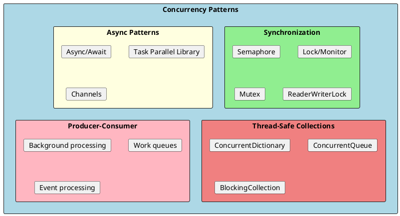
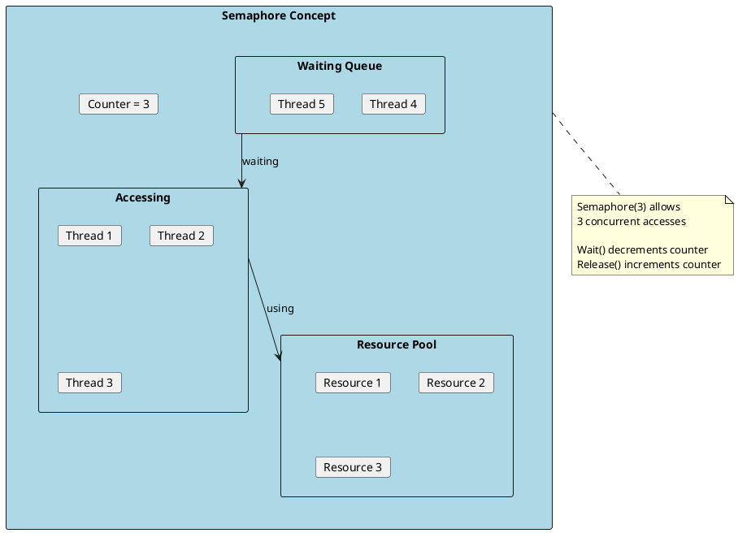
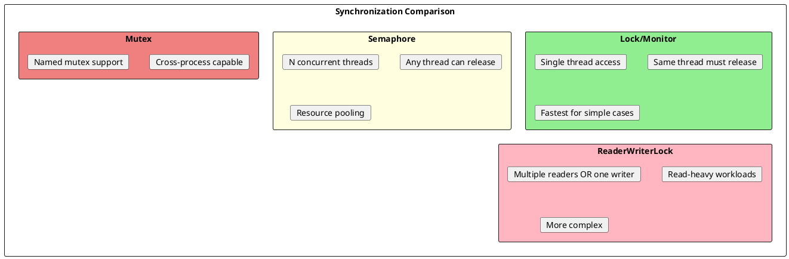

# Concurrency Patterns

Concurrency patterns help manage multi-threaded programming challenges, synchronize access to shared resources, and handle asynchronous operations safely. These patterns are essential for building scalable, responsive applications.



---

## Semaphore Pattern

### What is a Semaphore?

A semaphore is a synchronization primitive that controls access to a shared resource through the use of a counter. It limits the number of threads that can access a resource or pool of resources concurrently. Think of it like a nightclub with a maximum capacity—only a certain number of people can enter.



### SemaphoreSlim (Preferred in .NET)

```csharp
public class SemaphoreExample
{
    // Allow max 3 concurrent operations
    private readonly SemaphoreSlim _semaphore = new SemaphoreSlim(3, 3);

    public async Task ProcessItemAsync(string item)
    {
        // Wait to enter (acquire)
        await _semaphore.WaitAsync();
        try
        {
            Console.WriteLine($"Processing {item} (Current count: {_semaphore.CurrentCount})");
            await Task.Delay(1000); // Simulate work
            Console.WriteLine($"Completed {item}");
        }
        finally
        {
            // Always release in finally block
            _semaphore.Release();
        }
    }

    public async Task ProcessManyItemsAsync(IEnumerable<string> items)
    {
        // All items start processing, but only 3 at a time
        var tasks = items.Select(item => ProcessItemAsync(item));
        await Task.WhenAll(tasks);
    }
}

// Usage
var processor = new SemaphoreExample();
await processor.ProcessManyItemsAsync(new[]
{
    "Item1", "Item2", "Item3", "Item4", "Item5", "Item6"
});

// Output (order may vary):
// Processing Item1 (Current count: 2)
// Processing Item2 (Current count: 1)
// Processing Item3 (Current count: 0)
// Completed Item1
// Processing Item4 (Current count: 0)
// Completed Item2
// Processing Item5 (Current count: 0)
// ...
```

### Real-World Example: API Rate Limiting

```csharp
public class RateLimitedApiClient
{
    private readonly HttpClient _client;
    private readonly SemaphoreSlim _semaphore;
    private readonly int _maxRequestsPerSecond;

    public RateLimitedApiClient(HttpClient client, int maxRequestsPerSecond = 10)
    {
        _client = client;
        _maxRequestsPerSecond = maxRequestsPerSecond;
        _semaphore = new SemaphoreSlim(maxRequestsPerSecond, maxRequestsPerSecond);
    }

    public async Task<T> GetAsync<T>(string endpoint)
    {
        await _semaphore.WaitAsync();
        try
        {
            var response = await _client.GetAsync(endpoint);
            response.EnsureSuccessStatusCode();
            return await response.Content.ReadFromJsonAsync<T>();
        }
        finally
        {
            // Release after a delay to maintain rate limit
            _ = ReleaseAfterDelayAsync();
        }
    }

    private async Task ReleaseAfterDelayAsync()
    {
        await Task.Delay(1000 / _maxRequestsPerSecond);
        _semaphore.Release();
    }
}

// Usage - automatically limits to 10 requests per second
var client = new RateLimitedApiClient(httpClient, maxRequestsPerSecond: 10);
var tasks = Enumerable.Range(1, 100)
    .Select(i => client.GetAsync<User>($"/api/users/{i}"));
var users = await Task.WhenAll(tasks);
```

### Resource Pool with Semaphore

```csharp
public class ConnectionPool<T> where T : class
{
    private readonly ConcurrentBag<T> _connections;
    private readonly SemaphoreSlim _semaphore;
    private readonly Func<T> _connectionFactory;
    private readonly int _maxSize;

    public ConnectionPool(Func<T> connectionFactory, int maxSize)
    {
        _connectionFactory = connectionFactory;
        _maxSize = maxSize;
        _connections = new ConcurrentBag<T>();
        _semaphore = new SemaphoreSlim(maxSize, maxSize);

        // Pre-populate pool
        for (int i = 0; i < maxSize; i++)
        {
            _connections.Add(_connectionFactory());
        }
    }

    public async Task<PooledConnection> AcquireAsync(CancellationToken ct = default)
    {
        await _semaphore.WaitAsync(ct);

        if (_connections.TryTake(out var connection))
        {
            return new PooledConnection(connection, this);
        }

        // Should not happen if properly managed
        _semaphore.Release();
        throw new InvalidOperationException("Pool exhausted");
    }

    private void Return(T connection)
    {
        _connections.Add(connection);
        _semaphore.Release();
    }

    public class PooledConnection : IDisposable
    {
        public T Connection { get; }
        private readonly ConnectionPool<T> _pool;
        private bool _disposed;

        public PooledConnection(T connection, ConnectionPool<T> pool)
        {
            Connection = connection;
            _pool = pool;
        }

        public void Dispose()
        {
            if (!_disposed)
            {
                _pool.Return(Connection);
                _disposed = true;
            }
        }
    }
}

// Usage
var pool = new ConnectionPool<SqlConnection>(
    () => new SqlConnection(connectionString),
    maxSize: 10);

// Using statement automatically returns connection to pool
using (var pooled = await pool.AcquireAsync())
{
    var connection = pooled.Connection;
    // Use connection...
}
```

### Semaphore vs Other Synchronization



---

## Lock Pattern

### Basic Lock

```csharp
public class ThreadSafeCounter
{
    private int _count;
    private readonly object _lock = new();

    public int Count
    {
        get
        {
            lock (_lock)
            {
                return _count;
            }
        }
    }

    public void Increment()
    {
        lock (_lock)
        {
            _count++;
        }
    }

    public void Decrement()
    {
        lock (_lock)
        {
            _count--;
        }
    }
}
```

### Async-Compatible Lock

```csharp
// SemaphoreSlim works as async lock
public class AsyncLock
{
    private readonly SemaphoreSlim _semaphore = new SemaphoreSlim(1, 1);

    public async Task<IDisposable> LockAsync()
    {
        await _semaphore.WaitAsync();
        return new Releaser(_semaphore);
    }

    private class Releaser : IDisposable
    {
        private readonly SemaphoreSlim _semaphore;

        public Releaser(SemaphoreSlim semaphore) => _semaphore = semaphore;

        public void Dispose() => _semaphore.Release();
    }
}

// Usage
public class AsyncCache<T>
{
    private readonly AsyncLock _lock = new();
    private readonly Dictionary<string, T> _cache = new();
    private readonly Func<string, Task<T>> _factory;

    public AsyncCache(Func<string, Task<T>> factory) => _factory = factory;

    public async Task<T> GetOrCreateAsync(string key)
    {
        using (await _lock.LockAsync())
        {
            if (_cache.TryGetValue(key, out var value))
                return value;

            value = await _factory(key);
            _cache[key] = value;
            return value;
        }
    }
}
```

---

## Producer-Consumer Pattern

### Using Channels

```csharp
public class MessageProcessor
{
    private readonly Channel<Message> _channel;
    private readonly ILogger _logger;

    public MessageProcessor(ILogger<MessageProcessor> logger, int capacity = 100)
    {
        _logger = logger;
        _channel = Channel.CreateBounded<Message>(new BoundedChannelOptions(capacity)
        {
            FullMode = BoundedChannelFullMode.Wait
        });
    }

    // Producer
    public async Task PublishAsync(Message message)
    {
        await _channel.Writer.WriteAsync(message);
        _logger.LogDebug("Published message {Id}", message.Id);
    }

    // Consumer
    public async Task StartConsumingAsync(CancellationToken ct)
    {
        await foreach (var message in _channel.Reader.ReadAllAsync(ct))
        {
            try
            {
                await ProcessMessageAsync(message);
            }
            catch (Exception ex)
            {
                _logger.LogError(ex, "Failed to process message {Id}", message.Id);
            }
        }
    }

    // Multiple consumers
    public async Task StartConsumersAsync(int consumerCount, CancellationToken ct)
    {
        var consumers = Enumerable.Range(0, consumerCount)
            .Select(i => ConsumeAsync(i, ct));
        await Task.WhenAll(consumers);
    }

    private async Task ConsumeAsync(int consumerId, CancellationToken ct)
    {
        _logger.LogInformation("Consumer {Id} started", consumerId);

        await foreach (var message in _channel.Reader.ReadAllAsync(ct))
        {
            _logger.LogDebug("Consumer {ConsumerId} processing {MessageId}",
                consumerId, message.Id);
            await ProcessMessageAsync(message);
        }
    }

    private async Task ProcessMessageAsync(Message message)
    {
        await Task.Delay(100); // Simulate processing
    }

    public void Complete() => _channel.Writer.Complete();
}

// Usage
var processor = new MessageProcessor(logger);

// Start consumers
var consumerTask = processor.StartConsumersAsync(3, cancellationToken);

// Produce messages
for (int i = 0; i < 100; i++)
{
    await processor.PublishAsync(new Message { Id = i, Content = $"Message {i}" });
}

processor.Complete();
await consumerTask;
```

### Using BlockingCollection

```csharp
public class WorkQueue<T>
{
    private readonly BlockingCollection<T> _queue;
    private readonly Action<T> _processor;
    private readonly Task[] _workers;
    private readonly CancellationTokenSource _cts;

    public WorkQueue(Action<T> processor, int workerCount = 4, int maxCapacity = 1000)
    {
        _processor = processor;
        _cts = new CancellationTokenSource();
        _queue = new BlockingCollection<T>(maxCapacity);
        _workers = Enumerable.Range(0, workerCount)
            .Select(_ => Task.Run(WorkerLoop))
            .ToArray();
    }

    public void Enqueue(T item)
    {
        _queue.Add(item);
    }

    private void WorkerLoop()
    {
        try
        {
            foreach (var item in _queue.GetConsumingEnumerable(_cts.Token))
            {
                try
                {
                    _processor(item);
                }
                catch (Exception ex)
                {
                    Console.WriteLine($"Error processing item: {ex.Message}");
                }
            }
        }
        catch (OperationCanceledException)
        {
            // Expected when cancelling
        }
    }

    public void Stop()
    {
        _queue.CompleteAdding();
        Task.WaitAll(_workers);
    }

    public void Cancel()
    {
        _cts.Cancel();
    }
}

// Usage
var queue = new WorkQueue<int>(item =>
{
    Console.WriteLine($"Processing {item} on thread {Thread.CurrentThread.ManagedThreadId}");
    Thread.Sleep(100);
}, workerCount: 4);

for (int i = 0; i < 20; i++)
{
    queue.Enqueue(i);
}

queue.Stop();
```

---

## Async/Await Patterns

### Parallel Processing with Semaphore

```csharp
public class ParallelProcessor
{
    public async Task<IEnumerable<TResult>> ProcessParallelAsync<T, TResult>(
        IEnumerable<T> items,
        Func<T, Task<TResult>> processor,
        int maxConcurrency = 10)
    {
        using var semaphore = new SemaphoreSlim(maxConcurrency);
        var tasks = items.Select(async item =>
        {
            await semaphore.WaitAsync();
            try
            {
                return await processor(item);
            }
            finally
            {
                semaphore.Release();
            }
        });

        return await Task.WhenAll(tasks);
    }
}

// Usage
var processor = new ParallelProcessor();
var urls = new[] { "url1", "url2", "url3", /* ... 100 more */ };

var results = await processor.ProcessParallelAsync(
    urls,
    async url => await httpClient.GetStringAsync(url),
    maxConcurrency: 5);
```

### Batched Processing

```csharp
public static class BatchExtensions
{
    public static async Task ProcessInBatchesAsync<T>(
        this IEnumerable<T> items,
        int batchSize,
        Func<IEnumerable<T>, Task> processor)
    {
        var batches = items.Chunk(batchSize);
        foreach (var batch in batches)
        {
            await processor(batch);
        }
    }

    public static async Task ProcessInBatchesParallelAsync<T>(
        this IEnumerable<T> items,
        int batchSize,
        int maxParallelBatches,
        Func<IEnumerable<T>, Task> processor)
    {
        using var semaphore = new SemaphoreSlim(maxParallelBatches);
        var batches = items.Chunk(batchSize);

        var tasks = batches.Select(async batch =>
        {
            await semaphore.WaitAsync();
            try
            {
                await processor(batch);
            }
            finally
            {
                semaphore.Release();
            }
        });

        await Task.WhenAll(tasks);
    }
}

// Usage
var users = await GetUsersAsync(); // 10,000 users

await users.ProcessInBatchesAsync(100, async batch =>
{
    await SendEmailsAsync(batch);
    Console.WriteLine($"Sent {batch.Count()} emails");
});
```

### Retry Pattern with Exponential Backoff

```csharp
public class RetryPolicy
{
    public async Task<T> ExecuteAsync<T>(
        Func<Task<T>> operation,
        int maxRetries = 3,
        TimeSpan? initialDelay = null)
    {
        var delay = initialDelay ?? TimeSpan.FromSeconds(1);

        for (int i = 0; i <= maxRetries; i++)
        {
            try
            {
                return await operation();
            }
            catch (Exception ex) when (i < maxRetries && IsTransient(ex))
            {
                Console.WriteLine($"Attempt {i + 1} failed, retrying in {delay}...");
                await Task.Delay(delay);
                delay *= 2; // Exponential backoff
            }
        }

        throw new InvalidOperationException("Should not reach here");
    }

    private bool IsTransient(Exception ex)
    {
        return ex is HttpRequestException ||
               ex is TimeoutException ||
               ex is TaskCanceledException;
    }
}

// Usage
var retry = new RetryPolicy();
var result = await retry.ExecuteAsync(async () =>
{
    return await httpClient.GetStringAsync("https://api.example.com/data");
});
```

---

## Thread-Safe Collections

```csharp
public class ConcurrentDataStore
{
    // Thread-safe dictionary
    private readonly ConcurrentDictionary<string, User> _users = new();

    // Thread-safe queue
    private readonly ConcurrentQueue<Event> _events = new();

    // Thread-safe bag (unordered)
    private readonly ConcurrentBag<LogEntry> _logs = new();

    public void AddOrUpdateUser(User user)
    {
        _users.AddOrUpdate(
            user.Id,
            user,
            (key, existing) => user);
    }

    public User? GetUser(string id)
    {
        _users.TryGetValue(id, out var user);
        return user;
    }

    public User GetOrCreateUser(string id, Func<User> factory)
    {
        return _users.GetOrAdd(id, _ => factory());
    }

    public void EnqueueEvent(Event evt)
    {
        _events.Enqueue(evt);
    }

    public bool TryDequeueEvent(out Event? evt)
    {
        return _events.TryDequeue(out evt);
    }

    public void AddLog(LogEntry entry)
    {
        _logs.Add(entry);
    }
}
```

---

## ReaderWriterLockSlim

```csharp
public class ReadHeavyCache<TKey, TValue> where TKey : notnull
{
    private readonly Dictionary<TKey, TValue> _cache = new();
    private readonly ReaderWriterLockSlim _lock = new();

    public TValue? Read(TKey key)
    {
        _lock.EnterReadLock();
        try
        {
            return _cache.TryGetValue(key, out var value) ? value : default;
        }
        finally
        {
            _lock.ExitReadLock();
        }
    }

    public void Write(TKey key, TValue value)
    {
        _lock.EnterWriteLock();
        try
        {
            _cache[key] = value;
        }
        finally
        {
            _lock.ExitWriteLock();
        }
    }

    public TValue GetOrAdd(TKey key, Func<TKey, TValue> factory)
    {
        // Try read first (optimistic)
        _lock.EnterUpgradeableReadLock();
        try
        {
            if (_cache.TryGetValue(key, out var value))
                return value;

            // Need to write
            _lock.EnterWriteLock();
            try
            {
                // Double-check after acquiring write lock
                if (_cache.TryGetValue(key, out value))
                    return value;

                value = factory(key);
                _cache[key] = value;
                return value;
            }
            finally
            {
                _lock.ExitWriteLock();
            }
        }
        finally
        {
            _lock.ExitUpgradeableReadLock();
        }
    }
}
```

---

## Lazy Initialization

```csharp
public class ExpensiveResource
{
    // Thread-safe lazy initialization
    private readonly Lazy<DatabaseConnection> _connection;
    private readonly Lazy<HttpClient> _httpClient;

    public ExpensiveResource(string connectionString)
    {
        // LazyThreadSafetyMode.ExecutionAndPublication is default
        _connection = new Lazy<DatabaseConnection>(
            () => new DatabaseConnection(connectionString));

        _httpClient = new Lazy<HttpClient>(
            () =>
            {
                var client = new HttpClient();
                client.Timeout = TimeSpan.FromSeconds(30);
                return client;
            },
            LazyThreadSafetyMode.PublicationOnly); // Multiple threads may create, but only one wins
    }

    public DatabaseConnection Connection => _connection.Value;
    public HttpClient HttpClient => _httpClient.Value;
}

// Async lazy initialization
public class AsyncLazy<T>
{
    private readonly Lazy<Task<T>> _lazy;

    public AsyncLazy(Func<Task<T>> factory)
    {
        _lazy = new Lazy<Task<T>>(factory);
    }

    public Task<T> Value => _lazy.Value;

    public TaskAwaiter<T> GetAwaiter() => Value.GetAwaiter();
}

// Usage
public class DataService
{
    private readonly AsyncLazy<List<Product>> _products;

    public DataService(IProductRepository repository)
    {
        _products = new AsyncLazy<List<Product>>(async () =>
        {
            return await repository.GetAllAsync();
        });
    }

    public async Task<List<Product>> GetProductsAsync()
    {
        return await _products; // Only loads once, all calls get same result
    }
}
```

---

## Cancellation Pattern

```csharp
public class CancellableOperation
{
    public async Task<string> LongRunningOperationAsync(CancellationToken ct)
    {
        var result = new StringBuilder();

        for (int i = 0; i < 100; i++)
        {
            // Check for cancellation
            ct.ThrowIfCancellationRequested();

            // Or check and return gracefully
            if (ct.IsCancellationRequested)
            {
                Console.WriteLine("Operation cancelled, cleaning up...");
                return result.ToString();
            }

            await Task.Delay(100, ct); // Pass token to async operations
            result.AppendLine($"Step {i} completed");
        }

        return result.ToString();
    }
}

// Usage with timeout
var cts = new CancellationTokenSource(TimeSpan.FromSeconds(5));

try
{
    var result = await operation.LongRunningOperationAsync(cts.Token);
}
catch (OperationCanceledException)
{
    Console.WriteLine("Operation timed out");
}

// Usage with linked tokens
var userCts = new CancellationTokenSource();
var timeoutCts = new CancellationTokenSource(TimeSpan.FromSeconds(30));
var linkedCts = CancellationTokenSource.CreateLinkedTokenSource(
    userCts.Token,
    timeoutCts.Token);

// Cancel on user action
userCts.Cancel();
```

---

## Interview Questions & Answers

### Q1: What is a Semaphore and when would you use it?

**Answer**: A semaphore is a synchronization primitive that limits the number of threads that can access a resource concurrently. Use cases:
- Rate limiting API calls
- Connection pooling
- Throttling parallel operations
- Resource management (database connections, file handles)

### Q2: What's the difference between SemaphoreSlim and Semaphore?

**Answer**:
- **SemaphoreSlim**: Lightweight, single-process only, supports async/await
- **Semaphore**: Heavier, can work cross-process, named semaphores

Use `SemaphoreSlim` for most scenarios; use `Semaphore` only when you need cross-process synchronization.

### Q3: Why can't you use `lock` with async/await?

**Answer**: `lock` uses `Monitor.Enter`/`Monitor.Exit` which requires the same thread to release. With `async/await`, code may resume on a different thread. Use `SemaphoreSlim(1,1)` as an async-compatible lock instead.

### Q4: Explain the Producer-Consumer pattern.

**Answer**: Producers create work items and add them to a queue. Consumers take items from the queue and process them. This decouples production from consumption, enables:
- Backpressure (bounded queues)
- Multiple consumers (parallel processing)
- Async processing (producer doesn't wait)

.NET implementations: `Channel<T>`, `BlockingCollection<T>`

### Q5: How do you limit concurrent operations in async code?

**Answer**: Use `SemaphoreSlim`:
```csharp
var semaphore = new SemaphoreSlim(maxConcurrency);
var tasks = items.Select(async item =>
{
    await semaphore.WaitAsync();
    try { await ProcessAsync(item); }
    finally { semaphore.Release(); }
});
await Task.WhenAll(tasks);
```

### Q6: What is the difference between Task.WhenAll and Parallel.ForEachAsync?

**Answer**:
- **Task.WhenAll**: All tasks start immediately, no built-in concurrency limit
- **Parallel.ForEachAsync**: Built-in `MaxDegreeOfParallelism`, better memory usage

Use `Parallel.ForEachAsync` for large collections; use `Task.WhenAll` with `SemaphoreSlim` for fine control.
