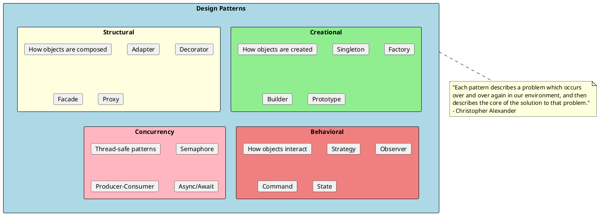
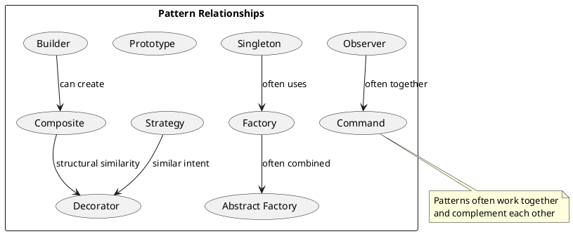
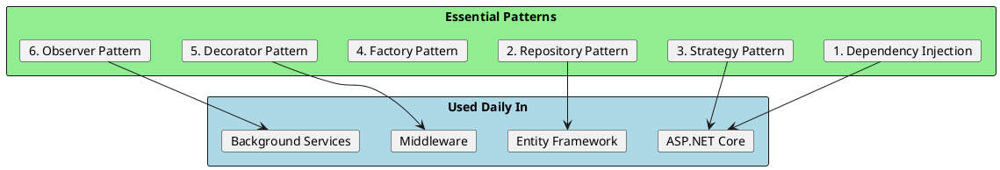
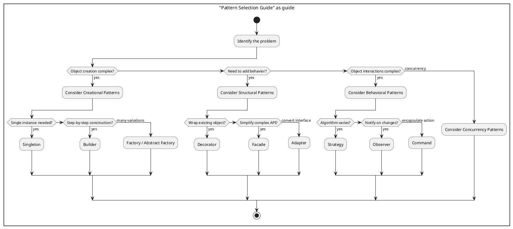

# Design Patterns

Design patterns are proven, reusable solutions to common problems in software design. They represent best practices evolved over time by experienced developers. Understanding patterns helps you communicate effectively with other developers and make better architectural decisions.

## Pattern Categories Overview

### Creational Patterns
These patterns deal with object creation mechanisms, trying to create objects in a manner suitable to the situation. They help make a system independent of how its objects are created, composed, and represented.

| Pattern | Intent | When to Use | .NET Example |
|---------|--------|-------------|--------------|
| **Singleton** | Ensure only one instance exists | Shared resources, configuration | `IServiceCollection.AddSingleton<T>()` |
| **Factory Method** | Create objects without specifying exact class | When creation logic is complex | `ILoggerFactory.CreateLogger()` |
| **Abstract Factory** | Create families of related objects | Multiple product variants | `DbProviderFactory` |
| **Builder** | Construct complex objects step by step | Many optional parameters | `StringBuilder`, `HostBuilder` |
| **Prototype** | Clone existing objects | When creation is expensive | `ICloneable`, `MemberwiseClone()` |

### Structural Patterns
These patterns explain how to assemble objects and classes into larger structures while keeping these structures flexible and efficient.

| Pattern | Intent | When to Use | .NET Example |
|---------|--------|-------------|--------------|
| **Adapter** | Convert one interface to another | Legacy integration | `StreamReader` wrapping `Stream` |
| **Decorator** | Add behavior dynamically | Cross-cutting concerns | `BufferedStream` wrapping `Stream` |
| **Facade** | Simplified interface to complex system | Simplify API | `HttpClient` |
| **Proxy** | Placeholder for another object | Lazy loading, access control | EF Core lazy loading |
| **Composite** | Treat individual and composite objects uniformly | Tree structures | UI control hierarchies |

### Behavioral Patterns
These patterns are concerned with algorithms and the assignment of responsibilities between objects. They describe not just patterns of objects but also the patterns of communication between them.

| Pattern | Intent | When to Use | .NET Example |
|---------|--------|-------------|--------------|
| **Strategy** | Define family of interchangeable algorithms | Runtime algorithm selection | `IComparer<T>` |
| **Observer** | Notify multiple objects of state changes | Event systems | Events, `IObservable<T>` |
| **Command** | Encapsulate request as object | Undo/redo, queuing | `ICommand` in WPF |
| **State** | Alter behavior when internal state changes | State machines | Workflow engines |
| **Template Method** | Define algorithm skeleton with steps | Framework extension points | `Stream.CopyTo()` |
| **Chain of Responsibility** | Pass request along handler chain | Middleware, filters | ASP.NET Core middleware |

### Concurrency Patterns
These patterns address multi-threaded programming challenges and help manage shared resources safely.

| Pattern | Intent | When to Use | .NET Example |
|---------|--------|-------------|--------------|
| **Semaphore** | Limit concurrent access | Resource pools | `SemaphoreSlim` |
| **Producer-Consumer** | Decouple production from consumption | Background processing | `BlockingCollection<T>` |
| **Async/Await** | Non-blocking asynchronous operations | I/O operations | `Task`, `async/await` |
| **Lock** | Mutual exclusion | Critical sections | `lock`, `Monitor` |

## Pattern Relationships

## Files in This Section

| File | Patterns Covered |
|------|-----------------|
| [01-CreationalPatterns.md](./01-CreationalPatterns.md) | Singleton, Factory, Abstract Factory, Builder, Prototype |
| [02-StructuralPatterns.md](./02-StructuralPatterns.md) | Adapter, Decorator, Facade, Proxy, Composite |
| [03-BehavioralPatterns.md](./03-BehavioralPatterns.md) | Strategy, Observer, Command, State, Template Method, Chain of Responsibility |
| [04-DependencyInjection.md](./04-DependencyInjection.md) | DI Patterns, IoC Containers, Service Lifetimes |
| [05-ConcurrencyPatterns.md](./05-ConcurrencyPatterns.md) | Semaphore, Producer-Consumer, Async Patterns, Thread Safety |

## Most Important Patterns for .NET Engineers

1. **Dependency Injection** - Foundation of modern .NET applications
2. **Repository Pattern** - Data access abstraction
3. **Strategy Pattern** - Configurable, testable behavior
4. **Factory Pattern** - Flexible object creation
5. **Decorator Pattern** - Adding cross-cutting concerns
6. **Observer Pattern** - Event-driven and reactive systems

## When to Use Patterns

## Anti-Patterns to Avoid

| Anti-Pattern | Problem | Solution |
|--------------|---------|----------|
| **God Object** | One class does everything | Apply SRP, use patterns |
| **Singleton Abuse** | Global state everywhere | Use DI instead |
| **Premature Abstraction** | Over-engineering | Start simple, refactor |
| **Pattern Mania** | Patterns for everything | Use patterns when needed |

## Interview Tips

1. **Know the Intent** - Explain WHY a pattern exists, not just HOW it works
2. **Real Examples** - Reference .NET Framework/Core implementations
3. **Trade-offs** - Discuss pros AND cons of each pattern
4. **Alternatives** - Know when NOT to use a pattern
5. **SOLID Connection** - Link patterns to SOLID principles they support
