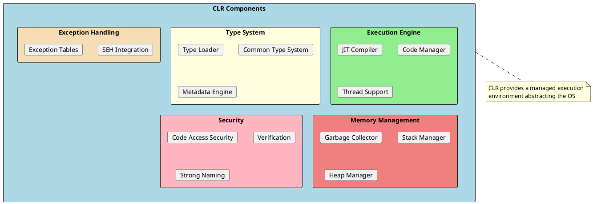
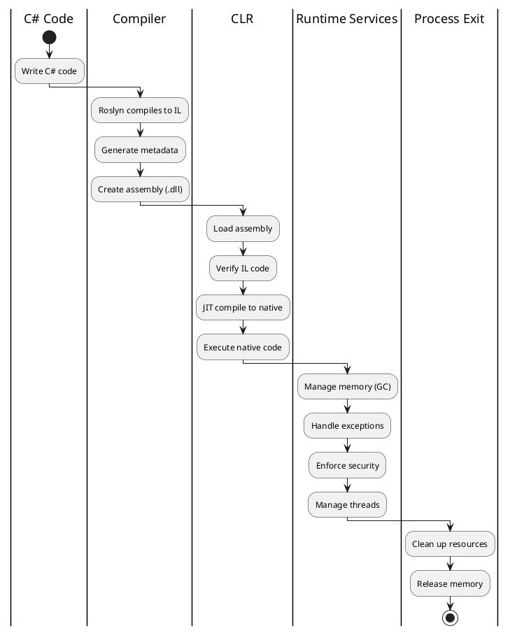
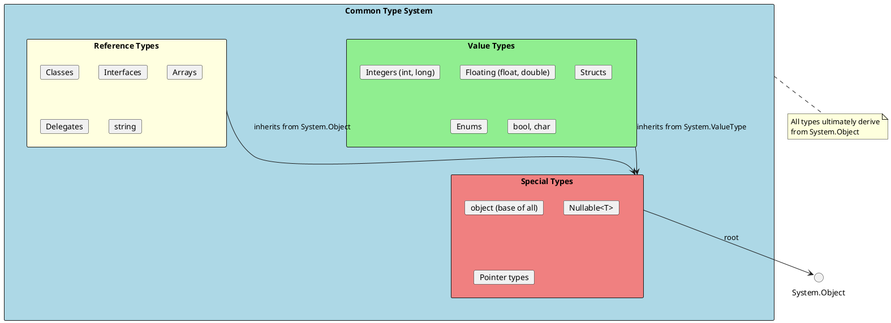
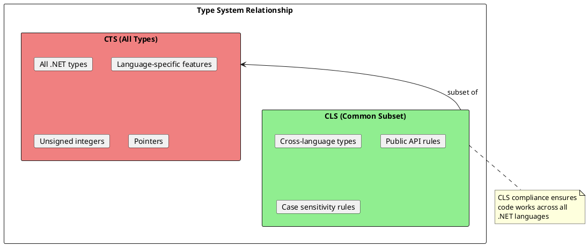
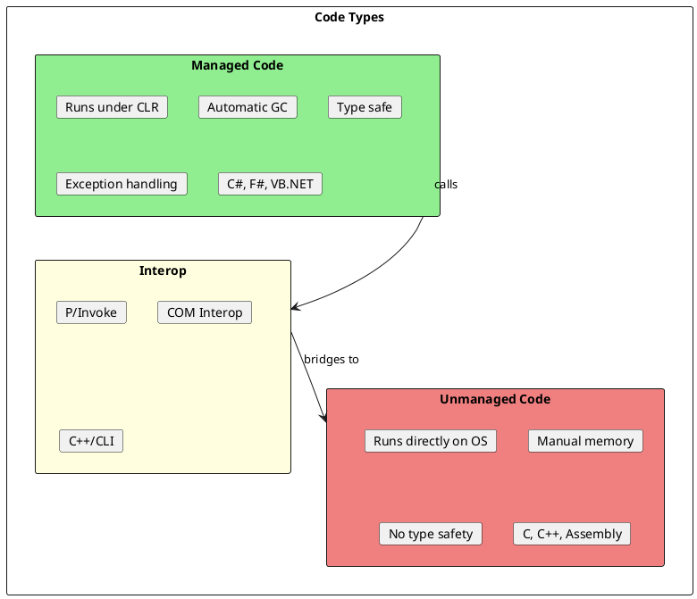
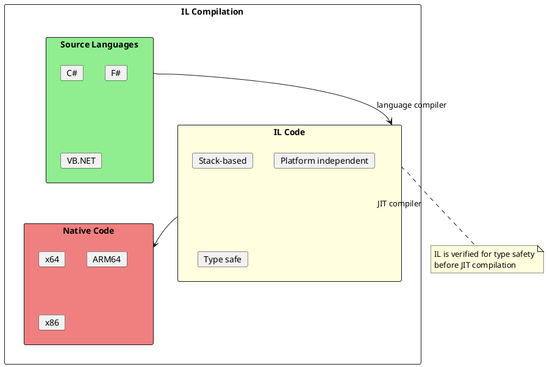
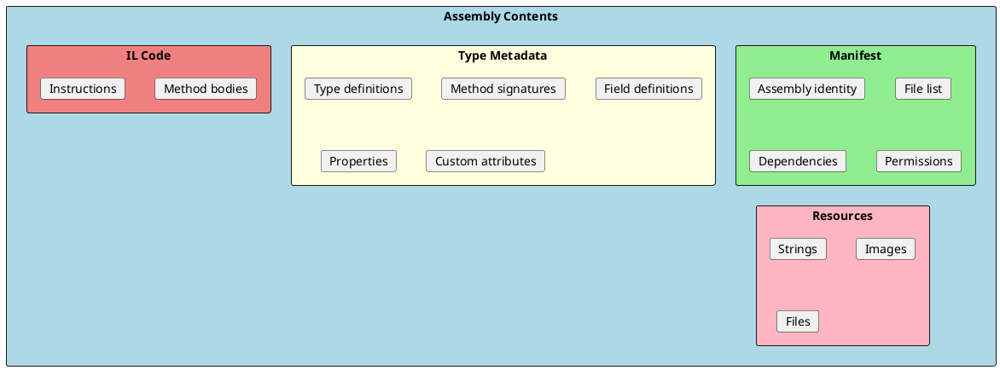
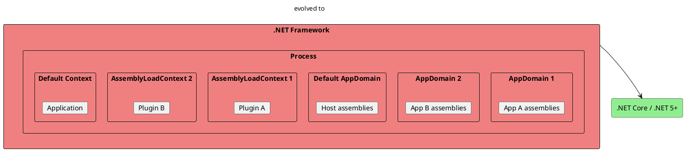

# CLR Architecture

The Common Language Runtime (CLR) is the heart of the .NET platform. It's a virtual execution system that manages the execution of .NET programs, providing services like memory management, type safety, exception handling, and security.



## What Does the CLR Do?

The CLR transforms your high-level C# code into running native code and manages its execution throughout its lifetime.



### CLR Responsibilities

| Service | What It Does | Why It Matters |
|---------|--------------|----------------|
| **Memory Management** | Allocates and frees memory automatically | No manual malloc/free, fewer memory leaks |
| **Type Safety** | Verifies type operations at runtime | Prevents buffer overflows, type confusion attacks |
| **Exception Handling** | Manages try/catch/finally | Consistent error handling across languages |
| **Security** | Enforces code access policies | Sandboxed execution, secure code |
| **JIT Compilation** | Converts IL to native code | Platform independence, runtime optimization |
| **Thread Management** | Provides thread pool and synchronization | Efficient concurrent execution |

---

## Common Type System (CTS)

The Common Type System defines how types are declared, used, and managed in the runtime. It enables **language interoperability** - code written in C# can use types defined in F# or VB.NET.



### Type Categories

```csharp
// Value Types - stored on stack (usually), copied by value
int number = 42;                    // Primitive
decimal price = 19.99m;             // Primitive
DateTime date = DateTime.Now;       // Struct
Point point = new Point(10, 20);    // Struct
DayOfWeek day = DayOfWeek.Monday;   // Enum

// Reference Types - stored on heap, copied by reference
string name = "John";               // Special reference type
int[] numbers = { 1, 2, 3 };       // Array
object obj = new object();          // Base class
List<int> list = new List<int>();  // Class
Action action = () => { };         // Delegate

// All types derive from Object
Console.WriteLine(number.GetType());    // System.Int32
Console.WriteLine(name.GetType());      // System.String
Console.WriteLine(42.ToString());       // Works because int inherits from Object
```

### CTS Type Mapping

| C# Keyword | .NET Type | Size | Range |
|------------|-----------|------|-------|
| `bool` | System.Boolean | 1 byte | true/false |
| `byte` | System.Byte | 1 byte | 0 to 255 |
| `short` | System.Int16 | 2 bytes | -32,768 to 32,767 |
| `int` | System.Int32 | 4 bytes | -2.1B to 2.1B |
| `long` | System.Int64 | 8 bytes | ±9.2×10¹⁸ |
| `float` | System.Single | 4 bytes | ±3.4×10³⁸ |
| `double` | System.Double | 8 bytes | ±1.7×10³⁰⁸ |
| `decimal` | System.Decimal | 16 bytes | 28-29 digits |
| `char` | System.Char | 2 bytes | UTF-16 |
| `string` | System.String | variable | UTF-16 sequence |

---

## Common Language Specification (CLS)

The CLS is a subset of the CTS that defines rules for language interoperability. If you follow CLS rules, your code can be used by any .NET language.



### CLS Rules

```csharp
// ✅ CLS Compliant
[assembly: CLSCompliant(true)]

public class Calculator
{
    public int Add(int a, int b) => a + b;
    public string GetName() => "Calculator";
}

// ❌ NOT CLS Compliant (but valid C#)
public class NonCompliant
{
    // UInt32 not in CLS
    public uint GetCount() => 42;

    // Case-only difference not allowed
    public void Process() { }
    public void PROCESS() { }  // Same name different case

    // Pointer types not in CLS
    public unsafe int* GetPointer() => null;
}
```

### Key CLS Rules

1. **No unsigned types** in public APIs (use `int` instead of `uint`)
2. **No pointers** in public APIs
3. **Case matters** - can't have `Value` and `value` as different members
4. **Array lower bound must be zero**
5. **Public members must use CLS types**

---

## Managed vs Unmanaged Code



### Managed Code Benefits

```csharp
// Managed code - CLR handles everything
public class ManagedExample
{
    public void Process()
    {
        // Memory automatically managed
        var data = new byte[1000000];

        // Exception handling built-in
        try
        {
            ProcessData(data);
        }
        catch (Exception ex)
        {
            // Structured exception handling
            Console.WriteLine(ex.Message);
        }

        // No need to free memory - GC does it
    }
}
```

### Interop with Unmanaged Code

```csharp
using System.Runtime.InteropServices;

public class UnmanagedInterop
{
    // P/Invoke - call native Windows API
    [DllImport("kernel32.dll")]
    private static extern uint GetCurrentThreadId();

    // P/Invoke with string marshaling
    [DllImport("user32.dll", CharSet = CharSet.Unicode)]
    private static extern int MessageBox(IntPtr hWnd, string text, string caption, uint type);

    public void ShowMessage()
    {
        var threadId = GetCurrentThreadId();
        MessageBox(IntPtr.Zero, $"Thread: {threadId}", "Info", 0);
    }
}

// Using unsafe code (requires /unsafe compiler flag)
public class UnsafeExample
{
    public unsafe void UsePointers()
    {
        int value = 42;
        int* ptr = &value;
        Console.WriteLine(*ptr);  // 42

        // Fixed statement pins managed object
        byte[] data = new byte[100];
        fixed (byte* pData = data)
        {
            // Can pass pData to native code
            *pData = 255;
        }
    }
}
```

---

## IL (Intermediate Language)

IL (also called MSIL or CIL) is the CPU-independent instruction set that all .NET languages compile to. The JIT compiler converts IL to native code at runtime.



### Viewing IL Code

```csharp
// C# code
public class Calculator
{
    public int Add(int a, int b)
    {
        return a + b;
    }
}

// Corresponding IL (simplified)
/*
.method public hidebysig instance int32 Add(int32 a, int32 b) cil managed
{
    .maxstack 2
    ldarg.1      // Load argument 'a' onto stack
    ldarg.2      // Load argument 'b' onto stack
    add          // Pop both, push sum
    ret          // Return top of stack
}
*/
```

### IL Characteristics

| Feature | Description |
|---------|-------------|
| **Stack-based** | Operations use a virtual stack |
| **Typed** | All operations are strongly typed |
| **Object-oriented** | Supports classes, interfaces, inheritance |
| **Verifiable** | Can be checked for type safety |
| **Metadata-rich** | Includes full type information |

---

## Metadata

Metadata is self-describing information about types, methods, and assemblies stored in every .NET assembly. It enables reflection, serialization, and cross-language interoperability.



### Using Metadata via Reflection

```csharp
public class ReflectionExample
{
    public void ExploreType<T>()
    {
        Type type = typeof(T);

        Console.WriteLine($"Type: {type.FullName}");
        Console.WriteLine($"Assembly: {type.Assembly.FullName}");
        Console.WriteLine($"Is Class: {type.IsClass}");
        Console.WriteLine($"Is Value Type: {type.IsValueType}");

        Console.WriteLine("\nProperties:");
        foreach (var prop in type.GetProperties())
        {
            Console.WriteLine($"  {prop.PropertyType.Name} {prop.Name}");
        }

        Console.WriteLine("\nMethods:");
        foreach (var method in type.GetMethods(BindingFlags.Public | BindingFlags.Instance | BindingFlags.DeclaredOnly))
        {
            var parameters = string.Join(", ", method.GetParameters().Select(p => $"{p.ParameterType.Name} {p.Name}"));
            Console.WriteLine($"  {method.ReturnType.Name} {method.Name}({parameters})");
        }

        Console.WriteLine("\nCustom Attributes:");
        foreach (var attr in type.GetCustomAttributes(true))
        {
            Console.WriteLine($"  [{attr.GetType().Name}]");
        }
    }
}

// Usage
var explorer = new ReflectionExample();
explorer.ExploreType<HttpClient>();
```

---

## Application Domains (Legacy)

Application Domains (AppDomains) were used in .NET Framework to provide isolation between applications running in the same process. In .NET Core/.NET 5+, they are largely replaced by **AssemblyLoadContext**.



### Modern Assembly Isolation

```csharp
// .NET Core+ uses AssemblyLoadContext
public class PluginLoader
{
    public Assembly LoadPlugin(string pluginPath)
    {
        var loadContext = new PluginLoadContext(pluginPath);
        return loadContext.LoadFromAssemblyPath(pluginPath);
    }
}

public class PluginLoadContext : AssemblyLoadContext
{
    private readonly AssemblyDependencyResolver _resolver;

    public PluginLoadContext(string pluginPath) : base(isCollectible: true)
    {
        _resolver = new AssemblyDependencyResolver(pluginPath);
    }

    protected override Assembly? Load(AssemblyName assemblyName)
    {
        var assemblyPath = _resolver.ResolveAssemblyToPath(assemblyName);
        if (assemblyPath != null)
        {
            return LoadFromAssemblyPath(assemblyPath);
        }
        return null;
    }
}
```

---

## Interview Questions & Answers

### Q1: What is the CLR?

**Answer**: The Common Language Runtime (CLR) is the virtual execution system of .NET that manages the execution of .NET programs. It provides services like:
- Memory management (garbage collection)
- Type safety and verification
- Exception handling
- JIT compilation
- Thread management
- Security enforcement

### Q2: What is the difference between CTS and CLS?

**Answer**:
- **CTS (Common Type System)**: Defines ALL types that can exist in .NET, including language-specific features
- **CLS (Common Language Specification)**: A SUBSET of CTS that ensures language interoperability

If you want your library to work with any .NET language, follow CLS rules for public APIs.

### Q3: What is IL and why is it used?

**Answer**: IL (Intermediate Language) is a CPU-independent instruction set that all .NET languages compile to. Benefits:
- **Platform independence**: Same IL runs on any CPU architecture
- **Language interoperability**: Different languages produce same IL
- **Runtime optimization**: JIT can optimize for current hardware
- **Security**: IL can be verified for type safety

### Q4: What is the difference between managed and unmanaged code?

**Answer**:
- **Managed code**: Runs under CLR control, with automatic memory management, type safety, and exception handling
- **Unmanaged code**: Runs directly on the OS, requires manual memory management (C/C++)

Use P/Invoke or COM interop to call unmanaged code from managed code.

### Q5: What is metadata and why is it important?

**Answer**: Metadata is self-describing type information stored in every .NET assembly. It enables:
- **Reflection**: Inspect types at runtime
- **Serialization**: Convert objects to/from bytes
- **IntelliSense**: IDE autocomplete
- **Interoperability**: Cross-language type usage
- **Versioning**: Assembly identity and dependencies

### Q6: What replaced AppDomains in .NET Core?

**Answer**: `AssemblyLoadContext` replaced AppDomains for assembly isolation. Key differences:
- AppDomains provided full isolation (separate memory)
- AssemblyLoadContext provides assembly unloading and isolation
- Use `isCollectible: true` for contexts that can be unloaded
