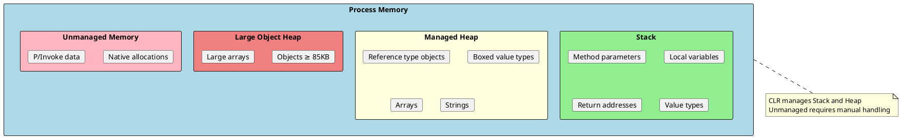
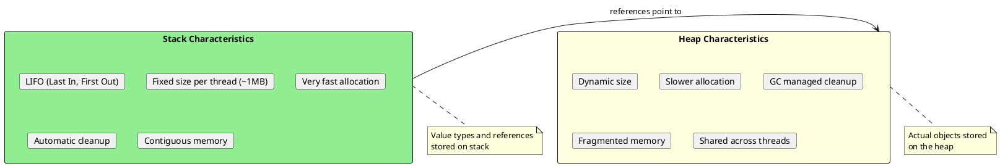
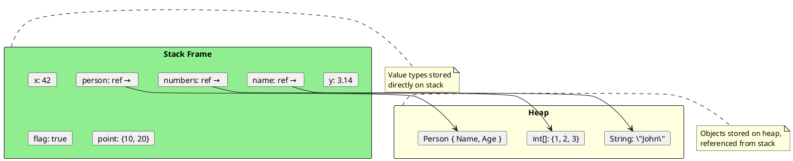
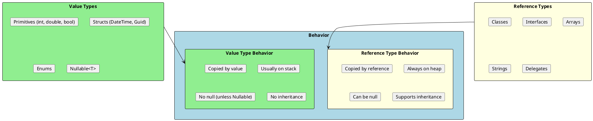
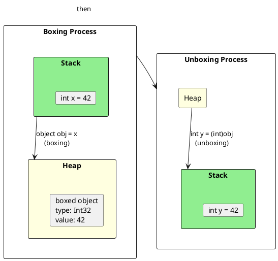
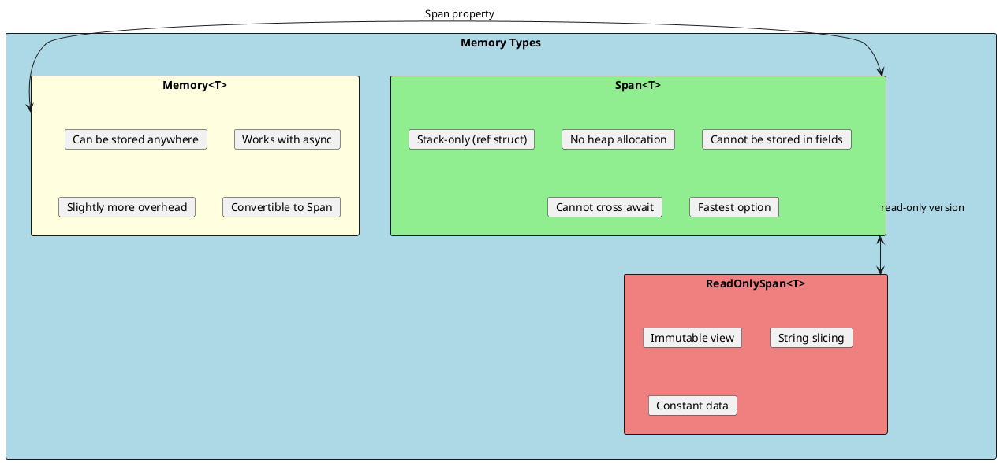
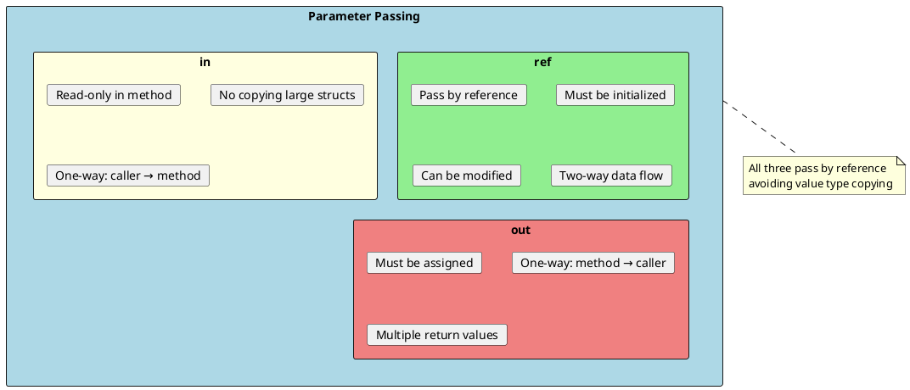
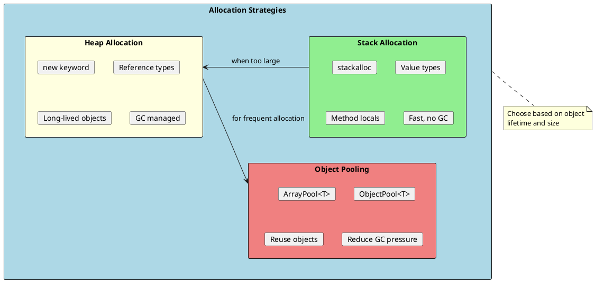

# Memory Management

Memory management is one of the most critical aspects of .NET performance. Understanding how memory is allocated, used, and reclaimed helps you write efficient applications and avoid common pitfalls like memory leaks and excessive garbage collection.



## Stack vs Heap

The stack and heap serve different purposes and have distinct characteristics that affect performance and memory usage.



### Key Differences

| Aspect | Stack | Heap |
|--------|-------|------|
| **Allocation** | Automatic, very fast | Slower, requires GC tracking |
| **Deallocation** | Automatic on scope exit | Garbage collector |
| **Size** | Limited (~1MB per thread) | Limited by available memory |
| **Thread Safety** | Thread-specific | Shared, needs synchronization |
| **Fragmentation** | None (contiguous) | Can fragment over time |
| **Access Speed** | Fastest | Slower (pointer dereferencing) |

### Memory Layout Example

```csharp
public class MemoryLayoutExample
{
    public void DemonstrateMemory()
    {
        // Stack allocations
        int x = 42;                      // 4 bytes on stack
        double y = 3.14;                 // 8 bytes on stack
        bool flag = true;                // 1 byte on stack
        Point point = new Point(10, 20); // Struct: 8 bytes on stack (if Point is struct)

        // Heap allocations (reference on stack, object on heap)
        string name = "John";            // Reference (8 bytes) on stack
                                         // String object on heap

        int[] numbers = { 1, 2, 3 };     // Reference on stack
                                         // Array object on heap

        Person person = new Person();    // Reference on stack
                                         // Person object on heap
    }
}

public struct Point
{
    public int X;  // 4 bytes
    public int Y;  // 4 bytes
}

public class Person
{
    public string Name;  // Reference (8 bytes in object)
    public int Age;      // 4 bytes
}
```



---

## Value Types vs Reference Types

Understanding the difference between value types and reference types is fundamental to .NET memory management.



### Copy Semantics

```csharp
// Value types - copied by VALUE
public void ValueTypeCopy()
{
    int a = 10;
    int b = a;      // b gets a COPY of the value
    b = 20;         // Changing b doesn't affect a

    Console.WriteLine(a);  // 10
    Console.WriteLine(b);  // 20
}

// Structs are value types too
public struct Point
{
    public int X;
    public int Y;
}

public void StructCopy()
{
    Point p1 = new Point { X = 10, Y = 20 };
    Point p2 = p1;      // p2 gets a COPY
    p2.X = 100;         // Changing p2 doesn't affect p1

    Console.WriteLine(p1.X);  // 10
    Console.WriteLine(p2.X);  // 100
}

// Reference types - copied by REFERENCE
public void ReferenceTypeCopy()
{
    int[] arr1 = { 1, 2, 3 };
    int[] arr2 = arr1;  // arr2 points to SAME array
    arr2[0] = 100;      // Modifies the shared array

    Console.WriteLine(arr1[0]);  // 100 - arr1 also changed!
}

public class Person
{
    public string Name;
}

public void ClassCopy()
{
    Person p1 = new Person { Name = "John" };
    Person p2 = p1;     // p2 points to SAME object
    p2.Name = "Jane";   // Modifies the shared object

    Console.WriteLine(p1.Name);  // "Jane" - p1 also changed!
}
```

### When to Use Struct vs Class

```csharp
// ✅ Good struct - small, immutable, logically a single value
public readonly struct Point
{
    public readonly int X;
    public readonly int Y;

    public Point(int x, int y) => (X, Y) = (x, y);
}

// ✅ Good struct - represents a single value
public readonly struct Money
{
    public readonly decimal Amount;
    public readonly string Currency;

    public Money(decimal amount, string currency)
    {
        Amount = amount;
        Currency = currency;
    }
}

// ❌ Bad struct - too large, copying is expensive
public struct BadLargeStruct
{
    public int Field1, Field2, Field3, Field4;
    public int Field5, Field6, Field7, Field8;
    public int Field9, Field10, Field11, Field12;
    // More than 16 bytes - should be a class
}

// ❌ Bad struct - mutable state causes confusion
public struct MutablePoint
{
    public int X;
    public int Y;

    public void Move(int dx, int dy)  // Mutating method on struct!
    {
        X += dx;
        Y += dy;
    }
}
```

### Guidelines for Struct vs Class

| Use Struct When | Use Class When |
|-----------------|----------------|
| Size ≤ 16 bytes | Size > 16 bytes |
| Immutable data | Mutable state needed |
| Single logical value | Identity matters |
| Short-lived | Long-lived objects |
| Frequently copied | Reference sharing needed |
| No inheritance needed | Polymorphism required |

---

## Boxing and Unboxing

Boxing is the process of converting a value type to a reference type. It's an important concept because it has performance implications.



### Boxing and Unboxing Examples

```csharp
public class BoxingExamples
{
    public void BasicBoxing()
    {
        // Boxing - value type to object
        int number = 42;
        object boxed = number;  // Boxing occurs here

        // Unboxing - object back to value type
        int unboxed = (int)boxed;  // Unboxing occurs here

        // ⚠️ Wrong type unboxing throws InvalidCastException
        // double wrong = (double)boxed;  // Throws!
    }

    // ❌ Hidden boxing - common mistake
    public void HiddenBoxing()
    {
        int value = 42;

        // String interpolation with value type - boxes!
        string s1 = $"Value: {value}";  // Boxing!

        // ArrayList stores objects - boxes value types
        var list = new System.Collections.ArrayList();
        list.Add(value);  // Boxing!
        list.Add(100);    // Boxing!

        // Calling ToString() on struct can box
        Console.WriteLine(value.ToString());  // May box depending on override
    }

    // ✅ Avoid boxing with generics
    public void AvoidBoxing()
    {
        int value = 42;

        // Generic collections - no boxing!
        var list = new List<int>();
        list.Add(value);  // No boxing
        list.Add(100);    // No boxing

        // Span<T> and Memory<T> - no boxing
        Span<int> span = stackalloc int[10];
        span[0] = value;  // No boxing
    }
}
```

### Boxing Performance Impact

```csharp
public class BoxingPerformance
{
    // ❌ Causes boxing on every iteration
    public int SumWithBoxing(int count)
    {
        object sum = 0;  // Boxed
        for (int i = 0; i < count; i++)
        {
            sum = (int)sum + i;  // Unbox, add, box again!
        }
        return (int)sum;
    }

    // ✅ No boxing
    public int SumWithoutBoxing(int count)
    {
        int sum = 0;
        for (int i = 0; i < count; i++)
        {
            sum += i;  // Pure value type operation
        }
        return sum;
    }
}

// Performance comparison:
// SumWithBoxing:    ~100x slower due to allocations
// SumWithoutBoxing: Fast, no GC pressure
```

### Common Boxing Scenarios

| Scenario | Boxing Occurs? | Solution |
|----------|---------------|----------|
| `object o = 42` | Yes | Use generics |
| `ArrayList.Add(42)` | Yes | Use `List<int>` |
| `string.Format("{0}", 42)` | Yes | Override `ToString()` |
| `Dictionary<int, int>` | No | Generics avoid boxing |
| `IComparable c = 42` | Yes | Use `IComparable<int>` |
| `struct.Equals(object)` | Yes | Override `Equals(T)` |

---

## Span<T> and Memory<T>

`Span<T>` and `Memory<T>` are modern types that provide safe, efficient access to contiguous memory without allocations.



### Span<T> Usage

```csharp
public class SpanExamples
{
    // ✅ Zero-allocation string parsing
    public void ParseWithSpan(string input)
    {
        ReadOnlySpan<char> span = input.AsSpan();

        // Find comma without creating substrings
        int commaIndex = span.IndexOf(',');

        ReadOnlySpan<char> firstName = span.Slice(0, commaIndex);
        ReadOnlySpan<char> lastName = span.Slice(commaIndex + 1);

        // Parse numbers without allocation
        if (int.TryParse(firstName, out int number))
        {
            Console.WriteLine(number);
        }
    }

    // ✅ Array slicing without copying
    public void ArraySlicing()
    {
        int[] array = { 1, 2, 3, 4, 5, 6, 7, 8, 9, 10 };

        Span<int> slice = array.AsSpan(2, 5);  // Elements 3-7
        slice[0] = 100;  // Modifies original array!

        Console.WriteLine(array[2]);  // 100
    }

    // ✅ Stack allocation with Span
    public void StackAllocation()
    {
        // Allocate on stack - no GC pressure
        Span<int> numbers = stackalloc int[100];

        for (int i = 0; i < numbers.Length; i++)
        {
            numbers[i] = i * 2;
        }

        // Process without heap allocation
        int sum = 0;
        foreach (int n in numbers)
        {
            sum += n;
        }
    }

    // ✅ Working with native memory
    public unsafe void NativeMemory()
    {
        // Wrap native memory in Span
        int* ptr = (int*)NativeMemory.Alloc(100 * sizeof(int));
        try
        {
            Span<int> span = new Span<int>(ptr, 100);
            span.Fill(42);

            // Use safely with bounds checking
            Console.WriteLine(span[50]);
        }
        finally
        {
            NativeMemory.Free(ptr);
        }
    }
}
```

### Memory<T> for Async Operations

```csharp
public class MemoryExamples
{
    // Memory<T> works with async (Span<T> doesn't!)
    public async Task ProcessDataAsync(Memory<byte> data)
    {
        // Can use Memory across await points
        await Task.Delay(100);

        // Convert to Span for processing
        Span<byte> span = data.Span;
        for (int i = 0; i < span.Length; i++)
        {
            span[i] = (byte)(span[i] * 2);
        }

        await Task.Delay(100);
    }

    // Storing in class fields
    public class DataProcessor
    {
        private Memory<byte> _buffer;  // OK - Memory can be stored
        // private Span<byte> _span;   // Error - Span cannot be stored

        public DataProcessor(int size)
        {
            _buffer = new byte[size];
        }

        public void Process()
        {
            Span<byte> span = _buffer.Span;  // Get Span when needed
            // Process data...
        }
    }
}
```

---

## ref, in, and out Parameters

These keywords control how parameters are passed and can significantly impact performance for large value types.



### Parameter Examples

```csharp
public class ParameterExamples
{
    // Standard pass by value - copies the struct
    public void ByValue(LargeStruct data)
    {
        // 'data' is a copy - original unchanged
    }

    // ref - pass by reference, can modify
    public void ByRef(ref int value)
    {
        value = value * 2;  // Modifies original
    }

    // in - pass by reference, read-only (great for large structs)
    public void ByIn(in LargeStruct data)
    {
        // Cannot modify 'data'
        Console.WriteLine(data.Field1);
        // data.Field1 = 10;  // Compiler error!
    }

    // out - must assign before returning
    public bool TryParse(string input, out int result)
    {
        if (int.TryParse(input, out result))
        {
            return true;
        }
        result = 0;  // Must assign
        return false;
    }

    public void Usage()
    {
        int x = 10;
        ByRef(ref x);
        Console.WriteLine(x);  // 20

        LargeStruct large = new LargeStruct();
        ByIn(in large);  // No copy, passed by reference

        if (TryParse("123", out int parsed))
        {
            Console.WriteLine(parsed);  // 123
        }
    }
}

public struct LargeStruct
{
    public int Field1, Field2, Field3, Field4;
    public int Field5, Field6, Field7, Field8;
    // Using 'in' avoids copying 32+ bytes
}
```

### ref Returns and ref Locals

```csharp
public class RefReturns
{
    private int[] _data = new int[100];

    // Return a reference to array element
    public ref int GetElementRef(int index)
    {
        return ref _data[index];
    }

    public void Usage()
    {
        // Get reference to element
        ref int element = ref GetElementRef(5);

        // Modify through reference
        element = 42;

        // _data[5] is now 42
        Console.WriteLine(_data[5]);  // 42
    }
}

// Real-world example: Dictionary value modification
public class DictionaryRefExample
{
    public void ModifyValue()
    {
        var dict = new Dictionary<string, int>
        {
            ["counter"] = 0
        };

        // Without ref - requires two lookups
        dict["counter"] = dict["counter"] + 1;

        // With ref - single lookup, in-place modification
        ref int counter = ref System.Runtime.InteropServices.CollectionsMarshal
            .GetValueRefOrAddDefault(dict, "counter", out _);
        counter++;
    }
}
```

---

## Memory Allocation Patterns

Understanding allocation patterns helps you write memory-efficient code.



### ArrayPool<T> Usage

```csharp
public class ArrayPoolExample
{
    public void ProcessData()
    {
        // ❌ Creates GC pressure
        byte[] buffer = new byte[4096];
        ProcessBuffer(buffer);
        // buffer becomes garbage after method exits

        // ✅ Uses pooled array - less GC pressure
        byte[] pooledBuffer = ArrayPool<byte>.Shared.Rent(4096);
        try
        {
            // Note: Rented array may be larger than requested
            ProcessBuffer(pooledBuffer.AsSpan(0, 4096));
        }
        finally
        {
            // Always return to pool
            ArrayPool<byte>.Shared.Return(pooledBuffer);
        }
    }

    // High-performance pattern with Span
    public void HighPerformance()
    {
        // Small buffers - use stack
        Span<byte> small = stackalloc byte[256];

        // Large buffers - use pool
        byte[] large = ArrayPool<byte>.Shared.Rent(1024 * 1024);
        try
        {
            // Process with Span (works for both)
            ProcessBuffer(large);
        }
        finally
        {
            ArrayPool<byte>.Shared.Return(large);
        }
    }

    private void ProcessBuffer(Span<byte> buffer)
    {
        // Process data...
    }
}
```

### Object Pooling with ObjectPool<T>

```csharp
using Microsoft.Extensions.ObjectPool;

public class ObjectPoolExample
{
    private readonly ObjectPool<StringBuilder> _stringBuilderPool;

    public ObjectPoolExample()
    {
        var policy = new StringBuilderPooledObjectPolicy();
        _stringBuilderPool = new DefaultObjectPool<StringBuilder>(policy);
    }

    public string BuildMessage(IEnumerable<string> parts)
    {
        StringBuilder sb = _stringBuilderPool.Get();
        try
        {
            foreach (var part in parts)
            {
                sb.Append(part);
                sb.Append(", ");
            }
            return sb.ToString();
        }
        finally
        {
            // Return to pool (policy resets the StringBuilder)
            _stringBuilderPool.Return(sb);
        }
    }
}

// Custom pooled object
public class ExpensiveObjectPolicy : IPooledObjectPolicy<ExpensiveObject>
{
    public ExpensiveObject Create() => new ExpensiveObject();

    public bool Return(ExpensiveObject obj)
    {
        obj.Reset();  // Clean up before returning to pool
        return true;  // Return to pool
    }
}
```

---

## Interview Questions & Answers

### Q1: What is the difference between stack and heap?

**Answer**:
- **Stack**: Fast, automatic memory for value types and references. LIFO structure, limited size (~1MB per thread), automatically cleaned when method exits.
- **Heap**: Managed by GC for reference type objects. Larger, slower allocation, shared across threads.

Key insight: The reference (pointer) to an object lives on the stack, but the actual object lives on the heap.

### Q2: What is boxing and why should you avoid it?

**Answer**: Boxing converts a value type to an object reference, allocating memory on the heap. It should be avoided because:
- Causes heap allocation (GC pressure)
- Requires unboxing to use the value again
- Performance overhead (up to 20x slower)

Avoid by: using generics (`List<int>` instead of `ArrayList`), overriding `ToString()` on structs, and using generic interfaces (`IComparable<T>`).

### Q3: When should you use a struct vs a class?

**Answer**: Use a struct when:
- Size is 16 bytes or less
- Data is immutable
- Represents a single logical value
- No inheritance needed
- Short-lived (method scope)

Use a class when:
- Size exceeds 16 bytes
- Need mutable state
- Identity matters
- Polymorphism required
- Long-lived objects

### Q4: What is Span<T> and when would you use it?

**Answer**: `Span<T>` is a stack-only type that provides type-safe, memory-safe access to contiguous memory. Use it for:
- Zero-allocation string parsing
- Array slicing without copying
- Working with `stackalloc`
- Wrapping native memory

Limitations: Cannot be stored in fields, cannot cross `await` boundaries (use `Memory<T>` for async).

### Q5: What does the `in` keyword do for parameters?

**Answer**: The `in` keyword passes parameters by reference but read-only. Benefits:
- Avoids copying large structs (performance)
- Prevents modification (safety)
- Caller knows value won't change

Use for large value types (`in LargeStruct data`) where you need read-only access without the copy overhead.

### Q6: How does ArrayPool<T> help with performance?

**Answer**: `ArrayPool<T>` provides a pool of reusable arrays, reducing:
- GC pressure (fewer allocations)
- Memory fragmentation
- Allocation time

Pattern: `Rent()` an array, use it, then `Return()` it. The returned array goes back to the pool for reuse instead of becoming garbage.

