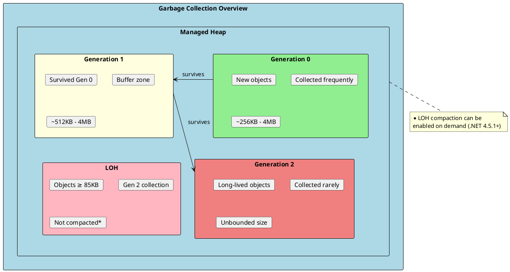
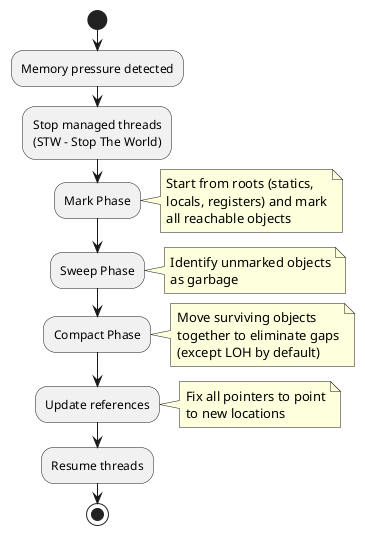
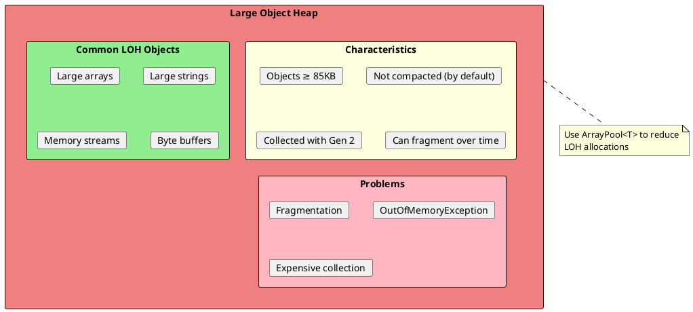
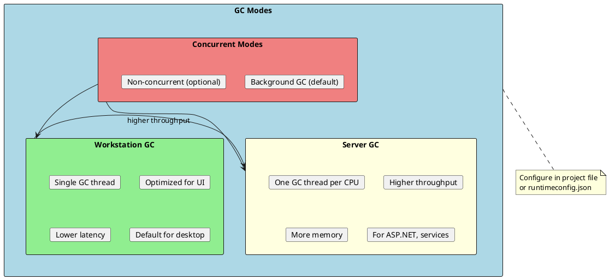
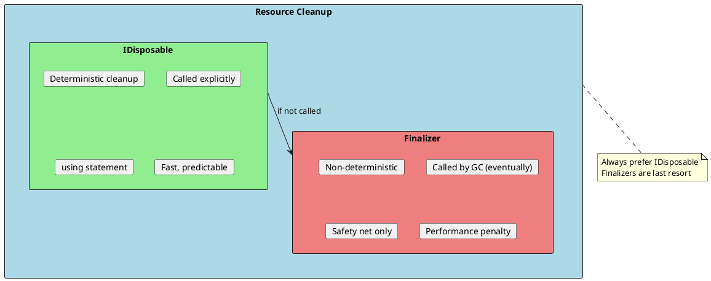
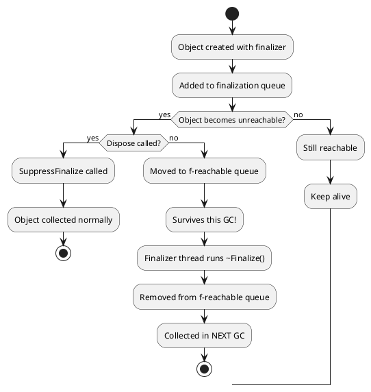
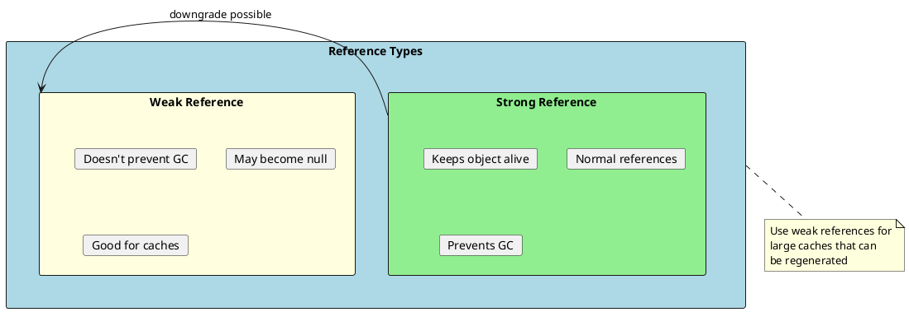
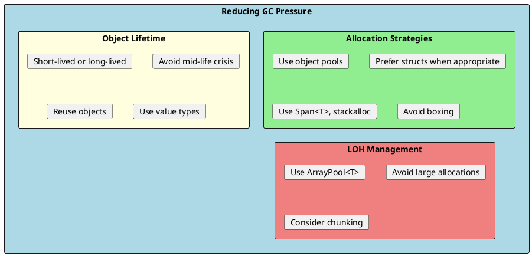

# Garbage Collection

Garbage Collection (GC) is the automatic memory management system in .NET that reclaims memory from objects that are no longer in use. Understanding how GC works is crucial for writing performant applications and avoiding memory-related issues.



## How Garbage Collection Works

The .NET GC is a **generational, mark-and-sweep, compacting** collector. It uses generations based on the observation that most objects die young.



### The Three Generations

| Generation | Purpose | Collection Frequency | Size |
|------------|---------|---------------------|------|
| **Gen 0** | New, short-lived objects | Very frequent | ~256KB - 4MB |
| **Gen 1** | Objects that survived Gen 0 | Moderate | ~512KB - 4MB |
| **Gen 2** | Long-lived objects | Rare (expensive) | Unbounded |
| **LOH** | Large objects (≥85KB) | With Gen 2 | Unbounded |

### Generation Promotion

```csharp
public class GenerationExample
{
    public void DemonstrateGenerations()
    {
        // New object - starts in Gen 0
        var obj = new object();
        Console.WriteLine(GC.GetGeneration(obj));  // 0

        // Force GC - object survives, promoted to Gen 1
        GC.Collect(0);
        Console.WriteLine(GC.GetGeneration(obj));  // 1

        // Another GC - promoted to Gen 2
        GC.Collect(1);
        Console.WriteLine(GC.GetGeneration(obj));  // 2

        // Object will stay in Gen 2 forever (or until collected)
    }

    public void ShowGCInfo()
    {
        var info = GC.GetGCMemoryInfo();

        Console.WriteLine($"Heap Size: {info.HeapSizeBytes / 1024 / 1024} MB");
        Console.WriteLine($"Gen 0 Collections: {GC.CollectionCount(0)}");
        Console.WriteLine($"Gen 1 Collections: {GC.CollectionCount(1)}");
        Console.WriteLine($"Gen 2 Collections: {GC.CollectionCount(2)}");
    }
}
```

---

## Large Object Heap (LOH)

Objects 85KB or larger go directly to the Large Object Heap, which has special characteristics.



### LOH Examples and Best Practices

```csharp
public class LOHExamples
{
    // ❌ Creates LOH allocation
    public void BadLOHUsage()
    {
        // Array of 85KB or more goes to LOH
        byte[] largeArray = new byte[85000];

        // String concatenation can create large LOH objects
        string largeString = new string('x', 42500);  // ~85KB in UTF-16

        // These become LOH allocations
    }

    // ✅ Avoid LOH with ArrayPool
    public void GoodLOHUsage()
    {
        // Use pooled arrays instead
        byte[] buffer = ArrayPool<byte>.Shared.Rent(100000);
        try
        {
            // Use buffer...
        }
        finally
        {
            ArrayPool<byte>.Shared.Return(buffer);
        }
    }

    // ✅ Enable LOH compaction when needed
    public void CompactLOH()
    {
        // Request LOH compaction on next Gen 2 GC
        GCSettings.LargeObjectHeapCompactionMode =
            GCLargeObjectHeapCompactionMode.CompactOnce;

        // Trigger full GC with compaction
        GC.Collect();

        // Mode resets to Default after compaction
    }

    // Check if object is on LOH
    public void CheckLOH()
    {
        var info = GC.GetGCMemoryInfo();

        // Get heap info for each generation
        foreach (var heapInfo in info.GenerationInfo)
        {
            Console.WriteLine($"Size: {heapInfo.SizeAfterBytes}");
        }
    }
}
```

---

## GC Modes and Configuration

.NET supports different GC modes optimized for different scenarios.



### Configuring GC Mode

```xml
<!-- In .csproj file -->
<PropertyGroup>
  <!-- Enable Server GC -->
  <ServerGarbageCollection>true</ServerGarbageCollection>

  <!-- Enable Concurrent GC (default is true) -->
  <ConcurrentGarbageCollection>true</ConcurrentGarbageCollection>

  <!-- Retain VM memory (don't return to OS) -->
  <RetainVMGarbageCollection>true</RetainVMGarbageCollection>
</PropertyGroup>
```

```json
// In runtimeconfig.json
{
  "runtimeOptions": {
    "configProperties": {
      "System.GC.Server": true,
      "System.GC.Concurrent": true,
      "System.GC.HeapCount": 4,
      "System.GC.HeapHardLimit": 536870912
    }
  }
}
```

### GC Mode Comparison

| Aspect | Workstation GC | Server GC |
|--------|---------------|-----------|
| **GC Threads** | 1 | 1 per CPU core |
| **Heap** | Single | One per core |
| **Throughput** | Lower | Higher |
| **Memory** | Less | More |
| **Latency** | Lower individual | Higher individual |
| **Best For** | Desktop apps, UI | Web servers, services |

### Programmatic GC Control

```csharp
public class GCControl
{
    public void ShowGCSettings()
    {
        Console.WriteLine($"Is Server GC: {GCSettings.IsServerGC}");
        Console.WriteLine($"Latency Mode: {GCSettings.LatencyMode}");
    }

    // Reduce GC latency during critical operations
    public void CriticalOperation()
    {
        var oldMode = GCSettings.LatencyMode;
        try
        {
            // Prevent Gen 2 collections during critical section
            GCSettings.LatencyMode = GCLatencyMode.LowLatency;

            PerformCriticalWork();
        }
        finally
        {
            GCSettings.LatencyMode = oldMode;
        }
    }

    // No GC region for ultra-low latency
    public void NoGCOperation()
    {
        // Request a no-GC region (may fail if not enough memory)
        if (GC.TryStartNoGCRegion(1024 * 1024 * 50))  // 50MB
        {
            try
            {
                PerformCriticalWork();
            }
            finally
            {
                GC.EndNoGCRegion();
            }
        }
    }

    private void PerformCriticalWork() { }
}
```

---

## Finalization and Dispose Pattern

Finalization is the mechanism for cleaning up unmanaged resources, but it has performance implications.



### The Dispose Pattern

```csharp
public class ResourceHolder : IDisposable
{
    private IntPtr _unmanagedResource;  // Unmanaged resource
    private Stream _managedResource;     // Managed resource
    private bool _disposed = false;

    public ResourceHolder()
    {
        _unmanagedResource = AllocateUnmanagedResource();
        _managedResource = new FileStream("file.txt", FileMode.Create);
    }

    // ✅ IDisposable implementation
    public void Dispose()
    {
        Dispose(disposing: true);
        GC.SuppressFinalize(this);  // Prevent finalizer from running
    }

    protected virtual void Dispose(bool disposing)
    {
        if (_disposed) return;

        if (disposing)
        {
            // Dispose managed resources
            _managedResource?.Dispose();
        }

        // Always clean up unmanaged resources
        if (_unmanagedResource != IntPtr.Zero)
        {
            FreeUnmanagedResource(_unmanagedResource);
            _unmanagedResource = IntPtr.Zero;
        }

        _disposed = true;
    }

    // Finalizer - safety net for unmanaged resources
    ~ResourceHolder()
    {
        Dispose(disposing: false);
    }

    // Helper methods
    private IntPtr AllocateUnmanagedResource() => IntPtr.Zero;
    private void FreeUnmanagedResource(IntPtr ptr) { }
}

// Usage
public class DisposableUsage
{
    public void CorrectUsage()
    {
        // ✅ Using statement ensures Dispose is called
        using (var resource = new ResourceHolder())
        {
            // Use resource...
        }  // Dispose called here automatically

        // ✅ Using declaration (C# 8+)
        using var resource2 = new ResourceHolder();
        // Use resource2...
    }  // Disposed at end of scope

    // ❌ Wrong - resource may never be disposed
    public void WrongUsage()
    {
        var resource = new ResourceHolder();
        // Use resource...
        // Forgot to dispose! Will wait for finalizer
    }
}
```

### Finalization Queue



### Modern Pattern: SafeHandle

```csharp
using Microsoft.Win32.SafeHandles;
using System.Runtime.InteropServices;

// ✅ Modern approach using SafeHandle
public class ModernResourceHolder : IDisposable
{
    private readonly SafeFileHandle _handle;
    private bool _disposed;

    public ModernResourceHolder(string path)
    {
        _handle = File.OpenHandle(path, FileMode.Open);
    }

    public void Dispose()
    {
        if (_disposed) return;

        _handle?.Dispose();
        _disposed = true;

        // No need for finalizer - SafeHandle handles it
    }
}

// Custom SafeHandle for native resources
public class MySafeHandle : SafeHandleZeroOrMinusOneIsInvalid
{
    public MySafeHandle() : base(ownsHandle: true) { }

    protected override bool ReleaseHandle()
    {
        // Release native resource
        return NativeMethods.CloseHandle(handle);
    }
}

internal static class NativeMethods
{
    [DllImport("kernel32.dll")]
    public static extern bool CloseHandle(IntPtr handle);
}
```

---

## Weak References

Weak references allow you to reference an object while still allowing it to be garbage collected.



### WeakReference Usage

```csharp
public class WeakReferenceExample
{
    public void BasicUsage()
    {
        var target = new ExpensiveObject();

        // Create weak reference
        WeakReference<ExpensiveObject> weakRef = new(target);

        // Clear strong reference
        target = null;

        // Later - try to retrieve
        if (weakRef.TryGetTarget(out ExpensiveObject? obj))
        {
            Console.WriteLine("Object still alive");
        }
        else
        {
            Console.WriteLine("Object was collected");
        }
    }
}

// Cache with weak references
public class WeakCache<TKey, TValue> where TKey : notnull where TValue : class
{
    private readonly Dictionary<TKey, WeakReference<TValue>> _cache = new();

    public void Add(TKey key, TValue value)
    {
        _cache[key] = new WeakReference<TValue>(value);
    }

    public TValue? Get(TKey key)
    {
        if (_cache.TryGetValue(key, out var weakRef))
        {
            if (weakRef.TryGetTarget(out TValue? value))
            {
                return value;
            }
            // Object was collected, remove from cache
            _cache.Remove(key);
        }
        return null;
    }

    public TValue GetOrCreate(TKey key, Func<TValue> factory)
    {
        var existing = Get(key);
        if (existing != null) return existing;

        var value = factory();
        Add(key, value);
        return value;
    }
}
```

---

## GC Performance Tuning

Understanding how to reduce GC pressure is critical for high-performance applications.



### GC Optimization Techniques

```csharp
public class GCOptimization
{
    // ❌ Creates many temporary objects
    public string BadConcatenation(string[] parts)
    {
        string result = "";
        foreach (var part in parts)
        {
            result += part + ", ";  // New string each iteration!
        }
        return result;
    }

    // ✅ Single allocation
    public string GoodConcatenation(string[] parts)
    {
        return string.Join(", ", parts);
    }

    // ✅ Even better with StringBuilder pool
    private readonly ObjectPool<StringBuilder> _sbPool =
        new DefaultObjectPool<StringBuilder>(
            new StringBuilderPooledObjectPolicy());

    public string BestConcatenation(string[] parts)
    {
        var sb = _sbPool.Get();
        try
        {
            foreach (var part in parts)
            {
                sb.Append(part).Append(", ");
            }
            return sb.ToString();
        }
        finally
        {
            _sbPool.Return(sb);
        }
    }

    // ❌ Allocates on every call (closure captures)
    public void BadLinq(int[] numbers)
    {
        int threshold = 10;
        var result = numbers.Where(n => n > threshold).ToList();
        // Lambda captures 'threshold', creating allocation
    }

    // ✅ Avoid closure allocation
    public void GoodLinq(int[] numbers)
    {
        // Use static lambda when no capture needed
        var evens = numbers.Where(static n => n % 2 == 0).ToList();

        // Or avoid LINQ for hot paths
        var result = new List<int>();
        foreach (var n in numbers)
        {
            if (n > 10) result.Add(n);
        }
    }
}
```

### Diagnosing GC Issues

```csharp
public class GCDiagnostics
{
    public void MonitorGC()
    {
        // Get current GC info
        var info = GC.GetGCMemoryInfo();

        Console.WriteLine($"Heap Size: {info.HeapSizeBytes / 1024 / 1024} MB");
        Console.WriteLine($"Fragmented: {info.FragmentedBytes / 1024} KB");
        Console.WriteLine($"Memory Load: {info.MemoryLoadBytes / 1024 / 1024} MB");
        Console.WriteLine($"Compacted: {info.Compacted}");

        // Collection counts
        Console.WriteLine($"Gen 0: {GC.CollectionCount(0)}");
        Console.WriteLine($"Gen 1: {GC.CollectionCount(1)}");
        Console.WriteLine($"Gen 2: {GC.CollectionCount(2)}");

        // Total memory
        Console.WriteLine($"Total Memory: {GC.GetTotalMemory(false) / 1024 / 1024} MB");
    }

    // Register for GC notifications
    public void RegisterGCNotification()
    {
        // Request notification before Gen 2 collection
        GC.RegisterForFullGCNotification(10, 10);

        // Check in background
        Task.Run(() =>
        {
            while (true)
            {
                var status = GC.WaitForFullGCApproach();
                if (status == GCNotificationStatus.Succeeded)
                {
                    Console.WriteLine("Full GC approaching!");
                    // Prepare for GC (finish operations, etc.)
                }

                status = GC.WaitForFullGCComplete();
                if (status == GCNotificationStatus.Succeeded)
                {
                    Console.WriteLine("Full GC completed");
                }
            }
        });
    }
}
```

---

## Interview Questions & Answers

### Q1: How does generational garbage collection work?

**Answer**: .NET GC divides objects into three generations:
- **Gen 0**: New objects. Collected most frequently (~milliseconds)
- **Gen 1**: Survived one collection. Buffer between Gen 0 and 2
- **Gen 2**: Long-lived objects. Collected rarely (expensive)

Objects that survive collection are promoted to the next generation. This is based on the generational hypothesis: most objects die young.

### Q2: What is the Large Object Heap (LOH)?

**Answer**: The LOH stores objects ≥85KB (primarily large arrays). Key characteristics:
- Collected with Gen 2 (infrequent)
- Not compacted by default (can fragment)
- Can cause OutOfMemoryException even with free space

Mitigation: Use `ArrayPool<T>` to reuse large arrays.

### Q3: What is the difference between Dispose and Finalize?

**Answer**:
- **Dispose**: Deterministic cleanup called by developer (via `using`). Fast, predictable.
- **Finalize**: Non-deterministic, called by GC on dedicated thread. Object survives extra GC cycle.

Best practice: Implement `IDisposable`, call `GC.SuppressFinalize()` in `Dispose()`, use finalizer only as safety net for unmanaged resources.

### Q4: When would you use Server GC vs Workstation GC?

**Answer**:
- **Server GC**: Web servers, services with high throughput needs. Uses one heap per CPU core, more memory, higher throughput.
- **Workstation GC**: Desktop apps, UI applications. Single heap, lower latency, less memory.

Configure in `.csproj` with `<ServerGarbageCollection>true</ServerGarbageCollection>`.

### Q5: What causes "mid-life crisis" in GC?

**Answer**: Objects that live long enough to be promoted to Gen 1/2 but then become garbage. They're expensive because:
- Promoted from Gen 0 (survives collection)
- Collected in Gen 1/2 (less frequent, more expensive)

Solution: Make objects either very short-lived (die in Gen 0) or truly long-lived (stay in Gen 2).

### Q6: How can you reduce GC pressure?

**Answer**:
1. **Use object pools** (`ArrayPool<T>`, `ObjectPool<T>`)
2. **Prefer structs** for small, immutable data
3. **Use `Span<T>`** and `stackalloc` for temporary buffers
4. **Avoid boxing** (use generics)
5. **Reuse objects** instead of creating new ones
6. **Avoid closures** in hot paths (use static lambdas)
7. **Use StringBuilder** for string concatenation

